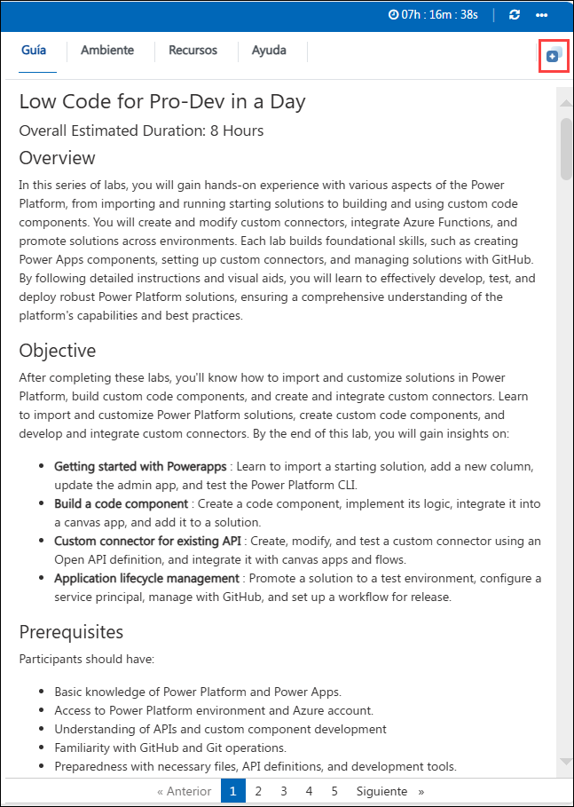

# Laboratório 01 - Introdução

Duração: 45 minutos

## Índice

**Cenário de laboratório**

1. Exercício 1 - Importar e rever os componentes da solução

   - Tarefa 1: Importar, rever os componentes da solução e executar o fluxo

   - Tarefa 2: Teste as aplicações

2. Exercício 2 – Adicione uma coluna para as minhas notas

   - Tarefa 1: Adicione uma nova coluna

   - Tarefa 2: Atualização da aplicação de administrador

3. Exercício 3 – Verifique o instalador de código do estúdio do Visual elétrico pré-instalado e a extensão CLI da plataforma de energia

   - Tarefa 1: Teste o CLI da plataforma de energia


### Cenário de laboratório


Trabalhando como parte da equipa de fusão Prioritz, estará a configurar o seu desenvolvimento de plataformas de alimentação
ambiente. Irá importar e rever a solução atual e explorar o estado atual das aplicações Prioritz,
fluxos e tabelas. Também irá adicionar uma coluna a uma tabela e modificar a aplicação para a utilizar.

# **Entrar com o seu programador num dia Workshop**

Bem-vindo ao seu programador num workshop de um dia! Preparámos um ambiente contínuo para que possa explorar e aprender sobre os serviços Azure. Comecemos por aproveitar ao máximo esta experiência:

## **Aceder ao seu ambiente de laboratório**

Depois de estar pronto para mergulhar, a sua máquina virtual e o **O Guia do laboratório** estarão mesmo ao seu navegador no seu navegador.

 

### **Guia de máquinas virtuais e laboratório**

A sua máquina virtual é o seu cavalo de carga durante todo o workshop. O guia de laboratório é o seu roteiro para o sucesso.

## **Explorando os seus recursos de laboratório**

Para compreender melhor os recursos e as credenciais do seu laboratório, navegue até ao separador **Detalhes do ambiente**.

 

## **Utilizando a Característica da Janela Split**

Por conveniência, pode abrir o guia de laboratório numa janela separada selecionando o botão **Split Window** do canto superior direito.

 

## **Gerir a sua máquina virtual**

Sinta-se à vontade para iniciar, parar ou reiniciar a sua máquina virtual conforme necessário no separador **Recursos**. A sua experiência está nas suas mãos!

 

## **Vamos começar com o Portal Azure**

1. Na sua máquina virtual, clique no ícone do Portal Azure, conforme mostrado abaixo:

   

2. Verá o separador **Inscreva-se no Microsoft Azure**. Aqui, introduza as suas credenciais:

   - **E-mail/nome de utilizador:** <inject key="AzureAdUserEmail"></inject>

      

3. Em seguida, forneça a sua palavra-passe:

   - **Password:** <inject key="AzureAdUserPassword"></inject>

      

4. Se vir o pop-up **Stay inscrito?**, clique em **Não**.

   

5. Se vir o pop-up **Tem recomendações gratuitas do Azure Advisor!**, feche a janela para continuar o laboratório.

6. Se aparecer uma janela pop-up **Bem-vindo à Microsoft Azure, clique em **Talvez mais tarde** saltar o tour.

7. Agora, clique no **Próximo** do canto inferior direito para se deslocar para a página seguinte.

   

Agora está todos prontos para explorar o poderoso mundo da tecnologia. Sinta-se à vontade para contactar se tiver alguma dúvida ao longo do caminho. Desfrute do seu workshop!


## Exercício 1 - Importar e rever os componentes da solução

Neste exercício, irá importar a solução atual para o ambiente de desenvolvimento pré-criado e rever os componentes da solução. Também executará um fluxo que adicionará dados de exemplo ao seu ambiente e testará as aplicações na solução.

>**Nota**: O ambiente Dev é já pré-criado como parte dos pré-requisitos.

### Tarefa 1: Importar, rever os componentes da solução e execute o fluxo

1. No JumpVM, clique no atalho portal **Power Apps** do navegador do Microsoft Edge que está disponível no ambiente de trabalho.

      

1. Ao clicar no portal do Power Apps, o ecrã de boas-vindas do navegador de borda surgirá e seleccione **Iniciar sem os seus dados**.

    

1. No **Podemos ajudá-lo a importar os seus dados de navegação da janela do Google**, clique em **Continuar sem estes dados**.

    

1. Na janela seguinte, clique em **Confirme e comece a navegar**.

    

1. Agora, verá duas abas no browser Edge, fecha o primeiro separador denominado **Microsoft Edge**.

1. Na janela **Inscreva-se**, verá o ecrã de login, introduza o seguinte nome de utilizador **(1)** e clique em **Próximo** **(2)**.

   * E-mail/nome de utilizador: <inject key="AzureAdUserEmail"></inject>

      

1. Introduza agora a seguinte palavra-passe **(1)** e clique em **Inscreva-se** **(2)**.

   * Palavra-passe: <inject key="AzureAdUserPassword"></inject>

      

1. Se for apresentado com **Ajude-nos a proteger a sua conta**, clique em **Skip por enquanto**.

    

1. Se vir o pop-up **Stay inscrito?**, clique em **Não**.

1. Depois de logado, clique em **Ambiente (1)** e seleccione o ambiente de desenvolvimento pré-criado denominado **DEV_ENV_<inject key="Deployment ID" enableCopy="false" /> (2)**.

    

2. Agora, clique em **Soluções (1)** do menu do lado esquerdo e clique em **Import Solution (2)**.

   

3. Clique em **Profisar**.

   

1. Navegue para este caminho `C:\LabFiles\Developer-in-ay\Student\L01 - Começar\Resources` no ficheiro explorer, seleccione o ficheiro **Prioritz_1_0_0_0_7.zip** e clique em **Aberto**.

1. Certifique-se de que o ficheiro **Prioritz (1)** está selecionado e Clique em **Próximo (2)**.

   

1. Clique novamente em **Próximo** na lâmina da solução de importação.

1. Clique no **selecione uma ligação** suspenso e selecione **+ Nova ligação**.

   

1. Clique em **Criar** numa janela de browser recém-aberta e **Inscreva-se se for solicitado.

   

1. Feche a janela do navegador de ligação ou o separador.

1. Clique em **Refrescar**.

   

1. Verifique a ligação e clique no botão **Import** para importar a solução.

   

1. Aguarde até que a importação da solução seja concluída.

   

1. Agora deve ver a solução que importa na lista de soluções.

1. Abra a solução **Prioritz** que importou.

4. Expandir **Tabelas (1)** e seleccione a tabela **PrioritZ Tópico (2)**.

   

5. Selecione as **Colunas** em Esquema e reveja as colunas da tabela **PrioritZ Topic**.

   >**Info**: As colunas padrão estão integradas e todas as tabelas têm-nas. As colunas personalizadas foram criadas pela equipa para esta aplicação.

   

6. Selecione o separador **Relações** do menu suspenso das Colunas e reveja como esta tabela está relacionada com outras tabelas.

   

   

1. Selecione **Fluxo de cloud (1)** e abra os **Importar dados de amostra – Tópicos (2)** fluxo.

   

9. Clique no botão **Editar** para rever o fluxo.

   

10. Expandir o passo **Parse JSON** e reveja os dados que este fluxo criará.

   

11. Expandir o passo **Aplicar a cada tópico**.

   

12. Expandir o passo **Aplicar a cada item do tópico**.

   

13. O **Aplicar a cada** deve parecer a image abaixo. Esta é a lógica da automatização.

      

14. Clique no botão **<- back**.

      

15. Clique no nome do fluxo para abrir o ecrã de detalhes do fluxo.

      

16. Clique em **Entrar** para executar o fluxo.

      

17. Clique no botão **Fugár** Executar a lâmina de fluxo.

      

      > **Nota**: Se receber este erro `Erro da troca de tokens: Permissão negada devido à falta de ligação` enquanto executa o fluxo, isto deve-se ao facto de a ligação **Dataverse** não está a ser adicionado correctamente. Apague a solução importada e tente reimportar a solução executando os **Estãos 11-21** desta tarefa novamente e, em seguida, tente desencadear o fluxo novamente.

18. Clique em **Done** e aguarde que o fluxo seja executado.

      

19. O fluxo deve ser executado com sucesso. Se quiser, pode clicar na linha de execução e ele mostrará
 os detalhes do que o fluxo fez.

      

### Tarefa 2: Teste as aplicações

1. Navegue de volta para a solução **PrioritZ** clicando em **Fluxos de cloud**. Em alternativa, também pode abrir o portal do fabricante **Power Apps** utilizando este URL `https://make.powerapps.com` se ainda não está aberto. Certifique-se de que o ambiente de desenvolvimento denominado **DEV_ENV_<inject key="Deployment ID" enableCopy="false" /> (2)** é selecionado.

   

1. Navegue até à lâmina **Soluções** clicando em **Regresso às soluções** **(<-)**.

   

2. Selecione **Apps (1)** do menu do lado esquerdo do Power Apps, deve ver duas aplicações denominadas **PrioritZ Ask** e **PrioritZ Admin (2)**.

   >**Info:** **A aplicação PrioritZ Admin** é utilizada para gerir tópicos que estão a ser solicitados e a aplicação **PrioritZ Ask** permite que os utilizadores respondam.

   

3. Inicie a aplicação **PrioritZ Admin**.

   

4. Deve ver os quatro tópicos abaixo.

   

5. Clique para abrir o tópico do banner **Evento**.

6. Deve ver os detalhes do tópico com alguns itens do tópico.

   

7. Clique no botão **<** Voltar.

   > **Nota**: Deve voltar ao ecrã inicial.

9. Agora, clique no botão **+** para adicionar um novo tópico.

   

10. Forneça as informações abaixo e clique em **Adicione uma image** que está presente abaixo **Respond By**.

    1. **Tópico**: Introduza `Change Taco Terça-feira para algum outro alimento`
    
    1. **Detalhes**: Introduza `As pessoas estão cansadas de tacos, o que devemos ter em vez de tacos?`

 1. **Responda By**: Selecione **data de hoje**.

      

1. Navegue para este caminho C:\LabFiles no explorador de ficheiros, seleccione **image.png** e clique em abrir.

12. Introduza **Tamale Terça-feira** no campo Choice e clique em **adicionar uma image** que está presente abaixo do campo Choice.

      

11. Navegue neste caminho `C:\LabFiles` no File Explorer, seleccione **image.png** e clique em abrir.

13. Clique em **+** para adicionar a escolha.

      

14. Adicione mais algumas opções repetindo **passos 12-14**.

    1. **Escolha 1**: Introduza `Fico Terça-feira`

    2. **Escolha 2**: Introduza `Cheese and Wine Terça-feira`

15. Clique no botão **Guardar** para guardar o tópico.

    

16. O novo tópico deve ser guardado e deve ser navegado de volta para o ecrã principal.

17. Deve ver o tópico que adicionou à lista de tópicos.

    

18. Feche a aplicação PrioritZ Admin fechando o separador do navegador no qual a aplicação PrioritZ Admin está aberta.

19. Selecione **Apps (1)** do menu do lado esquerdo do Power Apps e inicie a aplicação **PrioritZ Ask (2)**.

    

20. Deve ver uma lista de tópicos. Abra o **Change Taco Terça-feira a algum outro tópico de comida** que criou nos passos anteriores.

    

21. Clique em **up/down** ícones encomende os itens na ordem que os prefere e clique em **Vote**.

    

22. Deve ser navegado de volta para os ecrãs principais e ver uma mensagem de notificação.

    

23. Feche a aplicação PrioritZ Ask fechando o separador do navegador no qual a aplicação PrioritZ Ask está aberta.

## Exercício 2 – Adicione uma coluna para as minhas notas

Neste exercício, irá adicionar uma nova coluna **As minhas notas** à tabela de tópicos e atualizar o PriortZ Admin
aplicação.

### Tarefa 1: Adicione uma nova coluna

1. Navegue até ao portal do fabricante de aplicações Power, utilizando o URL abaixo, se ainda não estiver aberto. Certifique-se de que o ambiente de desenvolvimento denominado **DEV_ENV_<inject key="Deployment ID" enableCopy="false" /> (2)** é selecionado.
 
   ```
   https://make.powerapps.com
   ```

2. Selecione **Soluções (1)** do menu do lado esquerdo das aplicações de alimentação e abra a solução **PrioritZ (2)**.

    

3. Expandir **Tabelas** e seleccione a tabela **PrioritZ Topic**.

4. Selecione o separador **Colunas** que está presente em **Schema** e clique em **+ Nova coluna**.

    

5. Introduza o valor abaixo no campo de nomes de visualização.

   ```
   As minhas notas
   ```

1. Agora, pesquise por **Tisto de toque (1)** em tipo de dados e selecione aquele que está sob **Texto Multilina (2)** e clique em **Guardar (3)**.

   

   > **Nota**: Não navegue por esta página.

### Tarefa 2: Atualize a aplicação de administrador

1. Certifique-se de que ainda está na solução **PrioritZ**. Selecione **Apps (1)** em **Objects** e selecione a aplicação **PrioritZ Admin (2)** e clique em **Editar (3)**.

    

3. Selecione o **Adicionar ecrã do tópico**.

    

4. Clique em **+ Inserir(1)** e seleccione **Texto entrada(2)**.

    

5. Clique duas vezes na recém-adicionado **Texto entrada** e introduza o valor abaixo para renomear a entrada do texto.

   ```
   Caixa de texto de notas
   ```

    

6. Deixe o controlo da image adicionar mais pequeno, se necessário, e mova a caixa de texto **Respond By e etiqueta a caixa de texto **e coloque a caixa de texto **Notas **entre o controlo de Detalhes e o Responda pelo rótulo.

    

7. Selecione **Notes textbox** e depois **HintText** no menu suspenso das propriedades.

    

8. Altere o valor **HintText** da caixa de texto Notes para o valor abaixo.

   ```
   As minhas notas
   ```

    


9. Selecione o **Mode** no menu suspenso das propriedades e altere o seu valor introduzindo o texto abaixo.

   ```
   TextMode.MultiLine
   ```

    

10. Selecione **Guardar ícone do tópico** na secção **Adicionar tópicos de ecrã**.

    

11. Substitua a fórmula **OnSelect** do **Guardar o ícone do tópico** com a fórmula abaixo. O Patch criauma nova linha na tabela Dataverse.

    

      ```
      Set(newTopic,Patch('Prioritz Topics',Defaults('Prioritz Topics'),{'My Notes': 'Notes textbox'.Text,Topic:'Topic name textbox'.Text,Details:'Topic details textbox'.Text,'Respond By':'respond by date picker'.SelectedDate,Photo:AddTopicImage.Image}));ForAll(colAddChoices,Patch('Prioritz Topic Items',Defaults('Prioritz Topic Items'),{Choice:ThisRecord.choice,'PrioritZ Topic':newTopic,Photo:ThisRecord.photo}));Back()
      ```

12. Selecione o **Ver parapic Ecrã (1)** do separador **Ecrãs**.

1. Clique em **+ Inserir (1)** separador e seleccione **Texto rótulo (2)**.

   

13. Clique duas vezes no rótulo recentemente adicionado e introduza o valor abaixo para renomear o rótulo que acabou de adicionar.

      ```
      Etiqueta de notas
      ```

    

14. Altere o valor **Texto** do rótulo Notes com o texto abaixo.

      ```
      'galeria de tópicos'. Selecionado. 'As minhas notas'
      ```

      

15. Rearranque os controlos e mova o rótulo **Notas** entre o rótulo de detalhes e os itens do tópico
 galeria.

    

16. Selecione o **Ecrã de casa** e clique em **Própria a aplicação**.

    

17. Clique no botão **+** para adicionar um novo tópico.

    

18. Preencha o formulário fornecendo as informações abaixo e clique em **Adicione uma image** que está presente abaixo do campo **Respond By**.

      1. Tópico: `Test Notes` (1)

      2. Detalhes: `Testando as notas` (2)

      3. Entrada de texto: `Tópico do Admin Prioritz` (3)

      4. Responda por: **Data de hoje** (4)

1. Navegue para este caminho C:\LabFiles no explorador de ficheiros, seleccione **image.png** e clique em abrir.

12. Introduza **Test One** no campo Choice e clique em **Adicione uma image** que esteja presente abaixo do campo Choice.

    

11. Navegue neste caminho `C:\LabFiles` no File Explorer, seleccione **image.png** e clique em abrir.

13. Clique em **+** para adicionar a escolha.

    

14. Adicione mais uma escolha repetindo **passos 20-22** desta tarefa.

    1. **Escolha 1**: Introduza `Teste Dois`

1. Depois de adicionar todas as opções e detalhes do tópico, o seu ecrã deve parecer a captura de ecrã abaixo.

   

19. Agora, clique no botão **Guardar**. O novo tópico deve ser **salvado**.
20. Clique para abrir o tópico **Test Notes** que acabou de criar.
21. As notas **Tópico do Admin Prioritz** que adicionou anteriormente devem ser visíveis agora.

    

22. Feche a aplicação **preview**.

1. Clique em **Publique**.

   

25. Selecione Publicar esta versão e aguarde que a publicação seja concluída.

    

26. Pode fechar o designer **app**.

## Exercício 3 – Teste o CLI da plataforma de energia

Neste exercício, irá rever e testar a extensão CLI da plataforma Power no Visual Studio Code.

>**Nota**: O código de estúdio visual e a instalação da plataforma Power CLI já são feitos como parte dos pré-requisitos.

1.  Navegue até ao centro de administração da plataforma Power utilizando o URL abaixo e selecione **Ambientes**.
 
      ```
      https://admin.powerplatform.microsoft.com/environments
      ```

1. Se for apresentado com **Ajude-nos a proteger a sua conta**, clique em **Skip por enquanto**.

   

1. Se vir o pop-up **Stay inscrito?**, clique em **Não**.

2. Clique para abrir o seu ambiente de desenvolvimento chamado **DEV_ENV_<inject key="Deployment ID" enableCopy="false" />**.

3. Clique com o botão direito do rato no valor ** URL ** Ambiente e cole o valor no Notepad.

   >**Nota**: Certifique-se de que o valor do URL do ambiente é copiado juntamente com o **https**. O seu valor copiado deve ficar assi `https://orgxxxxxx.crm.dynamics.com/`

   

4. No JumpVM, inicie o **Código do estúdio do Visual** utilizando o atalho disponível na área de trabalho.

   

6. Clique em **Terminal** e seleccione **Novo Terminal**.

   

7. Execute o comando abaixo no terminal.

   ```
   pac
   ```

   > **Informações:** Se encontrar um erro após a utilização do comando pac, tente desinstalar a ferramenta Power Platform e reinstale-a, volte a tentar o passo.

8. Substitua `<o seu URL do seu ambiente>` no comando abaixo pelo valor do URL do ambiente que copiou anteriormente e depois executa o comando.

   ```
   pac auth create --name DevAuth --url <o seu ambiente URL>
   ```

   > **Info:** Depois de adicionar o URL do ambiente, o comando será assim: `pac auth create --name DevAuth--url https://org32172839283.crm.dynamics.com/`

   

1. Conclua o processo **Inscreva-se**, utilizando as credenciais abaixo.

   * E-mail/nome de utilizador: <inject key="AzureAdUserEmail"></inject>
   
   * Palavra-passe: <inject key="AzureAdUserPassword"></inject>

1. Se for apresentado com **Ajude-nos a proteger a sua conta**, clique em **Skip por enquanto**.

   

9. Selecione **Tratama de Power Platform (1)**, agora deve ter pelo menos um perfil de **aut (2)**. Se tiver mais do que um perfil, certifique-se de que o perfil que criou será selecionado

   

   > **Nota**: Se conseguir ver o perfil **Universal Profile** em vez do perfil de **DeVAuth**, é por adição do valor incorreto de **URL** Ambiente na **pac auth create** comando no Passo 9. Para corrigir istoue, siga os passos abaixo:

   1. image Apagar o **perfil Universal** do Visual Studio Code clicando no botão de eliminação.

   2. image Copie o valor correto do **URL** Ambiente seguindo **Estão 5** desta tarefa.
   
   3. image Execute o **Estão 9** desta tarefa novamente para criar o perfil de autenticação.

10. image Clique em **Terminal** e seleccione **Novo Terminal**, se ainda não estiver aberto.

    

11. image Execute o comando abaixo para ver uma lista de soluções.

      ```
      lista de soluções pac
      ```

12. image Deve ver uma lista de soluções instaladas no seu ambiente.

    