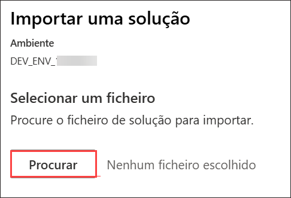

# Laboratório 01 - Introdução ao Powerapps

### Duração: 40 minutos

Trabalhando como parte da equipe de fusão do Prioritz, você configurará seu ambiente de desenvolvimento do Power Platform. Você importará e revisará a solução atual e explorará o estado atual dos aplicativos, fluxos e tabelas do Prioritz. Você também adicionará uma coluna a uma tabela e modificará o aplicativo para usá-la.

## Objetivos do laboratório

Você poderá concluir o seguinte:

Exercício 1: Importar e revisar componentes da solução
Exercício 2: Adicionar uma coluna para Minhas Anotações
Exercício 3: Verificar o Visual Studio Code Installer pré-instalado e a Power Platform CLI Extension

## Exercício 1 - Importar e rever os componentes da solução

Neste exercício, irá importar a solução atual para o ambiente de desenvolvimento pré-criado e rever os componentes da solução. Também executará um fluxo que adicionará dados de exemplo ao seu ambiente e testará as aplicações na solução.

>**Nota**: O ambiente Dev é já pré-criado como parte dos pré-requisitos.

### Tarefa 1: Importar, rever os componentes da solução e execute o fluxo

1. No JumpVM, clique no atalho portal **Power Apps** do navegador do Microsoft Edge que está disponível no ambiente de trabalho.

      

1. Na janela **Sign in**, verá o ecrã de login, introduza o seguinte nome de utilizador **(1)** e clique em **Next** **(2)**.

   - E-mail/nome de utilizador: <inject key="AzureAdUserEmail"></inject>

      

1. Introduza agora a seguinte palavra-passe **(1)** e clique em **Sign in** **(2)**.

   - Palavra-passe: <inject key="AzureAdUserPassword"></inject>

      

1. Clique em **Perguntar Depois** se a janela pop-up "Ação Necessária" aparecer.

   >**Observação:** Se a opção **Perguntar Depois** **não** estiver disponível, siga os Passos 5 a 14. Caso contrário, prossiga para o **Passo 15**.

1. Na página **Comece por obter a aplicação**, clique em **Seguinte**.

1. Clique em **Seguinte** duas vezes.

1. No **Android**, aceda à Play Store e pesquise por **Microsoft Authenticator** e toque em **Instalar**.

    

   > **Nota:** Para iOS, abra a loja de aplicações e repita os passos.

   > **Nota:** Ignore se já estiver instalado.

1. Abra a aplicação e toque em **Escanear um código QR**.

1. Digitalize o código QR visível no ecrã e clique em **Seguinte**.

   

1. Introduza o dígito apresentado no ecrã do aplicativo Autenticador no telemóvel e toque em **Sim**.

1. Após a notificação ser aprovada, clique em **Seguinte**.

    

1. Clique em **Concluído**.

1. Se lhe for pedido para permanecer ligado, pode clicar em **"Não"**.

1. Toque em **Concluir** no dispositivo móvel.

   > **NOTA:** Quando voltar a iniciar sessão, insira os dígitos apresentados no ecrã na **aplicação Autenticador** e clique em Sim.

1. Se for apresentado com **Help us protect your account**, clique em **Skip for now**.

   

1. Se vir o pop-up **Stay Signed in?**, clique em **Não**.

1. Depois de logado, clique em **Environment (1)** e seleccione o ambiente de desenvolvimento pré-criado denominado **DEV_ENV_<inject key="Deployment ID" enableCopy="false" /> (2)**.

    

2. Agora, clique em **Solutions (1)** do menu do lado esquerdo e clique em **Import Solution (2)**.

   

3. Clique em **Browse**.

   

1. Navegue para este caminho `C:\LabFiles\Developer-in-a-day\Student\L01 - Getting started\Resources` no ficheiro explorer, seleccione o ficheiro **Prioritz_1_0_0_0_7.zip** e clique em **Open**.

1. Certifique-se de que o ficheiro **Prioritz_1_0_0_7. zip(1)** está selecionado e clique em **Next (2)**.

   

1. Clique novamente em **Next** na lâmina da solução de importação.

1. Na secção **Connections**, clique no botão de reticências **...(1)** junto a **Microsoft Dataverse Priority**.

1. Certifique-se de que o e-mail do utilizador **<inject key="AzureAdUserEmail"></inject> (2)** que está a utilizar está seleccionado.

1. Clique em **Import (3)**.

   

1. Aguarde até que a importação da solução seja concluída.

   

1. Agora deve ver a solução que importa na lista de soluções.

1. Abra a solução **Prioritz** que importou.

4. Expandir **Tables (1)** e seleccione a tabela **PrioritZ Topic (2)**.

   

5. Selecione as **Columns** em Schema e reveja as colunas da tabela **PrioritZ Topic**.

   >**Info**: As colunas padrão estão integradas e todas as tabelas têm-nas. As colunas personalizadas foram criadas pela equipa para esta aplicação.

   

6. Selecione o separador **Relationships** do menu suspenso das Colunas e reveja como esta tabela está relacionada com outras tabelas.

   

   

1. Selecione **Cloud flow (1)** e abra os **Import sample data – Topics (2)** fluxo.

   

9. Clique no botão **Edit** para rever o fluxo.

   

10. Expandir o passo **Parse JSON** e reveja os dados que este fluxo criará.

    

11. Expandir o passo **Apply to each topic**.

    

12. Expandir o passo **Apply to each topic item**.

    

13. O **Apply to each** deve parecer a image abaixo. Esta é a lógica da automatização.

    

14. Clique no botão **<- back**.

    

15. Clique no nome do fluxo para abrir o ecrã de detalhes do fluxo.

    

16. Clique em **Run** para executar o fluxo.

      

17. Clique no botão **Run flow** Executar a lâmina de fluxo.

      

      > **Nota**: Se receber este erro `Error from the token exchange: Permission denied due to missing connection` enquanto executa o fluxo, isto deve-se ao facto de a ligação **Dataverse** não está a ser adicionado correctamente. Apague a solução importada e tente reimportar a solução executando os **passos 11-21** desta tarefa novamente e, em seguida, tente desencadear o fluxo novamente.

18. Clique em **Done** e aguarde que o fluxo seja executado.

      

19. O fluxo deve ser executado com sucesso. Se quiser, pode clicar na linha de execução e ele mostrará
 os detalhes do que o fluxo fez.

      

### Tarefa 2: Teste as aplicações

1. Navegue de volta para a solução **PrioritZ** clicando em **Cloud flows**. Em alternativa, também pode abrir o portal do fabricante **Power Apps** utilizando este URL `https://make.powerapps.com` se ainda não está aberto. Certifique-se de que o ambiente de desenvolvimento denominado **DEV_ENV_<inject key="Deployment ID" enableCopy="false" />** é selecionado.

   

   >**Observação:** se um pop-up **Bem-vindo ao Power Apps Studio** aparecer, basta clicar em **Ignorar** para prosseguir.

1. Navegue até ao separador **Solutions** clicando em **Back to Solutions** **(<-)**.

   

2. Selecione **Apps (1)** do menu do lado esquerdo do Power Apps, deve ver duas aplicações denominadas **PrioritZ Ask** e **PrioritZ Admin (2)**.

   >**Info:** A aplicação **PrioritZ Admin** é utilizada para gerir tópicos que estão a ser solicitados e a aplicação **PrioritZ Ask** permite que os utilizadores respondam.

   

3. Inicie a aplicação **PrioritZ Admin**.

   

4. Deve ver os quatro tópicos abaixo.

   

5. Clique para abrir o tópico do banner **Event banner**.

6. Deve ver os detalhes do tópico com alguns itens do tópico.

   

7. Clique no botão **<** Voltar.

   > **Nota**: Deve voltar ao ecrã inicial.

9. Agora, clique no botão **+** para adicionar um novo tópico.

   

10. Forneça as informações abaixo e clique em **add a picture** que está presente abaixo **Respond By**.

    1. **Topic**: Introduza `Change Taco Tuesday to some other food`
    
    1. **Details**: Introduza `People are tired of tacos, what should we have instead of tacos?`

 1. **Responda By**: Selecione **today's date**.

      

1. Navegue para este caminho `C:\LabFiles` no explorador de ficheiros, seleccione **image.png** e clique em abrir.

12. Introduza **Tamale Tuesday** no campo Choice e clique em **add a picture** que está presente abaixo do campo Choice.

      

11. Navegue neste caminho `C:\LabFiles` no File Explorer, seleccione **image.png** e clique em abrir.

13. Clique em **+** para adicionar a escolha.

      

14. Adicione mais algumas opções repetindo **os passos 12-14**.

    1. **Escolha 1**: Introduza `Steak Tuesday`

    2. **Escolha 2**: Introduza `Cheese and Wine Tuesday`

15. Clique no botão **Save** para guardar o tópico.

    

16. O novo tópico deve ser guardado e deve ser navegado de volta para o ecrã principal.

17. Deve ver o tópico que adicionou à lista de tópicos.

    

18. Feche a aplicação PrioritZ Admin fechando o separador do navegador no qual a aplicação PrioritZ Admin está aberta.

19. Selecione **Apps (1)** no menu do lado esquerdo do Power Apps e inicie a aplicação **Prioritz Ask (2)** clicando no símbolo de reprodução.

    

20. Deve ver uma lista de tópicos. Abra o ***Change Taco Tuesday to some other food** que criou nos passos anteriores.

    

21. Clique em **up/down** ícones encomende os itens na ordem que os prefere e clique em **Vote**.

    

22. Deve ser navegado de volta para os ecrãs principais e ver uma mensagem de notificação.

    

23. Feche a aplicação PrioritZ Ask fechando o separador do navegador no qual a aplicação PrioritZ Ask está aberta.

> **Parabéns** por completar a tarefa! Agora, é hora de validá-lo. Aqui estão os passos:
> - Pressione o botão Validar para a tarefa correspondente. Se receber uma mensagem de êxito, pode prosseguir para a próxima tarefa. 
> - Se não, leia atentamente a mensagem de erro e tente novamente a etapa, seguindo as instruções no guia do laboratório.
> - Se precisar de ajuda, entre em contato conosco pelo cloudlabs-support@spektrasystems.com. Estamos disponíveis 24 horas por dia, 7 dias por semana para ajudar.

<validation step="43212171-0d6f-44d9-9c69-5061a4bb1b1c" />

## Exercício 2 – Adicione uma coluna para as minhas notas

Neste exercício, irá adicionar uma nova coluna **My Notes** à tabela de tópicos e atualizar o PriortZ Admin
aplicação.

### Tarefa 1: Adicione uma nova coluna

1. Navegue até ao portal do fabricante de aplicações Power, utilizando o URL abaixo, se ainda não estiver aberto. Certifique-se de que o ambiente de desenvolvimento denominado **DEV_ENV_<inject key="Deployment ID" enableCopy="false" /> (2)** é selecionado.
 
   ```
   https://make.powerapps.com
   ```

2. Selecione **Solutions (1)** do menu do lado esquerdo das aplicações de alimentação e abra a solução **PrioritZ (2)**.

    

3. Expandir **Tables** e seleccione a tabela **PrioritZ Topic**.

4. Selecione o separador **Columns** que está presente em **Schema** e clique em **+ New column**.

    

5. Introduza o valor abaixo no campo de nomes de visualização.

   ```
   My Notes
   ```

1. Agora, pesquise por **Plain text (1)** em tipo de dados e selecione aquele que está sob **Multiline Text (2)** e clique em **Save (3)**.

   

   > **Nota**: Não navegue por esta página.

### Tarefa 2: Atualize a aplicação de administrador

1. Certifique-se de que ainda está na solução **PrioritZ**. Selecione **Apps (1)** em **Objects** e selecione a aplicação **PrioritZ Admin (2)** e clique em **Edit (3)**.

    

3. Selecione o **Add Topic Screen**.

    

4. Clique em **+ Insert(1)** e seleccione **Text input(2)**.

    

5. Clique duas vezes na recém-adicionado **Text input** e introduza o valor abaixo para renomear a entrada do texto.

   ```
   Notes textbox
   ```

    

6. Deixe o controlo da image adicionar mais pequeno, se necessário, e mova a caixa de texto **Respond By and label textbox** e coloque a caixa de texto **Notas** entre o controlo de Detalhes e o Responda pelo rótulo.

    

7. Selecione **Notes textbox** e depois **HintText** no menu suspenso das propriedades.

    

8. Altere o valor **HintText** da caixa de texto Notes para o valor abaixo.

   ```
   My notes
   ```

    


9. Selecione o **Mode** no menu suspenso das propriedades e altere o seu valor introduzindo o texto abaixo.

   ```
   TextMode.MultiLine
   ```

    

10. Selecione **Save topic icon** na secção **Add Topics Screen**.

    

11. Substitua a fórmula **OnSelect** do **Save topic icon** com a fórmula abaixo. O Patch criauma nova linha na tabela Dataverse.

    

      ```
      Set(newTopic,Patch('Prioritz Topics',Defaults('Prioritz Topics'),{'My Notes': 'Notes textbox'.Text,Topic:'Topic name textbox'.Text,Details:'Topic details textbox'.Text,'Respond By':'respond by date picker'.SelectedDate,Photo:AddTopicImage.Image}));ForAll(colAddChoices,Patch('Prioritz Topic Items',Defaults('Prioritz Topic Items'),{Choice:ThisRecord.choice,'PrioritZ Topic':newTopic,Photo:ThisRecord.photo}));Back()
      ```

12. Selecione o **View Topic Screen (1)** do separador **Screens**.

1. Clique em **+ Insert (1)** separador e seleccione **Text label (2)**.

   

13. Clique duas vezes no rótulo recentemente adicionado e introduza o valor abaixo para renomear o rótulo que acabou de adicionar.

      ```
      Notes label
      ```

    

14. Altere o valor **Text** do rótulo Notes com o texto abaixo.

      ```
      'Topics gallery'.Selected.'My Notes'
      ```

      

15. Rearranque os controlos e mova o rótulo **Notes** entre o rótulo de detalhes e os itens do tópico
 galeria.

    

16. Selecione o **Home Screen** e clique em **Preview the app**.

    

17. Clique no botão **+** para adicionar um novo tópico.

    

18. Preencha o formulário fornecendo as informações abaixo e clique em **add a picture** que está presente abaixo do campo **Respond By**.

      1. Tópico: `Test Notes` (1)

      2. Detalhes: `Testing the notes` (2)

      3. Entrada de texto: `Prioritz Admin topic` (3)

      4. Responda por: **Today's date** (4)

1. Navegue para este caminho C:\LabFiles no explorador de ficheiros, seleccione **image.png** e clique em abrir.

12. Introduza **Test One** no campo Choice e clique em **add a picture** que esteja presente abaixo do campo Choice.

    

11. Navegue neste caminho `C:\LabFiles` no File Explorer, seleccione **image.png** e clique em abrir.

13. Clique em **+** para adicionar a escolha.

    

14. Adicione mais uma escolha repetindo **passos 20-22** desta tarefa.

    1. **Choice 1**: Introduza `Test Two`

1. Depois de adicionar todas as opções e detalhes do tópico, o seu ecrã deve parecer a captura de ecrã abaixo.

   

19. Agora, clique no botão **Save**. O novo tópico deve ser **saved**.
20. Clique para abrir o tópico **Test Notes** que acabou de criar.
21. As notas **Prioritz Admin topic** que adicionou anteriormente devem ser visíveis agora.

    

22. Feche a aplicação **preview**.

1. Clique em **Publish**.

   

25. Selecione Publicar esta versão e aguarde que a publicação seja concluída.

    

26. Pode fechar o **app designer**.

## Exercício 3 – Teste o CLI da Power Platform

Neste exercício, irá rever e testar a extensão CLI da Power Platform no Visual Studio Code.

>**Nota**: O Visual Studio Code e a instalação da Power Platform CLI já estão instalados como parte dos pré-requisitos.

1.  Navegue até ao centro de administração da Power Platform utilizando o URL abaixo e selecione **Ambientes**.
 
      ```
      https://admin.powerplatform.microsoft.com/environments
      ```

1. Se for apresentado com **Help us protect your account**, clique em **Skip for now**.

   

1. Se vir o pop-up **Stay Signed in?**, clique em **Não**.

2. Clique para abrir o seu ambiente de desenvolvimento chamado **DEV_ENV_<inject key="Deployment ID" enableCopy="false" />**.

3. Clique com o botão direito do rato no valor **URL** Ambiente e cole o valor no Notepad.

   >**Nota**: Certifique-se de que o valor do URL do ambiente é copiado juntamente com o **https**. O seu valor copiado deve ficar assi `https://orgxxxxxx.crm.dynamics.com/`

   

4. No JumpVM, inicie o **Visual Studio Code** utilizando o atalho disponível na área de trabalho.

   

6. Clique em **Terminal** e seleccione **New Terminal**.

   

7. Execute o comando abaixo no terminal.

   ```
   pac
   ```

   > **Info:** Se encontrar um erro após a utilização do comando pac, tente desinstalar a ferramenta Power Platform e reinstale-a, volte a tentar o passo.

8. Substitua `<o seu URL do seu ambiente>` no comando abaixo pelo valor do URL do ambiente que copiou anteriormente e depois executa o comando.

   ```
   pac auth create --name DevAuth --url <your environment URL>
   ```

   > **Info:** Depois de adicionar o URL do ambiente, o comando será assim: `pac auth create --name DevAuth--url https://org32172839283.crm.dynamics.com/`

   

1. Conclua o processo **Sign in**, utilizando as credenciais abaixo.

   * E-mail/nome de utilizador: <inject key="AzureAdUserEmail"></inject>
   
   * Palavra-passe: <inject key="AzureAdUserPassword"></inject>

1. Se for apresentado com **Help us protect your account**, clique em **Skip for now**.

   

9. Selecione **Power Platform (1)**, agora deve ter pelo menos um perfil de **auth profile (2)**. Se tiver mais do que um perfil, certifique-se de que o perfil que criou será selecionado

   

   > **Nota**: Se conseguir ver o perfil **Universal Profile** em vez do perfil de **DeVAuth**, é por adição do valor incorreto  **Environment URL** no comendo **pac auth create** no Passo 9. Para corrigir isto, siga os passos abaixo:

   1. Apagar o **Universal Profile** do Visual Studio Code clicando no botão de eliminação.

   2. Copie o valor correto do **Environment URL** seguindo o **Passo 5** desta tarefa.
   
   3. Execute o **Passo 9** desta tarefa novamente para criar o perfil de autenticação.

10. Clique em **Terminal** e seleccione **New Terminal**, se ainda não estiver aberto.

    

11. Execute o comando abaixo para ver uma lista de soluções.

      ```
      pac solution list
      ```

12. Deve ver uma lista de soluções instaladas no seu ambiente.

    

## Você concluiu o laboratório com sucesso. Prossiga para a próxima página.
