# Lab 01 - Getting Started

Duration: 45 mins

## Table of Contents

**Lab Scenario** 

1. Exercise 1 - Import and review solution components 

   - Task 1: Import, review solution components and run flow 

   - Task 2: Test the apps 

2. Exercise 2 – Add a column for My Notes 

   - Task 1: Add a new column 

   - Task 2: Update admin app 

3. Exercise 3 – Verify the pre-installed Visual Studio Code Installer and Power Platform CLI Extension 

   - Task 1: Test the Power Platform CLI 


### Lab Scenario


Working as part of the Prioritz fusion team you will be setting up your Power Platform development
environment. You will import and review the current solution and explore the current state of the Prioritz apps,
flows and tables. You will be also adding a column to a table and modifying the app to use it.

# Getting Started with Lab

1. Once the environment is provisioned, a virtual machine (JumpVM) and lab guide will get loaded in your browser. Use this virtual machine throughout the workshop to perform the the lab.

   
   
1. To get the lab environment details, you can select **Environment Details** tab. Additionally, the credentials will also be sent to your email address provided during registration. 

   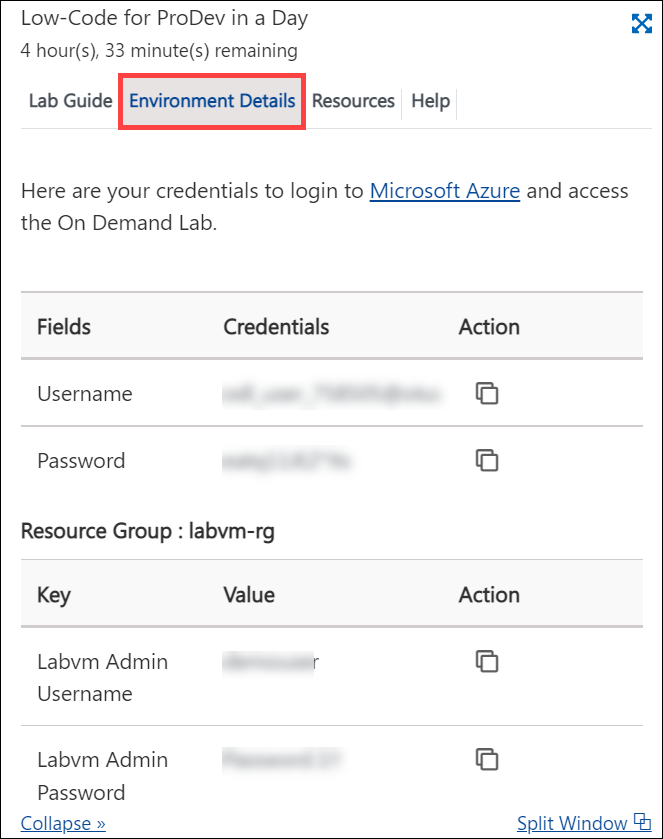
   
## Exercise 1 - Import, review solution components

In this exercise, you will import the current solution into the pre-created dev environment and review the components of the solution. You will also run a flow that will add sample data to your environment, and test the applications in the solution.

>**Note**: The Dev environment is already pre-created as a part of the prerequisites.

### Task 1: Import, Review solution components and run flow

1. In the JumpVM, click on **Power Apps** portal shortcut of Microsoft Edge browser that is available on desktop.

   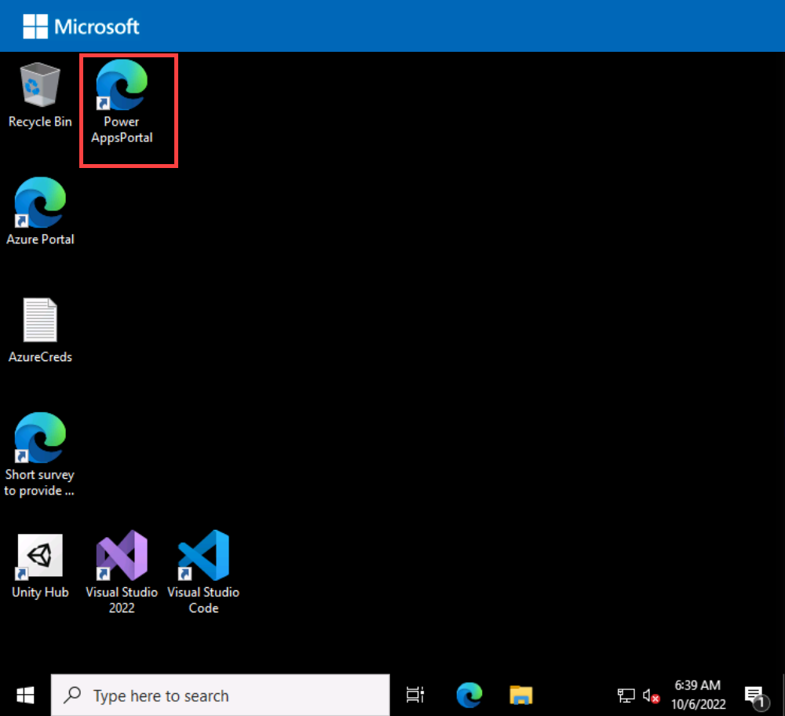
   
1. When you click on Power Apps portal, the edge browser welcome screen will come up, select **Start without your data**.

   

1. On the **We can help you import your browsing data from Google** window, click on **Continue without this data**.
   
   
   
1. On the next window, click on **Confirm and start browsing**.

   

1. Now, you will see two tabs in the edge browser, close the first tab named with **Microsoft Edge**.

1. On the **Sign in** window, you will see the login screen, enter the following username **(1)** and click on **Next** **(2)**.

   * Email/Username: <inject key="AzureAdUserEmail"></inject>

   

1. Now enter the following password **(1)** and click on **Sign in** **(2)**. 

   * Password: <inject key="AzureAdUserPassword"></inject>
   
   

1. If you are presented with **Help us protect your account**, click on **Skip for now**.

   

1. If you see the pop-up **Stay Signed in?**, click **No**.

1. Once logged in, click on **Environment (1)** and select the pre-created dev environment named **DEV_ENV_<inject key="Deployment ID" enableCopy="false" /> (2)**.   

     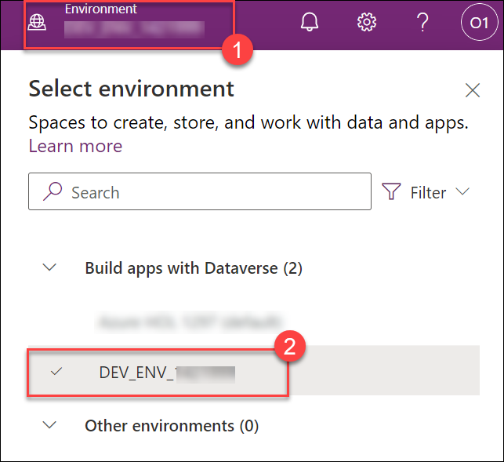

2. Now, click on **Solutions(1)** from the left hand side menu and click **Import Solution(2)**.

      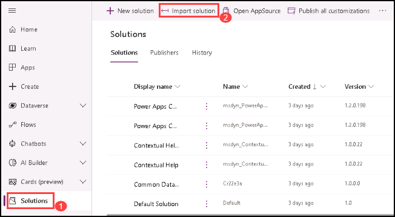

3.  Click **Browse**.
    
     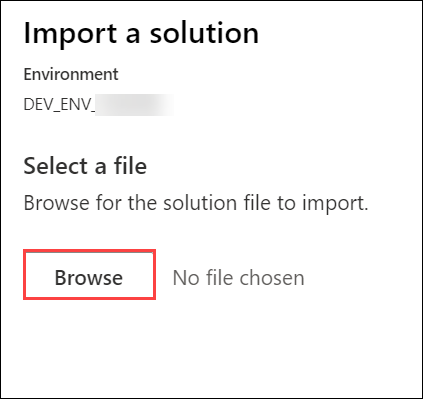
     
1. Navigate to this path `C:\LabFiles\Developer-in-a-day\Student\L01 - Getting started\Resources` in file explorer , select the **Prioritz_1_0_0_7.zip** file, and click **Open**.

1. Make sure the **Prioritz(1)** file is selected and Click **Next(2)**.
    
     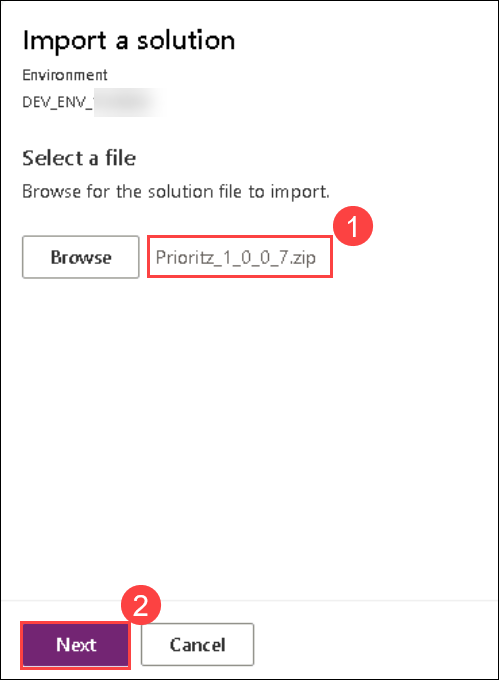
     
1. Click **Next** again on the import solution blade.

1. Click on the **select a connection** dropdown and then select **+ New connection**.

     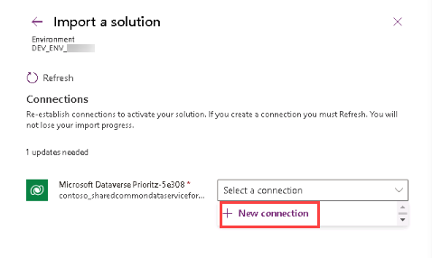 
      
1. Click **Create** in a newly opened browser window and **Sign In** if prompted.

      
     
1. Close the connection browser window or tab.

1. Click **Refresh**.

     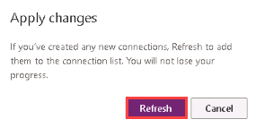 
     
1. Check the connection and click **Import** button to import the solution.

     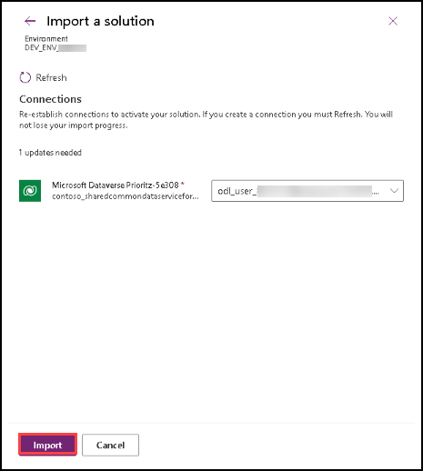
     
1. Wait until the solution import to complete.

     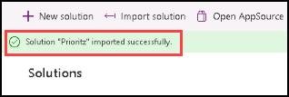
     
1. You should now see the solution you imported in the list of solutions.

1. Open the **Prioritz** solution you imported.

4. Expand **Tables (1)** and select the **PrioritZ Topic (2)** table.
   
     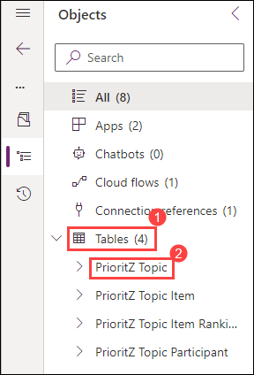

5. Select the **Columns** under Schema and review the columns of the **PrioritZ Topic** table.

   >**Info** : The standard columns are built-in, and all tables have them. The custom columns were created by the team for this application.
 
   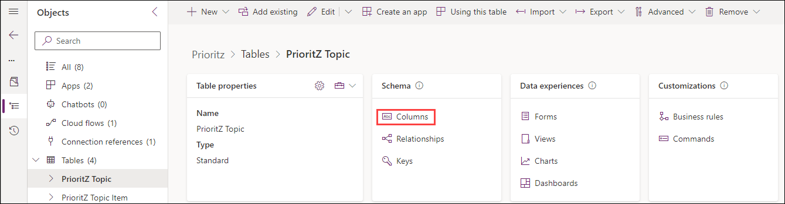

6. Select the **Relationships** tab from Columns dropdown and review how this table is related to other tables.
 
    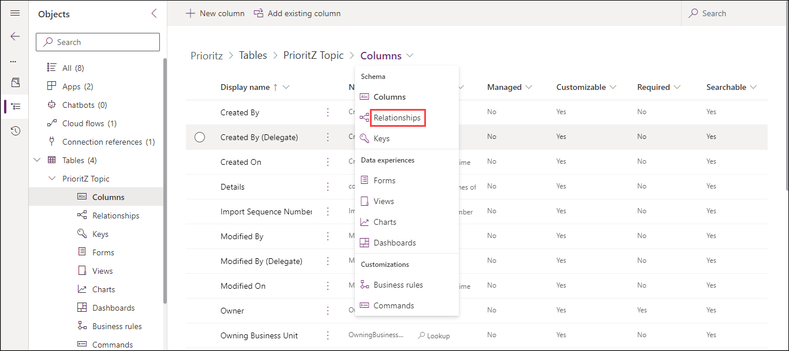
 
    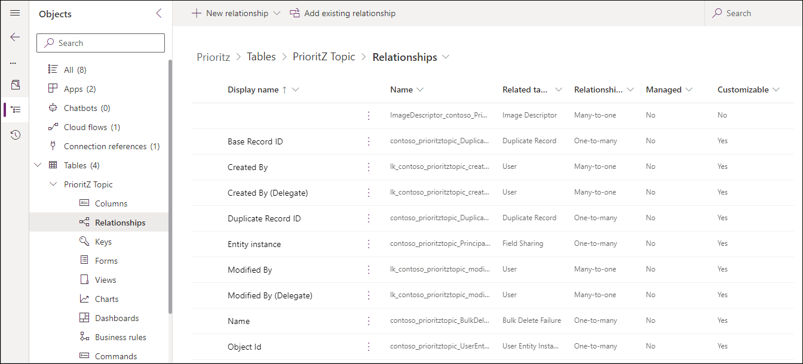

1. Select **Cloud flow (1)** and open the **Import sample data – Topics (2)** flow.
 
    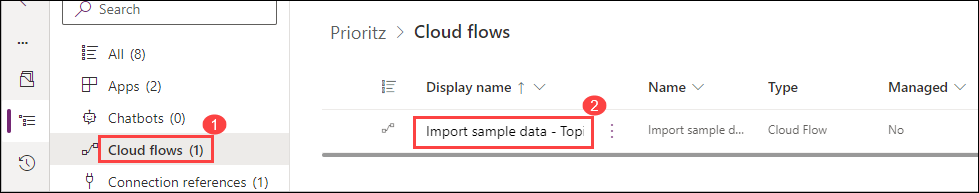

9. Click on **Edit** button to review the flow.
  
    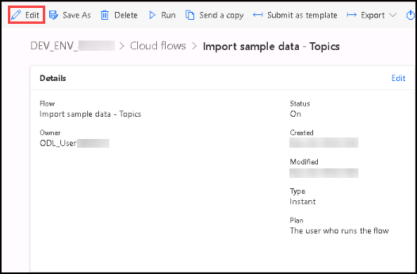

10. Expand the **Parse JSON** step and review the data this flow will create.

    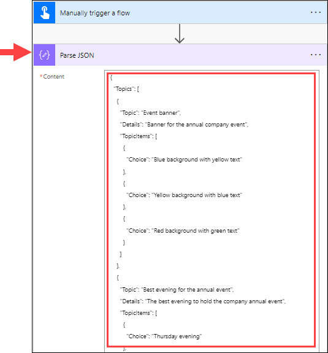

11. Expand the **Apply to each topic** step.
    
    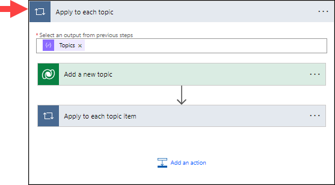

12. Expand the **Apply to each topic item** step.
   
     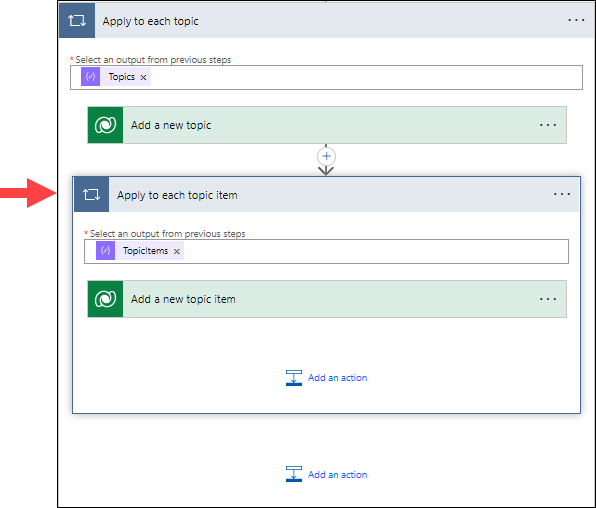

13. The **Apply to each** step should look like the image below. This is the logic for the automation.
 
     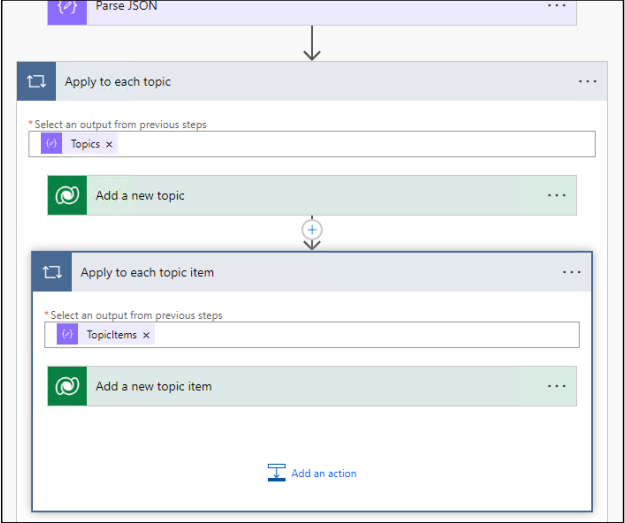

14. Click on the **<- back** button.
 
     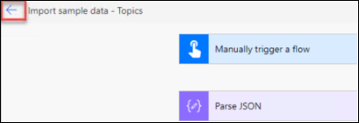

15. Click on the flow name to open the flow details screen.

     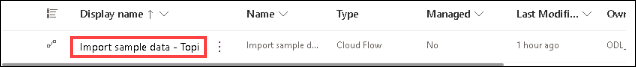

16. Click on **Run** to run the flow.
   
     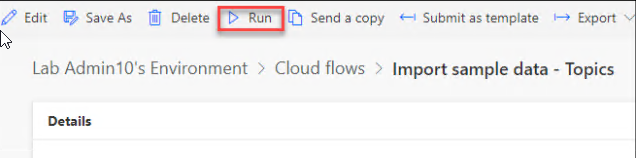

17. Click the **Run flow** button on the Run flow blade.

     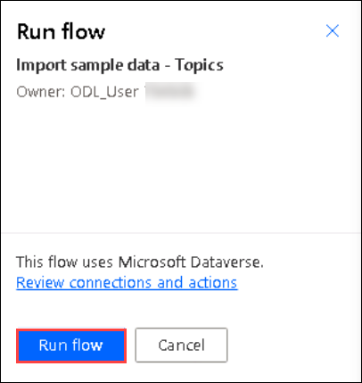

     > **Note** : If you receive this error `Error from token exchange: Permission denied due to missing connection` while running the flow, this is because the **Dataverse connection** not being added correctly. Delete the imported solution and try to re-import the solution by performing the **Steps 11-21** of this task again, then try to trigger the flow again.

18. Click **Done** and wait for the flow run to complete.

     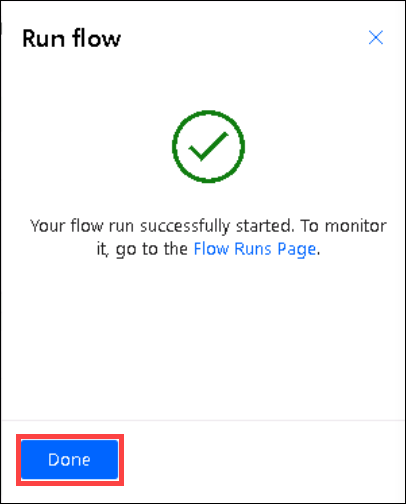

19. The flow should run successfully. If you want, you can click on the run row and it will show you
    the details of what the flow did.
   
      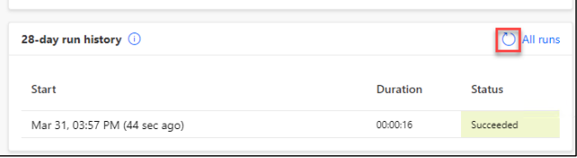

### Task 2: Test the apps

1. Navigate back to **PrioritZ** solution by clicking on **Cloud flows**. Alernatively you can also open **Power Apps** maker portal by using this URL `https://make.powerapps.com` if not already open. Make sure the development environment named **DEV_ENV_<inject key="Deployment ID" enableCopy="false" /> (2)** is selected.
       
   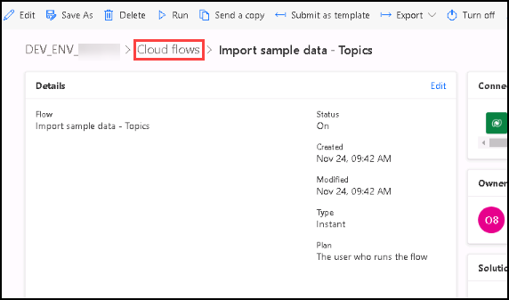

1. Navigate to **Solutions** blade by clicking on **Back to Solutions** **(<-)** button.

   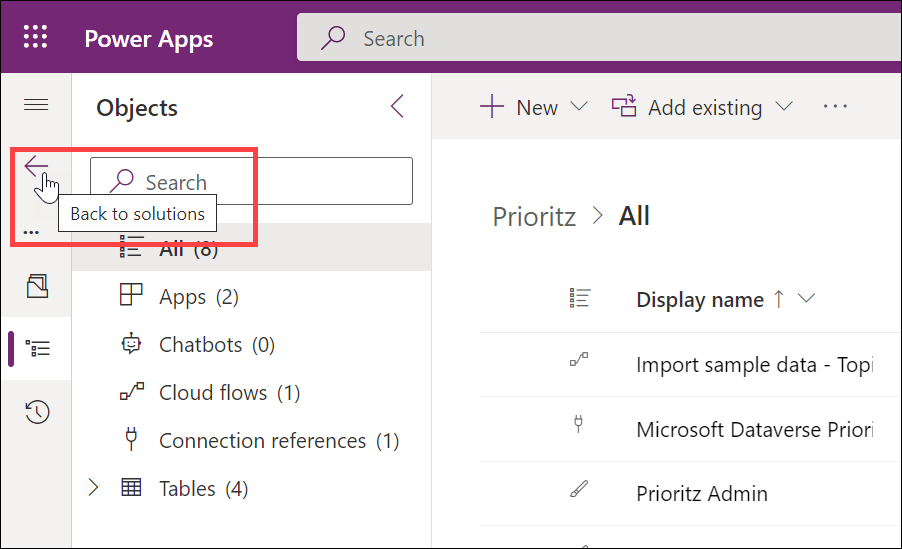
   
2. Select **Apps (1)** from the left-hand side menu of Power Apps,  you should see two applications named **PrioritZ Ask** and **PrioritZ Admin (2)**. 

     >**Info:** **PrioritZ Admin** app is used to manage topics being asked about and **PrioritZ Ask** app allows users to respond.

    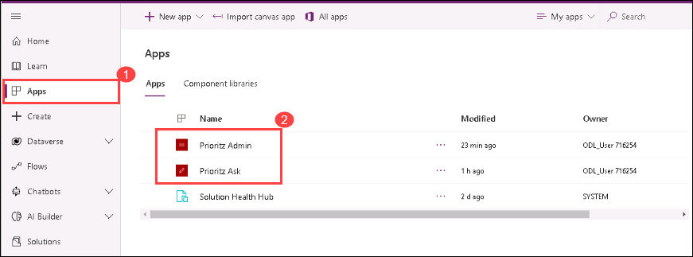

3. Launch the **PrioritZ Admin** application.
    
    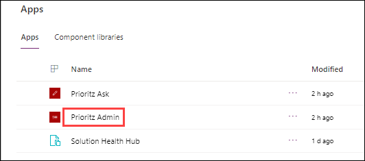

4. You should see the below four topics.

    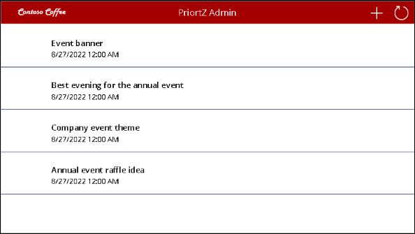

5. Click to open **Event banner** topic.

6. You should see the topic details with some topic items.

    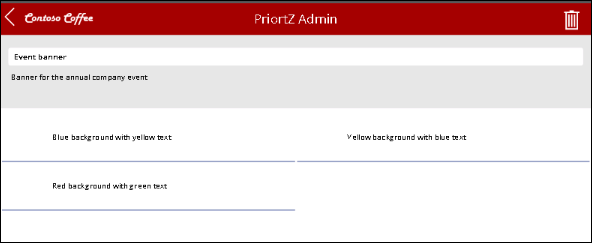

7. Click on the **<** back button.

    > **Note** : You should go back to the home screen.

9. Now, click on the **+** button to add a new topic.
    
    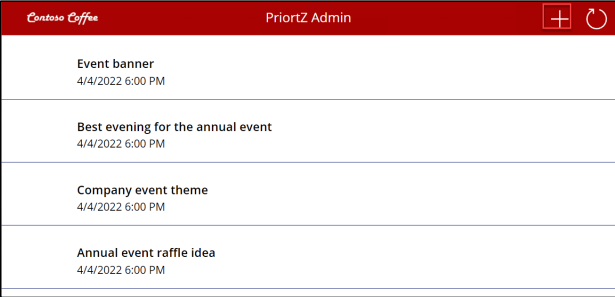

10. Provide the below information and click **add a picture** that is present below **Respond By** field.
     
     1. **Topic** : Enter `Change Taco Tuesday to some other food`
     
     1. **Details** : Enter `People are tired of tacos, what should we have instead of tacos?`
     
     1. **Respond By** : Select **today's date**.
     
     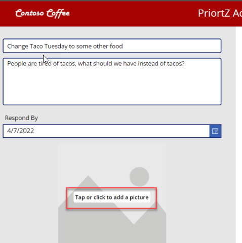

1. Navigate to this path C:\LabFiles in file explorer, select **image.png** and click open.

12. Type **Tamale Tuesday** on the Choice field and click **add a picture** that is present below Choice field.
     
      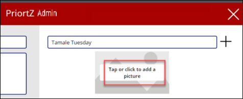

11. Navigate to this path `C:\LabFiles` in file explorer, select **image.png** and click open.

13. Click **+** to add the choice.
     
      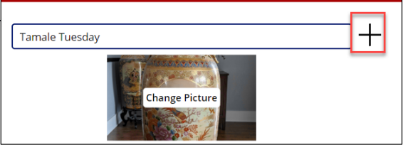

14. Add couple more choices by repeating **steps 12-14**.
       
       1. **Choice 1** : Enter `Steak Tuesday`
       
       2. **Choice 2**: Enter `Cheese and Wine Tuesday`

15. Click on **Save** button to save th topic.
    
    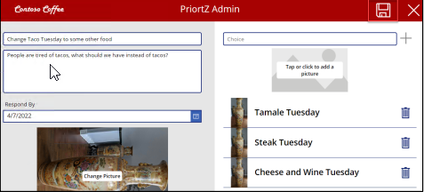

16. The new topic should be saved, and you should be navigated back to main screen.

17. You should see the topic you added in the list of topics.

     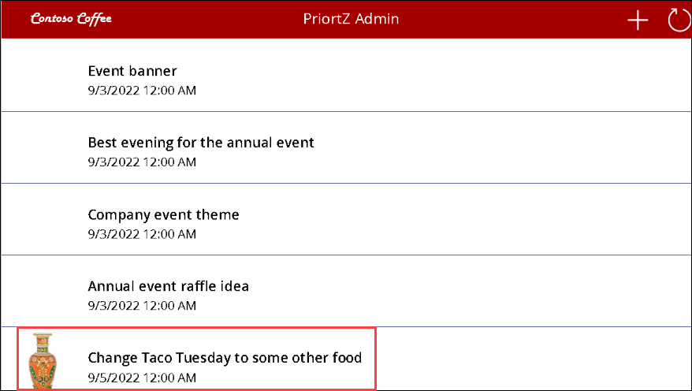

18. Close the PrioritZ Admin application by closing the browser tab in which PrioritZ Admin application is open.

19. Select **Apps (1)** from the left-hand side menu of Power Apps and launch the **PrioritZ Ask (2)** application.
     
     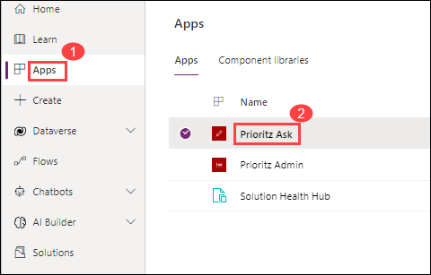

20. You should see a list of topics. Open the **Change Taco Tuesday to some other food** topic that you created in the previous steps.

     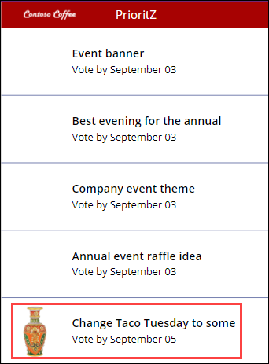

21. Click on the **up/down** icons and order the items in the order you prefer them and click **Vote**.
     
      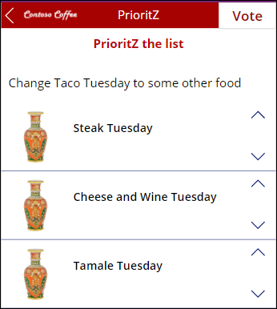

22. You should be navigated back to the main screens, and you should see a notification message.
      
      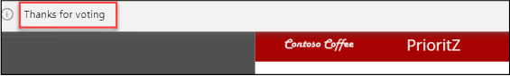

23. Close the PrioritZ Ask app by closing the browser tab in which PrioritZ Ask application is open.

## Exercise 2 – Add a column for My Notes

In this exercise, you will add a new column **My Notes** to the topic table and update the PriortZ Admin
application.

### Task 1: Add a new column

1. Navigate to Power Apps maker portal by using below URL if not already open. Make sure the development environment named **DEV_ENV_<inject key="Deployment ID" enableCopy="false" /> (2)** is selected.
    ```
    https://make.powerapps.com
   ```
2. Select **Solutions (1)** from the left-hand side menu of Power Apps and open the **PrioritZ (2)** solution.

   

3. Expand **Tables** and select the **PrioritZ Topic** table.

4. Select the **Columns** tab that is present under **Schema** and click **+ New column**.

    

5. Enter the below value in the Display name field.

   ```
   My Notes
   ```
1. Now, search for **Plain text (1)** under Data type then select the one that comes under **Multiline Text (2)** , and click **Save (3)**.

    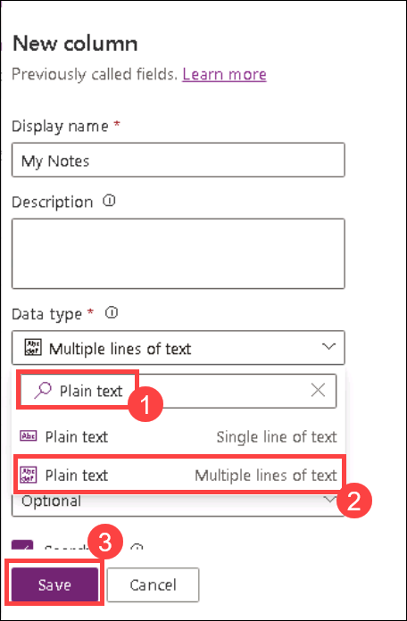
   
   > **Note** : Do not navigate away from this page.

### Task 2: Update admin app

1. Make sure you are still in the **PrioritZ** solution. Select **Apps (1)** under **Objects** and select the **PrioritZ Admin (2)** application and click on **Edit (3)**.
    
    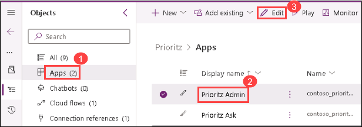

3. Select the **Add Topic Screen**.

    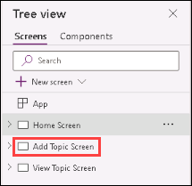

4. Select the **Insert (1)** tab, click **Text (2)** , and then select **Text input (3)**.
   
     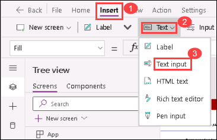

5. Double click on the newly added **Text input** and enter the below value to rename the text input.

    ```
    Notes textbox
    ```
    
     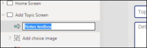

6. Make the add picture control smaller if needed, and move the **Respond By and label textbox** down and place the **Notes textbox** between the Details control and the Respond by label.
   
    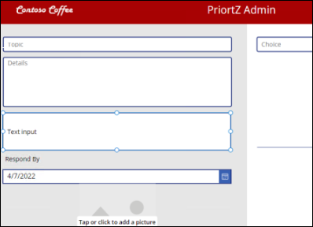

7. Select **Notes textbox** and then **HintText** from the properties dropdown.

    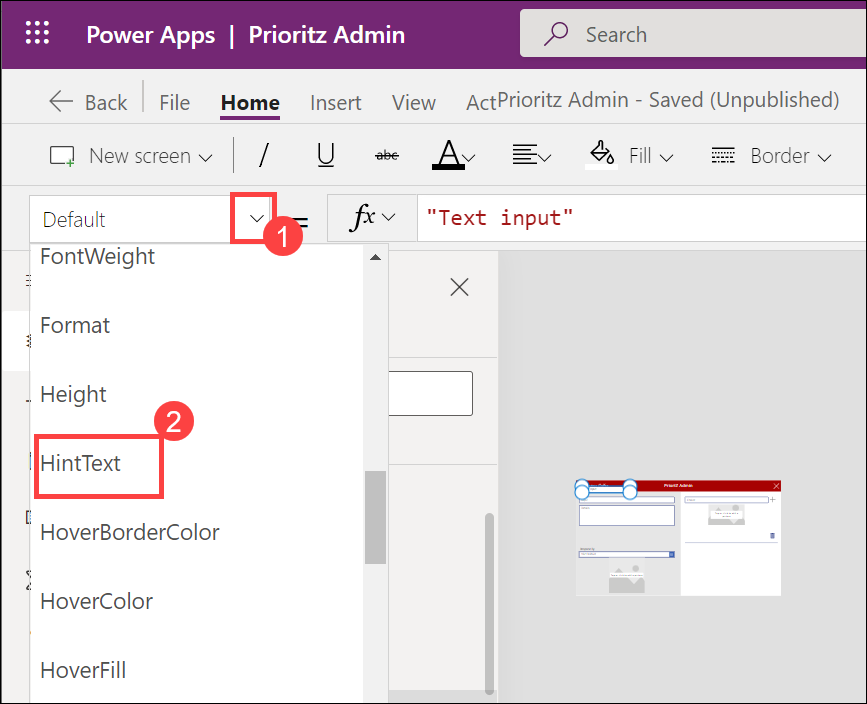

8. Change the **HintText** value of the Notes textbox to the below value. 

    ```
    My notes
    ```
   
    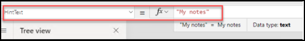


9. Select the **Mode** from the properties dropdown and change it's value by entering the below text.

    ```
    TextMode.MultiLine
    ```

    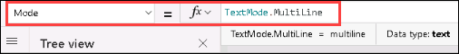

10. Select **Save topic icon** under **Add Topics Screen** section.
     
     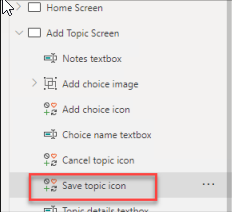

11. Replace the **OnSelect** formula of the **Save topic icon** with the formula below. The Patch creates
    the new row in the Dataverse table.
     
     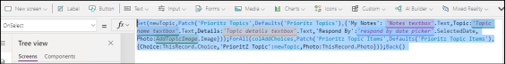

    ```
    Set(newTopic,Patch('Prioritz Topics',Defaults('Prioritz Topics'),{'My Notes': 'Notes textbox'.Text,Topic:'Topic name textbox'.Text,Details:'Topic details textbox'.Text,'Respond By':'respond by date picker'.SelectedDate,Photo:AddTopicImage.Image}));ForAll(colAddChoices,Patch('Prioritz Topic Items',Defaults('Prioritz Topic Items'),{Choice:ThisRecord.choice,'PrioritZ Topic':newTopic,Photo:ThisRecord.photo}));Back()
    ```
12. Select the **View Topic Screen (1)** from the **Screens** tab.

1.  Navigate to the **Insert** tab and click **Label (2)**.

    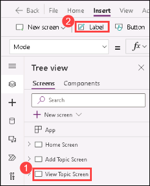

13. Double click on the newly added label and enter the below value to rename the label you just added.

     ```
     Notes label
     ```
     
    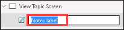

14. Change the **Text** value of the Notes label with the below text.

     ```
     'Topics gallery'.Selected.'My Notes'
     ```
  
      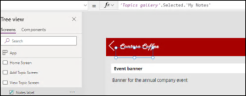

15. Rearrange the controls and move the **Notes label** between the details label and Topic items
    gallery.
   
      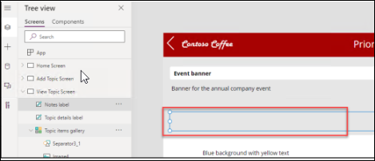


16. Select the **Home Screen** and click **Preview the app**.
      
      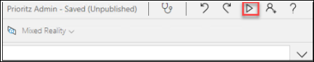

17. Click on the **+** button to add a new topic.

      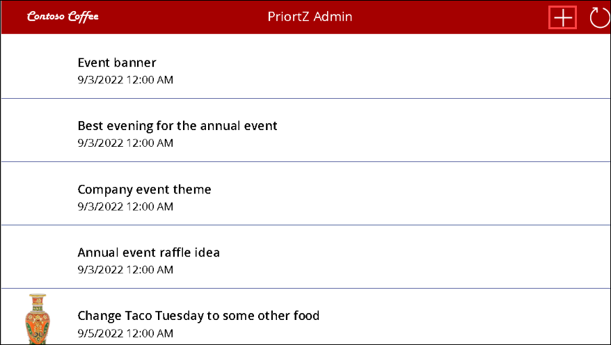

18. Fill out the form by providing below information and click **add a picture** that is present below **Respond By** field.

       1. Topic: `Test Notes` (1)
       
       2. Details: `Testing the notes` (2)
       
       3. Text input: `Prioritz Admin topic` (3)
       
       4. Respond By: **Today's date** (4)
      
      
1. Navigate to this path C:\LabFiles in file explorer, select **image.png** and click open.

12. Type **Test One** on the Choice field and click **add a picture** that is present below Choice field.
     
      

11. Navigate to this path `C:\LabFiles` in file explorer, select **image.png** and click open.

13. Click **+** to add the choice.
     
      

14. Add one more choices by repeating **steps 20-22** of this task.
       
       1. **Choice 1** : Enter `Test Two`
1. After adding all the Choices an topic dteails, your screen should look like beow screenshot.

   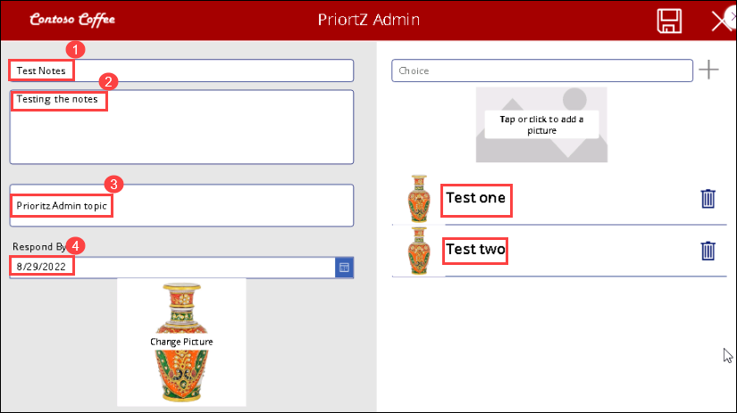
      
19. Now, click on **Save** button.The new topic should be **saved**.
20. Click to open the **Test Notes** topic that you just created.
21. The notes **Prioritz Admin topic** that you have added earlier should now be visible now.
 
     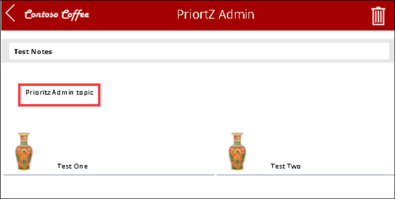

22. Close the app **preview**.
23. Click **File** and select **Save**.
24. Click **Publish**.
25. Select Publish this version and wait for the publishing to complete.

     

 26. You may close the **app designer**.

## Exercise 3 – Test the Power Platform CLI

In this exercise, you will review and test the Power Platform CLI extension in Visual Studio Code.

>**Note** : Visual studio code and Power platform CLI installation is already done as a part of the prerequisites.

1. Navigate to Power Platform admin center by using below URL and select **Environments**.
      ```
        https://admin.powerplatform.microsoft.com/environments
      ```

1. If you are presented with **Help us protect your account**, click on **Skip for now**.

   

1. If you see the pop-up **Stay Signed in?**, click **No**.

2. Click to open your dev environment named **DEV_ENV_<inject key="Deployment ID" enableCopy="false" />**.

3. Right click on the **Environment URL** value and paste the value in notepad.
 
    >**Note** : Make sure the Environment URL value is copied along with the **https**. Your copied value should look like this `https://orgxxxxxx.crm.dynamics.com/`

    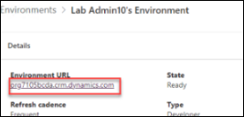

4. In the JumpVM, start **Visual Studio Code** using the shortcut available on the desktop.

   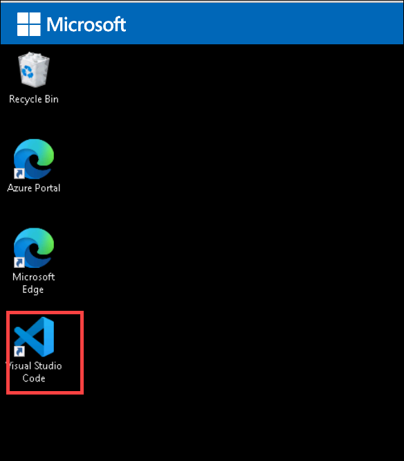
   
6. Click **Terminal** and select **New Terminal**.

    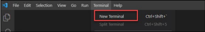

7. Run the below command in the terminal.
   ```
   pac
   ```
   
   > **Info:** If u found error after using pac command, try un-installing the Power Platform tool and re-install it, then retry the step.
   
8. Replace `<your environment URL>` in the below command with the value of environment URL that you copied earlier then run the command. 
   ```
   pac auth create --name DevAuth --url <your environment URL>
   ```

   > **Info:** After adding the environment URL, the command will look like this: `pac auth create --name DevAuth--url https://org32172839283.crm.dynamics.com/`
  
    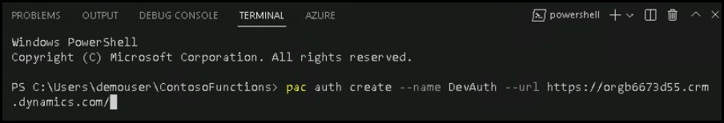

1.  Complete the **Sign in** process, using the below credentials.

      * Email/Username: <inject key="AzureAdUserEmail"></inject>
      * Password: <inject key="AzureAdUserPassword"></inject>

1. If you are presented with **Help us protect your account**, click on **Skip for now**.

     

9. Select **Power Platform (1)** tool, you should now have at least one **auth profile (2)**. If you have more than profile, make sure the profile you created is selected
   
    

    > **Note** : If you are able to see the **Universal Profile** instead of **DeVAuth** profile, it is because of adding the incorrect **Environment URL** value in the **pac auth create** command in Step 9. To fix this issue, follow the below steps:

      1. Delete the **Universal Profile** from Visual Studio Code by clicking on delete button.
      2. Copy the correct **Environment URL** value by following **Step 5** of this task. 
      3. Perform the **Step 9** of this task again to create the auth profile.

10. Click **Terminal** and select **New Terminal** if not already open.

     

11. Run the command below to see list of solutions.

      ```
      pac solution list
      ```
12. You should see list of solutions installed on your environment.
    
    
