# Lab 01 - Getting Started


## Table of Contents

**Lab Scenario** 

1. Exercise 1 - Review solution components 

   - Task 1: Review solution components and run flow 

   - Task 2: Test the apps 

2. Exercise 2 – Add a column for My Notes 

   - Task 1: Add a new column 

   - Task 2: Update admin app 

3. Exercise 3 – Verify the pre-installed Visual Studio Code Installer and Power Platform CLI Extension 

   - Task 1: Test the Power Platform CLI 


### Lab Scenario


Working as part of the Prioritz fusion team you will be setting up your Power Platform development
environment. You will review the current solution and explore the current state of the Prioritz apps,
flows and tables. You will be also adding a column to a table and modifying the app to use it.


## Exercise 1 - Review solution components

In this exercise, you will review the components of the solution that is already imported in your pre-created dev environment. You will also run a flow that will add sample data to your environment, and test the applications in the solution.

>**Note**: The Dev environment is already pre-created and Prioritz solution is imported into the Dev environment as a part of the prerequisites.

### Task 1: Review solution components and run flow

1. Navigate to **Power Apps maker** portal by using the below URL.
   ```        
    https://make.powerapps.com
   ```
1. Now, click on **Environment (1)** and select the pre-created dev environment named **Testodl_user_<inject key="Deployment ID" enableCopy="false" /> (2)**.   

     

2. Now, click on **Solutions** from the left hand side menu.

      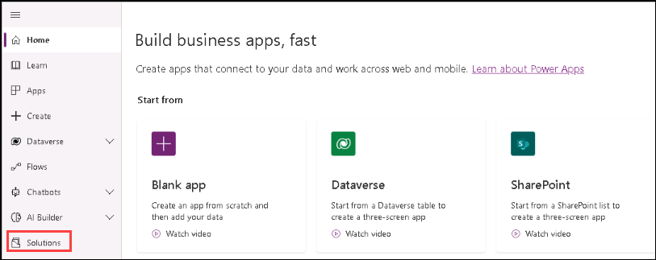

3.  Open the **PrioritZ** solution which is imported.
    
     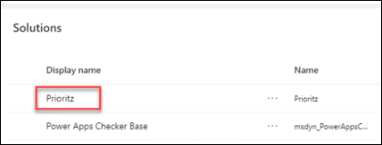

4. Expand **Tables (1)** and select the **PrioritZ Topic (2)** table.
   
     

5. Select the **Columns** under Schema and review the columns of the **PrioritZ Topic** table. The standard columns are built-in, and all tables have them.
 The custom columns were created by the team for this application.
 
   

6. Select the **Relationships** tab from Columns dropdown and review how this table is related to other tables.
 
    
 
    

1. Now, select **Connection reference (1)** and click on **Microsoft Dataverse Prioritz (2)**.

    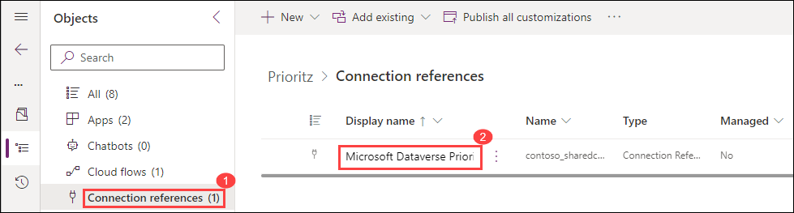

1. On the **Edit Microsoft Dataverse Prioritz** connection window, select the **Connection** dropdown and click on **New Connection**.

    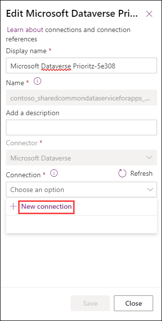

1. A new browser window will be opened to create the connection, in the search bar search for **Microsoft Dataverse (1)** and select it from the list.

    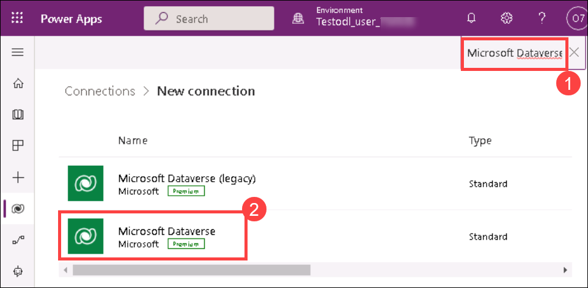

1. Click on the **create** button to create a new connection.

    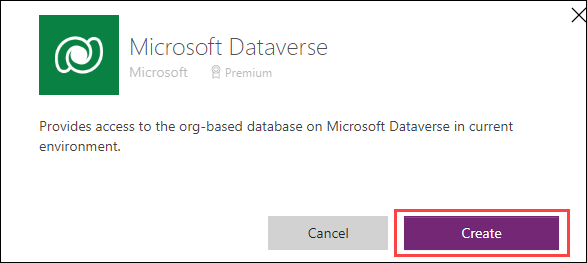

1. Verify the new connection that is created and close the browser window.

    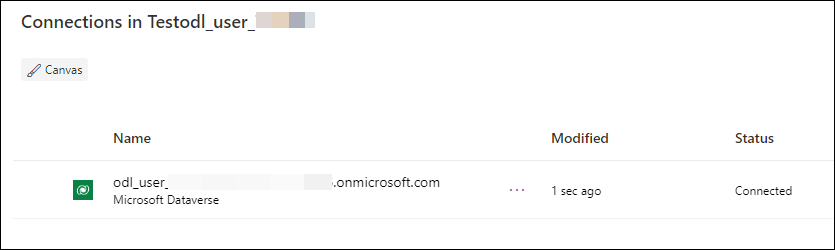

1. Navigate back to the **Edit Microsoft Dataverse Prioritz** connection window and click on **Refresh**. Select the connection dropdown, you should see the connection added in the previous step, select the connection and click on Save. 

    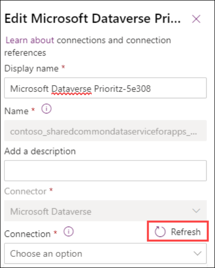

1. Click on **Save changes** on **Save Changes to this connection reference** pop-up.

    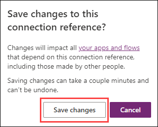

1. Select **Cloud flow (1)** and open the **Import sample data – Topics (2)** flow.
 
    

9. Click on **Edit** button to review the flow.
  
    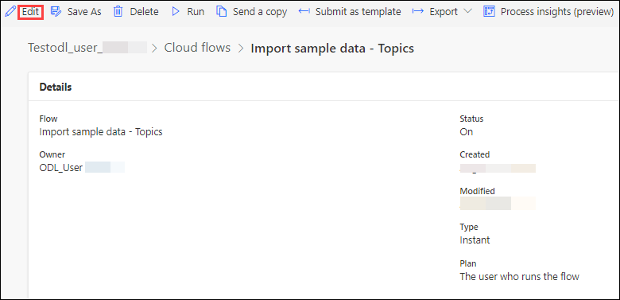

10. Expand the **Parse JSON** step and review the data this flow will create.

    

11. Expand the **Apply to each topic** step.
    
    

12. Expand the **Apply to each topic item** step.
   
     

13. The **Apply to each** step should look like the image below. This is the logic for the automation.
 
     

14. Click on the **<- back** button.
 
     

15. Click on the flow name to open the flow details screen.

     

16. Click on **Run** to run the flow.
   
     

17. Click the **Run flow** button on the Run flow blade.

     

18. Click **Done** and wait for the flow run to complete.

     

19. The flow should run successfully. If you want, you can click on the run row and it will show you
    the details of what the flow did.
   
      

### Task 2: Test the apps

1. Navigate to Power Apps maker portal by using below URL if not already open. Make sure the development environment named **Testodl_user_<inject key="Deployment ID" enableCopy="false" /> (2)** is selected.
   ```
       https://make.powerapps.com
   ```
2. Select **Apps (1)** and you should see two applications named **PrioritZ Ask** and **PrioritZ Admin (2)**. **PrioritZ Admin**
    app is used to manage topics being asked about and **PrioritZ Ask** app allows users to respond.

      

3. Launch the **PrioritZ Admin** application.
    
    

4. You should see the below four topics.

    

5. Click to open **Event banner** topic.
6. You should see the topic details with some topic items.

    

7. Click on the **<** back button
8. You should go back to the home screen.
9. Click on the **+** button.
    
    

10. Provide the below information and click **add a picture**.
     
     1. Topic : Enter `Change Taco Tuesday to some other food`
     
     1. Details : Enter `People are tired of tacos, what should we have instead of tacos?`
     
     1. Respond By : Select **today's date**
     
     


12. Type **Tamale Tuesday** on the Choice field and click **add a picture**.
     
      

11. Navigate to this path `C:\LabFiles` in file explorer, select **image.png** and click open.

13. Click **+** to add the choice.
     
      

14. Add couple more choices by repeating step 12 and 13.
       
       Choice 1 : Enter `Steak Tuesday`
       
       Choice 2: Enter `Cheese and Wine Tuesday`

15. Click on **Save** button to save th topic.
    
    

16. The new topic should be saved, and you should be navigated back to main screen.
17. You should see the topic you added in the list of topics.

     

18. Close the PrioritZ Admin application.
19. Select **Apps (1)** and launch the **PrioritZ Ask (2)** application.
     
     

20. You should see a list of topics. Open the topic you created.

     

21. Click on the **up/down** icons and order the items in the order you prefer them and click **Vote**.
     
      

22. You should be navigated back to the main screens, and you should see a notification message.
      
      

23. Close the PrioritZ Ask app.

## Exercise 2 – Add a column for My Notes

In this exercise, you will add a new column **My Notes** to the topic table and update the PriortZ Admin
application.

### Task 1: Add a new column

1. Navigate to Power Apps maker portal by using below URL if not already open. Make sure the development environment named **Testodl_user_<inject key="Deployment ID" enableCopy="false" /> (2)** is selected.
    ```
    https://make.powerapps.com
   ```
2. Select **Solutions (1)** and open the **PrioritZ (2)** solution.

   

3. Expand **Tables** and select the **PrioritZ Topic** table.
4. Select the **Columns** tab and click **+ New column**.

    

5. Enter **My Notes (1)** for Display name, select **Multiline Text (2)** for Data type, and click **Save (3)**.

    

6. Do not navigate away from this page.

### Task 2: Update admin app

1. Make sure you are still in the **PrioritZ** solution.
2. Select **Apps (1)** and select the **PrioritZ Admin (2)** application and click on **Edit (3)**.
    
    

3. Select the **Add Topic Screen**.

    

4. Select the **Insert (1)** tab, click **Text (2)** , and then select **Text input (3)**.
   
     

5. Rename the text input **Notes textbox**.
    
     

6. Make the add picture control smaller if needed and move the respond by and label textbox
    down and place the Notes textbox between the Details control and the Respond by label.
   
    

7. Select Notes **textbox**.
8. Change the **HintText** value of the Notes textbox to **My notes**.
   
    

9. Change the **Mode** to **TextMode.MultiLine**.

    

10. Select **Save topic icon**.
     
     

11. Replace the **OnSelect** formula of the **Save topic icon** with the formula below. The Patch creates
    the new row in the Dataverse table.
     
     

    ```
    Set(newTopic,Patch('Prioritz Topics',Defaults('Prioritz Topics'),{'My Notes': 'Notes textbox'.Text,Topic:'Topic name textbox'.Text,Details:'Topic details textbox'.Text,'Respond By':'respond by date picker'.SelectedDate,Photo:AddTopicImage.Image}));ForAll(colAddChoices,Patch('Prioritz Topic Items',Defaults('Prioritz Topic Items'),{Choice:ThisRecord.choice,'PrioritZ Topic':newTopic,Photo:ThisRecord.photo}));Back()
    ```
12. Select the **View Topic Screen (1)** and go to the **Insert** tab and click **Label (2)**.

    

13. Rename the label you just added **Notes label**.

    

14. Change the **Text** value of the Notes label to **'Topics gallery'.Selected.'My Notes'**
  
      

15. Rearrange the controls and move the **Notes label** between the details label and Topic items
    gallery.
   
      


16. Select the **Home Screen** and click **Preview the app**.
      
      

17. Click on the **+** button to add a new topic.

      

18. Fill out the form by providing below information, add some choices, and then click **Save**.
  
       Topic: `Test Notes` (1)
       
       Details: `Testing the notes` (2)
       
       Text input: `Prioritz Admin topic` (3)
       
       Respond By: **Today's date** (4)
      
      

19. The new topic should be **saved**.
20. Click to open the topic you just created.
21. The notes should now be shown.
 
     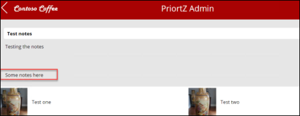

22. Close the app **preview**.
23. Click **File** and select **Save**.
24. Click **Publish**.
25. Select Publish this version and wait for the publishing to complete.

     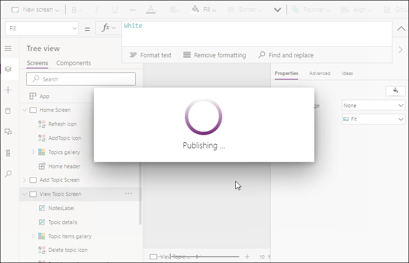

 26. You may close the **app designer**.

## Exercise 3 – Test the Power Platform CLI

In this exercise, you will review and test the Power Platform CLI extension in Visual Studio Code.

>**Note**: Visual studio code and Power platform CLI installation is already done as a part of the prerequisites.

1. Navigate to Power Platform admin center by using below URL and select **Environments**.
      ```
        https://admin.powerplatform.microsoft.com/environments
      ```
2. Click to open your dev environment named **Testodl_user_<inject key="Deployment ID" enableCopy="false" />**.
3. Copy the Environment URL and keep it in your clipboard or on notepad.
 
    

4. Open Visual Studio Code.

6. Click **Terminal** and select **New Terminal**.

    

7. Run the below command in the terminal.
   ```
   pac
   ```
   
8. Replace `<your environment URL>` in the below command with the value of environment URL that you copied earlier then run the command. 
   ```
   pac auth create --name DevAuth --url <your environment URL>
   ```
  >**Note**: Sign In if prompted
  
  > After adding the environment URL, the command will look like this: `pac auth create --name DevAuth--url https://org32172839283.crm.dynamics.com/`
  


9. Select **Power Platform (1)** tool, you should now have at least one **auth profile (2)**. If you have more than profile, make sure the profile you created is selected
   
   

10. Click **Terminal** and select **New Terminal**.

     

11. Run the command below to see list of solutions.

      ```
      pac solution list
      ```
12. You should see list of solutions installed on your environment.
    

