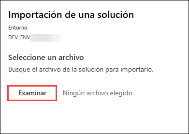
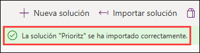
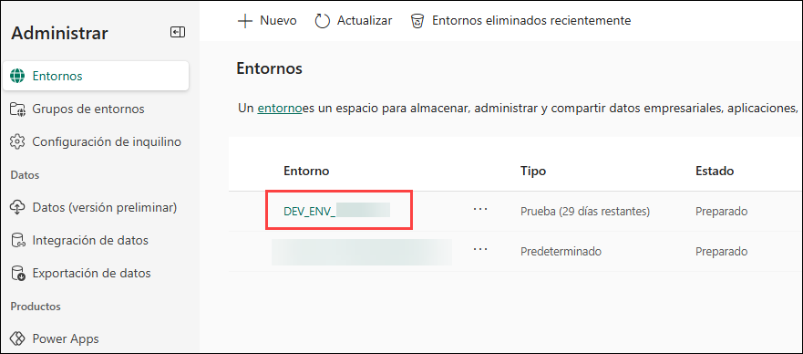
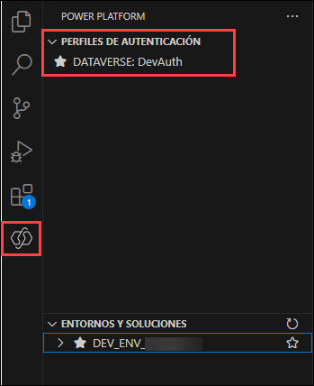

# Laboratorio 01 - Introducción a Power Apps

## Duración Estimada: 40 minutos

En este laboratorio, configurará su entorno de desarrollo de Power Platform como parte del equipo de fusión de Prioritz. Comenzará importando y revisando los componentes de la solución, incluyendo aplicaciones, flujos y tablas, para comprender el estado actual de la solución de Prioritz. A continuación, mejorará la solución añadiendo una nueva columna "My Notes" a una tabla y actualizando la aplicación de administración de Prioritz para que use este nuevo campo. Finalmente, verificará que Visual Studio Code y la extensión Power Platform CLI estén instalados y usará la CLI para conectarse a su entorno y mostrar las soluciones. Al completar estos ejercicios, adquirirá experiencia práctica con la administración de soluciones, la personalización de aplicaciones y las herramientas para desarrolladores en el ecosistema de Power Platform.

## Objetivos del laboratorio

Podrá completar lo siguiente:

- Ejercicio 1: Importar y revisar los componentes de la solución
- Ejercicio 2: Agregar una columna para My Notes
- Ejercicio 3: Verificar el instalador de Visual Studio Code y la extensión de la CLI de Power Platform preinstalados

## Ejercicio 1: Importar y revisar los componentes de la solución

En este ejercicio, importará la solución actual al entorno de desarrollo creado previamente y revisará los componentes de la solución. También ejecutará un flujo que agregará datos de muestra a su entorno y probará las aplicaciones en la solución.

>**Nota:** El entorno de Desarrollo (Dev) ya está creado como parte de los requisitos previos.

### Tarea 1: Importar, Revisar los componentes de la solución y ejecutar el flujo

1. En Lab VM, haga clic en el acceso directo **Power Apps Portal** del navegador Microsoft Edge que está disponible en el escritorio.

   

1. En la ventana **Iniciar sesión**, aparecerá la pantalla de inicio de sesión, introduzca el siguiente nombre de usuario **(1)** y pulse en **Siguiente** **(2)**.

   - Correo Electrónico/Nombre de Usuario: <inject key="AzureAdUserEmail"></inject>

     

1. Ahora, ingrese la siguiente contraseña **(1)** y haga clic en **Iniciar sesión** **(2)**. 

   - Contraseña: <inject key="AzureAdUserPassword"></inject>
    
     

1. Haga clic en **Preguntar más tarde** si aparece la ventana emergente "Acción requerida".

   >**Nota:** Si la opción **Preguntar más tarde** no está disponible, siga los pasos del 5 al 14. De lo contrario, continúe con el **Paso 15**.

1. En **Start by getting the app page**, haga clic en **Siguiente**.

1. Haga clic en **Siguiente** dos veces.

1. En **Android**, vaya a Play Store, busque **Microsoft Authenticator** y pulse **Install**.

   

   > **Nota:** Para iOS, abre la App Store y repita los pasos.

   > **Nota:** Omitir si ya está instalada.

1. Abra la aplicación y pulse **Scan a QR code**.

1. Escanee el código QR visible en la pantalla y haga clic en **Siguiente**.

   

1. Ingrese los dígitos que se muestran en la pantalla de la app Authenticator en el móvil y toque **Yes**.

1. Una vez aprobada la notificación, haga clic en **Next**.

   

1. Haga clic en **Done**.

1. Si se le solicita que mantenga la sesión iniciada, puede hacer clic en **No**.

1. Toque **Finish** en el dispositivo móvil.

   > **NOTA:** Al volver a iniciar sesión, ingrese los dígitos que se muestran en la pantalla de la **applicación Authenticator** y haga clic en Yes.

1. Si ve la ventana emergente **¿Desea permanecer conectado?**, haga clic en **No**.

1. Una vez que haya iniciado sesión, haga clic en **Entorno (1)** y seleccione el entorno de desarrollo creado previamente llamado **DEV_ENV_<inject key="Deployment ID" enableCopy="false" /> (2)**.   

     

1. Ahora, haga clic en **Soluciones(1)** en el menú del lado izquierdo y haga clic en **Importar solución(2)**.

      

1. Haga clic en **Examinar**.
    
     
     
1. Navegue hasta la ruta `C:\LabFiles\Developer-in-a-day\Student\L01 - Getting started\Resources` en el explorador de archivos, seleccione el archivo **Prioritz_1_0_0_7.zip** y haga clic en **Abrir**.

    

1. Asegúrese de que el archivo **Prioritz_1_0_0_7.zip(1)** esté seleccionado y haga clic en **Siguiente(2)**.
    
     
     
1. Haga clic en **Siguiente** nuevamente en la hoja de importación de solución.

     

1. En la sección **Conexiones**, haga clic en el botón de puntos suspensivos **...(1)** junto a **Microsoft Dataverse Priority**. Asegúrese de que el correo electrónico de usuario **<inject key="AzureAdUserEmail"></inject> (2)** que está utilizando esté seleccionado. Haga clic en **Importar(3)**.

    

1. Espere hasta que se complete la importación de la solución.

     
     
1. Ahora debería ver la solución que importó en la lista de soluciones. Abra la solución **Prioritz** que importó.

     

1. Expanda **Tablas (1)** y seleccione la tabla **PrioritZ Topic (2)**.
   
     

1. Seleccione **Columnas** en Esquema y revise las columnas de la tabla **PrioritZ Topic**.

   >**Información**: Las columnas estándar están integradas y todas las tablas las tienen. El equipo creó las columnas personalizadas para esta aplicación.
 
   

1. Seleccione la pestaña **Relaciones (2)** del menú desplegable **Columnas (1)** y revise cómo se relaciona esta tabla con otras tablas.
 
    
 
    

1. Seleccione **Flujo de nube (1)** y abra el flujo **Importar datos de muestra – Topics (2)**.
 
    

1. Haga clic en el botón **Editar** para revisar el flujo.
  
    

1. Expanda el paso **Parse JSON** y revise los datos que creará este flujo.

    
    
    >>**Nota**: Si no puede expandir el paso, haga clic en los puntos suspensivos (...), luego seleccione Configuración y haga clic en Cancelar.
    
1. Expanda el paso **Apply to each topic**.
    
    

1. Expanda el paso **Apply to each topic item**.
   
     

    >>**Nota**: Si no puede expandir el paso, haga clic en los puntos suspensivos (...), luego seleccione Configuración y haga clic en Cancelar.

1. Los pasos **Apply to each** deben verse como la imagen a continuación. Esta es la lógica para la automatización.
 
    

1. Haga clic en el botón **<- volver**.
 
    

1. Haga clic en el nombre del flujo para abrir la pantalla de detalles del flujo.

     

1. Haga clic en **Ejecutar** para ejecutar el flujo.
   
     

1. Haga clic en el botón **Ejecutar flujo** en la hoja Ejecutar flujo.

     

     > **Nota**: Si recibe este error `Error from the token exchange: Permission denied due to missing connection` mientras ejecuta el flujo, esto se debe a que la **conexión de Dataverse** no se está agregando correctamente. Elimine la solución importada e intente volver a importar la solución realizando los **Pasos 6 a 14** de esta tarea nuevamente, luego intente desencadenar el flujo de nuevo.

1. Haga clic en **Listo** y espere a que se complete la ejecución del flujo.

    

1. El flujo debería ejecutarse correctamente. Si lo desea, puede hacer clic en la fila de ejecución y se le mostrarán los detalles de lo que hizo el flujo.
   
      

### Tarea 2: Probar las aplicaciones

1. Vuelva a la solución **PrioritZ** haciendo clic en **Flujos en la nube**. Alternativamente, también puede abrir el portal de creación de **Power Apps** utilizando esta URL `https://make.powerapps.com` si aún no está abierto. Asegúrese de que el entorno de desarrollo denominado **DEV_ENV_<inject key="Deployment ID" enableCopy="false" /> ** esté seleccionado.
       
   

   > Nota: Si aparece la ventana emergente **Bienvenido a Power Apps Studio**, simplemente haga clic en Omitir para continuar.

1. Navegue hasta la hoja **Soluciones** haciendo clic en el botón **Volver a Soluciones** (<-)**.

   
   
1. Seleccione **Aplicaciones (1)** en el menú del lado izquierdo de Power Apps. Debería ver dos aplicaciones llamadas **PrioritZ Ask** y **PrioritZ Admin (2)**. 

     >**Información:** La aplicación **PrioritZ Admin** se utiliza para administrar los temas sobre los que se pregunta y la aplicación **PrioritZ Ask** permite que los usuarios respondan.

    

1. Inicie la aplicación **PrioritZ Admin** haciendo clic en el símbolo **iniciar**.
    
    

1. Debería ver los cuatro temas siguientes.

    

1. Haga clic para abrir el tema **Event banner**.

1. Debería ver los detalles del tema con algunos elementos del tema.

    

1. Haga clic en el botón **<** regresar.

    

    > **Nota**: Debería volver a la pantalla de inicio.

1. Ahora, haga clic en el botón **+** para agregar un nuevo tema.
    
    

1. Proporcione la siguiente información y haga clic en **add a picture** que se encuentra debajo del campo **Respond By**.
     
     1. **Topic**: Escriba `Change Taco Tuesday to some other food`
     
     1. **Details**: Escriba `People are tired of tacos, what should we have instead of tacos?`
     
     1. **Respond By**: Seleccione **la fecha de hoy**. <br/>

        

1. Navegue hasta la ruta `C:\LabFiles` **(1)** en el Explorador de Archivos, seleccione **image.png (2)** y haga clic en **Abrir (3)**.

      

1. Escriba **Tamale Tuesday** en el campo Choice y haga clic en **add a picture** que se encuentra debajo del campo Choice.
     
      

1. Navegue hasta la ruta `C:\LabFiles` en el Explorador de Archivos, seleccione **image.png** y haga clic en Abrir.

1. Haga clic en **+** para agregar la opción.
     
      

1. Agregue un par de opciones más repitiendo los **pasos 12 a 14**.
       
    1. **Choice 1** : Escriba `Steak Tuesday`
       
    2. **Choice 2**: Escriba `Cheese and Wine Tuesday`

1. Haga clic en el botón **Save** para guardar el tema.
    
    

1. El nuevo tema debería estar guardado y debería volver a la pantalla principal.

1. Debería ver el tema que agregó a la lista de temas.

     

1. Cierre la aplicación PrioritZ Admin cerrando la pestaña del navegador en la que está abierta la aplicación PrioritZ Admin.

1. Seleccione **Aplicaciones (1)** en el menú del lado izquierdo de Power Apps e inicie la aplicación **PrioritZ Ask (2)** haciendo clic en el símbolo iniciar.
     
     

1. Debería ver una lista de temas. Abra el tema **Change Taco Tuesday to some other food** que creó en los pasos anteriores.

     

1. Haga clic en los íconos **arriba/abajo** para ordenar los elementos en el orden que prefiera y haga clic en **Vote**.
     
      

1. Debería volver a las pantallas principales y debería ver un mensaje de notificación.

      
    
1. Cierre la aplicación PrioritZ Ask cerrando la pestaña del navegador en la que está abierta la aplicación PrioritZ Ask.

> **Felicidades** por completar la tarea! Ahora, es el momento de validarlo. Estos son los pasos:
> - Presione el botón Validar para la tarea correspondiente. Si recibe un mensaje de éxito, puede continuar con la siguiente tarea. 
> - Si no es así, lea atentamente el mensaje de error y vuelva a intentar el paso, siguiendo las instrucciones de la guía de laboratorio.
> - Si necesita ayuda, póngase en contacto con nosotros en cloudlabs-support@spektrasystems.com. Estamos disponibles las 24 horas del día, los 7 días de la semana para ayudar.

<validation step="43212171-0d6f-44d9-9c69-5061a4bb1b1c" />

## Ejercicio 2: Agregar una columna para My Notes

En este ejercicio, agregará una nueva columna **My Notes** a la tabla de temas y actualizará la aplicación PriortZ Admin.

### Tarea 1: Agregar una nueva columna

1. Navegue hasta el portal de creación de Power Apps utilizando la siguiente URL si aún no está abierta. Asegúrese de que el entorno de desarrollo denominado **DEV_ENV_<inject key="Deployment ID" enableCopy="false" /> (2)** esté seleccionado.
    ```
    https://make.powerapps.com
   ```
1. Seleccione **Soluciones (1)** en el menú del lado izquierdo de Power Apps y abra la solución **PrioritZ (2)**.

   

1. Expanda **Tablas (1)** y seleccione la tabla **PrioritZ Topic (2)**. Seleccione la pestaña **Columnas** que se encuentra debajo de **+ Nuevo (3)** y haga clic en **columna (4)**.

    

1. Ingrese **My Notes (1)** en el campo Nombre para mostrar. Ahora, busque **texto sin formato (2)** en Tipo de datos, luego seleccione el que se encuentra como **Multiple lines of text (3)** y haga clic en **Guardar (4)**.

    
   
   > **Nota**: No abandone esta página.

### Tarea 2: Actualizar la aplicación de administración

1. Asegúrese de que todavía se encuentra en la solución **PrioritZ**. Seleccione **Aplicaciones (1)** en **Objetos** y seleccione la aplicación **PrioritZ Admin (2)** y haga clic en **Editar (3)**.
    
    

   > Nota: Si no puede encontrar el botón Editar, haga clic en los puntos suspensivos **(...)** al lado del panel Agregar existente.

1. Seleccione **Add Topic Screen (1)**. Haga clic en **+ Insertar (2)** y seleccione **Entrada de texto (3)**.
   
     

   > Nota: Si no puede encontrar el botón Insertar, haga clic en los puntos suspensivos **(...)** en la esquina superior izquierda.

1. Haga doble clic en la **Entrada de texto** recién agregada e ingrese el valor a continuación para cambiar el nombre de la entrada de texto.

    ```
    Notes textbox
    ```
    
     

1. Si es necesario, reduzca el tamaño del control add picture y mueva el cuadro de texto y la etiqueta **Respond By** hacia abajo y coloque el cuadro de texto **Notes** entre el control Details y la etiqueta Respond by.
   
    

1. Seleccione el **cuadro de texto (1)** Notas, escriba **HintText (2)** en el cuadro de búsqueda de propiedades y luego seleccione **HintText (3)** de la lista.

    

1. Cambie el valor **HintText** del cuadro de texto Notes por el siguiente valor.

    ```
    My notes
    ```
   
    

1. Seleccione **Mode** en el menú desplegable de propiedades y cambie su valor ingresando el texto que aparece a continuación.

    ```
    TextMode.MultiLine
    ```

    

1. Seleccione **Save topic icon** en la sección **Add Topics Screen**.
     
     

1. Reemplace la fórmula **OnSelect** de **Save topic icon** con la fórmula que aparece a continuación. Patch crea una nueva fila en la tabla Dataverse.
     
     

    ```
    Set(newTopic,Patch('Prioritz Topics',Defaults('Prioritz Topics'),{'My Notes': 'Notes textbox'.Text,Topic:'Topic name textbox'.Text,Details:'Topic details textbox'.Text,'Respond By':'respond by date picker'.SelectedDate,Photo:AddTopicImage.Image}));ForAll(colAddChoices,Patch('Prioritz Topic Items',Defaults('Prioritz Topic Items'),{Choice:ThisRecord.choice,'PrioritZ Topic':newTopic,Photo:ThisRecord.photo}));Back()
    ```
1. Seleccione **View Topic Screen (1)** en la pestaña **Pantallas**. Haga clic en la pestaña **+ Insertar (2)** y seleccione **Etiqueta de texto (3)**.

    

1. Haga doble clic en la etiqueta recién agregada e ingrese el valor a continuación para cambiar el nombre de la etiqueta que acaba de agregar.

     ```
     Notes label
     ```
     
    

1. Cambie el valor **Text** de la etiqueta Notes por el texto a continuación.

     ```
     'Topics gallery'.Selected.'My Notes'
     ```
    

1. Reorganice los controles y mueva la **etiqueta Notes** entre la etiqueta de detalles y la galería de elementos de Temas.

      

1. Seleccione **Home Screen (1)** y haga clic en **Previsualizar la app (2)**.
      
      

1. Haga clic en el botón **+** para agregar un nuevo tema.

      

1. Complete el formulario proporcionando la siguiente información y haga clic en **add a picture** que se encuentra debajo del campo **Respond By**.

    1. Topic: **Test Notes (1)**
       
    2. Details: **Testing the notes (2)**
       
    3. Text input: **Prioritz Admin topic (3)**
       
    4. Respond By: **La fecha de Hoy (4)**
       
      

1. Escriba **Test One** en el campo Choice y haga clic en **add a picture** que se encuentra debajo del campo Choice.
     
      

1. Navegue hasta esta ruta `C:\LabFiles` en el Explorador de Archivos, seleccione **image.png** y haga clic en abrir.

      

1. Haga clic en **+** para agregar la opción.
     
      

1. Agregue una opción más repitiendo los **pasos 20 a 22** de esta tarea.
       
    - **Choice 1** : Escriba `Test Two`

      

1. Después de agregar todas las opciones y los detalles del tema, su pantalla debería verse como la siguiente captura de pantalla.

     
      
1. Ahora, haga clic en el botón **Save**. El nuevo tema debería estar **guardado**.

     

1. Haga clic para abrir el tema **Test Notes** que acaba de crear.

1. Las notas **Prioritz Admin topic** que agregó anteriormente ahora deberían estar visibles.
 
     

1. Cierre la **vista previa** de la aplicación.

1. Haga clic en **Publicar**.

    

1. Seleccione **Publicar esta versión** y espere a que se complete la publicación.

     

1. Puede cerrar el **diseñador de aplicaciones**.

## Ejercicio 3: Probar la CLI de Power Platform

En este ejercicio, revisará y probará la extensión de la CLI de Power Platform en Visual Studio Code.

>**Nota**: La instalación de Visual Studio Code y la CLI de Power Platform ya se realizó como parte de los requisitos previos.

1. Navegue hasta el centro de administración de Power Platform mediante la siguiente URL y seleccione **Ambientes**.
      ```
        https://admin.powerplatform.microsoft.com/environments
      ```

1. Si ve la ventana emergente **¿Desea permanecer conectado?**, haga clic en **No**.

1. Haga clic para abrir su entorno de desarrollo llamado **DEV_ENV_<inject key="Deployment ID" enableCopy="false" />**.

    


1. Haga clic con el botón derecho en el valor **Environment URL** y péguelo en el Bloc de notas.
 
    >**Nota**: Asegúrese de que el valor Environment URL se copie junto con **https**. El valor copiado debería verse parecido a `https://orgxxxxxx.crm.dynamics.com/`

    

1. En Lab VM, inicie **Visual Studio Code** usando el acceso directo disponible en el escritorio.

   
   
1. Haga clic en **Terminal** y seleccione **Nuevo terminal**.

    

1. Ejecute el siguiente comando en la terminal.
   ```
   pac
   ```
   
   > **Información:** Si encuentra un error después de usar el comando **pac**, descargue la CLI de Power Platform desde la URL **https://aka.ms/PowerAppsCLI**, abra el instalador y complete la instalación. Luego, vuelva a intentar el paso.

1. Reemplace `<your environment URL>` en el siguiente comando con el valor de la URL del entorno que copió anteriormente y luego ejecute el comando.
   ```
   pac auth create --name DevAuth --url <your environment URL>
   ```

   > **Información:** Después de agregar la URL del entorno, el comando se verá así: `pac auth create --name DevAuth--url https://org32172839283.crm.dynamics.com/`
  
    

1. Complete el proceso de **Inicio de sesión**, utilizando las siguientes credenciales.

      * Correo Electrónico/Nombre de Usuario: <inject key="AzureAdUserEmail"></inject>
      * Contraseña: <inject key="AzureAdUserPassword"></inject>

1. Seleccione la herramienta **Power Platform (1)**, ahora debería tener al menos un **perfil de autenticación (2)**. Si tiene más de un perfil, asegúrese de que el perfil que creó esté seleccionado.
   
    

    > Nota: Si no puede ver el perfil **DeVAuth**, cierre Visual Studio Code y vuélvalo a abrir.
    > **Nota**: Si puede ver el **Perfil Universal** en lugar del perfil **DeVAuth**, se debe a que agregó el valor **Environment URL** incorrecto en el comando **pac auth create** en el paso 9. Para solucionar este problema, siga los pasos a continuación:

      1. Elimine el **Perfil Universal** de Visual Studio Code haciendo clic en el botón Eliminar.
      2. Copie el valor **Environment URL** correcto siguiendo el **Paso 4** de esta tarea.
      3. Realice el **Paso 8** de esta tarea nuevamente para crear el perfil de autenticación.

1. Haga clic en **Terminal** y seleccione **Nuevo terminal** si aún no está abierta.

     

1. Ejecute el siguiente comando para ver una lista de soluciones.

      ```
      pac solution list
      ```
1. Debería ver una lista de soluciones instaladas en su entorno.
    
    

## Resumen

En este laboratorio, aprendió a importar y ejecutar una solución de inicio, a personalizarla agregando una nueva columna y actualizando la aplicación de administración, y a verificar la funcionalidad mediante la CLI de Power Platform.

## Has completado este laboratorio con éxito. Haz clic en el botón **Siguiente >>** para continuar con el próximo laboratorio.

