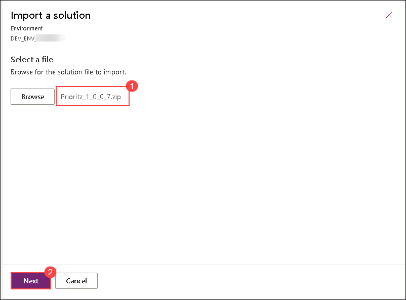
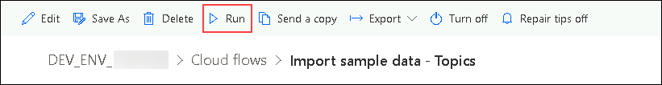
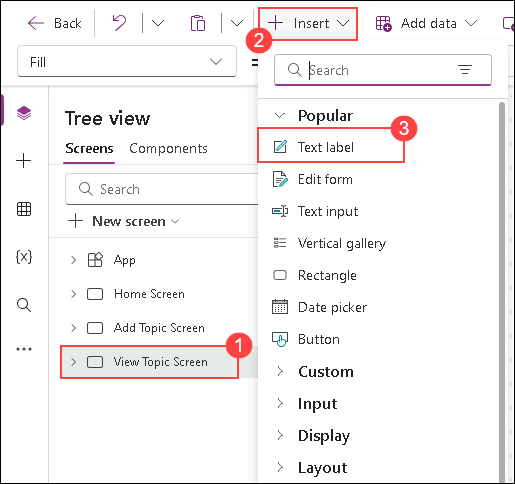

# Lab 01 - Getting started with Power Apps

## Estimated Duration: 100 Minutes

In this lab, you will set up your Power Platform development environment as part of the Prioritz fusion team. You will start by importing and reviewing solution components, including apps, flows, and tables, to understand the current state of the Prioritz solution. Next, you will enhance the solution by adding a new "My Notes" column to a table and updating the Prioritz Admin app to use this new field. Finally, you will verify that Visual Studio Code and the Power Platform CLI extension are installed and use the CLI to connect to your environment and list solutions. By completing these exercises, you will gain hands-on experience with solution management, app customization, and developer tools in the Power Platform ecosystem.

## Lab Objectives

You will be able to complete the following exercises:

- Exercise 1: Import and review solution components
- Exercise 2: Add a column for My Notes
- Exercise 3: Verify the pre-installed Visual Studio Code Installer and Power Platform CLI Extension

## Exercise 1 - Import and review solution components

In this exercise, you will import the current solution into the pre-created dev environment and review the components of the solution. You will also run a flow that will add sample data to your environment and test the applications in the solution.

>**Note:** The Dev environment is already pre-created as a part of the prerequisites.

### Task 1: Import, Review solution components and run flow

In this task, you will be importing the Prioritz solution into the Power Apps portal, connecting it with Dataverse, and exploring its tables, schema, and relationships. You also review and run a cloud flow that loads sample topic data into the environment. In the end, you verify that the solution and automation were imported and executed successfully.

1. On the top right corner,  click on **Environment (1)** and select the pre-created dev environment named **DEV_ENV_<inject key="Deployment ID" enableCopy="false" /> (2)**.   

      

    > **Note:** If you are unable to access **DEV_ENV_<inject key="Deployment ID" enableCopy="false" />** environment, follow the below steps. 

    i. Navigate to the Power Platform admin center by using the URL below
    
    ```
    https://admin.powerplatform.microsoft.com/environments
    ```

    ii. Click **Manage (1)**, naviagte to **Environments (2)** tab and open your dev environment named **DEV_ENV_<inject key="Deployment ID" enableCopy="false" />**.

    

    iii. Copy the **Environment ID** value and paste it into Notepad.

    

    iv. Replace the below **<ENVIRONMENT-ID>** value with the copied environment id and paste the URL in the browser.

    ```
    https://make.powerapps.com/environments/<ENVIRONMENT-ID>
    ```  

1. Now, click on **Solutions (1)** from the left hand side menu and click **Import solution (2)**.

      

1. On the **Import a Solution** pane, click **Browse** to select the solution file.
    
     
     
1. Navigate to this path `C:\LabFiles\Developer-in-a-day\Student\L01 - Getting started\Resources` **(1)** in file explorer , select the **Prioritz_1_0_0_7.zip** **(2)** file, and click **Open (3)**.

    

1. Make sure the **Prioritz_1_0_0_7.zip (1)** file is selected and Click **Next (2)**.
    
    
     
1. Click **Next** again on the import solution blade.

    

1. Under the **Connections** section, click on the ellipsis button **(...) (1)** next to **Microsoft Dataverse Prioritz**.

1. Ensure that user mail **<inject key="AzureAdUserEmail"></inject> (2)** you are using is selected.

1. Click on **Import (3)**.

    
    
1. The import process will take approximately 5–10 minutes to complete. Once the import is successful, a confirmation message will appear **Solution "Prioritz" imported successfully**.

     
     
1. You should now see the solution you imported in the list of solutions. Open the **Prioritz** solution you imported.

     

1. Expand **Tables (1)** and select the **Prioritz Topic (2)** table.
   
     

1. Under the **Schema** section, select the **Columns** of the **Prioritz Topic** table.

   >**Info:** The standard columns are built-in, and all tables have them. The custom columns were created by the team for this application.
 
   

1. From the **Columns (1)** dropdown, select the **Relationships (2)** Schema  and review how this table is related to other tables.
 
    
 
    

1. From the left-hand side under **Objects**, select **Cloud flows (1)**. Then, open the **Import sample data – Topics (2)** flow.
 
    

1. Click on **Edit** button to review the flow.
  
    

1. Expand the **Parse JSON** step and review the data this flow will create.

    
    
    >**Note:** If you're unable to expand the step, click on the ellipsis (...), then select Settings, and click Cancel.
    
1. Expand the **Apply to each topic** step.
    
    

    >**Note:** If you're unable to expand the step, click on the ellipsis (...), then select Settings, and click Cancel.

1. Expand the **Apply to each topic item** step.
   
     

1. The **Apply to each** step should look like the image below. This is the logic for the automation.
 
    

1. Click on the **<- back** arrow to navigate back.
 
    

1. Click on the **Import sample data - Topics** cloud flow name to open the flow details screen.

     

1. Click on **Run** to run the flow.
   
     

1. Click the **Run flow** button on the Run flow blade.

     

     > **Note:** If you receive the error `Error from the token exchange: Permission denied due to missing connection` while running the flow, it indicates that the **Dataverse connection** was not added correctly. To fix this, edit the flow, expand the **Apply to each** section, and click the **three dots (...)** next to **Add a new topic**. Then, add a new connection reference using your **ODL credentials**, save the flow, and run it again to test. If the error still persists, delete the imported solution and re-import it by performing **Steps 6–14** of this task again, and then try to trigger the flow once more.


1. Click **Done** and wait for the flow run to complete.

     

1. The flow should run successfully. If desired, you can click on the run entry to view detailed information about the actions the flow performed.

   
      

      

### Task 2: Test the apps

In this task, you will test the two imported apps, Prioritz Admin and Prioritz Ask.

1. Navigate back to **Prioritz** solution by clicking on **Cloud flows**. Alternatively, you can also open the **Power Apps** maker portal by using this URL `https://make.powerapps.com` if not already open. Make sure the development environment named **DEV_ENV_<inject key="Deployment ID" enableCopy="false" />** is selected.
       
   

2. Navigate to **Solutions** blade by clicking on **Back to solutions** **(←)** button.

   
   
3. Select **Apps (1)** from the left-hand side menu of Power Apps, you should see two applications named **Prioritz Ask** and **Prioritz Admin (2)**. 

     >**Info:** **Prioritz Admin** app is used to manage topics being asked about and **Prioritz Ask** app allows users to respond.

    

4. Navigate to **Prioritz Admin** Launch the **Prioritz Admin** application by clicking on **play** symbol.
    
    

5. You should see the four topics below. Click to open **Event banner**.

    

6. You should see the topic details with some topic items.

    

7. Click on the **(<)** back button.

    

    > **Note:** You should go back to the home screen.

8. Now, on the top right corner, click on the **+** button to add a new topic.
    
    

9. Provide the below information and click **add a picture (4)** that is present below **Respond By** field.
     
     - **Topic:** Enter `Change Taco Tuesday to some other food` **(1)**
     
     - **Details:** Enter `People are tired of tacos, what should we have instead of tacos?` **(2)**
     
     - **Respond By:** Select **today's date.** **(3)**

        

10. Navigate to this path **C:\LabFiles (1)** in file explorer, select **image.png (2)** and click **Open (3)**.

    

11. Type **Tamale Tuesday (1)** in the Choice field and click **Tap or click to add a picture (2)** that is present below the Choice field. Navigate to this path C:\LabFiles in file explorer, select **image.png** and click open.
     
      

12. Click **+** to add the choice.
     
      

13. Add a couple more choices by repeating **steps 12-14**.   
    - **Choice 1:** Enter `Steak Tuesday`
    - **Choice 2:** Enter `Cheese and Wine Tuesday`

14. Click on **Save** button to save the topic.
    
    

15. The new topic should be saved, and you should be navigated back to the main screen.

16. You should see the topic you added to the list of topics.

     

17. Close the Prioritz Admin application by closing the browser tab in which the Prioritz Admin application is open.

18. Select **Apps (1)** from the left-hand side menu of Power Apps and launch the **Prioritz Ask** application by clicking on the **play (2)** symbol.
     
     

19. You should see a list of topics. Open the **Change Taco Tuesday to some other food** topic that you created in the previous steps.

     

20. Click on the **up/down** icons to order the items in the order you prefer them, and click **Vote**.
     
      

21. You should be navigated back to the main screens, and you should see a notification message.   
      
    
22. Close the Prioritz Ask app by closing the browser tab in which the Prioritz Ask application is open.

> **Congratulations** on completing the task! Now, it's time to validate it. Here are the steps:
> - If you receive a success message, you can proceed to the next task.
> - If not, carefully read the error message and retry the step, following the instructions in the lab guide.
> - If you need any assistance, please contact us at cloudlabs-support@spektrasystems.com. We are available 24/7 to help you out.
 
<validation step="43212171-0d6f-44d9-9c69-5061a4bb1b1c" />

## Exercise 2 – Add a column for My Notes

In this exercise, you will add a new column **My Notes** to the topic table and update the PriortZ Admin
application.

### Task 1: Add a new column

In this task, you will add a new column in Prioritz solution in Power Apps.

1. Navigate to the Power Apps maker portal by using the URL below if not already open. Make sure the development environment named **DEV_ENV_<inject key="Deployment ID" enableCopy="false" /> (2)** is selected.
    ```
    https://make.powerapps.com
   ```
2. Select **Solutions (1)** from the left-hand side menu of Power Apps and open the **Prioritz (2)** solution.

   

3. Expand **Tables (1)** and select the **Prioritz Topic (2)** table.

4. Select the **Columns** tab that is present under **+ New (3)** and click **column (4)**.

    

5. Enter the value below in the Display name field.

   ```
   My Notes
   ```

6. Now, search for **Plain text (1)** under Data type then select the  **Multiple lines of text (2)** , and click **Save (3)**.

    
   
    > **Note:** Do not navigate away from this page.

### Task 2: Update the admin app

In this task, you will be updating the Prioritz Admin app by adding a new Notes textbox linked to the My Notes column in Dataverse.

1. Make sure you are still in the **Prioritz** solution. Select **Apps (1)** under **Objects** and select the **Prioritz Admin (2)** application and click on **Edit (3)**.
    
    

   >**Note 1:** If you can't find the Edit button, click the ellipsis **(...)** next to the Add existing pane.

   >**Note 2:** If you get a prompt **Welcome to Power Apps Studio** click on **Skip**.

    

1. Select the **Add Topic Screen** **(1)** from the left panel, then click **+ Insert** **(2)** and choose **Text input** **(3)**.
   
     

   >**Note:** If you can't find the Insert button, click the ellipsis **(...)** in the upper-left corner.
     
1. Double-click on the newly added **Text input** and enter the value below to rename the text input.

    ```
    Notes textbox
    ```
    
     

1. Make the add picture control smaller if needed, and move the **Respond By and label textbox** down and place the **Notes textbox** between the Details control and the Respond by label.
   
    

1. Select **Notes textbox**, then search for **HintText (1)** and choose **HintText (2)** from the dropdown.

    

1. Change the **HintText** value of the Notes textbox to the value below. The value should be inside double quotes. 

    ```
    My notes
    ```
   
    

1. Select the **Mode** from the properties dropdown and change its value by entering the text below.

    ```
    TextMode.MultiLine
    ```

    

1. Select **Save topic icon** under **Add Topics Screen** in tree view section.
     
     

1. Replace the **OnSelect** formula of the **Save topic icon** with the formula below. The Patch creates a new row in the Dataverse table.
     
     

    ```
    Set(newTopic,Patch('Prioritz Topics',Defaults('Prioritz Topics'),{'My Notes': 'Notes textbox'.Text,Topic:'Topic name textbox'.Text,Details:'Topic details textbox'.Text,'Respond By':'respond by date picker'.SelectedDate,Photo:AddTopicImage.Image}));ForAll(colAddChoices,Patch('Prioritz Topic Items',Defaults('Prioritz Topic Items'),{Choice:ThisRecord.choice,'PrioritZ Topic':newTopic,Photo:ThisRecord.photo}));Back()
    ```
1. Select the **View Topic Screen (1)** from the **Screens** tab.

     >**Note:** If you can't find the Insert button, click the ellipsis **(...)** in the upper-left corner.
     
1. Click **+ Insert (2)** tab and select **Text label (3)**.

    

1. Double-click on the newly added label and enter the value below to rename the label you just added.

     ```
     Notes label
     ```
     
    

1. Change the **Text** value of the Notes label with the below text.

     ```
     'Topics gallery'.Selected.'My Notes'
     ```

1. Rearrange the controls so that the **Notes label** is positioned between the Details label and the Topic items gallery.

    

1. Select the **Home Screen (1)** and click **Preview the app (2)**.
      
      

1. Click on the **+** button to add a new topic.

      

1. Fill out the form by providing the information below and click **add a picture** that is present below the **Respond By** field.
    - Topic: `Test Notes` **(1)**    
    - Details: `Testing the notes` **(2)**
    - Text input: `Prioritz Admin topic` **(3)**
    - Respond By: **Today's date** **(4)**

      

1. Type **Test One** in the Choice field and click **add a picture** that is present below the Choice field.
     
      

1. Navigate to this path `C:\LabFiles` **(1)** in File Explorer, select **image.png (2)** and click **Open (3)**.

    

1. Click **+** to add the choice.
     
      

1. Add one more choice by repeating **steps 20-22** of this task.    
   - **Choice 1:**  Enter `Test Two`
     
1. After adding all the Choices and topic details, your screen should look like the screenshot below.

    
      
1. Now, click on the **Save** button. The new topic should be **saved**.

1. Click to open the **Test Notes** topic that you just created.

1. The notes **Prioritz Admin topic** that you added earlier should now be visible.

1. Close the app **preview**.

1. Click **Publish**.

    

1. Select **Publish this version** and wait for the publishing to complete.

     

1. You may close the **app designer**.

## Exercise 3 – Verify the pre-installed Visual Studio Code Installer and Power Platform CLI Extension
 
In this exercise, you will verify the pre-installed Visual Studio Code Installer and Power Platform CLI Extension

### Task 1: Test the Power Platform CLI

In this task, you will review and test the Power Platform CLI extension in Visual Studio Code.

1. Navigate to the Power Platform admin center by using the URL below and select **Environments**.
    
    ```
    https://admin.powerplatform.microsoft.com/environments
    ```

2. If you see the pop-up **Stay Signed in?**, click **No**.

3. Click to open your dev environment named **DEV_ENV_<inject key="Deployment ID" enableCopy="false" />**.

    

4. Right-click on the **Environment URL**, copy the value, and paste it into Notepad.
 
    >**Note:** Make sure the Environment URL value is copied along with the **https**. Your copied value should look like this `https://orgxxxxxx.crm.dynamics.com/`

    

5. In the LabVM, start **Visual Studio Code** using the shortcut available on the desktop.

   
   
6. Click  on **Ellipsis** **(...) (1)** **Terminal (2)** and select **New Terminal (3)**.

    

7. Run the command below in the terminal.

   ```
   pac
   ```
   
   > **Info:** If you encounter an error after using the **pac** command, download the Power Platform CLI from the **https://aka.ms/PowerAppsCLI** link, 
     open   the installer, and complete the installation. Then, try the step again.

8. Replace `<your environment URL>` in the below command with the value of the environment URL that you copied earlier then run the command.

   ```
   pac auth create --name DevAuth --url <your environment URL>
   ```

   > **Info:** After adding the environment URL, the command will look like this: `pac auth create --name DevAuth--url https://org32172839283.crm.dynamics.com/`
  
    

9. Complete the **Sign in** process, using the credentials below.

      * Email/Username: <inject key="AzureAdUserEmail"></inject>
      * Password: <inject key="AzureAdUserPassword"></inject>
      
        > **Note:** If a Windows Security Warning pops up, click **Yes** to proceed.

10. Select **Power Platform** tool, you should now have at least one **auth profile**. If you have more than one profile, make sure the profile you created is selected
   
    

    > **Note:** If you're unable to see the **DeVAuth** profile, close Visual Studio Code and reopen it.

    > **Note:** If you are able to see the **Universal Profile** instead of **DeVAuth** profile, it is because of adding the incorrect **Environment URL** value in the **pac auth create** command in Step 9. To fix this issue, follow the steps below:

    > 1. Delete the **Universal Profile** from Visual Studio Code by clicking on the delete button.
    > 2. Copy the correct **Environment URL** value by following **Step 5** of this task. 
    > 3. Perform the **Step 9** of this task again to create the auth profile.

11. Click  on **Ellipsis** **(...) (1)** **Terminal (2)** and select **New Terminal (3)** if not already open.

    

12. Run the command below to see a list of solutions.

      ```
      pac solution list
      ```
      
13. You should see a list of solutions installed in your environment.
    
    

## Summary

In this lab, you learned to import and execute a starting solution, customize it by adding a new column and updating the admin app, and verify functionality using the Power Platform CLI.

### You have successfully completed this lab. Click the **Next** button to proceed to the next lab.


