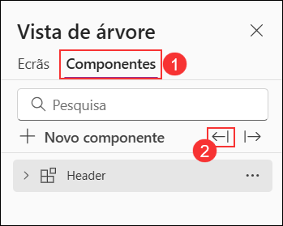

# Laboratório 02 - Construir um componente de código

## Duração estimada: 90 minutos

Trabalhando como parte da equipe de PrioritZ fusion, você foi solicitado a criar um componente de código do Power Apps para permitir a classificação de prioridade de arrastar e soltar itens no PrioritZ Ask Power App. Você criará um componente de código usando a estrutura React JavaScript. Uma abordagem de componente de código é usada para para atender ao requisito porque não existe um controlo semelhante já incorporado.

Você colaborou com os criadores de aplicativos para identificar as seguintes propriedades para permitir que eles configurar o componente de código na aplicação:

- BackgroundColor
- DragBackgroundColor
- ItemHeight
- FontSize
- FontColor

O aplicativo PrioritZ Ask preparará uma coleção dos itens a serem classificados que serão vinculados como o conjunto de dados para o componente de código. Quando um item é arrastado e largado, o componente de código gera um evento OnSelect que será tratado pela aplicação de alojamento. A aplicação de alojamento actualizará os itens da coleção com a sua nova classificação. O componente de código será stateless.

## Objectivos do laboratório

- Exercício 1: Construir o componente de código 
- Exercício 2: Usar o componente de código 
- Exercício 3: Adicionar o componente de código à solução 

## Exercício 1 - Construir o componente de código

Neste exercício, você irá construir o componente de código.

### Tarefa 1: Criar o componente de código

1. Inicie o **Visual Studio Code** se ainda não estiver aberto usando o atalho disponível na área de trabalho.

   
   
1. Selecione o separador **Power Platform (1)** e certifique-se de que o seu perfil **Dev Auth (2)** está selecionado. 
    
   >**Nota**: O separador Power Platform já está instalado.
    
    

1. Clique no menu de opções **(1)** no canto superior direito, selecione **Terminal** **(2)** e depois clique em **Novo Terminal** **(3)** para abrir um novo terminal no VS Code.

   

1. Na janela Terminal, crie um novo diretório executando o comando abaixo.

    ```
    md PrioritZDnDRanking
    ```
1. Execute o comando abaixo para mudar para o diretório PrioritZDnRanking que você criou.

    ```
    cd PrioritZDnDRanking
    ```
1. Agora você deve estar no diretório que criou. Crie um novo projeto de componente e instale as dependências executando o comando abaixo.
    
     ```
     pac pcf init -ns ContosoCoffee --name PrioritZDnDRanking --template dataset --framework react --run-npm-install
     ```
     
     

1. O projeto do componente framework deve ser criado com sucesso.

    

1. Execute o comando abaixo para abrir o projeto.
    
    ```
    code -a.
    ```

1. Se lhe for apresentado o pop-up abaixo, clique em **Yes** para confiar nos autores dos ficheiros.

1. Reveja os ficheiros de componentes de código criados selecionando o separador **Explorer**.
    
     

1. Expanda a pasta **PrioritZDnDRanking (1)** e, em seguida, expanda a subpasta **generated**.

1. Abra o ficheiro **ControlManifest.Input.xml (2)**. O manifesto é o ficheiro de metadados que define um componente, incluindo as propriedades expostas à aplicação de alojamento.

    

1. Localize o elemento XML **data-set** na **linha número 21** no ficheiro **ControlManifest.Input.xml**.

    

1. Altere o **name** para **items** e o **display-name-key** para **items**. Isto define a propriedade que a aplicação se liga a uma coleção de itens.

    

1. Adicione as seguintes propriedades entre a etiqueta de fecho do elemento de conjunto de dados `</data-set>` e a etiqueta de abertura do elemento `<resources>`.

    > Adicione as seguintes propriedades após **linha número 26** no ficheiro **ControlManifest.Input.xml**.

    ```
    <property name="BackgroundColor" display-name-key="Background color" usage="input" of-type="SingleLine.Text" default-value="#F3F2F1"/>
    <property name="DragBackgroundColor" display-name-key="Drag background color" usage="input" of-type="SingleLine.Text" default-value="lightgreen"/>
    <property name="ItemHeight" display-name-key="Item height" usage="input" of-type="Whole.None" default-value="32"/>
    <property name="FontSize" display-name-key="Font size" usage="input" of-type="Whole.None" default-value="12"/>
    <property name="FontColor" display-name-key="Font color" usage="input" of-type="SingleLine.Text" default-value="#333333"/>
    ```

    

1. Localize a secção `<resources>` e adicione o código abaixo após o **code path** para adicionar o recurso **css**. Isto garantirá que os nossos estilos serão agrupados com o componente de código quando este for implementado.

    ```
    <css path="css/PrioritZDnDRanking.css" order="1" />
    ```

    

    >**Nota**: Certifique-se de que não descolhe o caminho **resx**, pois estará a enfrentar um problema na próxima tarefa ao construir o componente de código se este não for comentado.

1. Observe os dois recursos seguintes. Isto declara a dependência do componente destes dois bibliotecas. Isto é o resultado da especificação – framework React na inicialização.
        
     ```
     <platform-library name="React" version="16.8.6" />
     <platform-library name="Fluent" version="8.29.0" />
     ```
     
     

1. Clique em **File** e seleccione **Save All** para guardar as suas alterações.

1. Certifique-se de que o ficheiro **ControlManifest.Input.xml** ainda está selecionado e clique em **New Folder**.

    

1. Nomeie a nova pasta como **css**.

1. Selecione a nova pasta **css** que criou e clique em **New File**

    

1. Refira o novo ficheiro **PrioritZDnDranking.css**.

1. Cole o seguinte CSS no ficheiro **PrioritZDnDRAnking.css**.

    ```
    .prioritydnd-scroll-container {
    box-sizing: border-box;
    padding: 2px;
    overflow-y: auto;
    overflow-x: hidden;
    position: relative;
    }
    .prioritydnd-item-container {
    user-select: none;
    display: flex;
    align-items: center;
    }
    .prioritydnd-item-column {
    margin: 8px;
    }
    ```
1. O ficheiro deve agora parecer-se com o seguinte.

    

1. Clique em **File** e seleccione **Save All** para guardar as suas alterações.

### Tarefa 2: Implementar a lógica do componente

1. Selecione o ficheiro do componente **HelloWorld.tsx**, clique com o botão direito do rato no mesmo e selecione **Delete** para remover o ficheiro de componentes à medida que este é criado automaticamente e não o iremos utilizar.

    

1. Navegue para este caminho `C:\LabFiles\Developer-in-a-day\Student\L02 - Build a code component\Resources` no ficheiro explorador.

1. Arraste o ficheiro **PriorityComponent.tsx** e deixe-o largar na pasta **PrioriZDnDranking**.

1. O ficheiro **PriorityComponent.tsx** deve agora estar na pasta **PrioriZDnDranking**.

    

1. Clique em **File** e guarde as suas alterações.

1. Abra o **PriorityComponent.tsx** e reveja o conteúdo. Isto implementa o React componente que será renderizado para representar os nossos itens dragáveis.

1. A linha de notificação 9 `from react-beautiful-dnd` tem um sublinhado vermelho. Este é um pacote npm o componentes utilizamos que não fazemos referenciados.

    

1. Execute o seguinte comando numa janela de terminal para adicionar uma referência a react-beautiful-dnd.

    ```
    npm install react-beautiful-dnd
    ```

    >**Nota**: Se receber este erro **npm is not recognised**, execute os passos abaixo:

    1. Abra o PowerShell e execute este comando `choco install -y --force nodejs`.
    
    2. Assim que a execução do comando estiver concluída, feche o Visual Studio Code e abra-o novamente.
    
    3. Execute o **Passo 8** desta tarefa novamente para instalar o pacote **react-beautiful-dnd**.

1. Execute o seguinte comando para as definições tipo.

    ```
    npm i --save-dev @types/react-beautiful-dnd
    ```

1. Observe que o sublinhado vermelho na linha 9 foi resolvido.

1. Abra o ficheiro **index.ts**.

1. Remova a seguinte linha (linha número 2 no ficheiro Index.ts), pois já não estamos a utilizar o HelloWorld

    ```
    import { HelloWorld, IHelloWorldProps } from "./HelloWorld";
    ```

    

1. Adicione o código abaixo ao ficheiro **index.ts** após **linha número 1**. Isto fará referência ao PriorityComponent.

     ```
     import { PriorityComponent, PriorityComponentProps } from './PriorityComponent';
     ```
    
     


1. Localize a classe **Export** na **linha número 7**.

     

1. Adicione o seguinte código abaixo dentro da classe **export**. Isto define algumas variáveis ​​de trabalho que estará a utilizar na lógica da classe.

     ```
     private context: ComponentFramework.Context<IInputs>;
     private items: ComponentFramework.PropertyTypes.DataSet;
     private state: ComponentFramework.Dictionary;
     ```
            
     

1. Localize a função **init**.

     

1. Cole o código abaixo dentro da função **init**. Esta lógica inicializa as nossas variáveis ​​de classe do valores de tempo de execução e permite a notificação de redimensionamento.

     

     ```
     this.context = context;
     context.mode.trackContainerResize(true);
     ```

1. Localize a função **updateView**.

    

1. Substitua a função **updateView** pela função abaixo. Esta lógica cria o Elemento React do PriorityComponent e adiciona-o ao DOM virtual.

    ```   
    public updateView(context: ComponentFramework.Context<IInputs>): React.ReactElement {
        const dataset = context.parameters.items;
        return React.createElement(PriorityComponent, {
            width: context.mode.allocatedWidth,
            height: context.mode.allocatedHeight,
            itemHeight: context.parameters.ItemHeight.raw,
            fontSize: context.parameters.FontSize.raw,
            fontColor: context.parameters.FontColor.raw,
            dataset: dataset,
            onReorder: this.onReorder,
            backgroundColor: this.context.parameters.BackgroundColor.raw,
            dragBackgroundColor:
            this.context.parameters.DragBackgroundColor.raw,
        } as PriorityComponentProps);
    }
    ```

    

1. Adicione o código abaixo após a função **destroy**. Esta lógica trata do evento onReorder de o PriorityComponent e identifica os itens envolvidos na aplicação de alojamento como itens selecionados.

    ```
    onReorder = (sourceIndex: number, destinationIndex: number): void => {
    const dataset = this.context.parameters.items;
    const sourceId = dataset.sortedRecordIds[sourceIndex];
    const destinationId = dataset.sortedRecordIds[destinationIndex];
    // raise the OnSelect event
    this.context.parameters.items.openDatasetItem(dataset.records[sourceId].getNamedReference());
    // set the SelectedItems property
    this.context.parameters.items.setSelectedRecordIds([sourceId, destinationId]);
    };
    ```

    

    > **Nota** : A função **Destroy** função estará presente no final da classe **PrioritZDnDranking**.

1. Após concluir todos os passos, o seu ficheiro `index.ts` deverá conter o seguinte código.

    ```
    import { IInputs, IOutputs } from "./generated/ManifestTypes";
    import { PriorityComponent, PriorityComponentProps } from './PriorityComponent';
    import * as React from "react";

    export class PrioritZDnDRanking implements ComponentFramework.ReactControl<IInputs, IOutputs> {
        private context: ComponentFramework.Context<IInputs>;
        private items: ComponentFramework.PropertyTypes.DataSet;
        private state: ComponentFramework.Dictionary;
        private theComponent: ComponentFramework.ReactControl<IInputs, IOutputs>;
        private notifyOutputChanged: () => void;

        /**
        * Empty constructor.
        */
        constructor() { }

        /**
        * Used to initialize the control instance. Controls can kick off remote server calls and other initialization actions here.
        * Data-set values are not initialized here, use updateView.
        * @param context The entire property bag available to control via Context Object; It contains values as set up by the 
        * customizer mapped to property names defined in the manifest, as well as utility functions.
        * @param notifyOutputChanged A callback method to alert the framework that the control has new outputs ready to be retrieved 
        * asynchronously.
        * @param state A piece of data that persists in one session for a single user. Can be set at any point in a controls life 
        * cycle by calling 'setControlState' in the Mode interface.
        */
        public init(
            context: ComponentFramework.Context<IInputs>,
            notifyOutputChanged: () => void,
            state: ComponentFramework.Dictionary
        ): void {
            this.context = context;
            context.mode.trackContainerResize(true);
            this.notifyOutputChanged = notifyOutputChanged;
        }

        /**
        * Called when any value in the property bag has changed. This includes field values, data-sets, global values such as container 
        * height and width, offline status, control metadata values such as label, visible, etc.
        * @param context The entire property bag available to control via Context Object; It contains values as set up by the customizer 
        * mapped to names defined in the manifest, as well as utility functions.
        * @returns ReactElement root react element for the control
        */
        public updateView(context: ComponentFramework.Context<IInputs>): React.ReactElement {
            const dataset = context.parameters.items;
            return React.createElement(PriorityComponent, {
                width: context.mode.allocatedWidth,
                height: context.mode.allocatedHeight,
                itemHeight: context.parameters.ItemHeight.raw,
                fontSize: context.parameters.FontSize.raw,
                fontColor: context.parameters.FontColor.raw,
                dataset: dataset,
                onReorder: this.onReorder,
                backgroundColor: this.context.parameters.BackgroundColor.raw,
                dragBackgroundColor: this.context.parameters.DragBackgroundColor.raw,
            } as PriorityComponentProps);
        }

        /**
        * It is called by the framework prior to a control receiving new data.
        * @returns an object based on nomenclature defined in manifest, expecting object[s] for property marked as "bound" or "output"
        */
        public getOutputs(): IOutputs {
            return { };
        }

        /**
        * Called when the control is to be removed from the DOM tree. Controls should use this call for cleanup.
        * i.e. cancelling any pending remote calls, removing listeners, etc.
        */
        public destroy(): void {
            // Add code to cleanup control if necessary
        }

        onReorder = (sourceIndex: number, destinationIndex: number): void => {
            const dataset = this.context.parameters.items;
            const sourceId = dataset.sortedRecordIds[sourceIndex];
            const destinationId = dataset.sortedRecordIds[destinationIndex];
            // raise the OnSelect event
            this.context.parameters.items.openDatasetItem(dataset.records[sourceId].getNamedReference());
            // set the SelectedItems property
            this.context.parameters.items.setSelectedRecordIds([sourceId, destinationId]);
        };
    } 
    ```
 
1. Abra o ficheiro **package.json**.

1. Localize o objeto **dependencies** JSON.

    

1. Substitua **dependencies** pelo JSON abaixo.

    ```
    "dependencies": {
    "@fluentui/react": "8.29.0",
    "eslint-config-prettier": "^8.5.0",
    "eslint-plugin-prettier": "^4.0.0",
    "eslint-plugin-react": "^7.29.4",
    "eslint-plugin-react-hooks": "^4.4.0",
    "eslint-plugin-sonarjs": "^0.13.0",
    "prettier": "^2.6.1",
    "react": "16.8.6",
    "react-beautiful-dnd": "^13.1.0",
    "react-dom": "16.8.6"
    },
    ```

1. Navegue até ao ficheiro **.eslintric.json(1)** da navegação esquerda para adicionar a nova regra de flexição. Localize **rules(2)** na **linha número 21** e cole as regras abaixo.

    ```
    "no-unused-vars": ["off"],
    "no-undef": ["off"]
    ```

    

1. Clique em **File** e guarde todas as suas alterações.

1. Clique em **Terminal** e seleccione **New Terminal**.

    

1. Execute o comando abaixo. Isto irá construir o seu componente e identificar quaisquer problemas.

    ```
    npm run-script build
    ```

    > **Nota**: Se a operação de compilação falhar com este erro **`Root element is missing`**, certifique-se de que o **resx path** é comentado no ficheiro Manifest.Xml e tente construir o componente novamente.

1. A construção deve ter sucesso. Se algum erro, resolva-os antes de prosseguir.

     

1. Execute o comando abaixo para iniciar o teste.

    ```
    npm start
    ```

    > **Observação**: se você receber um pop-up do Internet Explorer, feche-o, copie o URL do host local e cole-o em uma nova guia no Edge.

1. O teste deve iniciar, se não, copiar o endereço e colar-o numa nova janela do browser. Experimente arrastar os itens e ver se o comportamento funciona como esperado.

    

    > **Nota**: Se o teste não começar como esperado, não poderá ver a saída esperada como mencionado. Verifique se seguiu as instruções anteriores e adicionou o código corretamente nos ficheiros **Manifest e Index**.

1. Feche o teste fechando a aba do navegador.

1. Pare a corrida segurando a tecla **[CONTROL]** + **C**.

1. Tipo **Y** e [ENTER].

    

1. Execute o comando abaixo para empurrar a compidentificador para o seu ambiente.
    
    ```
    pac pcf push --publisher-prefix contoso
    ```

    > **Nota**: 
     1. Se você encontrar a mensagem de erro **"Erro: Ferramenta necessária ausente: MSBuild.exe/dotnet.exe. Adicione MSBuild.exe/dotnet.exe na variável de ambiente Path ou use 'Desenvolvedor 
        Prompt de comando para VS'"**, siga estas etapas:
        1. Navegue até o diretório `C:\LabFiles` e abra **dotnet-sdk-8.0.100-win-x64**.
        2. Na janela de configuração, selecione **Reparar** e aguarde a conclusão do processo.
        3. Após a conclusão do reparo, feche o Visual Studio Code, reabra-o e primeiro execute o comando build presente na etapa 28 e execute novamente o comando acima.
        4. Se o problema persistir, desinstale **dotnet-sdk-8.0.100-win-x64** e instale a versão mais recente da [página de download do .NET](https://dotnet.microsoft.com/en-us/download). Feche o Visual Studio Code, abra-o novamente, execute o comando build da etapa 28 e execute o comando acima novamente.

     2. Se a operação de push falhar com o erro **`Desculpe, a aplicação encontrou um erro      irrecuperável e terá de ser encerrada`**, certifique-se de que seguiu as instruções anteriores e adicionou o código corretamente nos ficheiros **Manifest e Index**. 
        
        Além disso, você pode encontrar os arquivos **Manifest and Index** no local `C:\LabFiles`, você pode comparar seu código com esses arquivos e corrigir os problemas, se houver algum. 
        tente enviar o componente novamente executando o comando **pac push** novamente.
     3. Se a execução falhar com um erro de pacote Nuget, execute o comando abaixo no PowerShell e tente executar o comando acima novamente.
    
        ```
        dotnet nuget adicionar fonte https://api.nuget.org/v3/index.json -n nuget.org --configfile $env:APPDATA\NuGet\NuGet.Config
        ```
1. Aguarde que a solução seja importada e publicada no seu ambiente.

    

### Tarefa 3: Confirme que o controlo foi adicionado ao ambiente

1. Navegue até ao portal do fabricante de aplicações Power, utilizando o URL abaixo, se ainda não estiver aberto. Certifique-se de que o ambiente de desenvolvimento denominado **DEV_ENV_<inject key="Deployment ID" enableCopy="false" /> (2)** é selecionado.

    ```
    https://make.powerapps.com/
    ```

1. No painel de navegação à esquerda, selecione **Soluções** **(1)** e clique na solução **PowerAppsTools_contoso** **(2)** para abri-la.

    

1. Confirme que o controlo personalizado está nesta solução.

    

> **Parabéns** por completar a tarefa! Agora, é hora de validá-lo. Aqui estão os passos:
> - Pressione o botão Validar para a tarefa correspondente. Se receber uma mensagem de êxito, pode prosseguir para a próxima tarefa. 
> - Se não, leia atentamente a mensagem de erro e tente novamente a etapa, seguindo as instruções no guia do laboratório.
> - Se precisar de ajuda, entre em contato conosco pelo cloudlabs-support@spektrasystems.com. Estamos disponíveis 24 horas por dia, 7 dias por semana para ajudar.

<validation step="aae02cab-a129-491c-b38b-29c66f2f2547" />

## Exercício 2 – Use Componente de Código

Neste exercício, irá utilizar o componente de código que criou na aplicação de tela PrioritZ Ask.

### Tarefa 1: Permitir a estrutura do componente Apps Power

Nesta tarefa, permitirá a publicação de aplicações em tela com componentes de código para o seu ambiente.

1. Navegue até ao centro de administração da Power Platform utilizando o URL abaixo e selecione ambientes.

    ```
    https://admin.powerplatform.microsoft.com/environments
    ```

1. Abra o ambiente de desenvolvimento denominado **DEV_ENV_<inject key="Deployment ID" enableCopy="false" />** que está a utilizar para este laboratório.

    

1. Clique em **Definições** para aceder às opções de configuração.

    

1. Na página **Definições**, expanda a seção **Produto** **(1)** e clique em **Funcionalidades** **(2)** para visualizar as opções disponíveis.

    

1. Ative a opção **Permitir a publicação de aplicações de tela com componentes de código** deslizando o botão para **Ativado** **(1)** e clique em **Guardar** **(2)** para aplicar as alterações.

    

 ### Tarefa 2: Editar aplicação em tela

Nesta tarefa, irá editar a aplicação PrioritZ Ask em tela para utilizar o componente de código que criou.

1. Navegue até ao portal do fabricante de aplicações Power, utilizando o URL abaixo, se ainda não estiver aberto. Certifique-se de que o ambiente de desenvolvimento denominado **DEV_ENV_<inject key="Deployment ID" enableCopy="false" />** é selecionado.

    ```
    https://make.powerapps.com/
    ```

1. No menu de navegação à esquerda, clique em **Soluções** **(1)** e selecione a solução **Prioritz** **(2)** para abri-la.

    

1. No painel **Objetos**, selecione **Aplicações (1)**. Em seguida, clique na aplicação **Prioritz Ask (2)** e selecione o botão **Editar (3)** na parte superior.

    

1. No separador **Componentes (1)**, clique no ícone de seta para trás **(2)** para importar componentes.

    

1. No separador **Código (1)**, selecione o componente **PrioritZDnDRanking (2)** e clique em **Importar (3)**.

    

1. Selecione o separador **Ecras**.

1. Expanda **Vote Screen (1)** e selecione **Votes gallery (2)**.

    

1. Selecione a **Width** do menu suspenso das propriedades.

    

1. Defina o valor de **Width** da galeria Votes para **570**.

    

1. O ecrã deve agora parecer a image abaixo.

    

1. Selecione o **Votes Screen** e clique em **+ Insert**.

    

1. Selecione o componente **PrioritZDnDranking** em **Componentes de codigo**.

    

1. Vá até à aba de **Vista de árvore** e selecione o item **PrioritZDnDRanking** que acabou de adicionar.

1. Defina o valor **Items** do componente **PrioritZDnDRAnking** para a fórmula abaixo.

    ```
    'Votes gallery'.AllItems
    ```

    

1. Selecione o **PrioritZDnDRanking**, no painel **Propriedades** à direita, vá ao separador **Apresentar (1)**, defina o valor de **Item height** como **160 (2)** e clique em **Editar (3)**.

    

1. Clique em **+ Add field** para adicionar um novo campo.

1. Selecione **Rank (1)** e clique em **Add (2)**.

    

1. A classificação deve agora mostrar-se no controlo, mas está resolvido descendente.

1. Selecione a galeria **Votes**, selecione a propriedade **Items** do menu suspenso da propriedade e altere a ordem de classificação para **Ascending**.

1. A classificação deve agora classificar ascendente.

1. Selecione o **Pcomponente rioritZDnDRAnking** e depois **X** propriedade do menu suspenso da propriedade.

    

1. Defina o valor **X** do componente **PrioritZDnDRAnking** na fórmula abaixo.

    ```
    'Votes gallery'.Width
    ```

1. Selecione a propriedade **Width** do componente **PrioritZDnDRAnking** do menu suspenso da propriedade e defina o seu valor para **60**.

    

1. Selecione a propriedade **Height** do componente **PrioritZDnDRAnking** do menu suspenso da propriedade e defina o seu valor com a fórmula abaixo.

    ```
    'Votes gallery'.Height
    ```

    

1. Selecione a propriedade **ItemHeight** do componente **PrioritZDnDRAnking** do suspensão da propriedade e defina o seu valor com a fórmula abaixo

    ```
    'Votes gallery'.TemplateHeight
    ```

    

1. Selecione a propriedade **BackgroundColor** do componente **PrioritZDnDRAnking** do menu suspenso da propriedade e defina o seu valor para **"#A70202"**

    

1. Selecione a propriedade **DragBackgroundColor** do componente **PrioritZDnDranking** do menu suspenso da propriedade e defina o seu valor para **"LightBlue"**

    

1. Selecione a propriedade **Y** do componente **PrioritZDnDRAnking** do suspensão da propriedade e defina o seu valor com a fórmula abaixo.

    ```
    'Votes gallery'.Y
    ```

1. Selecione a propriedade **OnSelect** do componente **PrioritZDnDRAnking** do suspensão da propriedade e defina o seu valor com a fórmula abaixo.

    ```
    With(
        {
            sourceRank: First(Self.SelectedItems).Rank,
            destinationRank: Last(Self.SelectedItems).Rank
        },
        If(
            sourceRank < destinationRank,
     // Moving Up
            UpdateIf(
                colVotes,
                Rank >= sourceRank && Rank <= destinationRank,
                {
                    Rank: If(
                        Rank <> sourceRank,
                        Rank - 1,
                        destinationRank
                    )
                }
            );
        );
        If(
            sourceRank > destinationRank,
     // Moving Down
            UpdateIf(
                colVotes,
                Rank >= destinationRank && Rank <= sourceRank,
                {
                    Rank: If(
                        Rank <> sourceRank,
                        Rank + 1,
                        destinationRank
                    )
                }
            );
        );

    );
    ```

1. Selecione o **Home Screen** e clique em **Play**.

1. Selecione um dos **topics**.

1. Pode visualizar como está no ecrã de um telefone utilizando o emulador.

    

1. Arraste um dos itens do tópico e deixe-o ativá-lo num local diferente.

    

1. O arrastar/desembarque deve funcionar como esperado.

1. Feche a antevisão.

1. Clique em **Publish**.

    

1. Selecione **Publish this version** e aguarde que a publicação seja concluída.

1. Pode **close** o estúdio de aplicações em tela.

## Exercício 3 – Adicionar Componente de Código à Solução

Neste exercício, irá adicionar o componente de código que criou à solução PrioritZ.

### Tarefa 1: Adicione o componente à solução

1. Navegue até ao portal do fabricante de aplicações Power, utilizando o URL abaixo, se ainda não estiver aberto. Certifique-se de que o ambiente de desenvolvimento denominado **DEV_ENV_<inject key="Deployment ID" enableCopy="false" /> (2)** é selecionado.

    ```
    https://make.powerapps.com/
    ```

1. Selecione **Solutions** e abra a solução **PrioritZ**.

1. Clique em **Adicionar existente (1)**, selecione **Mais (2)** → **Programador (3)** → **Controlo personalizado (4)**.

    

1. Selecione **contoso_ContosoCoffee.PrioritZDnDRanking** e clique em **Adicionar**.

    

1. Clique em **Publicar todas as personalizações**.

    

## Resumo

Neste laboratório, aprendeu a criar um componente de código, a implementar a sua lógica, a integrá-lo numa aplicação de lona e a adicioná-la a uma solução dentro da Power Platform.

## Concluiu o laboratório com sucesso.Prossiga para a próxima página.


## Boa aprendizagem!!
