# Lab 02 - Build a code component

## Table of Contents

Lab Scenario 

1. Exercise 1 – Build Code Component 

    - Task 1: Create the code component 

    - Task 2: Implement the component logic 

    - Task 3: Confirm the control was added to environment 

2. Exercise 2 – Use Code Component 

    - Task 1: Allow Power Apps component framework 

    - Task 2: Edit canvas app 

3. Exercise 3 – Add Code Component to Solution 

     - Task 1: Add component to solution 

### Lab Scenario

Working as part of the PrioritZ fusion team you have been asked to create to create a Power Apps code
 component to allow drag and drop priority ranking of items in the PrioritZ Ask Power App. You will build
a code component using the React JavaScript framework. A code component approach is used to
address the requirement because there isn’t a similar control already built-in.

You have collaborated with the app makers to identify the following properties to allow them to
configure the code component in the app:

- BackgroundColor
- DragBackgroundColor
- ItemHeight
- FontSize
- FontColor

The PrioritZ Ask app will prepare a collection of the items to rank that will be bound as the dataset for
the code component. When an item is dragged and dropped the code component will raise an OnSelect
event that will be handled by the hosting app. The hosting app will update the collection items with
their new rank. The code component will be stateless.

## Exercise 1 – Build Code Component

In this exercise, you will build the code component.

### Task 1: Create the code component

1. Start **Visual Studio Code** using the shortcut available on the desktop.

   
   
2. Select the **Power Platform (1)** tab and make sure your **Dev Auth (2)** profile is selected. 
    
   >**Note** : The Power Platform tab is already installed.
    
    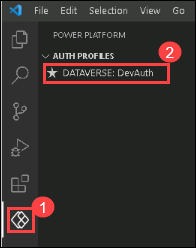

3. Click **Terminal (1)** and select **New Terminal (2).**
     
     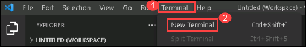

4. In the Terminal window, make a new directory by running the command below.

    ```
    md PrioritZDnDRanking
    ```
5. Run the command below to switch to the PrioritZDnRanking directory you created.

    ```
    cd PrioritZDnDRanking
    ```
6. You should now be in the directory you created. Create a new component project and install dependencies by running the commands below.
    
     ```
     pac pcf init -ns ContosoCoffee --name PrioritZDnDRanking --template dataset --framework react --run-npm-install
     ```
     
     

7. The component framework project should be created successfully.

    

8. Run the command below to open the project.
    ```
    code -a.
    ```

9. Review the created code component files by selecting the **Explorer** tab.
    
     

10. Expand the **PrioritZDnDRanking** folder and then expand the component folder.

11. Open the **ControlManifest.Input.xml** file. The manifest is the metadata file that defines a
    component including the properties exposed to the hosting app.

      

12. Locate **data-set** XML element in the **ControlManifest.Input.xml** file.

      

13. Change the **name** to **items** and the **display-name-key** to **items**. This defines the property the app will bind to a collection of items.

      

14. Add the following properties after the closing tag of the data-set element **</data-set**>.

    ```
    <property name="BackgroundColor" display-name-key="Background color" usage="input" of-type="SingleLine.Text" default-value="#F3F2F1"/>
    <property name="DragBackgroundColor" display-name-key="Drag background color" usage="input" of-type="SingleLine.Text" default-value="lightgreen"/>
    <property name="ItemHeight" display-name-key="Item height" usage="input" of-type="Whole.None" default-value="32"/>
    <property name="FontSize" display-name-key="Font size" usage="input" of-type="Whole.None" default-value="12"/>
    <property name="FontColor" display-name-key="Font color" usage="input" of-type="SingleLine.Text" default-value="#333333"/>
    ```

     

15. Locate **<resources>** and uncomment **css** resource. This will ensure that our styles will be
    bundled with the code component when it is deployed.

     
 
 16. Notice the following two resources. This declares the component’s dependency on these two
    libraries. This is a result of specifying –framework React on initialization.
     ```
     <platform-library name="React" version="16.8.6" />
     <platform-library name="Fluent" version="8.29.0" />
     ```
     
 
17. Click **File** and select **Save All**.
18. Make sure you still have the **ControlManifest.Input.xml** file selected and then click **New Folder**.

      

19. Name the new folder **css**.
20. Select the new **css** folder you created and then click **New File**
 
     
 
 21. Name the new file **PrioritZDnDRanking.css**.
 22. Paste the following css into the **PrioritZDnDRanking.css** file.
    
       ```
        .prioritydnd-scroll-container {
        box-sizing: border-box;
        padding: 2px;
        overflow-y: auto;
        overflow-x: hidden;
        position: relative;
        }
        .prioritydnd-item-container {
        user-select: none;
        display: flex;
        align-items: center;
        }
        .prioritydnd-item-column {
        margin: 8px;
        }
        ```
23. The file should now look like the following.

     

24. Click **File** and save your changes.

### Task 2: Implement the component logic

1. Remove the HelloWorld.tsx component file that is automatically created as we won’t be using it.
     
     

2. Navigate to this path `C:\LabFiles\Developer-in-a-day\Student\L02 - Build a code component\Resources` in file explorer.
    
3. Drag the **PriorityComponent.tsx** file and drop it in the **PrioriZDnDRanking** folder.
 
4. The **PriorityComponent.tsx** file should now be in the **PrioriZDnDRanking** folder.

     

5. Click **File** and save your changes.
    
6. Open the **PriorityComponent.tsx** and review the contents. This implements the React
    component that will be rendered to represent our draggable items.
    
7. Notice line 9 `from react-beautiful-dnd` has a red underline. This is a npm package the
    component uses that we haven’t referenced.

     
 
 8. Run the following command in a terminal window to add a reference to react-beautiful-dnd.

    ```
    npm install react-beautiful-dnd
    ```
9. Run the following command for the type definitions.

    ```
    npm i --save-dev @types/react-beautiful-dnd
    ```

10. Notice the red underline in line 9 has been resolved.
    
11. Open the **index.ts** file.
    
12. Remove the following line 2 as we are no longer using HelloWorld

    ```
    import { HelloWorld, IHelloWorldProps } from "./HelloWorld";
    ```
    
    
 
 13. Add the import below to the **index.ts** file. This will reference the PriorityComponent.
    
        ```
        import { PriorityComponent, PriorityComponentProps } from './PriorityComponent';
        ```
          
   
 
 15. Locate the **Export** class.
      
     
 
 16. Add the following code below inside the **export** class. This defines some working variables you
    will be using in the class logic.
   
        ```
         private context: ComponentFramework.Context<IInputs>;
         private items: ComponentFramework.PropertyTypes.DataSet;
        ```
        
 

 17. Locate the **init** function.
 
      
        
 18. Paste the code below inside the **init** function. This logic initializes our class variables from the
    runtime values and enables resize notification.    
    
        
   
       ```
        this.context = context;
        context.mode.trackContainerResize(true);
       ```
 
19. Locate the **updateView** function.

     
 
20. Replace **updateView** function with the function below. This logic creates the React Element
    from the PriorityComponent and adds it to the virtual DOM.
  
     ```   
    public updateView(context: ComponentFramework.Context<IInputs>): React.ReactElement {
        const dataset = context.parameters.items;
        return React.createElement(PriorityComponent, {
            width: context.mode.allocatedWidth,
            height: context.mode.allocatedHeight,
            itemHeight: context.parameters.ItemHeight.raw,
            fontSize: context.parameters.FontSize.raw,
            fontColor: context.parameters.FontColor.raw,
            dataset: dataset,
            onReorder: this.onReorder,
            backgroundColor: this.context.parameters.BackgroundColor.raw,
            dragBackgroundColor:
            this.context.parameters.DragBackgroundColor.raw,
        } as PriorityComponentProps);
    }
    ```

    
 
21. Add the function below after the **destroy** function. This logic handles the onReorder event from
    the PriorityComponent and identifies the involved items to the hosting app as selected items.
       
    ```
    onReorder = (sourceIndex: number, destinationIndex: number): void => {
    const dataset = this.context.parameters.items;
    const sourceId = dataset.sortedRecordIds[sourceIndex];
    const destinationId = dataset.sortedRecordIds[destinationIndex];
    // raise the OnSelect event
    this.context.parameters.items.openDatasetItem(dataset.records[sourceId].getNamedReference());
    // set the SelectedItems property
    this.context.parameters.items.setSelectedRecordIds([sourceId, destinationId]);
    };
    ```
  
    
 
22. Open the **package.json** file.
    
23. Locate the **dependencies** JSON object.

      
 
24. Replace **dependencies** with the JSON below.

    ```
    "dependencies": {
    "@fluentui/react": "8.29.0",
    "eslint-config-prettier": "^8.5.0",
    "eslint-plugin-prettier": "^4.0.0",
    "eslint-plugin-react": "^7.29.4",
    "eslint-plugin-react-hooks": "^4.4.0",
    "eslint-plugin-sonarjs": "^0.13.0",
    "prettier": "^2.6.1",
    "react": "16.8.6",
    "react-beautiful-dnd": "^13.1.0",
    "react-dom": "16.8.6"
    },
    ```
    
25. Click **File** and save all your changes.

26. Click **Terminal** and select **New Terminal**.
     
      

27. Run the command below. This will build your component and identify any problems.

    ```
    npm run-script build
    ```

 28. The build should succeed. If any errors, resolve them before proceeding.
      
       
 
 29. Run the command below to start the test harness.
    
        ```
        npm start
        ```

30. The test harness should start, if not then copy the address and paste it in a new browser window. Try dragging the items and see if the behavior functions as
    expected.

      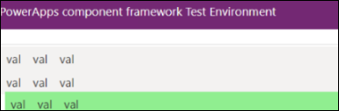
 
31. Close the test harness.

32. Stop the run by holding the **[CONTROL]** key + **C**.

 
33. Type **Y** and [ENTER].
     
      

 
34. Run the command below to push the component to your environment.
    ```
    pac pcf push --publisher-prefix contoso
    ```
    
    >**Note** : If the run fails with nuget package error,run the below command in Powershell and try running the above command again.
    
    ```
    dotnet nuget add source https://api.nuget.org/v3/index.json -n nuget.org --configfile $env:APPDATA\NuGet\NuGet.Config
    ```
    
    
35. Wait for the solution to be imported and published to your environment.

      
 
### Task 3: Confirm the control was added to environment

1. Navigate to Power Apps maker portal by using below URL if not already open. Make sure the development environment named **Testodl_user_<inject key="Deployment ID" enableCopy="false" /> (2)** is selected.

   ```
    https://make.powerapps.com/
    ```
    
2. Select **Solutions** and open the **PowerAppsTools** solution.
    
    

 3. Confirm that the custom control is in this solution.
     
      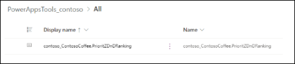
 
## Exercise 2 – Use Code Component

In this exercise, you will use the code component you created in the PrioritZ Ask canvas application.

### Task 1: Allow Power Apps component framework

In this task, you will allow publishing of canvas apps with code components for your environment.

1. Navigate to Power Platform admin center by using below URL and select environments.
     ```
        https://admin.powerplatform.microsoft.com/environments
     ```

2. Open the dev environment named **Testodl_user_<inject key="Deployment ID" enableCopy="false" />** that you are using for this lab.

3. Click **Settings** from top menu.
    
     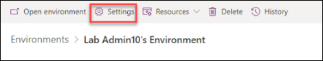

4. Expand **Products** and select **Features**.
    
     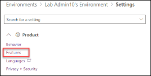

 5. Turn on **Allow publishing of canvas apps with code components** and click **Save**.
     
      

 ### Task 2: Edit canvas app

In this task, you will edit the PrioritZ Ask canvas application to use the code component you created.

1. Navigate to Power Apps maker portal by using below URL if not already open. Make sure the development environment named **Testodl_user_<inject key="Deployment ID" enableCopy="false" /> (2)** is selected.
   ```   
   https://make.powerapps.com/
   ```
2. Select **Solutions** and open the **PrioritZ** solution.
    
3. Select **Apps (1)** , select the **PrioritZ Ask (2)** app and click **Edit (3)**.

     

4. Select the **Components** tab, click on the ellipsis button (**...**) and select **Import**
    **components**.

     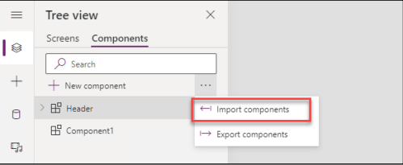
 
1. Select the **Code (1)** tab, select the code component (2) you created and click **Import (3)**.
    
     
 
7. Select the **Screens** tab.

8. Expand **votescreen (1)** and Select the **Votes gallery (2)**.

     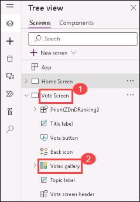
    
9. Set the **Width** value of the Votes gallery to **570**.

     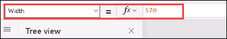
    
10. The screen should now look like the image below.
     
      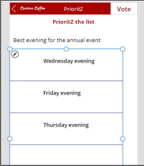

11. Select the **Votes Screen** and click **+ Insert**.
      
     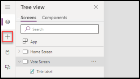
 
12. Select the component **PrioritZDnDRanking** under **Code Components**.
      
     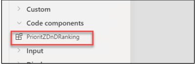
 
13. Go to the Tree view tab and select the **PrioritZDnDRanking** you just added.

14. Set the **Items** value of the **PrioritZDnDRanking** component to the formula below.

    ```
    'Votes gallery'.AllItems
    ```
     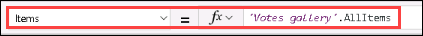
    
15. Select the **PrioritZDnDRanking**, go to the **Properties** pane ,set **Item Height** 160 and click **Edit Fields** .

      

16. Click on **+ Add field** to add a new field.
    
17. Select **Rank** and click on **Add**.
     
      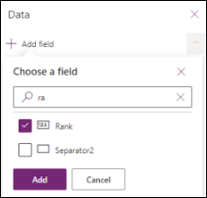
 
18. The rank should now show on the control, but it is sorted descending.
      
      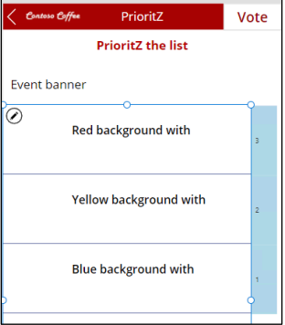

19. Select the **Votes gallery** and change the sort order to **Ascending**.
     
      
 
 20. The rank should now get sorted ascending.
     
      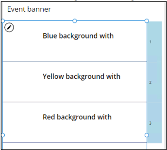
 
21. Select the **PrioritZDnDRanking** component.
    
22. Set the **X** value of the **PrioritZDnDRanking** component to the below formula.

    ```
    'Votes gallery'.Width
    ```
23. Set the **Width** value of the **PrioritZDnDRanking** component to **60**.
    
24. Set the **Height** value of the **PrioritZDnDRanking** component to the below formula.

    ```
    'Votes gallery'.Height
    ```
25. Set the **ItemHeight** value of the **PrioritZDnDRanking** component to the below formula.

    ```
    'Votes gallery'.TemplateHeight
    ```
26. Set the **BackgroundColor** value of the **PrioritZDnDRanking** component to **"LightBlue".**
    
27. Set the **DragBackgroundColor** value of the **PrioritZDnDRanking** component to **"#A70202".**

28. Set the **Y** value of the **PrioritZDnDRanking** component to the below formula.

    ```
    'Votes gallery'.Y
    ```
    
29. Set the **OnSelect** value of the **PrioritZDnDRanking** component to the below formula.

    ```
    With(
        {
            sourceRank: First(Self.SelectedItems).Rank,
            destinationRank: Last(Self.SelectedItems).Rank
        },
        If(
            sourceRank < destinationRank,
     // Moving Up
            UpdateIf(
                colVotes,
                Rank >= sourceRank && Rank <= destinationRank,
                {
                    Rank: If(
                        Rank <> sourceRank,
                        Rank - 1,
                        destinationRank
                    )
                }
            );
        );
        If(
            sourceRank > destinationRank,
     // Moving Down
            UpdateIf(
                colVotes,
                Rank >= destinationRank && Rank <= sourceRank,
                {
                    Rank: If(
                        Rank <> sourceRank,
                        Rank + 1,
                        destinationRank
                    )
                }
            );
        );

    );

    ```

30. Select the **Home Screen** and click **Play**.

31. Select one of the **topics**.

32. Make your browser widow smaller until it is the size of a phone screen.
     
     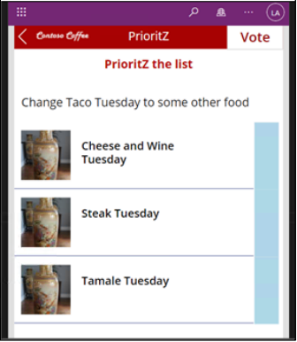

33. Drag one of the topic items and drop it in a different location.
     
     
 
34. The drag/drop should work as expected.
35. Close the preview.
36. Click **File** and select **Save**.
37. Click **Publish**.
38. Select Publish this version and wait for the publish to be completed.
39. You may **close** the canvas app studio.


## Exercise 3 – Add Code Component to Solution

In this exercise, you will add the code component you created to the PrioritZ solution.

### Task 1: Add component to solution

1. Navigate to Power Apps maker portal by using below URL if not already open. Make sure the development environment named **Testodl_user_<inject key="Deployment ID" enableCopy="false" /> (2)** is selected.

   ```
    https://make.powerapps.com/
    ```
2. Select **Solutions** and open the **PrioritZ** solution.
3. Click **Add existing** and select **More | Developer | Custom control**.
      
      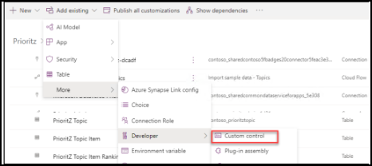
 
 4. Select **contoso_ContosoCoffee.PrioritZDnDRanking** and click **Add**.
     
      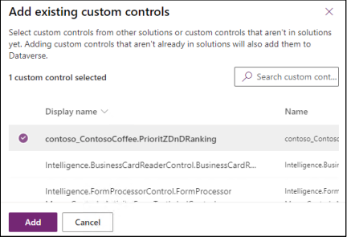
 
 5. Click **Publish all customizations** and wait for the publishing to complete.

    

