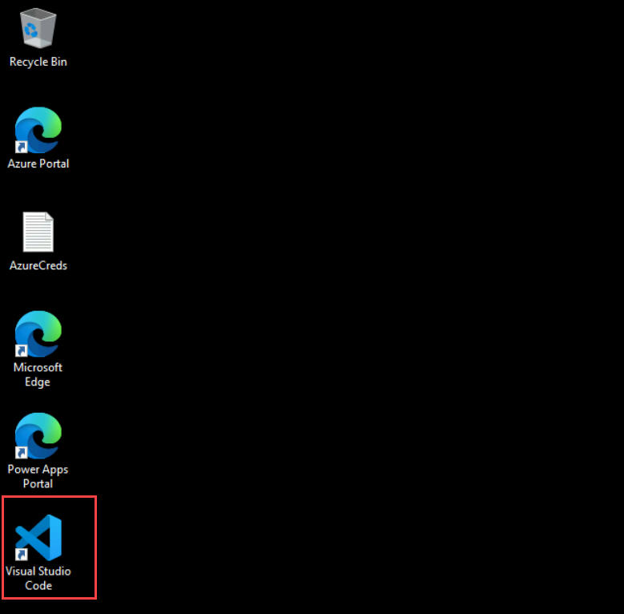
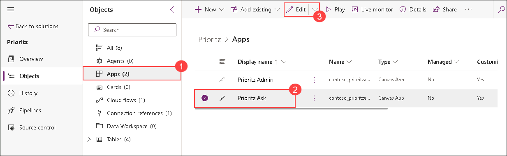

# Lab 02 - Build a code component

## Estimated Duration: 100 Minutes

In this lab, you will build a custom code component using the React JavaScript framework to enable drag-and-drop priority ranking of items in the PrioritZ Ask Power App. You will start by creating and configuring the code component, then implement its logic and test it locally. Next, you will integrate the component into the PrioritZ Ask canvas app, allowing users to reorder items visually. Finally, you will add the completed code component to the PrioritZ solution, ensuring it is available for use within your Power Platform environment. By completing these exercises, you will gain practical experience in developing, deploying, and using custom code components in Power Apps.

## Lab Objectives

- Exercise 1: Build Code Component 
- Exercise 2: Use Code Component 
- Exercise 3: Add Code Component to Solution 

## Exercise 1 – Build Code Component

In this exercise, you will build the code component.

### Task 1: Create the code component

1. Start **Visual Studio Code** if not already open using the shortcut available on the desktop.

   
   
2. Select the **Power Platform** tab and make sure your **Dev Auth** profile is selected. 
    
   >**Note:** The Power Platform tab is already installed.
    
    

3. Click on the ellipsis menu **... (1)** to expand additional options. Then, select **Terminal (2)** from the dropdown menu and click on **New Terminal (3)** to open a terminal session.
     
     

4. In the Terminal window, make a new directory by running the command below.

    ```
    md PrioritZDnDRanking
    ```

     

5. Run the command below to switch to the PrioritZDnRanking directory you created.

    ```
    cd PrioritZDnDRanking
    ```

6. You should now be in the directory you created. Create a new component project and install dependencies by running the below command.
    
     ```
     pac pcf init -ns ContosoCoffee --name PrioritZDnDRanking --template dataset --framework react --run-npm-install
     ```
     
     

      >**Note:** The above command may take 2-3 minutes to complete.
    
7. The component framework project should be created successfully.

    
    
    >**Note:** When installing dependencies, you might see warnings like:

    >- npm WARN deprecated @babel/plugin-proposal-object-rest-spread

    >- npm WARN deprecated rimraf@3.0.2

    >- npm WARN deprecated eslint@8.57.1

    >- These warnings mean that some packages are outdated or no longer updated. You can safely ignore them as they won't affect how the project works.

8. Run the command below to open the project.

    ```
    code -a.
    ```

9. If you are presented with the below pop-up, click on **Yes** to trust the authors of the files.

    

10. Review the created code component files by selecting the **Explorer** tab.
    
     

11. Expand the **PrioritZDnDRanking** folder and then expand the sub-folder **generated**.

12. Open the **ControlManifest.Input.xml** file. The manifest is the metadata file that defines a component, including the properties exposed to the hosting app.

      

13. Locate **data-set** XML element in **line number 21** in the **ControlManifest.Input.xml** file.

      

14. Change the **name** to **items** and the **display-name-key** to **items**. This defines the property that the app will bind to a collection of items.

      

15. Add the following properties in between the closing tag of the data-set element `</data-set>` and the opening tag of the `<resources>` element.

    > Add the following properties after **line number 26** in the **ControlManifest.Input.xml** file.

    ```
    <property name="BackgroundColor" display-name-key="Background color" usage="input" of-type="SingleLine.Text" default-value="#F3F2F1"/>
    <property name="DragBackgroundColor" display-name-key="Drag background color" usage="input" of-type="SingleLine.Text" default-value="lightgreen"/>
    <property name="ItemHeight" display-name-key="Item height" usage="input" of-type="Whole.None" default-value="32"/>
    <property name="FontSize" display-name-key="Font size" usage="input" of-type="Whole.None" default-value="12"/>
    <property name="FontColor" display-name-key="Font color" usage="input" of-type="SingleLine.Text" default-value="#333333"/>
    ```

     

16. Locate `<resources>` section and add the below code after **code path** to add **css** resource. This will ensure that our styles will be bundled with the code component when it is deployed.

    ```
    <css path="css/PrioritZDnDRanking.css" order="1" />
    ```
    
     
 
      >**Note:** Please make sure not to uncomment the **resx path** as you will be facing an issue in the next task while building the code component if it's uncommented.
      
 17. Notice the following two resources. This declares the component’s dependency on these two libraries. This is a result of specifying –framework React on initialization.

     ```
     <platform-library name="React" version="16.8.6" />
     <platform-library name="Fluent" version="8.29.0" />
     ```

     
    
18. Click **File** and select **Save All** to save your changes.

19. Make sure you still have the **ControlManifest.Input.xml** file selected and then click **New Folder**.

      

20. Name the new folder as **css**.

21. Select the new **css** folder you created and then click **New File**
 
     
 
 22. Name the new file **PrioritZDnDRanking.css**.

 23. Paste the following CSS into the **PrioritZDnDRanking.css** file.
    
       ```
        .prioritydnd-scroll-container {
        box-sizing: border-box;
        padding: 2px;
        overflow-y: auto;
        overflow-x: hidden;
        position: relative;
        }
        .prioritydnd-item-container {
        user-select: none;
        display: flex;
        align-items: center;
        }
        .prioritydnd-item-column {
        margin: 8px;
        }
        ```

24. The file should now look like the following.

     

25. Click **File** and select **Save All** to save your changes.

### Task 2: Implement the component logic

1. Select the **HelloWorld.tsx (1)** component file, right-click on it and select **Delete (2)** to remove the component file as it is automatically created and we won’t be using it. 
     
     
    
2. Navigate to this path `C:\LabFiles\Developer-in-a-day\Student\L02 - Build a code component\Resources` in file explorer.
    
3. Drag the **PriorityComponent.tsx** file and drop it in the **PrioriZDnDRanking** folder.
 
4. The **PriorityComponent.tsx** file should now be in the **PrioriZDnDRanking** folder.

     

5. Click **File** and save your changes.
    
6. Open the **PriorityComponent.tsx** and review the contents. This implements the React component that will be rendered to represent our draggable items.
    
7. Notice line 9 `from react-beautiful-dnd` has a red underline. This is an npm package the component uses that we haven’t referenced.

     
 
 8. Run the following command in a terminal window to add a reference to react-beautiful-dnd.

    ```
    npm install react-beautiful-dnd
    ```

    >**Note:** If you receive this error **npm is not recognised**, then perform the below steps:

    >  1. Open PowerShell, then run this command `choco install -y --force nodejs`.
    >  2. Once the command execution is done, close Visual Studio Code and open it again.
    >  3. Perform **Step 8** of this task again to install the **react-beautiful-dnd** package.

9. Run the following command for the type definitions.

    ```
    npm i --save-dev @types/react-beautiful-dnd
    ```

10. Notice the red underline in line 9 has been resolved.

    
    
11. Open the **index.ts** file.
    
12. Remove the following line (line number 2 in the Index.ts file) as we are no longer using HelloWorld

    ```
    import { HelloWorld, IHelloWorldProps } from "./HelloWorld";
    ```
    
    
 
 13. Add the below code to the **index.ts** file after **line number 1**. This will reference the PriorityComponent.
    
     ```
     import { PriorityComponent, PriorityComponentProps } from './PriorityComponent';
     ```

       
    
 14. Locate the **Export** class in **line number 5**.
      
     
 
 15. Add the following code below inside the **export** class. This defines some working variables you will be using in the class logic.
   
        ```
        private context: ComponentFramework.Context<IInputs>;
        private items: ComponentFramework.PropertyTypes.DataSet;
        private state: ComponentFramework.Dictionary;
        ```

        
 
 16. Locate the **init** function and remove the following line of code.

       ```
       state: ComponentFramework.Dictionary
       ```
     
      
        
 17. Paste the code below inside the **init** function. This logic initializes our class variables from the runtime values and enables resize notification.    
    
     
   
     ```
     this.context = context;
     context.mode.trackContainerResize(true);
     ```
 
18. Locate the **updateView** function.

     
 
19. Replace the **updateView** function with the function below. This logic creates the React Element from the PriorityComponent and adds it to the virtual DOM.
  
     ```   
    public updateView(context: ComponentFramework.Context<IInputs>): React.ReactElement {
        const dataset = context.parameters.items;
        return React.createElement(PriorityComponent, {
            width: context.mode.allocatedWidth,
            height: context.mode.allocatedHeight,
            itemHeight: context.parameters.ItemHeight.raw,
            fontSize: context.parameters.FontSize.raw,
            fontColor: context.parameters.FontColor.raw,
            dataset: dataset,
            onReorder: this.onReorder,
            backgroundColor: this.context.parameters.BackgroundColor.raw,
            dragBackgroundColor:
            this.context.parameters.DragBackgroundColor.raw,
        } as PriorityComponentProps);
    }
    ```

    
 
20. Add the below code after the **destroy** function. This logic handles the onReorder event from the PriorityComponent and identifies the involved items to the hosting app as selected items.
       
    ```
    onReorder = (sourceIndex: number, destinationIndex: number): void => {
    const dataset = this.context.parameters.items;
    const sourceId = dataset.sortedRecordIds[sourceIndex];
    const destinationId = dataset.sortedRecordIds[destinationIndex];
    // raise the OnSelect event
    this.context.parameters.items.openDatasetItem(dataset.records[sourceId].getNamedReference());
    // set the SelectedItems property
    this.context.parameters.items.setSelectedRecordIds([sourceId, destinationId]);
    };
    ```
  
    
 
     > **Note:** **Destroy** function will be present at the end of the **PrioritZDnDRanking** class.

21. After completing all the steps, replace the existing code in your `index.ts` file with the following code to avoid errors. Then, press **CTRL + S** to save the file.:

    ```
    import { IInputs, IOutputs } from "./generated/ManifestTypes";
    import { PriorityComponent, PriorityComponentProps } from './PriorityComponent';
    import * as React from "react";

    export class PrioritZDnDRanking implements ComponentFramework.ReactControl<IInputs, IOutputs> {
        private context: ComponentFramework.Context<IInputs>;
        private items: ComponentFramework.PropertyTypes.DataSet;
        private state: ComponentFramework.Dictionary;
        private theComponent: ComponentFramework.ReactControl<IInputs, IOutputs>;
        private notifyOutputChanged: () => void;

        /**
        * Empty constructor.
        */
        constructor() { }

        /**
        * Used to initialize the control instance. Controls can kick off remote server calls and other initialization actions here.
        * Data-set values are not initialized here, use updateView.
        * @param context The entire property bag available to control via Context Object; It contains values as set up by the 
        * customizer mapped to property names defined in the manifest, as well as utility functions.
        * @param notifyOutputChanged A callback method to alert the framework that the control has new outputs ready to be retrieved 
        * asynchronously.
        * @param state A piece of data that persists in one session for a single user. Can be set at any point in a controls life 
        * cycle by calling 'setControlState' in the Mode interface.
        */
        public init(
            context: ComponentFramework.Context<IInputs>,
            notifyOutputChanged: () => void,
        ): void {
            this.context = context;
            context.mode.trackContainerResize(true);
            this.notifyOutputChanged = notifyOutputChanged;
        }

        /**
        * Called when any value in the property bag has changed. This includes field values, data-sets, global values such as container 
        * height and width, offline status, control metadata values such as label, visible, etc.
        * @param context The entire property bag available to control via Context Object; It contains values as set up by the customizer 
        * mapped to names defined in the manifest, as well as utility functions.
        * @returns ReactElement root react element for the control
        */
        public updateView(context: ComponentFramework.Context<IInputs>): React.ReactElement {
            const dataset = context.parameters.items;
            return React.createElement(PriorityComponent, {
                width: context.mode.allocatedWidth,
                height: context.mode.allocatedHeight,
                itemHeight: context.parameters.ItemHeight.raw,
                fontSize: context.parameters.FontSize.raw,
                fontColor: context.parameters.FontColor.raw,
                dataset: dataset,
                onReorder: this.onReorder,
                backgroundColor: this.context.parameters.BackgroundColor.raw,
                dragBackgroundColor: this.context.parameters.DragBackgroundColor.raw,
            } as PriorityComponentProps);
        }

        /**
        * It is called by the framework prior to a control receiving new data.
        * @returns an object based on nomenclature defined in manifest, expecting object[s] for property marked as "bound" or "output"
        */
        public getOutputs(): IOutputs {
            return { };
        }

        /**
        * Called when the control is to be removed from the DOM tree. Controls should use this call for cleanup.
        * i.e. cancelling any pending remote calls, removing listeners, etc.
        */
        public destroy(): void {
            // Add code to cleanup control if necessary
        }

        onReorder = (sourceIndex: number, destinationIndex: number): void => {
            const dataset = this.context.parameters.items;
            const sourceId = dataset.sortedRecordIds[sourceIndex];
            const destinationId = dataset.sortedRecordIds[destinationIndex];
            // raise the OnSelect event
            this.context.parameters.items.openDatasetItem(dataset.records[sourceId].getNamedReference());
            // set the SelectedItems property
            this.context.parameters.items.setSelectedRecordIds([sourceId, destinationId]);
        };
    }
    ```

22. Open the **package.json** file.
    
23. Locate the **dependencies** JSON object.

      
 
24. Replace **dependencies** with the JSON below. Then, press **CTRL + S** to save the file.

    ```
    "dependencies": {
    "@fluentui/react": "8.29.0",
    "eslint-config-prettier": "^8.5.0",
    "eslint-plugin-prettier": "^4.0.0",
    "eslint-plugin-react": "^7.29.4",
    "eslint-plugin-react-hooks": "^4.4.0",
    "eslint-plugin-sonarjs": "^0.13.0",
    "prettier": "^2.6.1",
    "react": "16.8.6",
    "react-beautiful-dnd": "^13.1.0",
    "react-dom": "16.8.6"
    },
    ```
    
25. Navigate to **.eslintric.json(1)** file from the left navigation to add the new lint rule. Locate **rules(2)** in **line number 22** and replace the code by following the specified rules below.
   
      ```
      "no-unused-vars": ["off"],
      "no-undef": ["off"]
     ```
   
      
   
26. Click **File** and save all your changes.

27. Click  on **Ellipsis** **(...) (1)** **Terminal (2)** and select **New Terminal (3)** if not already open.
     
    

28. Run the command below. This will build your component and identify any problems.

    ```
    npm run-script build
    ```

      > **Note:** If the build operation fails with this error **`Root element is missing`**, please make sure that **resx path** is commented in the Manifest.Xml file and try to build the component again.
 
 29. The build should succeed. If any errors, resolve them before proceeding.
      
       
 
 30. Run the command below to start the test harness.
    
        ```
        npm start
        ```

31. The test harness should start; if not, then copy the address and paste it in a new browser window  of Edge. Try dragging the items and see if the behaviour functions as expected.

      

    > **Note:** **If you receive a pop-up for Internet Explorer, close it, then copy the localhost URL and paste it into a new tab in Edge**.

       

       > **Note:** If the test harness didn't start as expected, you are not able to see the expected output as mentioned. Please verify that you have followed the previous instructions and added the code correctly in the **Manifest and Index** files. 

32. Close the test harness by closing the browser tab.

33. Stop the run by holding the **[CONTROL]** key + **C**.
 
34. Type **Y** and hit [ENTER].
     
      

35. Run the command below to push the component to your environment.

    ```
    pac pcf push --publisher-prefix contoso
    ```
    
    > **Note:** 
    
    > 1. If you encounter the error message **"Error: Missing required tool: MSBuild.exe/dotnet.exe. Please add MSBuild.exe/dotnet.exe in Path environment variable or use 'Developer Command Prompt for VS'"**, follow these steps:
        
    > - Navigate to the `C:\LabFiles` directory and open **dotnet-sdk-8.0.100-win-x64**.
           
    > - In the setup window, select **Repair**, then wait for the process to complete.

    > - After the repair finishes, close Visual Studio Code, reopen it, and First run the build command present in 28 step and again run the above command.

    > - If the issue persists, uninstall **dotnet-sdk-8.0.100-win-x64** and install the latest version from [the .NET download page](https://dotnet.microsoft.com/en-us/download). Close Visual Studio Code, reopen it, run the build command from step 28, and then execute the above command again.

    > 2. If the push operation fails with the error **`Sorry, the app encountered a non-recoverable error and will need to terminate`**, please make sure that you have followed the previous instructions and added the code correctly in **Manifest and Index** files. 
        
    > - Additionally, you can find the **Manifest and Index** files in the location `C:\LabFiles`, you can compare your code with these files and fix the issues if there are any then retry to push the component by running the  **pac push command** again.

    > 3. If the run fails with a Nuget package error, run the below command in PowerShell and try running the above command again.
    
    ```
     dotnet nuget add source https://api.nuget.org/v3/index.json -n nuget.org --configfile $env:APPDATA\NuGet\NuGet.Config
    ```
    
36. Wait for the solution to be imported and published to your environment.

      
 
### Task 3: Confirm the control was added to the environment

1. Navigate to the Power Apps maker portal by using the URL below if not already open. Make sure the development environment named **DEV_ENV_<inject key="Deployment ID" enableCopy="false" />** is selected.

    ```
    https://make.powerapps.com/
    ```
    
2. Select **Solutions (1)** and open the **PowerAppsTools_contoso (2)** solution.
    
    

3. Click on **All** and confirm that the custom control is in this solution.
     
    
    
> **Congratulations** on completing the task! Now, it's time to validate it. Here are the steps:
> - If you receive a success message, you can proceed to the next task.
> - If not, carefully read the error message and retry the step, following the instructions in the lab guide.
> - If you need any assistance, please contact us at cloudlabs-support@spektrasystems.com. We are available 24/7 to help you out.
 
<validation step="aae02cab-a129-491c-b38b-29c66f2f2547" />

## Exercise 2 – Use Code Component

In this exercise, you will use the code component you created in the PrioritZ Ask canvas application.

### Task 1: Allow Power Apps component framework

In this task, you will allow the publishing of canvas apps with code components for your environment.

1. Navigate to the Power Platform admin center by using the URL below and select environments.

     ```
     https://admin.powerplatform.microsoft.com/environments
     ```

2. Open the dev environment named **DEV_ENV_<inject key="Deployment ID" enableCopy="false" />** that you are using for this lab.

    

3. Click **Settings** from top menu.
    
     

4. Expand **Product(1)** and select **Features(2)**.
    
     

5. Turn on **Allow publishing of canvas apps with code components**, which should be under **Power Apps component framework for canvas apps**. Scroll down and click on **Save**.
     
      

      

 ### Task 2: Edit canvas app

In this task, you will edit the PrioritZ Ask canvas application to use the code component you created.

1. Navigate to the Power Apps maker portal by using the URL below if not already open. Make sure the development environment named **DEV_ENV_<inject key="Deployment ID" enableCopy="false" />** is selected.

   ```   
   https://make.powerapps.com/
   ```

2. Select **Solutions (1)** and open the **PrioritZ (2)** solution.

   
    
3. Select **Apps (1)** , select the **PrioritZ Ask (2)** app and click **Edit (3)**.

     

4. Select the **Components (1)** tab, click on the backward arrow  to **Import components (2)**.

     

   >**Note:** The arrow may be invisible due to a glitch.
 
5. Select the **Code (1)** tab, select the code component **(2)** you created and click **Import (3)**.
    
     
 
6. Select the **Screens (1)** tab.

7. Expand **Vote Screen (2)** and Select the **Votes gallery (3)**.

     

8. Select the **Width (2)** from the properties dropdown **(1)**.    

     

9. Set the **Width** value of the Votes gallery to **570**.

      
    
10. The screen should now look like the image below.
     
      

11. Select the **Votes Screen** and click **+ Insert (1)**.
 
12. Select the component **PrioritZDnDRanking (2)** under **Code Components**.
      
     
    
       >**Note:** If you receive a pop-up for "Select a data source," simply click **Close**.

         
 
13. Go to the **Tree view (1)** tab and select the **PrioritZDnDRanking (2)** you just added.

     

14. Set the **Items** value of the **PrioritZDnDRanking** component to the formula below.

    ```
    'Votes gallery'.AllItems
    ```

     
    
15. On the **PrioritZDnDRanking**, go to the **Properties** pane that is present at the right side of the screen, set **Item Height** to **160** **(1)** and click **Edit (2)** next.

      

    >**Note:** If you can't find the properties on the right side of the screen, click the properties option located next to the edit button in the upper-right corner.

      
       
16. Click on **+ Add field** to add a new field.

    

17. Select **Rank (1)** and click on **Add (2)**.
     
      
 
18. The rank should now show on the control, but it is sorted in descending order.
      
19. Go to **Tree view**, select the **Vote Screen**, then **Votes gallery (1)**, then select the **Items (2)** property from the property dropdown and change the sort order to **Ascending (3)**.
     
      
 
20. The rank should now be sorted in ascending order.

21. Select the **PrioritZDnDRanking** component, then from the property drop-down menu **(1)**, click the **X** property **(2)**.
 
      
      
22. Set the **X** value of the **PrioritZDnDRanking** component to the below formula.

    ```
    'Votes gallery'.Width
    ```

23. Select the **Width** property  of the **PrioritZDnDRanking** component from the property dropdown and set its value to **60**.
    
24. Select the **Height** property  of the **PrioritZDnDRanking** component from the property dropdown and set its value with the below formula.

    ```
    'Votes gallery'.Height
    ```

25. Select the **ItemHeight** property  of the **PrioritZDnDRanking** component from the property dropdown and set its value with the below formula

    ```
    'Votes gallery'.TemplateHeight
    ```

26. Select the **BackgroundColor** property  of the **PrioritZDnDRanking** component from the property dropdown and set its value to **"#35A393"**
    
27. Select the **DragBackgroundColor** property  of the **PrioritZDnDRanking** component from the property dropdown and set its value to **"LightBlue"**

28. Select the **Y** property  of the **PrioritZDnDRanking** component from the property dropdown and set its value with the below formula.

    ```
    'Votes gallery'.Y
    ```
    
29. Select the **OnSelect** property  of the **PrioritZDnDRanking** component from the property dropdown and set its value with the below formula.

    ```
    With(
        {
            sourceRank: First(Self.SelectedItems).Rank,
            destinationRank: Last(Self.SelectedItems).Rank
        },
        If(
            sourceRank < destinationRank,
     // Moving Up
            UpdateIf(
                colVotes,
                Rank >= sourceRank && Rank <= destinationRank,
                {
                    Rank: If(
                        Rank <> sourceRank,
                        Rank - 1,
                        destinationRank
                    )
                }
            );
        );
        If(
            sourceRank > destinationRank,
     // Moving Down
            UpdateIf(
                colVotes,
                Rank >= destinationRank && Rank <= sourceRank,
                {
                    Rank: If(
                        Rank <> sourceRank,
                        Rank + 1,
                        destinationRank
                    )
                }
            );
        );

    );
    ```

30. Select the **Vote Screen (1)** and click **Play (2)**.

    

31. You can view how it looks on a phone screen by using the emulator.
     
     

32. Drag one of the topic items and drop it in a different location.
     
     
 
33. The drag/drop should work as expected.

34. Close the preview.

35. Click **Publish**.

    

36. Select **Publish this version** and wait for the publish to be completed.

    

37. You may **close** the canvas app studio.

## Exercise 3 – Add Code Component to Solution

In this exercise, you will add the code component you created to the PrioritZ solution.

### Task 1: Add the component to the solution

1. Navigate to the Power Apps maker portal by using the URL below if not already open. Make sure the development environment named **DEV_ENV_<inject key="Deployment ID" enableCopy="false" />** is selected.

   ```
   https://make.powerapps.com/
   ```

2. Select **Solutions (1)** and open the **PrioritZ (2)** solution.

    

3. Click **Add existing** and select **More (1) | Developer (2) | Custom control (3)**.
      
      
 
4. Select **contoso_ContosoCoffee.PrioritZDnDRanking (1)** and click **Add (2)**.
     
      
 
5. Click **Publish all customizations** and wait for the publishing to complete.

    
    
    >**Note:** If you can't find the Publish all customizations button, click the ellipsis **(...)** next to the Add existing pane.
    
## Summary

In this lab, you learned to create a code component, implement its logic, integrate it into a canvas app, and add it to a solution within the Power Platform.

### You have successfully completed this lab. Click the Next button to proceed to the next lab.


