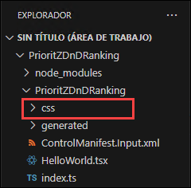
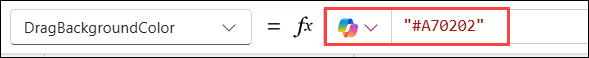
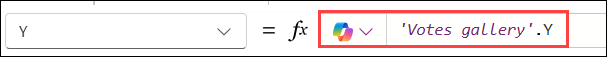
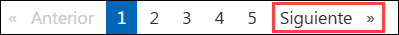

# Laboratorio 02 - Construir un componente de código

## Duración Estimada: 90 minutos

Como parte del equipo de fusión de PrioritZ, se le ha pedido que cree un componente de código de Power Apps para permitir la clasificación de prioridad de elementos mediante arrastrar y soltar en la Power App PrioritZ Ask. Construirá un componente de código utilizando el framework de JavaScript React. Se utiliza un enfoque de componente de código para abordar el requisito porque no hay un control similar ya integrado.

Ha colaborado con los creadores de la aplicación para identificar las siguientes propiedades que les permitirán
configurar el componente de código en la aplicación:

- BackgroundColor
- DragBackgroundColor
- ItemHeight
- FontSize
- FontColor

La aplicación PrioritZ Ask preparará una colección de elementos para clasificar que se vincularán como el conjunto de datos para el componente de código. Cuando se arrastre y suelte un elemento, el componente de código generará un evento OnSelect que será controlado por la aplicación de alojamiento. La aplicación de alojamiento actualizará los elementos de la colección con su nueva clasificación. El componente de código no tendrá estado.

## Objetivos del Laboratorio

- Ejercicio 1: Construir Componente de Código 
- Ejercicio 2: Usar Componente de Código 
- Ejercicio 3: Agregar Componente de Código a la Solución 

## Ejercicio 1: Construir Componente de Código

En este ejercicio, creará el componente de código.

### Tarea 1: Crear el componente de código

1. Inicie **Visual Studio Code** si aún no está abierto, utilizando el acceso directo disponible en el escritorio.

   
   
1. Seleccione la pestaña **Power Platform (1)** y asegúrese de que su perfil **Dev Auth (2)** esté seleccionado.
    
   >**Nota**: La pestaña Power Platform ya está instalada.
    
    

1. Haga clic en los **tres puntos (1)**, vaya a **Terminal (2)** y seleccione **Nueva terminal (3)**.
     
     

1. En la ventana Terminal, cree un nuevo directorio ejecutando el siguiente comando.

    ```
    md PrioritZDnDRanking
    ```
     

1. Ejecute el siguiente comando para cambiar al directorio PrioritZDnDRanking que creó.

    ```
    cd PrioritZDnDRanking
    ```
1. Ahora debería estar en el directorio que creó. Cree un nuevo proyecto de componente e instale las dependencias ejecutando el siguiente comando.
    
     ```
     pac pcf init -ns ContosoCoffee --name PrioritZDnDRanking --template dataset --framework react --run-npm-install
     ```
     
     

   > Nota: El comando anterior podría tomar de 2 a 3 minutos en ejecutarse.

1. El proyecto del framework de componentes debería crearse correctamente.

    

    >**Nota:** Al instalar las dependencias, podría ver advertencias como:

    >- npm WARN deprecated @babel/plugin-proposal-object-rest-spread

    >- npm WARN deprecated rimraf@3.0.2

    >- npm WARN deprecated eslint@8.57.1

    > Estas advertencias indican que algunos paquetes están desactualizados o ya no se actualizan. Puede ignorarlas, ya que no afectarán el funcionamiento del proyecto.

1. Ejecute el siguiente comando para abrir el proyecto.
    ```
    code -a.
    ```
    

1. Si aparece la siguiente ventana emergente, haga clic en **Sí** para confiar en los autores de los archivos.

    

1. Revise los archivos de componentes de código creados seleccionando la pestaña **Explorador**.
    
     

1. Expanda la carpeta **PrioritZDnDRanking** y luego expanda la subcarpeta **generated**.

    

1. Abra el archivo **ControlManifest.Input.xml**. El manifiesto es el archivo de metadatos que define un componente, incluyendo las propiedades expuestas a la aplicación de alojamiento.

      

1. Ubique el elemento XML **data-set** en la **línea número 21** del archivo **ControlManifest.Input.xml**.

      

1. Cambie **name** a **items** y **display-name-key** a **items**. Esto define la propiedad que la aplicación vinculará a una colección de elementos.

      

1. Agregue las siguientes propiedades entre la etiqueta de cierre del elemento del conjunto de datos `</data-set>` y la etiqueta de apertura del elemento `<resources>`.

    > Agregue las siguientes propiedades después de la **línea número 26** en el archivo **ControlManifest.Input.xml**.

    ```
    <property name="BackgroundColor" display-name-key="Background color" usage="input" of-type="SingleLine.Text" default-value="#F3F2F1"/>
    <property name="DragBackgroundColor" display-name-key="Drag background color" usage="input" of-type="SingleLine.Text" default-value="lightgreen"/>
    <property name="ItemHeight" display-name-key="Item height" usage="input" of-type="Whole.None" default-value="32"/>
    <property name="FontSize" display-name-key="Font size" usage="input" of-type="Whole.None" default-value="12"/>
    <property name="FontColor" display-name-key="Font color" usage="input" of-type="SingleLine.Text" default-value="#333333"/>
    ```

     

1. Ubique la sección `<resources>` y agregue el código mostrado a continuación después de **code path** para agregar el recurso **css**. Esto garantizará que nuestros estilos se incluyan con el componente de código cuando se implemente.

    ```
    <css path="css/PrioritZDnDRanking.css" order="1" />
    ```
    
     
 
      >**Nota**: Por favor asegúrese de NO descomentar la **ruta resx** ya que se encontraría con un problema en la próxima tarea mientras construye el componente de código si no está comentada.
      
1. Observe los siguientes dos recursos. Esto declara la dependencia del componente en estas dos bibliotecas. Este es el resultado de especificar –framework React en la inicialización.

    ```
    <platform-library name="React" version="16.8.6" />
    <platform-library name="Fluent" version="8.29.0" />
    ```
     
    
    
1. Haga clic en **Archivo (1)** y seleccione **Guardar Todo (2)** para guardar los cambios.

    

1. Asegúrese de que todavía tiene seleccionado el archivo **ControlManifest.Input.xml (1)** y luego haga clic en **Nueva carpeta (2)**.

    

1. Nombre la nueva carpeta como **css**.

    

1. Seleccione la nueva carpeta **css (1)** que creó y luego haga clic en **Nuevo archivo (2)**
 
     
 
1. Nombre el nuevo archivo **PrioritZDnDRanking.css**

     

1. Pegue el siguiente CSS en el archivo **PrioritZDnDRanking.css**.
    
      ```
     .prioritydnd-scroll-container {
     box-sizing: border-box;
     padding: 2px;
     overflow-y: auto;
     overflow-x: hidden;
     position: relative;
     }
     .prioritydnd-item-container {
     user-select: none;
     display: flex;
     align-items: center;
     }
     .prioritydnd-item-column {
     margin: 8px;
     }
     ```

1. El archivo ahora debería verse de la siguiente manera:

     

1. Haga clic en **Archivo (1)** y seleccione **Guardar Todo (2)** para guardar los cambios.

     

### Tarea 2: Implementar la lógica del componente

1. Seleccione el archivo del componente **HelloWorld.tsx (1)**, haga clic derecho sobre él y seleccione **Eliminar (2)** para eliminar el archivo del componente, ya que se crea automáticamente y no lo usaremos.

     
    
1. Navegue hasta la ruta `C:\LabFiles\Developer-in-a-day\Student\L02 - Build a code component\Resources` en el explorador de archivos.

         

1. Copie el archivo **PriorityComponent.tsx** y péguelo en la carpeta **PrioriZDnDRanking** para duplicarlo dentro del proyecto.

      

1. El archivo **PriorityComponent.tsx** ahora debería estar en la carpeta **PrioriZDnDRanking**.

     

1. Haga clic en **Archivo** y guarde los cambios.
    
1. Abra **PriorityComponent.tsx** y revise el contenido. Esto implementa el componente React que se renderizará para representar nuestros elementos arrastrables.
    
1. Observe que la línea 9 `from react-beautiful-dnd` tiene un subrayado rojo. Este es un paquete npm que el componente utiliza y al que no hemos hecho referencia.

     
 
 1. Ejecute el siguiente comando en una ventana de terminal para agregar una referencia a react-beautiful-dnd.

    ```
    npm install react-beautiful-dnd
    ```
     

    >**Nota**: Si recibe el error **npm is not recognised**, realice los pasos siguientes:

      1. Abra PowerShell y ejecute el comando `choco install -y --force nodejs`.
      2. Una vez que se haya ejecutado el comando, cierre Visual Studio Code y ábralo nuevamente.
      3. Realice el **Paso 8** de esta tarea nuevamente para instalar el paquete **react-beautiful-dnd**.

1. Ejecute el siguiente comando para las definiciones de tipo.

    ```
    npm i --save-dev @types/react-beautiful-dnd
    ```
     

1. Observe que el subrayado rojo en la línea 9 se ha resuelto.

     

1. Abra el archivo **index.ts**.

1. Elimine la siguiente línea (línea número 2 en el archivo Index.ts) ya que ya no usamos HelloWorld

    ```
    import { HelloWorld, IHelloWorldProps } from "./HelloWorld";
    ```
    
    
 
 1. Agregue el código mostrado a continuación al archivo **index.ts** después de la **línea número 1**. Esto hará referencia a PriorityComponent.
    
    ```
    import { PriorityComponent, PriorityComponentProps } from './PriorityComponent';
    ```
      
   
1. Ubique la clase **Export** en la **línea número 5**.
      
     
 
1. Agregue el siguiente código dentro de la clase **export**. Esto define algunas variables de trabajo que usará en la lógica de la clase.
   
    ```
    private context: ComponentFramework.Context<IInputs>;
    private items: ComponentFramework.PropertyTypes.DataSet;
    private state: ComponentFramework.Dictionary;
    ```
    
    
 
1. Ubique la función **init** y remueva la siguiente línea de código
 
    ```
     state: ComponentFramework.Dictionary
     ```
     
   


1. Pegue el código a continuación dentro de la función **init**. Esta lógica inicializa nuestras variables de clase a partir de los valores de tiempo de ejecución y habilita la notificación de cambio de tamaño.
    
   ```
   this.context = context;
   context.mode.trackContainerResize(true);
   ```
    

1. Localice la función **updateView**.

   
 
1. Reemplace la función **updateView** con la función que se muestra a continuación. Esta lógica crea el elemento React a partir de PriorityComponent y lo agrega al DOM virtual.
  
    ```   
    public updateView(context: ComponentFramework.Context<IInputs>): React.ReactElement {
        const dataset = context.parameters.items;
        return React.createElement(PriorityComponent, {
            width: context.mode.allocatedWidth,
            height: context.mode.allocatedHeight,
            itemHeight: context.parameters.ItemHeight.raw,
            fontSize: context.parameters.FontSize.raw,
            fontColor: context.parameters.FontColor.raw,
            dataset: dataset,
            onReorder: this.onReorder,
            backgroundColor: this.context.parameters.BackgroundColor.raw,
            dragBackgroundColor:
            this.context.parameters.DragBackgroundColor.raw,
        } as PriorityComponentProps);
    }
    ```

    
 
1. Agregue el código a continuación después de la función **destroy**. Esta lógica maneja el evento onReorder desde PriorityComponent e identifica los elementos involucrados para la aplicación de alojamiento como elementos seleccionados.
       
    ```
    onReorder = (sourceIndex: number, destinationIndex: number): void => {
    const dataset = this.context.parameters.items;
    const sourceId = dataset.sortedRecordIds[sourceIndex];
    const destinationId = dataset.sortedRecordIds[destinationIndex];
    // raise the OnSelect event
    this.context.parameters.items.openDatasetItem(dataset.records[sourceId].getNamedReference());
    // set the SelectedItems property
    this.context.parameters.items.setSelectedRecordIds([sourceId, destinationId]);
    };
    ```
  
    
 
     > **Nota**: La función **Destroy** estará presente al final de la clase **PrioritZDnDRanking**.

1. Después de completar todos los pasos, su archivo `index.ts` debe contener el siguiente código.

    ```
    import { IInputs, IOutputs } from "./generated/ManifestTypes";
    import { PriorityComponent, PriorityComponentProps } from './PriorityComponent';
    import * as React from "react";

    export class PrioritZDnDRanking implements ComponentFramework.ReactControl<IInputs, IOutputs> {
        private context: ComponentFramework.Context<IInputs>;
        private items: ComponentFramework.PropertyTypes.DataSet;
        private state: ComponentFramework.Dictionary;
        private theComponent: ComponentFramework.ReactControl<IInputs, IOutputs>;
        private notifyOutputChanged: () => void;

        /**
        * Empty constructor.
        */
        constructor() { }

        /**
        * Used to initialize the control instance. Controls can kick off remote server calls and other initialization actions here.
        * Data-set values are not initialized here, use updateView.
        * @param context The entire property bag available to control via Context Object; It contains values as set up by the 
        * customizer mapped to property names defined in the manifest, as well as utility functions.
        * @param notifyOutputChanged A callback method to alert the framework that the control has new outputs ready to be retrieved 
        * asynchronously.
        * @param state A piece of data that persists in one session for a single user. Can be set at any point in a controls life 
        * cycle by calling 'setControlState' in the Mode interface.
        */
        public init(
            context: ComponentFramework.Context<IInputs>,
            notifyOutputChanged: () => void,
            
        ): void {
            this.context = context;
            context.mode.trackContainerResize(true);
            this.notifyOutputChanged = notifyOutputChanged;
        }

        /**
        * Called when any value in the property bag has changed. This includes field values, data-sets, global values such as container 
        * height and width, offline status, control metadata values such as label, visible, etc.
        * @param context The entire property bag available to control via Context Object; It contains values as set up by the customizer 
        * mapped to names defined in the manifest, as well as utility functions.
        * @returns ReactElement root react element for the control
        */
        public updateView(context: ComponentFramework.Context<IInputs>): React.ReactElement {
            const dataset = context.parameters.items;
            return React.createElement(PriorityComponent, {
                width: context.mode.allocatedWidth,
                height: context.mode.allocatedHeight,
                itemHeight: context.parameters.ItemHeight.raw,
                fontSize: context.parameters.FontSize.raw,
                fontColor: context.parameters.FontColor.raw,
                dataset: dataset,
                onReorder: this.onReorder,
                backgroundColor: this.context.parameters.BackgroundColor.raw,
                dragBackgroundColor: this.context.parameters.DragBackgroundColor.raw,
            } as PriorityComponentProps);
        }

        /**
        * It is called by the framework prior to a control receiving new data.
        * @returns an object based on nomenclature defined in manifest, expecting object[s] for property marked as "bound" or "output"
        */
        public getOutputs(): IOutputs {
            return { };
        }

        /**
        * Called when the control is to be removed from the DOM tree. Controls should use this call for cleanup.
        * i.e. cancelling any pending remote calls, removing listeners, etc.
        */
        public destroy(): void {
            // Add code to cleanup control if necessary
        }

        onReorder = (sourceIndex: number, destinationIndex: number): void => {
            const dataset = this.context.parameters.items;
            const sourceId = dataset.sortedRecordIds[sourceIndex];
            const destinationId = dataset.sortedRecordIds[destinationIndex];
            // raise the OnSelect event
            this.context.parameters.items.openDatasetItem(dataset.records[sourceId].getNamedReference());
            // set the SelectedItems property
            this.context.parameters.items.setSelectedRecordIds([sourceId, destinationId]);
        };
    }
    ```

1. Abra el archivo **package.json**.

1. Localice el objeto JSON **dependencies**.

      
 
1. Reemplace **dependencies** con el JSON que aparece a continuación.

    ```
    "dependencies": {
    "@fluentui/react": "8.29.0",
    "eslint-config-prettier": "^8.5.0",
    "eslint-plugin-prettier": "^4.0.0",
    "eslint-plugin-react": "^7.29.4",
    "eslint-plugin-react-hooks": "^4.4.0",
    "eslint-plugin-sonarjs": "^0.13.0",
    "prettier": "^2.6.1",
    "react": "16.8.6",
    "react-beautiful-dnd": "^13.1.0",
    "react-dom": "16.8.6"
    },
    ```
      

1. Navegue hasta el archivo **.eslintric.json(1)** desde la navegación izquierda para agregar la nueva regla de lint. Ubique **rules(2)** en la **línea número 22** y pegue las reglas a continuación.
   
      ```
      "no-unused-vars": ["off"],
      "no-undef": ["off"]
      ```
   
      
   
1. Haga clic en **Archivo (1)** y seleccione **Guardar Todo (2)** para guardar los cambios.

      

1. Haga clic en los **tres puntos (...) (1)**, vaya a **Terminal (2)** y seleccione **Nueva terminal (3)**.
     
      

1. Ejecute el siguiente comando. Esto compilará su componente e identificará cualquier problema.

    ```
    npm run-script build
    ```

      > **Nota**: Si la operación de compilación falla con el error **`Root element is missing`**, asegúrese de que la **ruta resx** esté comentada en el archivo Manifest.Xml e intente compilar el componente nuevamente.
 
1. La compilación debería tener éxito. Si hay algún error, resuélvalo antes de continuar.
      
    
 
1. Ejecute el siguiente comando para iniciar el arnés de prueba.
    
      ```
      npm start
      ```
      

1. El arnés de prueba debería iniciarse; si no, copie la dirección y péguela en una nueva ventana del navegador. Intente arrastrar los elementos y vea si el comportamiento funciona como se esperaba.

      

    > **Nota**: **Si recibe una ventana emergente de Internet Explorer, ciérrela, luego copie la URL del host local y péguela en una nueva pestaña en Edge**.

       
 
     > **Nota**: Si el arnés de prueba no se inició como se esperaba, no podrá ver el resultado esperado como se mencionó. Verifique que haya seguido las instrucciones anteriores y haya agregado el código correctamente en los archivos **Manifest e Index**.

1. Cierre el arnés de prueba cerrando la pestaña del navegador.

1. Detenga la ejecución manteniendo presionada la tecla **[Ctrl]** + **C**.
 
1. Escriba **S** y presione [ENTER].
     
      

1. Ejecute el siguiente comando para enviar el componente a su entorno.

    ```
    pac pcf push --publisher-prefix contoso
    ```
    
    > **Nota** : 
     1. Si encuentra el mensaje de error **"Error: Falta la herramienta requerida: MSBuild.exe/dotnet.exe. Agregue MSBuild.exe/dotnet.exe en la variable de entorno Ruta o use 'Desarrollador 
        Símbolo del sistema para VS'"**, siga estos pasos:
        1. Navegue hasta el directorio `C:\LabFiles` y abra **dotnet-sdk-8.0.100-win-x64**.
        2. En la ventana de configuración, seleccione **Reparar**, luego espere a que se complete el proceso.
        3. Una vez finalizada la reparación, cierre Visual Studio Code, vuelva a abrirlo y primero ejecute el comando de compilación presente en el paso 28 y vuelva a ejecutar el comando anterior.
        4. Si el problema persiste, desinstale **dotnet-sdk-8.0.100-win-x64** e instale la última versión desde [la página de descarga de .NET](https://dotnet.microsoft.com/en-us/download). Cierre Visual Studio Code, vuelva a abrirlo, ejecute el comando de compilación del paso 28 y luego ejecute el comando anterior nuevamente.

     2. Si la operación de inserción falla con el error **`Sorry, the app encountered a non-recoverable error and will need to terminate`**, asegúrese de haber seguido las instrucciones anteriores y agregué el código correctamente en los archivos **Manifiesto e Índice**. 
        
        Además, puede encontrar los archivos **Manifiesto e Índice** en la ubicación `C:\LabFiles`, puede comparar su código con estos archivos y solucionar los problemas, si los hay. 
        Vuelva a intentar enviar el componente ejecutando el **comando pac push** nuevamente.
        
     3. Si la ejecución falla con un error del paquete Nuget, ejecute el siguiente comando en PowerShell e intente ejecutar el comando anterior nuevamente.
    
        ```
        dotnet nuget add source https://api.nuget.org/v3/index.json -n nuget.org --configfile $env:APPDATA\NuGet\NuGet.Config
        ```
    
1. Espere a que la solución se importe y publique en su entorno.

      
 
### Tarea 3: Confirmar que el control se agregó al entorno

1. Navegue hasta el portal de creación de Power Apps utilizando la siguiente URL si aún no está abierta. Asegúrese de que el entorno de desarrollo denominado **DEV_ENV_<inject key="Deployment ID" enableCopy="false" /> (2)** esté seleccionado.

   ```
   https://make.powerapps.com/
   ```
    
1. Seleccione **Soluciones** y abra la solución **PowerAppsTools_contoso**.
    
    

1. Confirme que el control personalizado se encuentra en esta solución.
     
      

> **Felicidades** por completar la tarea! Ahora, es el momento de validarlo. Estos son los pasos:
> - Presione el botón Validar para la tarea correspondiente. Si recibe un mensaje de éxito, puede continuar con la siguiente tarea. 
> - Si no es así, lea atentamente el mensaje de error y vuelva a intentar el paso, siguiendo las instrucciones de la guía de laboratorio.
> - Si necesita ayuda, póngase en contacto con nosotros en cloudlabs-support@spektrasystems.com. Estamos disponibles las 24 horas del día, los 7 días de la semana para ayudar.

<validation step="aae02cab-a129-491c-b38b-29c66f2f2547" />
 
## Ejercicio 2: Usar Componente de Código

En este ejercicio, usará el componente de código que creó en la aplicación de canvas PrioritZ Ask.

### Tarea 1: Permitir el framework de componentes de Power Apps

En esta tarea, permitirá la publicación de aplicaciones de canvas con componentes de código para su entorno.

1. Navegue hasta el centro de administración de Power Platform utilizando la siguiente URL y seleccione entornos.

     ```
     https://admin.powerplatform.microsoft.com/environments
     ```

1. Abra el entorno de desarrollo llamado **DEV_ENV_<inject key="Deployment ID" enableCopy="false" />** que está usando para este laboratorio.

    

1. Haga clic en **Configuración** en el menú superior.
    
     

1. Expanda **Productos(1)** y seleccione **Características(2)**.
    
     

1. Active **Permitir publicación de aplicaciones de lienzo con componentes de código (1)** en **Power Apps component framework para aplicaciones de lienzo**, desplácese hacia abajo y haga clic en **Guardar (2)**. 
 
      

### Tarea 2: Editar la aplicación de canvas

En esta tarea, editará la aplicación de canvas PrioritZ Ask para usar el componente de código que creaste.

1. Navegue al portal de creación de Power Apps usando la siguiente URL si aún no está abierta. Asegúrese de que el entorno de desarrollo llamado **DEV_ENV_<inject key="Deployment ID" enableCopy="false" />** esté seleccionado.

     ```   
     https://make.powerapps.com/
     ```
1. Seleccione **Soluciones (1)** y abra la solución **PrioritZ (2)**.

     

1. Seleccione **Aplicaciones (1)**, seleccione la aplicación **PrioritZ Ask (2)** y haga clic en **Editar (3)**.

     

1. Seleccione la pestaña **Componentes (1)**, haga clic en la flecha hacia atrás para **Importar componentes (2)**.

     
 
1. Seleccione la pestaña **Código (1)**, seleccione el componente de código **(2)** que creó y haga clic en **Importar (3)**.
    
     
 
1. Seleccione la pestaña **Pantallas**.

1. En la Vista de árbol, expanda **Vote Screen (1)** y seleccione **Votes gallery (2)**.

     

1. Seleccione **Width** en el menú desplegable de propiedades. 

     

1. Establezca el **Width** de Votes gallery en **570**.

     
    
1. La pantalla ahora debería verse como la imagen a continuación.
     
      

1. Seleccione **Votes Screen** y haga clic en **+ Insertar**.
      
     
 
1. Seleccione el componente **PrioritZDnDRanking** en **Componentes de Código**.
      
     

   >**Nota:** Si recibe una ventana emergente para "Select a data source," simplemente haga clic en **Close**.
 
1. Vaya a la pestaña de vista de árbol y seleccione el elemento **PrioritZDnDRanking** que acaba de agregar.

      

1. Establezca el valor **Items** del componente **PrioritZDnDRanking** con la fórmula que se muestra a continuación.

      ```
    ' Votes gallery'.AllItems
      ```

      
    
1. Seleccione **PrioritZDnDRanking**, vaya al panel **Properties** que se encuentra en el lado derecho de la pantalla, configure **Item Height (1)** en 160 y haga clic en **Editar (2)**.

      

    >**Note:** Si no puede encontrar las propiedades en el lado derecho de la pantalla, haga clic en la opción de propiedades ubicada junto al botón editar en la esquina superior derecha.

      

1. Haga clic en **+ Agregar campo** para agregar un nuevo campo.

1. Haga clic en **+ Agregar campo (1)** para agregar un nuevo campo, buscar **rank (2)** Seleccione **Rango (3)** y haga clic en **Agregar (4)**.
     
      
 
1. El rango ahora debería aparecer en el control, pero está ordenado de manera descendente.

1. Vaya a la vista de árbol, seleccione la **Pantalla de votación**, luego la **Galería de votos**, luego seleccione la propiedad **Elementos** en el menú desplegable de propiedades y cambie el orden de clasificación a **Ascendente**.
     
      
 
1. Ahora, el rango debería ordenarse de manera ascendente.

1. Seleccione el componente **PrioritZDnDRanking** y luego la propiedad **X** del menú desplegable de propiedades.

      
      
1. Establezca el valor **X** del componente **PrioritZDnDRanking** con la siguiente fórmula.

      ```
      'Votes gallery'.Width
      ```


1. Seleccione la propiedad **Width** del componente **PrioritZDnDRanking** del menú desplegable de propiedades y establezca su valor en **60**.
    
      

1. Seleccione la propiedad **Height** del componente **PrioritZDnDRanking** del menú desplegable de propiedades y establezca su valor con la siguiente fórmula.

      ```
      'Votes gallery'.Height
      ```
      

1. Seleccione la propiedad **ItemHeight** del componente **PrioritZDnDRanking** del menú desplegable de propiedades y establezca su valor con la siguiente fórmula.

      ```
      'Votes gallery'.TemplateHeight
      ```
      

1. Seleccione la propiedad **BackgroundColor** del componente **PrioritZDnDRanking** del menú desplegable de propiedades y establezca su valor en **"LightBlue"**
    
      

1. Seleccione la propiedad **DragBackgroundColor** del componente **PrioritZDnDRanking** del menú desplegable de propiedades y establezca su valor en **"#A70202"**

      

1. Seleccione la propiedad **Y** del componente **PrioritZDnDRanking** del menú desplegable de propiedades y establezca su valor con la siguiente fórmula.

     ```
     'Votes gallery'.Y
     ```
      

1. Seleccione la propiedad **OnSelect** del componente **PrioritZDnDRanking** del menú desplegable de propiedades y establezca su valor con la siguiente fórmula.

    ```
    With(
        {
            sourceRank: First(Self.SelectedItems).Rank,
            destinationRank: Last(Self.SelectedItems).Rank
        },
        If(
            sourceRank < destinationRank,
     // Moving Up
            UpdateIf(
                colVotes,
                Rank >= sourceRank && Rank <= destinationRank,
                {
                    Rank: If(
                        Rank <> sourceRank,
                        Rank - 1,
                        destinationRank
                    )
                }
            );
        );
        If(
            sourceRank > destinationRank,
     // Moving Down
            UpdateIf(
                colVotes,
                Rank >= destinationRank && Rank <= sourceRank,
                {
                    Rank: If(
                        Rank <> sourceRank,
                        Rank + 1,
                        destinationRank
                    )
                }
            );
        );

    );
    ```

1. Seleccione **Home Screen** y haga clic en **Iniciar**.

     

1. Seleccione uno de los **temas**.

1. Puede ver cómo se ve en la pantalla de un teléfono usando el emulador.
     
     

1. Arrastre uno de los elementos del tema y suéltelo en una ubicación diferente.
     
     
 
1. La función de arrastrar y soltar debería funcionar como se espera.

1. Cierre la vista previa.

1. Haga clic en **Publicar**.

    

1. Seleccione **Publicar esta versión** y espere a que se complete la publicación.

    

1. Puede **cerrar** Canvas App Studio.

## Ejercicio 3: Agregar Componente de Código a la Solución 

En este ejercicio, agregará el componente de código que creó a la solución PrioritZ.

### Tarea 1: Agregar el componente a la solución

1. Navegue hasta el portal de creación de Power Apps utilizando la siguiente URL si aún no está abierta. Asegúrese de que el entorno de desarrollo denominado **DEV_ENV_<inject key="Deployment ID" enableCopy="false" /> (2)** esté seleccionado.

      ```
      https://make.powerapps.com/
      ```
1. Seleccione **Soluciones** y abra la solución **PrioritZ**.

    

1. Haga clic en **Agregar existente (1)** y seleccione **Más (2) | Developer (3) | Control personalizado (4)**.
      
      
 
1. Seleccione **contoso_ContosoCoffee.PrioritZDnDRanking (1)** y haga clic en **Agregar (2)**.
     
      
 
1. Haga clic en **Publicar todas las personalizaciones** y espere a que se complete la publicación.

    

## Resumen

En este laboratorio, aprendió a crear un componente de código, implementar su lógica, integrarlo en una aplicación de canvas y agregarlo a una solución dentro de Power Platform.

## Has completado este laboratorio con éxito. Haz clic en el botón **Siguiente >>** para continuar con el próximo laboratorio.



