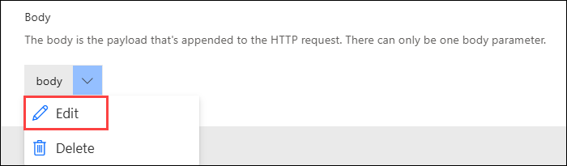
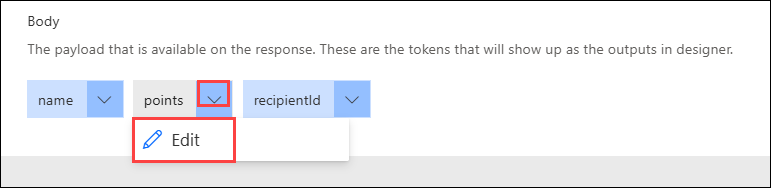
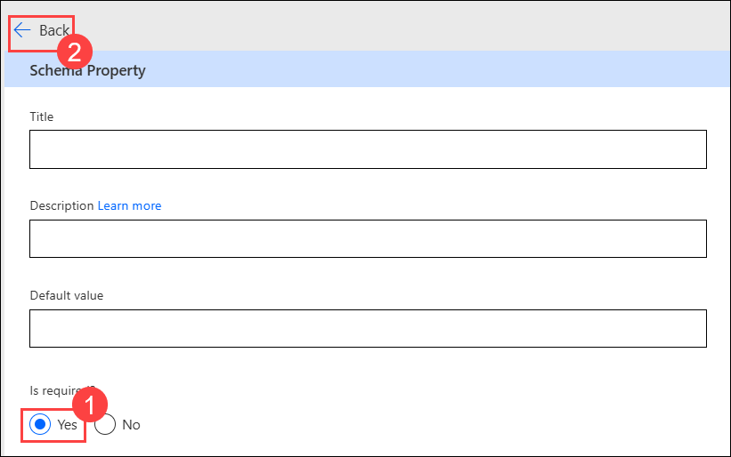
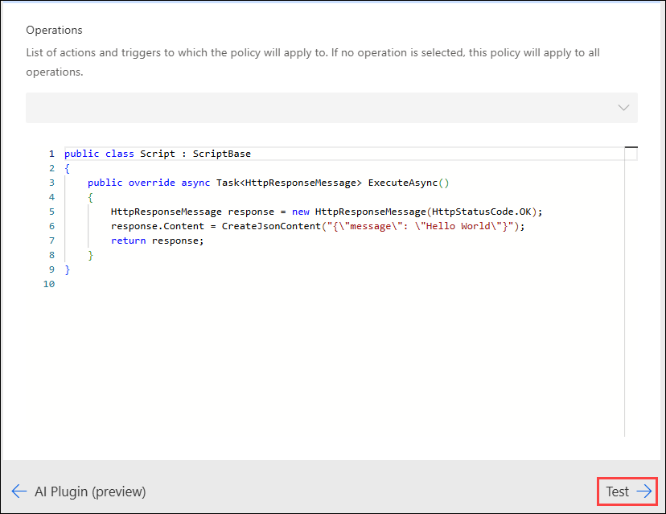
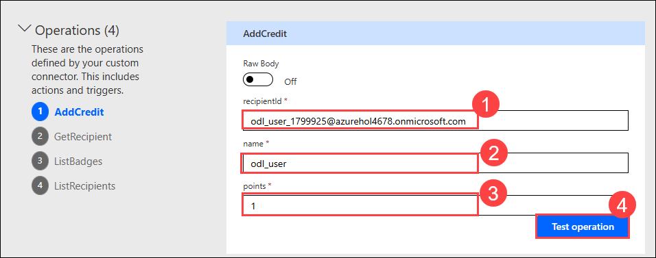
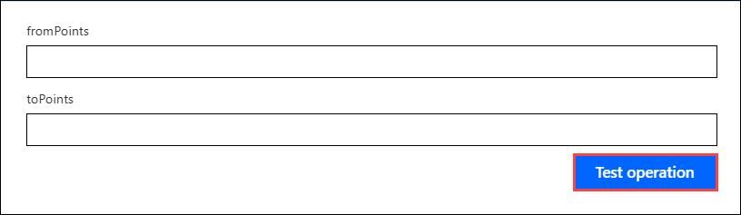
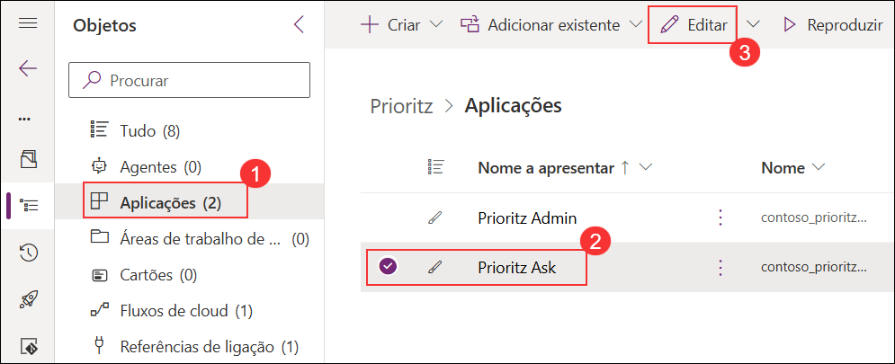

# Laboratório 03 - Conector personalizado para API existente

## Duração estimada: 110 minutos

Neste laboratório, você vai configurar um conector personalizado para uma API existente a fim de adicionar um recurso de emblemas (*badges*) ao aplicativo **PrioritZ**. Isso permitirá que os usuários recebam créditos ao concluir a classificação de um item. Você começará criando um banco de dados Dataverse e uma nova solução, depois construirá um conector personalizado usando uma definição Open API. Após modificar e testar o conector, você adicionará um código personalizado para aprimorar sua funcionalidade e o testará novamente. Por fim, você integrará o conector a um aplicativo de tela e a um fluxo, permitindo que o aplicativo **PrioritZ** exiba os emblemas do usuário e os atualize com base nas ações realizadas. Ao final, você terá experiência prática na criação, personalização e uso de conectores personalizados na Power Platform.

## Objectivos de Laboratório

- Exercício 1: Criar Banco de dados no ambiente padrão
- Exercício 2: Criar uma Solução
- Exercício 3: Criar Conector Personalizado
- Exercício 4: Adicionar Código Personalizado
- Exercício 5: Testar o Conector Personalizado

## Exercício 1 - Criar Banco de Dados no ambiente padrão

Neste exercício, você criará um banco de dados Dataverse no ambiente de teste, que será usado para importar a solução nos próximos exercícios.

Ao analisar a API, você verá que ela possui quatro operações e utiliza autenticação por chave de API.


### Tarefa 1: Criar Banco de dados

1. Navegue até o portal de criação do Power Apps.

    ```
    https://make.powerapps.com
    ```

1. Clique em **Ambiente (1)** e selecione o ambiente de desenvolvimento pré-criado chamado **Azure HOL - xxxxxx (default) (2)**.

    

1. Selecione **Soluções (1)** no menu à esquerda e clique em **Criar um Banco de Dados (2)**.

    

>**Observação:** Se o banco de dados do Dataverse já estiver criado, pule esta tarefa e continue com o Exercício 2.

1. Na janela **Nova Banco de dados**, selecione **Moeda → TND (1)**, **Linguagem → English (United States) (2)** e clique em **Criar um banco de dados (3)**.

    

    >**Observação:** Você pode deixar esta aba do navegador aberta e continuar com o próximo exercício, pois a criação do banco de dados do Dataverse levará algum tempo.

## Exercício 2 - Criar Solução

Neste exercício, você criará uma solução para o conector personalizado Contoso Badges. Atualmente, os conectores personalizados devem estar em uma solução separada dos aplicativos e fluxos que os utilizam.

### Tarefa 1: Criar uma solução

1. Abra uma nova aba no navegador, navegue até o portal de criação do Power Apps, selecione **Ambientes (1)** e certifique-se de que está em seu ambiente de desenvolvimento chamado **DEV_ENV_<inject key="Diployment ID" activityCopy="false " /> (2)**.

    ```
    https://make.powerapps.com
    ```

    

1. Selecione **Soluções (1)** e clique em **+ Nova solução (2)** no topo da página.

    

1. Insira **Contoso Badges connector (1)**  como Nome de exibição, selecione **Contoso Coffee (ContosoCoffee) (2)** como Fornecedor e clique em **Criar (3)**.

    

> **Parabéns** por concluir a tarefa! Agora, é hora de validá-la. Aqui estão os passos:
> - Pressione o botão Validar para a tarefa correspondente. Se receber uma mensagem de êxito, pode prosseguir para a próxima tarefa. 
> - Se não, leia atentamente a mensagem de erro e tente novamente a etapa, seguindo as instruções no guia do laboratório.
> - Se precisar de ajuda, entre em contato conosco pelo cloudlabs-support@spektrasystems.com. Estamos disponíveis 24 horas por dia, 7 dias por semana para ajudar.

<validation step="2be455a2-0037-48b9-83b9-d3efb66743e9" />

## Exercício 3 – Crie Conector Personalizado

Neste exercício, você criará um conector personalizado a partir de uma API existente.

### Tarefa 1: Baixar a definição da Open API e criar um conector

1. Navegue até a URL abaixo para abrir a API `Contoso Coffee Badges`.

    ```
    https://contosobadgestest.azurewebsites.net/
    ```

1. Clique no link **Open API definition file**.

    

1. Faça uma rápida revisão da definição da Open API.

1. Clique com o botão direito na página, selecione **Save as** ou use **Ctrl + S** e nomeie o arquivo como **swagger.json** em sua máquina. Feche a aba do navegador.

    

>**Observação:** Se estiver com problemas para salvar, copie o código, cole no Bloco de Notas e salve o arquivo como `swagger.json`.

1. Volte ao portal de criação do Power Apps, selecione **Ambientes (1)** e certifique-se de que está em seu ambiente de desenvolvimento **DEV_ENV_<inject key="Deployment ID" enableCopy="false" />** **(2)**.

    ```
    https://make.powerapps.com
    ```

1. Selecione **Soluções (1)** e abra a solução **Contoso Badges connector (2)** que você criou.

    

1. Clique em **+ Novo (1)**, passe o cursor sobre **Automatização (2)** e selecione **Conector personalizado (3)**.

    

1. Insira as seguintes informações:

    - Nome do conector: **Badges connector (1)**
    - Descrição: **Connector for contosobadgestest (2)**
    - Host: **contosobadgestest.azurewebsites.net (3)**
    - Clique em **Criar conector (4)** para continuar.

        

       >**Observação**: Se for solicitado o login, use as credenciais do laboratório.

1. Selecione **Conectores personalizados (1)** no menu. Clique no botão de **reticências** **...(2)**, **Mais ações (2)** do seu conector e selecione **Atualizar do arquivo Open API (3)**.

    

1. Clique em **Importar** para selecionar o arquivo da API.

    

1. Selecione a pasta **Downloads (1)**, clique no arquivo **swagger.json (2)** que você salvou e clique em **Abrir (3)**.

1. Clique em **Continuar** no pop-up **Importar um arquivo OpenAPI**.

    

1. Insira **Connector for contosobadgestest (1)** como Descrição, **contosobadgestest.azurewebsites.net (2)** para Host e avance para **Segurança (3)**.

    

1. Revise a configuração de **segurança (1)** e avance para **Definição (2)**.

    

1. Não saia desta página.

### Tarefa 2: Modifique a definição

1. Selecione a ação **AddCredit (1)** e, em Visibilidade, escolha **Important (2)**.

    

2. Role para baixo até a seção **Solicitação**, clique na seta de **body** e selecione **Editar**.
     
     

3. Role para baixo, clique na seta de **points** e selecione **Editar**.

    

5. Selecione **Sim (1)** para **É obrigatório** e clique no botão **Voltar (2)**.
     
     

6. Clique na seta de **recipientid** e selecione **Editar**.

     

7. Selecione **Sim (1)** para **É obrigatório** e clique no botão **Voltar (2)**.

     

8. Clique na seta de **name** e selecione **Editar**.

     

9. Selecione **Sim (1)** para **É obrigatório** e clique no botão **Voltar (2)**.

     

10. Verifique se todos os 3 campos (*payloads*) estão exibindo um `*` **(1)** e clique em **Voltar (2)**.

      

12. Avance para **Código**.

     
 
13. Revise o código e avance para **Testar**.

      

14. Clique em **Atualizar conector** e aguarde a atualização.

     

15. Não saia desta página.

### Tarefa 3: Testar o conector

1. Em uma nova aba, navegue até a API **Contoso Coffee Badges**.

    ```
    https://contosobadgestest.azurewebsites.net/
    ```

1. Clique no link **API Key**.

    

2. Copie o valor **API Key** e salve em seu Bloco de Nota. Você a usará em breve. Feche a aba.

    

3. Volte para a página de teste do conector e clique em **+ Nova conexão**.
    
     

5. Cole a **API Key (1)** que você copiou e clique em **Criar conexão (2)**.
   
    

6. Clique no botão **Atualizar** conexões.
   
    

7. A conexão que você criou deve estar selecionada.

8. Vá para a operação **AddCredit**. Insira seu **endereço de e-mail como recipientid (1)**, seu **nome como name (2)**, **digite **1** como points (3)** e clique em **Testar operação. (4)**.
    
    

9. O teste deve ser bem-sucedido e a resposta deve ser semelhante à imagem do guia.
     
     

10. Selecione a operação **GetRecipient**.

11. Forneça seu e-mail como ID e clique em **Testar operação**.
      
     

12. O teste deve ser bem-sucedido.

13. Teste também as operações **ListBadges** e **ListRecipients**. Deixe as opções em branco e clique em **Testar operação**.

     

14. Todos os testes devem ser bem-sucedidos.
  
     

> **Parabéns** por concluir a tarefa! Agora, é hora de validá-la. Aqui estão os passos:
> - Pressione o botão Validar para a tarefa correspondente. Se receber uma mensagem de êxito, pode prosseguir para a próxima tarefa. 
> - Se não, leia atentamente a mensagem de erro e tente novamente a etapa, seguindo as instruções no guia do laboratório.
> - Se precisar de ajuda, entre em contato conosco pelo cloudlabs-support@spektrasystems.com. Estamos disponíveis 24 horas por dia, 7 dias por semana para ajudar.

<validation step="e9892770-5284-40d8-a6a1-28f85d7e051f" />

## Exercício 4 – Adicionar Código personalizado

Neste exercício, você adicionará uma nova operação para retornar apenas o nome e a URL da imagem do emblema atual, usando o recurso de código personalizado para remodelar a resposta da API.

### Tarefa 1: Adicione o código da pasta de recursos

1. Navegue até ao Power Automate em uma nova aba. Selecione **Ambientes (1)** e certifique-se de que está em seu ambiente chamado **DEV_ENV_... (2)**.

    ```
    https://make.powerautomate.com
    ```

1. Clique em **Mais(1)** no menu lateral esquerdo. Em seguida, selecione **Descobrir tudo (2)**.

    

1. Em **Dados (1)**, selecione **Conectores personalizados (2)**.

    

1. Clique no botão **Editar** do conector personalizado que você criou.

    

1. Selecione a guia **Definição (1)** e clique em **Nova ação (2)**.

    

1. Insira as seguintes informações para adicionar a ação **Get current badge**:

    - No campo **Resumo**, digite: `Get current badge` **(1)**
    - No campo **Descrição**, digite: `Get current badge` **(2)**
    - No campo **ID da operação**, insira: `getcurrentbadge` **(3)**

       

1. Role para baixo até a seção **Solicitação** e clique em **+ Importar da amostra** para definir os parâmetros da operação a partir de um exemplo.

    

1. Selecione **GET (1)** como o verbo, introduza a seguinte URL **https://contosobadgetest.azurewebsites.net/getcurrentbadge?id={id} (2)** e clique em **Importar (3)**.
    
    ```
    https://contosobadgestest.azurewebsites.net/getcurrentbadge?id={id} 
    ```

    

1. Clique em **Atualizar conector** e aguarde até que o conector seja atualizado.

1. Selecione a guia **Código**.

1. Na guia **4. Código (1)**, ative a opção **Código Habilitado (2)** e clique em **Carregar (3)** para aplicar o código à operação.

    

1. Navegue até `C:\LabFiles\Developer-in-a-day\Student\L03 - Custom connector for existing API\Resources` **(1)**, selecione o arquivo **CustomConnectorCode (2)** e clique em **Abrir (3)**.

    

1. Na guia **Código**, selecione a ação **getcurrentbadge (1)** no menu suspenso.

    

1. Revise o código que você adicionou.

1. Clique em **Atualizar conector** e aguarde até que o conector seja atualizado.

1. Avance para guia **Testar** selecionando-o no menu suspenso.

1. Selecione a ação **getcurrentbadge**.
   
1. Forneça seu e-mail como ID e clique em **Testar operação**.

    

1. O teste deve ser bem-sucedido, retornando um emblema para o usuário.

    

    > **Observação**: Se o teste falhar, tente atualizar o conector novamente e refaça os passos 15-18.

1. Copie o JSON do **Corpo** (*Body*) da Resposta.

1. Selecione a guia **Definição**.
1. Selecione a ação **getcurrentbadge**.
1. Role para baixo até a seção **Resposta** e clique em **+ Adicionar resposta padrão**.
1. Cole o JSON que você copiou no **Corpo (1)** e clique em **Importar (2)**.

    

1. Clique em **Atualizar conector** e aguarde até que o conector seja atualizado.

1. **Não** navegue por esta página.

### Tarefa 2: Testar o código personalizado

Nesta tarefa, você testará seu código personalizado.

1. Selecione a guia **Testar**.

1. Selecione a conexão que você criou anteriormente.

1. Na secção **Operações**, selecione a operação **getcurrentbadge (1)**, forneça seu endereço de e-mail como **id (2)** e clique em **Testar operação (3)**.

    

1. A operação deve ser bem-sucedida e a resposta em **Body** deve ser semelhante a imagem abaixo.

    

## Exercício 5 – Teste o Conector Personalizado

Neste exercício, você testará o conector personalizado que criou usando um fluxo e um aplicativo de tela.

### Tarefa 1: Testar o conector a partir do aplicativo de tela

Nesta tarefa, você usará o conector para mostrar o emblema atual do usuário no aplicativo de tela **PrioritZ Ask**.

1. Navegue até o portal do **Power Apps** em uma nova aba e certifique-se de que está no ambiente chamado **DEV_ENV_...** 
 
    ```
    https://make.powerapps.com
    ```

1. Expanda **Solutions (1)** e abra a solução **PrioritZ (2)**.

1. Selecione **Aplicativos (1)**, selecione o aplicativo **PrioritZ Ask (2)** e clique em **Editar (3)**.

    

1. No menu lateral esquerdo, selecione **Dados (1)** e clique em **+ Adicionar dados (2)**.

    

1. Expanda a seção **Conectores (1)** e selecione o conector **Badges connector (2)** que criou anteriormente.

    

1. Clique em **+ Adicionar uma conexão**.
   
    

1. Abra a **API Contoso Coffee Badge** em uma nova aba para obter a **Chave de API**.

    ```
    https://contosobadgestest.azurewebsites.net/
    ```
    
1. Clique no link **Abrir a Chave de API**

    

1. Copie o valor **API Key** e cole o valor para o Bloco de Notas, pois irá utilizar este valor nos próximos passos. Agora, feche a aba.

1. Volte para o editor do aplicativo, cole a chave **API (1)** que copiou no passo anterior e clique em **Connectar (2)**.

    

1. Selecione a **Exibição em árvore**.

1. Vá para a guia **+ Inserir (2)**, clique em **Mídia** e selecione **Imagem (3)**.

    

1. Dê um duplo clique na imagem recém-adicionada e renomeie-a para **User badge**.

    

1. Defina o valor da **Imagem** do *User badge* com a fórmula abaixo.

    ```
    ContosoBadges.getcurrentbadge({id:User().Email}).image
    ```

    

1. Defina o valor da **Dica de Ferramenta** do *User badge* com a fórmula abaixo.

    ```
    ContosoBadges.getcurrentbadge({id:User().Email}).name
    ```

    

1. Diminua o tamanho da imagem e mova-a para o canto superior direito da tela.

1. O *User badge* deve agora se parecer com a imagem do guia.

    

1. Selecione a guia **Telas** e clique no botão **Executar** (*Play*).

1. Passe o mouse sobre o emblema para ver seu nome.

    

1. Feche a visualização.

1. Selecione **Publicar**.

    

1. Selecione **Publicar esta versão**.

    

1. Volte para a solução clicando no botão **Voltar**.

    

1. Não navegue por esta página.

### Tarefa 2: Testar o conector a partir do fluxo

1. Vá para **Soluções (1)** e clique em **PrioritZ (2)**.

1. Clique em **+ Novo (1)**, selecione **Automação (2)**, depois **Fluxo de nuvem (3)** e, por fim, **Instantâneo (4)**.

    

1. Insira **Test add credit (1)** como nome do fluxo, selecione **Disparar um fluxo manualmente (2)** e clique em **Criar (3)**.

    

1. Clique em **+ Nova etapa**.

    

1. Selecione a guia **Personalizado (1)** e, em seguida, selecione a ação **Add Credit (2)**.

    

1. Insira **Test connection**, cole a chave da **API** que você copiou anteriormente e clique em **Criar**.

    .png)

1. Clique no campo **recipientId (1)** e, no painel do gatilho, selecione **E-mail do usuário (2)**.

    

1. Clique no campo **name** e selecione **Nome de usuário**.

1. Insira **1** em **points** e clique em **Salvar**.

1. Clique em **Testar**.

    

1. Selecione **Manualmente (1)** e clique em **Testar (2)** novamente.

    

1. Clique em **Continuar**.

1. Clique em **Executar fluxo**. 

1. Clique em **Concluído**.

1. A execução do fluxo deve ser bem-sucedida. Clique no botão **Voltar**.

    

1. Vá para **Fluxos de nuvem (1)** e abra o fluxo que criou, **Test add credit (2)**.

    

1. Volte ao portal do Power Apps e inicie o aplicativo **PrioritZ Ask**.

1. O aplicativo agora deve mostrar o **First Badge**. Atualize a página.

    

1. Volte ao fluxo e execute-o mais duas vezes.

    

1. Volte ao aplicativo **PrioritZ Ask** e atualize a página.

1. Agora você deve ver o emblema **Team Player**.

    

1. Volte ao fluxo e execute-o mais duas vezes.

1. Volte ao aplicativo **PrioritZ Ask** e atualize a página.

1. Agora você deve ver o emblema **Champ**

    

## Resumo

Neste laboratório, você aprendeu a criar e modificar um conector personalizado usando uma definição Open API, testar sua funcionalidade e integrá-lo com aplicativos de tela e fluxos na Power Platform

## Você concluiu este laboratório com sucesso. Clique no botão **Avançar** para prosseguir.


