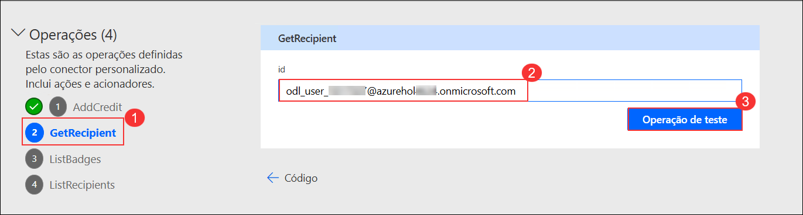
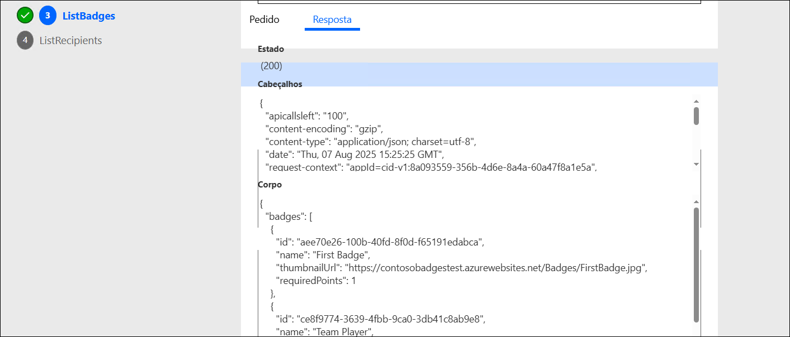

# Laboratório 03 - Conector personalizado para a API existente

## Duração estimada: 110 minutos

Trabalhando como parte da equipa de PrioritZ fusion, estará a configurar um conector personalizado para uma API existente. A equipa gostaria de adicionar um crachá à aplicação PrioritZ para dar crédito aos utilizadores quando estes concluíram a classificação de um item. A equipa identificou uma API existente, mas não tem um Power Platform Conector.

## Objectivos de laboratório

- Exercício 1: Criar base de dados no ambiente padrão
- Exercício 2: Criar uma Solução
- Exercício 3: Crie um conector personalizado
- Exercício 4: Adicionar código personalizado
- Exercício 5: Testar o Conector Personalizado

## Exercício 1 - Criar base de dados no ambiente padrão

Neste exercício, criará uma base de dados Dataverse no ambiente de teste, que será utilizado para importar a solução nos próximos exercícios.

Ao analisar a API, verifica-se que tem quatro operações e utiliza uma API Key paraa autenticação.


### Tarefa 1: Criar base de dados

1. Navegue até o portal do criador do Power Apps.

    ```
    https://make.powerapps.com
    ```

1. Clique em **Ambiente (1)** e selecione o ambiente de desenvolvimento pré-criado denominado **Azure HOL - xxxxxx (default) (2)**.

    

1. No menu do lado esquerdo do Power Apps, selecione **Soluções (1)** e clique em **Criar uma base de dados (2)** para criar uma base de dados do Dataverse.

    

1. Na janela **Nova base de dados**, selecione **Moeda → TND (1)**, **Idioma → English (United States) (2)** e clique em **Criar a minha base de dados (3)**.

    

    >**Nota:** Pode deixar este separador de navegador aberto e continuar com o próximo exercício, uma vez que a criação da base de dados Dataverse levará algum tempo.

## Exercício 2 - Criar Solução

Neste exercício, criará uma solução para o conector personalizado da Contose Badges. Atualmente, personalizado
os conectores devem estar numa solução separada das aplicações e dos fluxos que os utilizam.

### Tarefa 1: Crie uma solução

1. Abra um novo separador do browser e navegue até ao portal do fabricante de aplicações Power e selecione **Ambientes (1)**, certifique-se de que está no seu ambiente de desenvolvimento chamado **DEV_ENV_<inject key="Diployment ID" activityCopy="false " /> (2)**.

    ```
    https://make.powerapps.com
    ```

    

1. No portal Power Apps, selecione **Soluções (1)** no menu lateral esquerdo e clique em **+ Nova solução (2)** no topo da página.

    

1. Introduza **Contoso Badges connector (1)** como nome a apresentar, selecione **Contoso Coffee (ContosoCoffee) (2)** como editor e clique em **Criar (3)**.

    

> **Parabéns** por completar a tarefa! Agora, é hora de validá-lo. Aqui estão os passos:
> - Pressione o botão Validar para a tarefa correspondente. Se receber uma mensagem de êxito, pode prosseguir para a próxima tarefa. 
> - Se não, leia atentamente a mensagem de erro e tente novamente a etapa, seguindo as instruções no guia do laboratório.
> - Se precisar de ajuda, entre em contato conosco pelo cloudlabs-support@spektrasystems.com. Estamos disponíveis 24 horas por dia, 7 dias por semana para ajudar.

<validation step="2be455a2-0037-48b9-83b9-d3efb66743e9" />

## Exercício 3 – Crie Conector Personalizado

Neste exercício, criará um conector personalizado a partir de uma API existente.

### Tarefa 1: Descarregue a definição de API aberta e crie um conector

1. Navegue até ao URL abaixo para abrir a API de crachás de café Contoso.

    ```
    https://contosobadgestest.azurewebsites.net/
    ```

1. Clique no **Open API definition file**.

    

1. Faça uma revisão rápida da definição de API aberta.

1. Clique com o botão direito do rato na página seleccione **Save as** ou utilize **Ctrl + C** e nomeie o ficheiro como **swagger.json** na sua máquina. Agora, feche o separador do navegador por
 clicando em **X**.

    

1. Navegue até ao portal do fabricante do Power Apps e certifique-se de que está no seu ambiente de desenvolvimento chamado **DEV_ENV_<inject key="Deployment ID" enableCopy="false" />**.

    ```
    https://make.powerapps.com
    ```

1. Selecione **Soluções (1)** no painel de navegação esquerdo e abra a solução **Contoso Badges connector (2)** que acabou de criar.

    

1. Clique em **+ Criar (1)**, passe o cursor sobre **Automatização (2)** e selecione **Conector personalizado (3)**.

    

1. Na lâmina **Criar conector**, introduza as seguintes informações:

    - Nome do conector: **Badges connector (1)**
    - Descrição: **Connector for contosobadgestest (2)**
    - Host: **contosobadgestest.azurewebsites.net (3)**
    - Clique em **Criar conector (4)** para continuar.

        

       >**Nota**:Se for pedido a login, utilize as credenciais ODL encontradas no separador ambiente localizados à direita do guia Lab.

1. No mapa do site, selecione **Conectores personalizados (1)**. Clique no botão de reticências **...(2)** junto ao conector personalizado que criou e selecione **Atualizar a partir do ficheiro OpenAPI (3)**.

    

1. Clique em **Importar** para selecionar o ficheiro OpenAPI.

    

1. Selecione o ficheiro **swagger.json** que guardou na sua máquina e clique em **Open**.

1. No pop-up **Importar um ficheiro OpenAPI**, clique em **Continuar**.

    

1. Introduza **Connector for contosobadgestest (1)** para Descrição, **contosobadgestest.azurewebsites.net (2)** para Anfitrião, e clique em **Segurança (3)** para avançar.

    

1. Reveja a configuração da **Chave de API (1)** com os seguintes campos:

    - **Etiqueta do parâmetro**: Chave de API  
    - **Nome do parâmetro**: X-API-KEY  
    - **Localização do parâmetro**: Cabeçalho  

    Clique em **Definição (2)** para continuar.

    

1. Não navegue por esta página.

### Tarefa 2: Modifique a definição

1. Selecione a ação **AddCredit (1)** então **Important (2)** para a Visibilidade.

    

1. Desça até à secção **Corpo**, clique no botão de seta ao lado de **body** e selecione **Editar**.

    

1. Na secção **Corpo** da resposta, clique no botão de chevron ao lado de **points (1)** e selecione **Editar (2)**.

    

1. Na janela **Propriedade do Esquema**, selecione **Sim (1)** para marcar o campo como obrigatório e clique em **Anterior (2)** para voltar.

    

1. Clique no botão chevron do **recipientid** e selecione **Editar**.

    

1. Selecione **Sim (1)** para “É obrigatório?” e clique no botão **Anterior (2)**.

    

1. Clique no botão chevron de **name** e seleccione **Edit**.

    

1. Selecione **Sim (1)** para “É obrigatório?” e clique no botão **Anterior (2)**.

    

1. Clique no botão **Anterior** novamente.

    

1. Avançar para **AI Plugin(preview)**.

1. Avance para **Código**.

    

1. Analise o código e avance para **Testar**.

    

1. Clique em **Atualizar conector** e aguarde que o conector seja atualizado.

    

1. Não navegue por esta página.

### Tarefa 3: Conector de teste

1. Abra um novo aba ou janela do navegador e navegue até ao URL abaixo para abrir a API Contoso Coffee Badges.

    ```
    https://contosobadgestest.azurewebsites.net/
    ```

1. Clique no link **API Key**

    

1. Copie o valor **API Key** e guarde-o no Notepad, pois irá utilizar este valor nos próximos passos. Agora, feche o separador do browser clicando em **X**.

    

1. Volte para a aba **5. Testar** e clique em **+ Nova ligação** para criar uma nova conexão com o co

    

1. Cole a chave **API (1)** que copiou no **Passo 3** desta tarefa e clique em **Criar ligação (2)** para estabelecer a conexão com o conector.

    

1. Clique no botão **Atualizar** no canto superior direito para atualizar a lista de ligações disponíveis.

    

1. A ligação que criou deve ser selecionada.

1. Aceda à operação **AddCredit**. Introduza **1** para o campo **points (1)**, insira o seu endereço de e-mail no campo **recipientId (2)**, o seu nome no campo **name (3)** e clique em **Operação de teste (4)**.

    

1. O teste deve ter sucesso e a **resposta** deve parecer a imagem abaixo.

    

1. Clique em **GetRecipient (1)** na lista de operações. Forneça o seu endereço de e-mail no campo **id (2)** e clique em **Operação de teste (3)**

    

1. O teste deve ter sucesso e deve obter a resposta esperada.

    

1. Clique em **ListBadges (1)** na lista de operações. Deixe os campos **fromPoints** e **toPoints** em branco e clique em **Operação de teste (2)**.

    

1. Todos os testes devem ter sucesso.

    

1. Clique em **ListRecipients (1)** na lista de operações. Deixe os campos **fromPoints** e **toPoints** em branco e clique em **Operação de teste (2)**.

    

1. Todos os testes devem ter sucesso.

    

> **Parabéns** por completar a tarefa! Agora, é hora de validá-lo. Aqui estão os passos:
> - Pressione o botão Validar para a tarefa correspondente. Se receber uma mensagem de êxito, pode prosseguir para a próxima tarefa. 
> - Se não, leia atentamente a mensagem de erro e tente novamente a etapa, seguindo as instruções no guia do laboratório.
> - Se precisar de ajuda, entre em contato conosco pelo cloudlabs-support@spektrasystems.com. Estamos disponíveis 24 horas por dia, 7 dias por semana para ajudar.

<validation step="e9892770-5284-40d8-a6a1-28f85d7e051f" />

## Exercício 4 – Adicionar código personalizado

Neste exercício, irá adicionar uma nova operação para devolver apenas o nome do crachá e a imagem atual.
Fará isto utilizando a funcionalidade de código personalizado para remodelar a resposta da API.

### Tarefa 1: Adicione o código da pasta de recursos

1. Navegue até ao Poder Automatizar utilizando o URL abaixo.

    ```
    https://make.powerautomate.com
    ```

1. Clique em **Base (1)** no menu lateral esquerdo. Em seguida, selecione **Descobrir tudo (2)** no painel **Mais**.

    

1. Em **Dados (1)**, selecione **Conectores personalizados (2)**.

    

1. Clique no botão **Editar** do conector personalizado que criou.

    

1. Selecione o separador **Definição** e clique em **Nova ação**.

    

1. Introduza as seguintes informações para adicionar a ação **Get current badge**:

    - No campo **Resumo**, digite: `Get current badge` **(1)**
    - No campo **Descrição**, digite: `Get current badge` **(2)**
    - No campo **ID da operação**, insira: `getcurrentbadge` **(3)**

       

1. Desça até à secção **Pedido** e clique em **+ Importar a partir da amostra** para definir os parâmetros da operação a partir de um exemplo.

    

1. Selecione **GET (1)** como o verbo, introduza o seguinte URL **https://contosobadgetest.azurewebsites.net/getcurrentbadge?id={id} (2)** e clique em **Importar (3)** para carregar os detalhes do pedido.
    
    ```
    https://contosobadgestest.azurewebsites.net/getcurrentbadge?id={id} 
    ```

    

1. Clique em **Atualizar conector** e aguarde até que o conector seja atualizado.

1. Selecione o separador **Código** do menu suspenso.

1. No separador **4. Código (1)**, ative a opção **Código Ativado (2)** e clique em **Carregar (3)** para aplicar o código à operação.

    

1. No caminho `C:\LabFiles\Developer-in-a-day\Student\L03 - Custom connector for existing API\Resources (1)`, selecione o ficheiro **CustomConnectorCode (2)** e clique em **Abrir (3)**.

    

1. No separador **Código**, selecione a ação **getcurrentbadge (1)** no menu suspenso e clique em **Testar (2)** para avançar.

    

1. Reveja o código que acabou de adicionar.

1. Clique em **Atualizar conector** e aguarde até que o conector seja atualizado.

1. Avanço para **Test** selecionando-o no menu suspenso.

1. Na secção **Operações**, selecione **getcurrentbadge (1)**, introduza o seu endereço de e-mail como valor de **id (2)** e clique em **Operação de teste (3)** para executar a ação.

    

1. O teste deve ter sucesso e deve obter um crachá atual para o utilizador que criou.

    

    > **Nota**: Se a operação de teste falhar, tente atualizar o conector, teste o conector executando os Passos 15-18 novamente.

1. Copie a resposta **Body** JSON.

1. No separador **Definição (1)**, desça até à secção **Resposta**, clique em **+ Adicionar resposta predefinida (2)**, cole o JSON fornecido no campo **Corpo (3)** e clique em **Importar (4)**.

    

1. Clique em **Atualizar conector** e aguarde até que o conector seja atualizado.

1. **Não** navegue por esta página.

### Tarefa 2: Teste o código personalizado

Nesta tarefa, testará o seu código personalizado.

1. Selecione o separador **Testar**.

1. Selecione a ligação que criou anteriormente.

1. Na secção **Operações**, selecione a operação **getcurrentbadge (1)**, introduza o seu endereço de e-mail como **id (2)** e clique em **Operação de teste (3)**.

    

1. A operação deve ter sucesso e a resposta **Body** deve parecer a imagem abaixo.

    

## Exercício 5 – Teste Conector Personalizado

Neste exercício, testará o conector personalizado que criou utilizando um fluxo e uma aplicação de lona.

### Tarefa 1: Teste conector da aplicação de lona

Nesta tarefa, irá utilizar o conector personalizado que criou para mostrar o crachá atual do utilizador na aplicação de lona PrioritZ Ask.

1. Navegue até ao portal do fabricante **Power Apps** utilizando o URL abaixo, caso ainda não esteja aberto e certifique-se de que está no seu ambiente de desenvolvimento.
 
    ```
    https://make.powerapps.com
    ```

1. Expanda **Solutions** e abra a solução **PrioritZ**.

1. Selecione **Aplicações (1)**, selecione a aplicação **PrioritZ Ask (2)** e clique em **Editar (3)**.

    

1. No menu lateral esquerdo, selecione **Dados (1)** e clique em **+ Adicionar dados (2)**.

    

1. Expanda a secção **Conectores (1)** e selecione o conector **Badges connector (2)** que criou anteriormente.

    

1. Clique em **+ Adicionar uma ligação** para criar a ligação ao conector **Badges connector**.

    

1. Abra um novo separador ou janela do navegador e navegue até ao URL abaixo para abrir a API Contoso Coffee Badge.

    ```
    https://contosobadgestest.azurewebsites.net/
    ```

1. Clique no link **Abrir a Chave de API**

    

1. Copie o valor **API Key** e cole o valor para o Notapad, pois irá utilizar este valor nos próximos passos. Agora, feche o separador do browser clicando em **X**.

1. Volte ao designer da aplicação, cole a chave **API (1)** que copiou no passo anterior e clique em **Connect (2)**.

    

1. Selecione a **Tree view**.

1. Na **Vista de árvore (1)**, selecione o separador **Ecrãs (2)**.  
Clique em **Inserir (3)**, expanda **Multimédia (4)** e selecione **Imagem (5)**.

    

1. Clique duas vezes na imagem recém-adicionado e altere o seu nome para **User badge**.

    

1. Defina o crachá do utilizador **Imagem** valor para a fórmula abaixo.

    ```
    ContosoBadges.getcurrentbadge({id:User().Email}).image
    ```

    

1. Defina o valor da dica de ferramenta do crachá do utilizador na fórmula abaixo.

    ```
    ContosoBadges.getcurrentbadge({id:User().Email}).name
    ```

    

1. Faça a imagem mais pequena e mova-a para o canto superior direito do ecrã.

1. O crachá do utilizador deve agora parecer a imagem abaixo.

    

1. Selecione o separador **Screen** na vista da Árvore. Clique no botão **Play**.

1. Passe o crachá para ver o nome do crachá.

    

1. Feche a antevisão.

1. Selecione **Publicar**.

    

1. Selecione **Publicar esta versão**.

    

1. Volte à solução clicando no botão **Anterior**.

    

1. Não navegue por esta página.

### Tarefa 2: Teste conector do fluxo

1. Certifique-se de que ainda está na solução **PrioritZ**.

1. Clique em **+ Criar (1)**, selecione **Automatização (2)**, depois **Fluxo de cloud (3)** e, por fim, **Instantâneo (4)**.

    

1. Introduza **Test add credit (1)** como nome do fluxo, selecione **Acionar manualmente um fluxo (2)** e clique em **Criar (3)**.

    

1. Clique em **+ Novo passo**.

    

1. Selecione o separador **Personalizado (1)** e, em seguida, selecione a ação **Add Credit (2)**.

    

1. Introduza **Test connection**, cole a chave **API** que copiou anteriormente em **passo 9** de task1 neste exercício e clique em **Create**.

    .png)

1. No campo **recipientId (1)**, selecione **E-mail do utilizador**. No campo **name (2)**, selecione **Nome de utilizador** e, no campo **points (3)**, introduza `1`.

    

1. No campo **name**, selecione **Nome de utilizador**.

1. Introduza **1** no campo **points** e clique em **Guardar**. Aguarde até que o fluxo seja guardado.

1. Clique em **Test**.

    

1. Selecione **Manualmente (1)** e clique em **Testar (2)**.

    

1. Clique em **Testar**.

1. Clique em **Concluído**.

1. O fluxo deve ter sucesso. Depois de ter sido bem sucedido, clique no botão **Anterior**.

    

1. Selecione **Fluxos de cloud** e abra o fluxo que criou.

    

1. Inicie uma nova janela do browser e navegue até ao portal do fabricante de aplicações Power.

1. Certifique-se de que está no ambiente correto.

1. Selecione **Apps** e inicie a aplicação **PrioritZ Ask**.

1. A aplicação deve agora mostrar **Cloud flows**.

    

1. Volte ao fluxo e execute-o mais duas vezes.

    

1. Volte à aplicação **PrioritZ Ask** e atualize a página.

1. Agora deve ver o crachá de **Team Player**.

    

1. Vá para o fluxo e execute-o mais duas vezes.

1. Volte à aplicação **PrioritZ Ask** e atualize a página.

1. Agora deve ver o crachá **Champ**

    

## Resumo

Neste laboratório, aprendeu a criar e a modificar um conector personalizado utilizando uma definição Open API, a testar a sua funcionalidade e a integrá-la com aplicações de lona e fluxos dentro da Power Platform.

## Concluiu este laboratório com sucesso. Prossiga para a próxima página.

