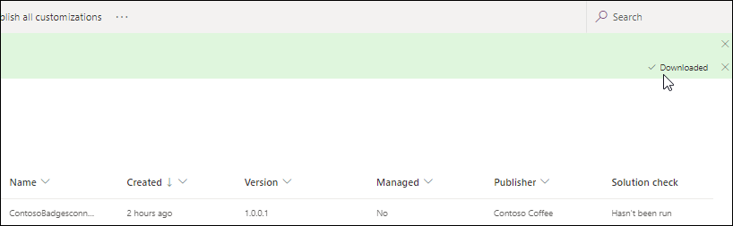

# Lab 03 - Custom connector for existing API

## Table of Contents

Lab Scenario 

1. Exercise 1 - Create Solution 

    - Task 1: Create solution 

2. Exercise 2 – Create Custom Connector 

    - Task 1: Download open API definition and create connector 

    - Task 2: Modify the definition 

    - Task 3: Test connector 

3. Exercise 3 – Add Custom Code 

    - Task 1: Add code from resource folder 

    - Task 2: Test custom code 

4. Exercise 4 – Test Custom Connector 

    - Task 1: Test connector from canvas app

    - Task 2: Test connector from flow 

5. Exercise 5 – Promote Solution to Test Environment 

    - Task 1: Export solution. 

    - Task 1: Import solution 

    - Task 2: Test connector 

### Lab Scenario

Working as part of the PrioritZ fusion team you will be configuring a custom connector for an existing
API. The team would like to add badging to the PrioritZ application to give credit to users when they
have completed ranking an item. The team identified an existing API, but it doesn't have a Power
Platform connector.

When you review the API, you see that it has four operations and uses API key authentication.


 

## Exercise 1 - Create Solution

In this exercise, you will create a solution for Contoso Badges custom connector. Currently, custom
connectors must be in a separate solution from the apps and flows that use them.

### Task 1: Create solution

1. Navigate to Power Apps maker portal and make sure you are in your dev environment. 

         https://make.powerapps.com 

2. Select **Solutions** and click **+ New solution**.

3. Enter **Contoso Badges connector** for Display name, select **Contoso Coffee** for Publisher, and
    click **Create**.
   
   

## Exercise 2 – Create Custom Connector

In this exercise, you will create a custom connector from an existing API.

### Task 1: Download open API definition and create connector

1. Navigate to Contoso Coffee Badges (contosobadgestest.azurewebsites.net)
2. Click on open the **Open API definition file** link.
   
    

3. Do a quick review of the Open API definition.
4. Right click on the page and select **Save as**.
      
     

5. Save the **swagger.json** file on your machine.
6. Navigate to Power Apps  maker portal and make sure you are in your dev environment.

         https://make.powerapps.com

7. Select **Solutions** open the **Contoso Badges connector** solution you created.
8. Click **+ New | Automation** and select **Custom connector**.
     
     


9. Enter **Badges connector** for Connector name, **Connector for badges** for Description,
    **contosobadgestest.azurewebsites.net** for Host, and click **Create connector**.
    
    

10. Select **Custom connectors** from the sitemap.
11. Click on the **... More actions** button of the custom connector you created and select **Update**
    **from Open API file**.

      

12. Click **Import**.
13. Select the **swagger.json** file you saved to your machine and click **Open**.
14. Click **Continue**.
    
    

15. Enter **Connector for badges** for Description, **contosobadgestest.azurewebsites.net** for Host,
    and advance to **Security**.
      
      

16. Review the security configuration and advance to **Definition**.
17. Do not navigate away from this page.

### Task 2: Modify the definition

1. Select the **AddCredit** action.
2. Select **Important** for Visibility.
    
     

3. Scroll down to the **Request** section, click on the chevron button of the **body** and select **Edit**.
     
     

4. Scroll down and Click on the chevron button of **points** and select **Edit**.
    
    

5. Select **Yes** for Is required and click on the  **Back** button.
     
     

6. Click on the chevron button of **recipientid** and select **Edit**.
7. Select **Yes** for Is required and click on the  **Back** button.
8. Click on the chevron button of **name** and select **Edit**.
9. Select **Yes** for Is required and click on the  **Back** button.
10. Click on the  **Back** button again.

      

11. Advance to **Code**.
12. Review the code and advance to **Test**.
13. Click **Update connector** and wait for the connector to be updated

     

14. Do not navigate away from this page.

### Task 3: Test connector

1. Open a new browser tab or window and navigate to Contoso Coffee Badges 
     
 ```
 https://contosobadgestest.azurewebsites.net/
 
 ```

2. Click on open the **API Key** link
    
     

3. Copy the **API Key**. Save this key you will use it multiple times.
4. Go back to the connector test page and click **+ New Connection**.
    
     

5. Paste the **API Key** you copied and click **Create connection**.
   
    

6. Click on the **Refresh** connections button.
   
    


7. The connection you created should get selected.
8. Go to the **AddCredit** operation.
9. Enter your email address for recipientid, enter your name for name, enter **1** for points, and click
    **Test operation**.
    
    

10. The test should succeed, and the response should look like the image below.
     
     


11. Select the **GetRecipient** operation.
12. Provide your email address as the id and click **Test operation**.
      
     

13. The test should succeed, and you should get expected response.

14. Go ahead and test the ListBadges and ListRecipients operations.
15. All the tests should succeed.
  
  


## Exercise 3 – Add Custom Code

In this exercise, you will add a new operation to only return the current badge name and image URL.
You will do this by using the custom code feature to reshape the response from the API.

### Task 1: Add code from resource folder

1. Navigate to Power Automate
           https://powerplatform.microsoft.com/en-us/power-automate/)

2. Expand **Data** and select **Custom connectors**.


3. Click the **Edit** button of the custom connector you created.

    

4. Select the **Definition** tab and click **New action**.
  
    

5. Enter **Get current badge** for Summary, **Get current badge** for Description, and **getcurrentbadge**
    for Operation ID.
    
    

6. Scroll down to the **Request** section and click **+ Import from sample**.
    
    

7. Select Get for Verb, enter
                https://contosobadgestest.azurewebsites.net/getcurrentbadge?id={id} 
     for URL, and click
    Import.


  

8. Click **Update connector** and wait for the connector to be updated.
9. Select the **Code** tab.
10. Enable **Code** and click **Upload**.
    
     

11. Select the **CustomConnectorCode.csx** file located in the lab resources folder and click **Open**.
12. Select the **getcurrentbadge** action.
     
     

13. Review the code you just added.
14. Click **Update connector** and wait for the connector to be updated.
15. Advance to **Test**.
16. Select the **getcurrentbadge** action.
17. Provide your email address as id and click **Test operation**.
     
     


18. The test should succeed, and you should get current badge for the user you created.
    
    

19. Copy the Response **Body** JSON.

20. Select the Definition tab.

21. Select the **getcurrentbadge** action.
     
      

22. Scroll down to the **Response** section and click **+ Add default response.**
 
      


23. Paste the JSON you copied in the **Body** and click **Import**.
     
     

24. Click **Update connector** and wait for the connector to be updated.
25. **Do not** navigate away from this page.

### Task 2: Test custom code

In this task, you will test your custom code.

1. Select the **Test** tab.
2. Select the connection you created earlier.


3. Go to the **Operations** section and select the **getcurrentbadge** operation.
4. Provide your email as **id** and click **Test operation**.
   
     

5. The operation should succeed, and the response **Body** should look like the image below.
    
    

## Exercise 4 – Test Custom Connector

In this exercise, you will test the custom connector you created using a flow and a canvas application.

### Task 1: Test connector from canvas app

In this task, you will use the custom connector you created to show the user’s current badge on the
PrioritZ Ask canvas application.

1. Navigate to Power Apps  maker portal and make sure you are in your dev environment.
          https://make.powerapps.com

2. Expand **Solutions** and open the **PrioritZ** solution.
3. Select **Apps** , select the **PrioritZ Ask** application, and click **Edit**.
 
     

4. Select **Data** from the left and click **+ Add data.**
     
     

5. Expand **Connectors** and select the **Badges connector** you created.
    
    


6. Click **+ Add a connection**.
7. Open a new browser tab or window and navigate to Contoso Coffee Badges
    (contosobadgestest.azurewebsites.net)
    
```
https://contosobadgestest.azurewebsites.net/
 
```
    
8. Click on open the **API Key** link
     
    

9. Copy the **API Key**. Keep this API Key in a notepad, you will need it again.
10. Go back to the app designer, paste the **API Key** you copied, and click **Connect**.
     
     


11. Select the **Tree view**.
12. Select the **Components** tab, go to the **Insert** tab, click **Media** , and then select **Image**.
     
     

13. Change the Image name to **User badge**.
    
     


14. Set the User badge **Image** value to the formula below.

```
ContosoBadges.getcurrentbadge({id:User().Email}).image
```


15. Set the Tooltip value of the User badge to the formula below.

```
ContosoBadges.getcurrentbadge({id:User().Email}).name
```
16. Make the image smaller and move it to top right corner of the screen.
17. The User badge should now look like the image below.
      
     

18. Select **Screens** tab in the Tree view. Click **Play** button.
19. Hover over the badge to see the badge name.
      
      

20. Close the preview.
21. Click **File** and select **Save**.
22. Select **Publish**.
23. Select **Publish this version**.
24. Go back to the solution by clicking on the  **Back** button.
     
      

25. Do not navigate away from this page.

### Task 2: Test connector from flow

1. Make sure you are still in the **PrioritZ** solution.
2. Click **+ New** and select **Automation | Cloud flow | Instant**.

    

3. Enter **Test add credit** for flow name, select **Manually trigger a flow** , and click **Create**.
     
    .png)

4. Click **+ New step**.
5. Select the **Custom** tab and then select the **Add credit** action.
   
    .png)
    
6. Enter **Test connection** , paste the **API Key** you copied earlier, and click **Create**.
  
    .png)

7. Click on the **recipientId** field, go to the Dynamic content pane, and select **User email**.
    
     

8. Click on the **name** field, go to the Dynamic content pane, and select **User name**.
9. Enter **1** for points and click **Save**. Wait for the flow to be saved.
   
     

10. Click **Test**.
11. Select **Manually** and click **Test** again.


12. Click **Continue**.
13. Click **Run flow**.
14. Click **Done**.
15. The flow run should succeed.
16. Click on the  back button.
    
     

17. Select **Cloud flows** and open the flow you created.
     
     

18. Start a new browser window and navigate to Power Apps maker portal.
19. Make sure you are the correct environment.
20. Select **Apps** and launch the **PrioritZ Ask** application.
21. The application should now show **First Badge**.
  
     

22. Go back to flow and run it couple more times.
23. Go back to the **PrioritZ Ask** application and refresh the page.
24. You should now see the **Team Player** badge.
  
     

25. Go to the flow and run it two more times.
26. Go back to the **PrioritZ Ask** application and refresh the page.
27. You should now see the **Champ** badge
   
     

## Exercise 5 – Promote Solution to Test Environment

In this exercise, you will export the export the Contoso Badges connector solution from the Dev
environment and import it to Test environment.

###  Task 1: (i) Export solution.

1. Navigate to Power Apps  maker portal and make sure you are in your dev environment.

         https://make.powerapps.com

2. Select **Solutions**.
3. Select the **Contoso Badges connector** solution and click **Export**.
   
     

4. Click **Publish** and wait for the publishing to complete.
5. Click **Next**.
6. Select **Managed** and click **Export**.
7. Wait for the solution to be exported.
8. Click Download button Right side top of the screen ,Click Download Solution.
 
    

###  Task 1: (ii) Import solution

1. Navigate to Power Apps  maker portal and select your **Test** environment.

         https://make.powerapps.com

2. Select **Solutions**.
3. Click **Import**.
    
     

4. Click **Browse**.
5. Select the solution you exported from the Dev environment and click **Open**.
6. Click **Next**.
7. Click **Import** and wait for the import to complete.
8. The solution should import successfully.
9. **Do not** navigate away from this page.

### Task 2: Test connector

1. Click to open the solution you just imported.
2. Click to open the **Badges connector**.
  
     


3. Click **Edit**.
4. Select the **Test** tab.
   
     

5. Click **+ New connection**.
6. Start a new browser window or tab and navigate to Contoso Coffee Badges
    (contosobadgestest.azurewebsites.net)
```
https://contosobadgestest.azurewebsites.net/
```

7. Click on the **Get an API Key** link.
  
     

8. Copy the **API Key.**
9. Go back to the connector editor, paste the API Key you copied and click **Create connection**.
   
     

10. Click **Refresh** connections.
     
      

11. Go to the **Operations** section and select the **addcredit** operation.
12. Provide your email for **recipientid** , provide a **name** , enter **1** for **points** , and click **Test operation**.
     
     

13. The test should succeed, and the response should look like the image below.
      
      

14. You may **test** the rest of the operations.


