# Lab 03 - Custom connector for existing API

## Estimated Duration: 110 Minutes

In this lab, you will configure a custom connector for an existing API to add a badging feature to the PrioritZ application, allowing users to receive credit when they complete ranking an item. You will begin by creating a Dataverse database and a new solution, then build a custom connector using an Open API definition. After modifying and testing the connector, you will add custom code to enhance its functionality and test it again. Finally, you will integrate the connector with both a canvas app and a flow, enabling the PrioritZ app to display user badges and update them based on user actions. Through these exercises, you will gain hands-on experience in creating, customizing, and using custom connectors within the Power Platform.

## Lab Objectives

- Exercise 1: Create Database in Default Environment 
- Exercise 2: Create Solution 
- Exercise 3: Create Custom Connector 
- Exercise 4: Add Custom Code 
- Exercise 5: Test Custom Connector 

## Exercise 1 - Create Database in Default Environment 

In this exercise, you will create a Dataverse database in the test environment, which will be used to import the solution in the next exercises.

When you review the API, you see that it has four operations and uses API key authentication.

 

### Task 1: Create Database 

1. Navigate to the Power Apps maker portal.

   ```
   https://make.powerapps.com
   ```

1. Click on **Environment (1)** and select the pre-created development environment named **Azure HOL xxxx (default) (2)**

    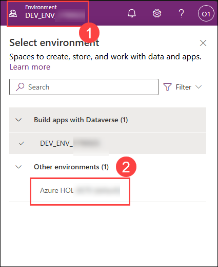

2. Select **Solutions (1)** from the left-hand side menu of Power Apps, click on **Create a database (2)**

    

4. Select **Currecny -> TND and Language -> English(1)** and click on **Create my database (2)**.

    
    
    >**Note:** You can leave this browser tab open and continue with the next exercise, as Dataverse database creation will take some time.

## Exercise 2 - Create Solution

In this exercise, you will create a solution for the Contoso Badges custom connector. Currently, custom connectors must be in a separate solution from the apps and flows that use them.

### Task 1: Create a solution

1. Open a new browser tab and navigate to the Power Apps maker portal and select **Environments (1)**, make sure you are in your dev environment named **DEV_ENV_<inject key="Deployment ID" enableCopy="false" /> (2)**. 

   ```
   https://make.powerapps.com
   ```

   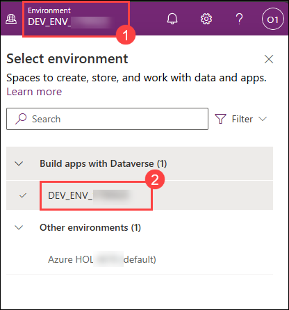

2. Select **Solutions** and click **+ New solution**.

    

3. Enter **Contoso Badges connector (1)** for Display name, select **Contoso Coffee (ContosoCoffee) (2)** for Publisher, and click **Create (3)**.
   
   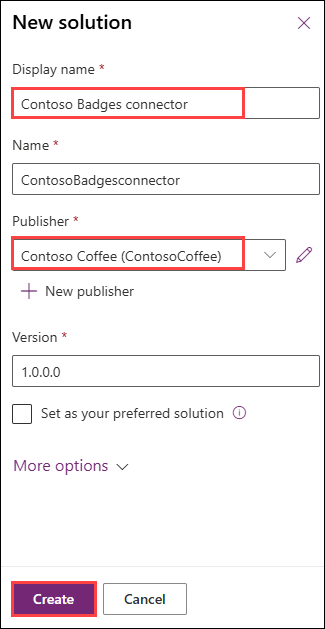

> **Congratulations** on completing the task! Now, it's time to validate it. Here are the steps:
> - If you receive a success message, you can proceed to the next task.
> - If not, carefully read the error message and retry the step, following the instructions in the lab guide.
> - If you need any assistance, please contact us at cloudlabs-support@spektrasystems.com. We are available 24/7 to help you out.
 
<validation step="2be455a2-0037-48b9-83b9-d3efb66743e9" />

## Exercise 3 – Create Custom Connector

In this exercise, you will create a custom connector from an existing API.

### Task 1: Download the open API definition and create a connector

1. Navigate to the URL below to open the Contoso Coffee Badges API.

   ```
   https://contosobadgestest.azurewebsites.net/
   ```

1. Click on the **Open API definition file** link.
   
    

3. Do a quick review of the Open API definition.

4. Right-click on the page select **Save as** or use **Ctrl + S** and name the file as **swagger.json** in your machine. Now, close the browser tab by clicking on **X**.
      
     

   >**Note:** If you're having trouble saving the file, copy the code and paste it into Notepad, then save the file as **swagger.json**.

5. Navigate to the Power Apps maker portal and select **Environments (1)**, make sure you are in your dev environment named **DEV_ENV_<inject key="Deployment ID" enableCopy="false" /> (2)**. 

   ```
   https://make.powerapps.com
   ```

    

6. Select **Solutions (1)** open the **Contoso Badges connector (2)** solution you created.

     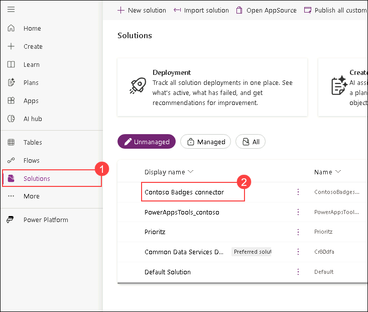

7. Click **+ New (1) | Automation (2)** and select **Custom connector (3)**.
     
     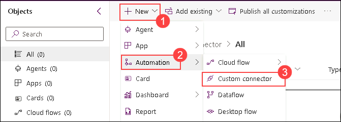

8. Enter the following information on the **Create Connector** blade.

     1. Connector name: **Badges connector (1)** 
     2. Description: **Connector for contosobadgestest (2)**
     3. Host: **contosobadgestest.azurewebsites.net (3)** and 
     4. click **Create connector (4)**.
    
    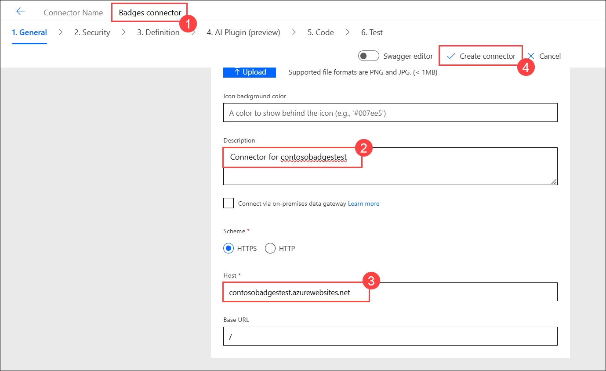

    >**Note:** If prompted to sign in, use the ODL credentials found in the environment tab located to the right of the Lab guide.

9. Select **Custom connectors (1)** from the sitemap. Click on the **... More actions (2)** button of the custom connector you created and select **Update from Open API file (3)** 

      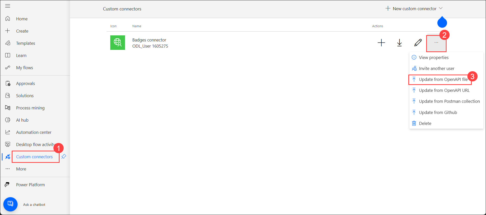

10. Click **Import** to select the API file.

      

11. Select the **swagger.json (2)** file you saved to your machine **(1)** and click **Open (3)**.

    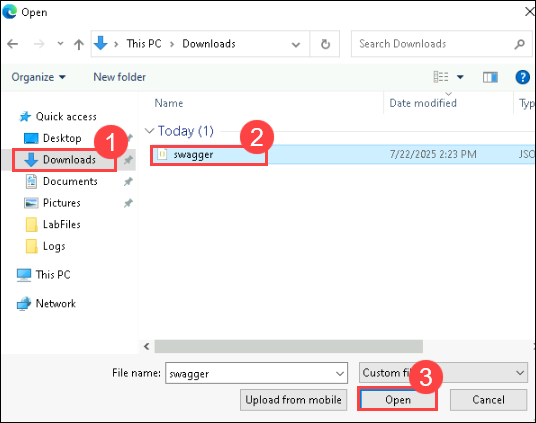
    
12. Click **Continue** on the **Import an OpenAPI file** pop-up.
    
    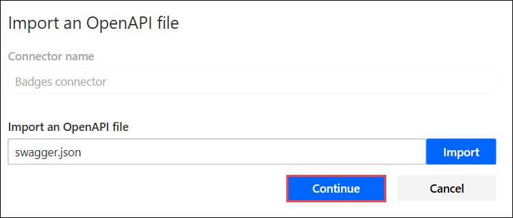

13. Enter **Connector for contosobadgestest (1)** for Description, **contosobadgestest.azurewebsites.net (2)** for Host, and advance to **Security (3)**.
      
      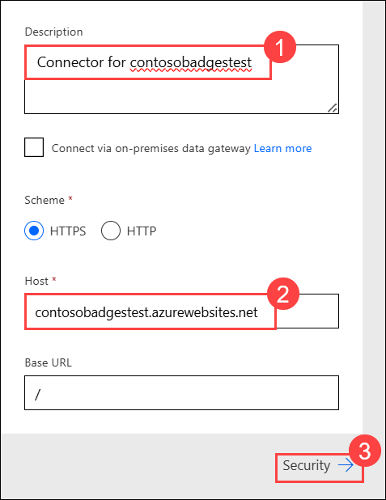

14. Review the **security configuration (1)** and advance to **Definition (2)**.

      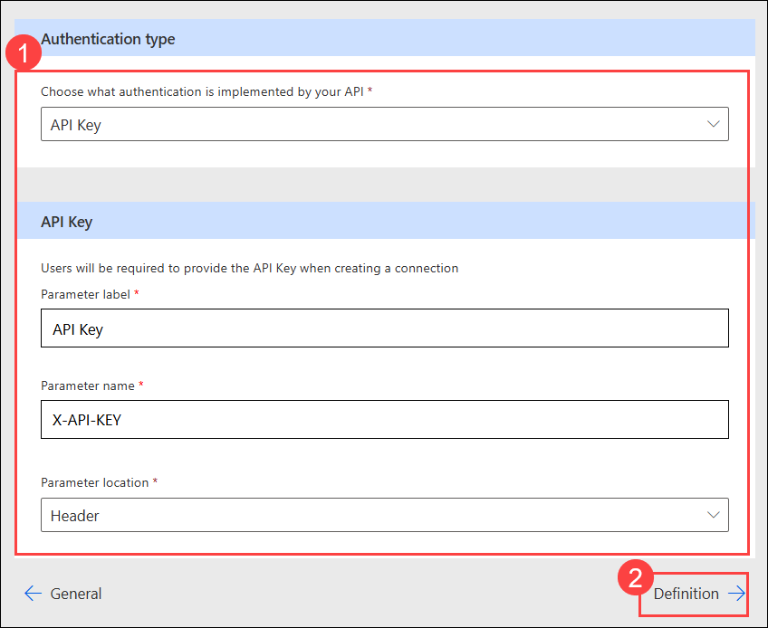

15. Do not navigate away from this page.

### Task 2: Modify the definition

1. Select the **AddCredit (1)** action then **Important (2)** for Visibility.
    
     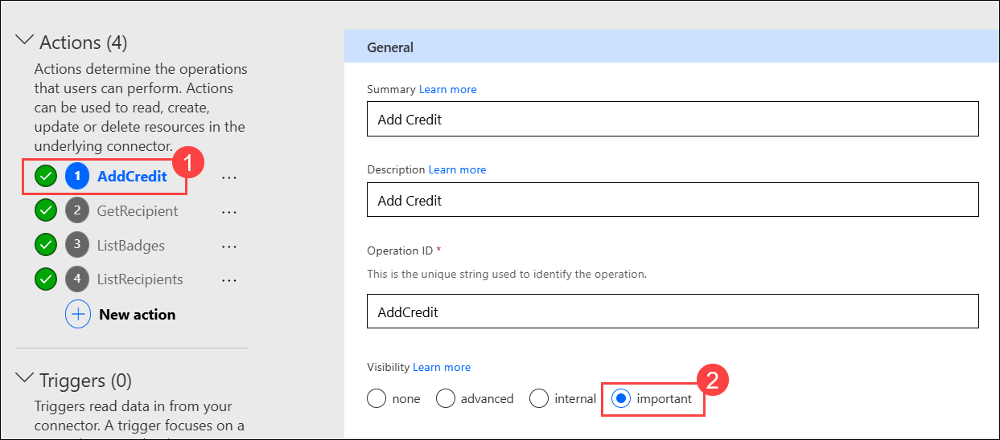

3. Scroll down to the **Request** section, click on the chevron button of the **body** and select **Edit**.
     
     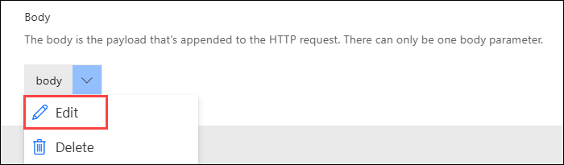

4. Scroll down and click on the chevron button of **points** and select **Edit**.
    
    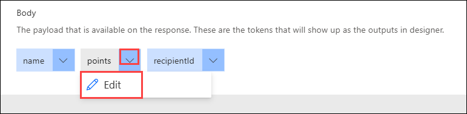

5. Select **Yes (1)** for Is required and click on the **Back (2)** button.
     
     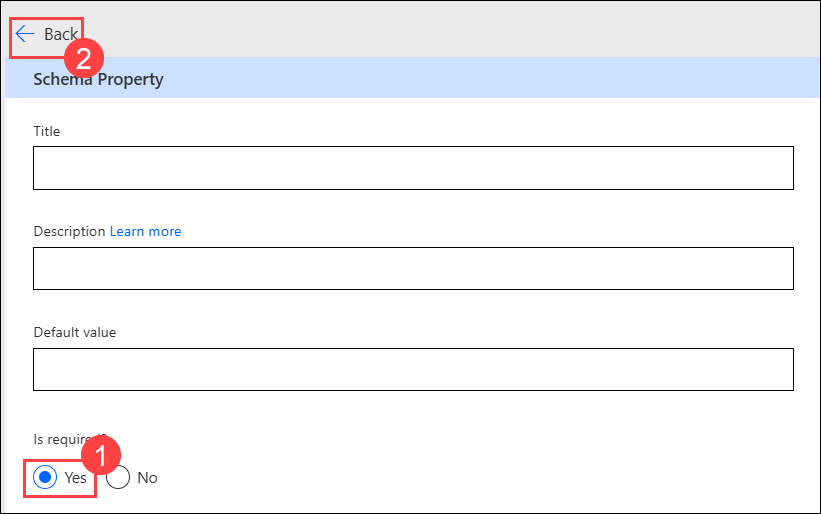

6. Click on the chevron button of **recipientid** and select **Edit**.

     

7. Select **Yes** for Is required and click on the **Back** button.

     

8. Click on the chevron button of **name** and select **Edit**.

     

9. Select **Yes** for Is required and click on the **Back** button.

     

10. Verify that all 3 payloads are displaying `*` on them and click on the **Back** button again.

      

11. Advance to **AI Plugin(preview) (1)**.

      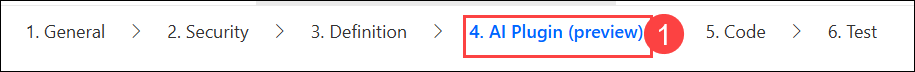

12. Advance to **Code**.
 
13. Review the code and advance to **Test**.

      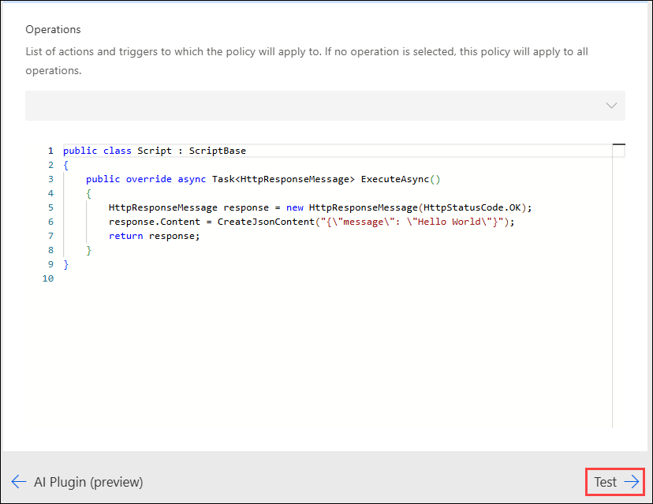

14. Click **Update connector** and wait for the connector to be updated.

     

15. Do not navigate away from this page.

### Task 3: Test connector

1. Open a new browser tab or window and navigate to the URL below to open the Contoso Coffee Badges API.

    ```
    https://contosobadgestest.azurewebsites.net/
    ```

2. Click on the **API Key** link.
    
   

3. Copy the **API Key** value and save it to Notepad, as you will be using this value in the next steps. Now, close the browser tab by clicking on **X**.

4. Go back to the connector test page and click **+ New connection**.
    
     

5. Paste the **API Key (1)** you copied in **step 3** of this task and click **Create connection (2)**.
   
    

6. Click on the **Refresh** connections button.
   
    

7. The connection you created should be selected.

8. Go to the **AddCredit ** operation. **Enter your email address for recipientid (1)**, **enter your name for name (2)**, **enter **1** for points (3)**, and click **Test operation (4)**.
    
    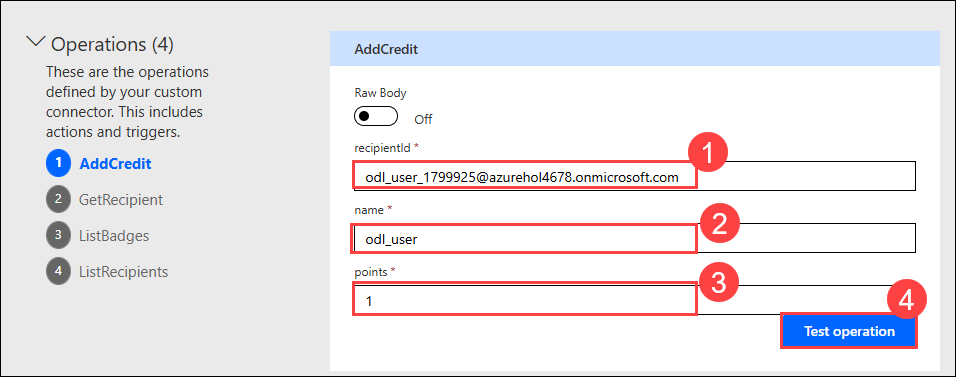

9. The test should succeed, and the response should look like the image below.
     
     

11. Select the **GetRecipient** operation.

12. Provide your email address as the ID and click **Test operation**.
      
     

13. The test should succeed, and you should get the expected response.

14. Go ahead and test the **ListBadges** and **ListRecipients** operations. Leave the options blank and click on **Test operation**.

     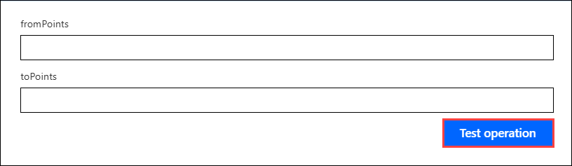

15. All the tests should succeed.
  
     

> **Congratulations** on completing the task! Now, it's time to validate it. Here are the steps:
> - If you receive a success message, you can proceed to the next task.
> - If not, carefully read the error message and retry the step, following the instructions in the lab guide.
> - If you need any assistance, please contact us at cloudlabs-support@spektrasystems.com. We are available 24/7 to help you out.
 
<validation step="e9892770-5284-40d8-a6a1-28f85d7e051f" />

## Exercise 4 – Add Custom Code

In this exercise, you will add a new operation to only return the current badge name and image URL.
You will do this by using the custom code feature to reshape the response from the API.

### Task 1: Add code from the resource folder

1. Open a new browser tab and navigate to the Power Automate using the URL below. Select **Environments (1)**, make sure you are in your dev environment named **DEV_ENV_<inject key="Deployment ID" enableCopy="false" /> (2)**.
          
   ```
   https://make.powerautomate.com
   ```

     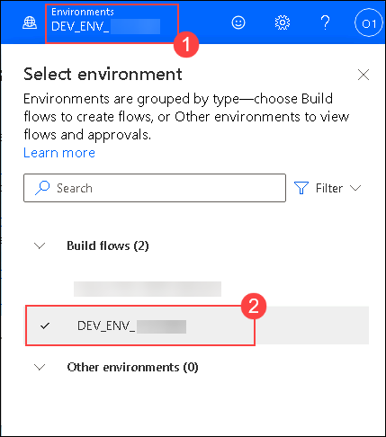

2. Click on **More (1)** and select **Discover All (2)**.

   

3. Under **Data (1)** and select **Custom connectors (2)**.

   

4. Click the **Edit** button of the custom connector you created.

    

5. Select the **Definition (1)** tab from the dropdown and click **New action (2)** in the definition tab.
  
    

6. Enter the following information to add the **Get current badge** action.

     1. Summary: **Get current badge (1)**
     2. Description: **Get current badge (2)** 
     3. Operation ID: **getcurrentbadge (3)**
    
   

7. Scroll down to the **Request** section and click **+ Import from sample**.
    
    

8. Select **Get (1)** for Verb, enter the below value for **URL (2)**, and click **Import (3)**.
   
   ```
   https://contosobadgestest.azurewebsites.net/getcurrentbadge?id={id}
   ```

    

10. Click **Update connector** and wait for the connector to be updated.

     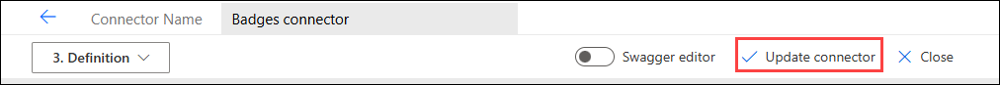

11. Select the **Code** tab from the dropdown.
  
     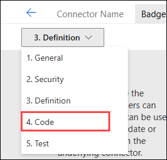

12. Enable **Code (1)** and click **Upload (2)**.
    
     

13. Navigate to `C:\LabFiles\Developer-in-a-day\Student\L03 - Custom connector for existing API\Resources` **(1)**, Select the **CustomConnectorCode.csx (2)** file located in this path and click **Open (3)**.

     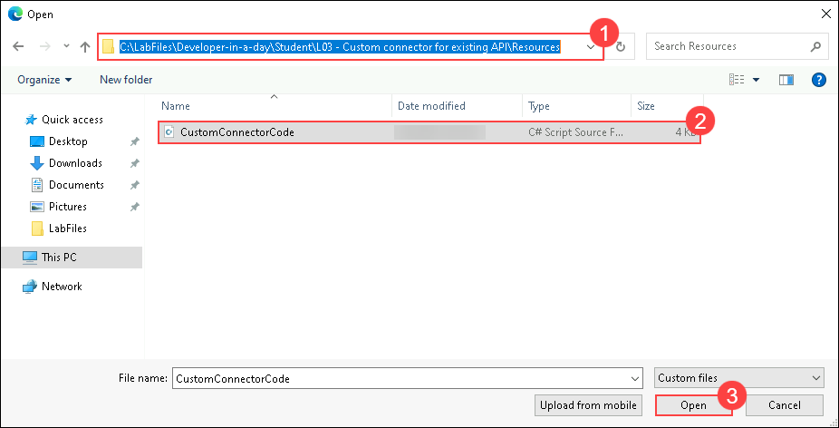

14. Select the **getcurrentbadge** action from the dropdown.
     
     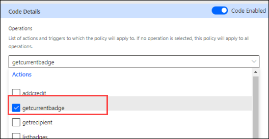

15. Review the code you just added.

16. Click **Update connector** and wait for the connector to be updated.

17. Advance to **Test** by selecting it in the dropdown.

     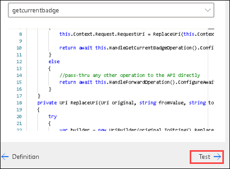

18. Select the **getcurrentbadge** action.

19. Provide your email address as ID and click **Test operation**.
     
     

20. The test should succeed, and you should get a current badge for the user you created.
    
    

     > **Note:** If the test operation fails, try updating the connector, then test the connector by performing Steps 15-18 again.

21. Copy the Response **Body** JSON.

22. Select the **Definition** tab from the dropdown.

23. Select the **getcurrentbadge** action.
     
      

24. Scroll down to the **Response** section and click **+ Add default response**.
 
      

25. Paste the JSON you copied in the **Body (1)** and click **Import (2)**.
     
     

26. Click **Update connector** and wait for the connector to be updated.

27. **Do not** navigate away from this page.

### Task 2: Test custom code

In this task, you will test your custom code.

1. Select the **Test** tab.

2. Select the connection you created earlier.

1. Go to the **Operations** section and select the **getcurrentbadge (1)** operation. Provide your email as **id (2)** and click **Test operation (3)**.
   
     

5. The operation should succeed, and the response **Body** should look like the image below.
    
    

## Exercise 5 – Test Custom Connector

In this exercise, you will test the custom connector you created using a flow and a canvas application.

### Task 1: Test connector from canvas app

In this task, you will use the custom connector you created to show the user’s current badge on the PrioritZ Ask canvas application.

1. Open a new browser tab and navigate to the **Power Apps** maker portal using the below URL if not already open and select **Environments (1)**, make sure you are in your dev environment named **DEV_ENV_<inject key="Deployment ID" enableCopy="false" /> (2)**. 

   ```
   https://make.powerapps.com
   ```

    

2. Expand **Solutions (1)** and open the **PrioritZ (2)** solution.

     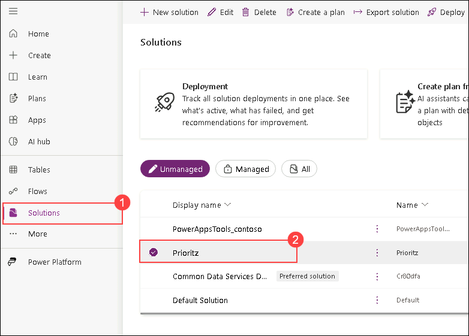

3. Select **Apps (1)** , select the **PrioritZ Ask (2)** application, and click **Edit (3)**.
 
     

      >**Note:** Click on **Open app** if prompted.

4. Select **Data (1)** from the left and click **+ Add data (2)**.

     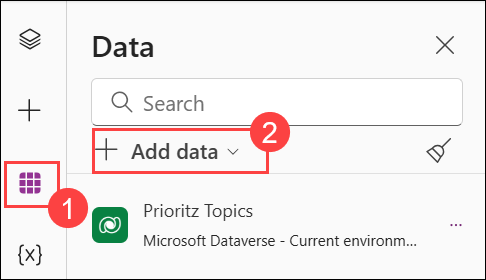

5. Expand **Connectors** and select the **Badges connector** you created.
    
    

6. Click **+ Add a connection**.

    

7. Open a new browser tab or window and navigate to the URL below to open the Contoso Coffee Badge API.
    
    ```
    https://contosobadgestest.azurewebsites.net/ 
    ```
    
8. Click on the **open the API Key** link
     
    

9. Copy the **API Key** value and paste the value into Notepad, as you will be using this value in the next steps. Now, close the browser tab by clicking on **X**.

     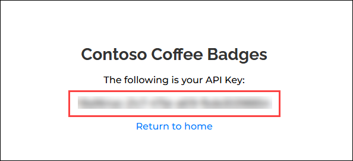 

10. Go back to the app designer, paste the **API Key (1)** you copied in the previous step, and click **Connect (2)**. Click **Got it** if any pop-up appears with the title Premium.
     
     

      >**Note:** If you're not prompted to enter an API key, please ignore.

11. Select the **Tree view**.

12. Select the **Screens (1)** tab, go to the **Insert (2)** tab, click **Media** , and then select **Image (3)**.
     
     

13. Double-click on the newly added image and change its name to **User badge**.
    
     

14. Set the User badge **Image** value to the formula below.

    ```
    ContosoBadges.getcurrentbadge({id:User().Email}).image
    ```
    
    

15. Set the **Tooltip** value of the User badge to the formula below.

    ```
    ContosoBadges.getcurrentbadge({id:User().Email}).name
    ```
    
    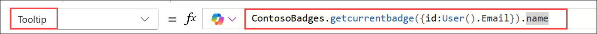

16. Make the image smaller and move it to the top right corner of the screen.

17. The User badge should now look like the image below.
      
     

18. Select the **Screens** tab in the Tree view. Click the **Play** button.

19. Hover over the badge to see the badge name.
      
      

20. Close the preview.

1. Select **Publish**.

     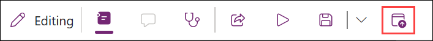

23. Select **Publish this version**.

24. Go back to the solution by clicking on the **Back** button.
     
      

25. Do not navigate away from this page.

### Task 2: Test connector from the flow

1. Go to **Solutions (1)** and click on **Prioritz (2)**.

    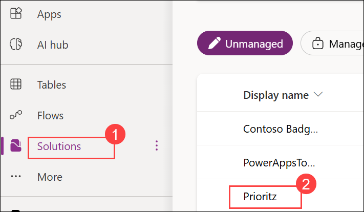

2. Click **+ New (1)** and select **Automation (1) | Cloud flow (2) | Instant (3)**.

    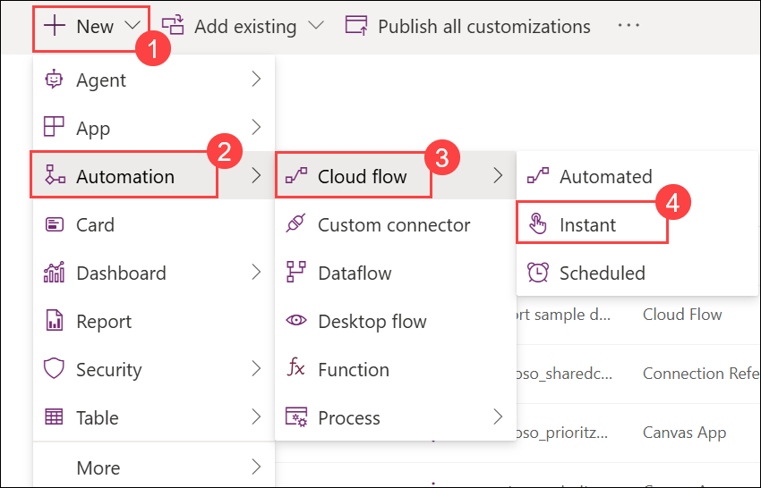

3. Enter **Test add credit (1)** for flow name, select **Manually trigger a flow (2)** , and click **Create (3)**.
     
    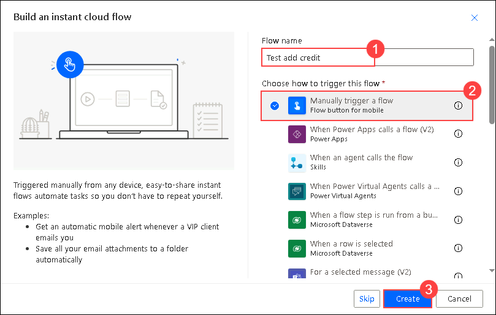

    >**Note:** If you cannot see the **Create** button, click on the **ellipsis** button located in the top right corner of the webpage and adjust the zoom to **90%**.

     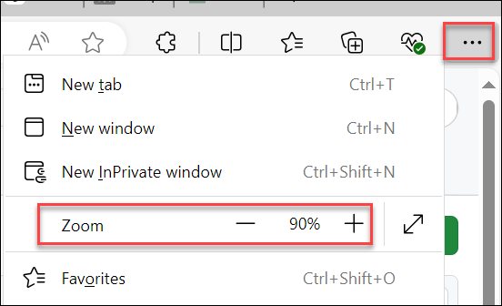
     
4. Click **+ New step**.

    

5. Select the **Custom (1)** tab and then select the **Add credit (2)** action.
   
    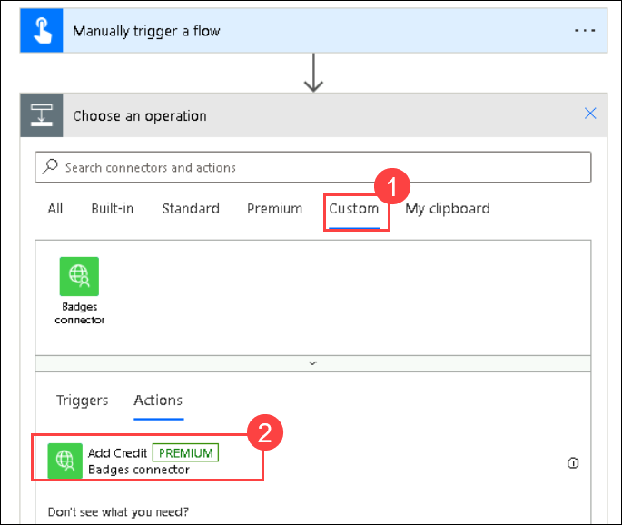
    
6. Enter **Test connection** , paste the **API Key** you copied earlier in **step 9** of **task 1** in this exercise, and click **Create**.
  
    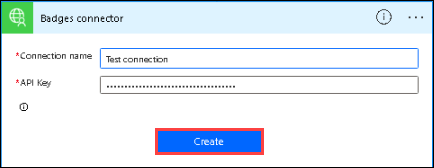

7. Click on the **recipientId** field, under Manually trigger a flow pane, and select **User email**.
    
     

8. Click on the **name** field, under Manually trigger a flow pane, and select **User name**.

9. Enter **1** for points and click **Save**. Wait for the flow to be saved.
   
     

10. Click **Test**.

     

11. Select **Manually** and click **Test** again.

     

12. Click **Continue**.

13. Click **Run flow**.

14. Click **Done**.

15. The flow run should succeed. Once succeeded, click on the **Back** button.
    
     

17. Select **Cloud flows** and open the flow you created.
     
     

18. Navigate to the **Power Apps** maker portal using the URL below if not already open, and make sure you are in your dev environment.

     ```
     https://make.powerapps.com
     ```

19. Select **Apps** and launch the **PrioritZ Ask** application.

20. The application should now show **First Badge** and refresh the page.
  
     

21. Go back to the flow and run it two more times.

     

22. Go back to the **PrioritZ Ask** application and refresh the page.

23. You should now see the **Team Player** badge.
  
     

24. Go to the flow and run it two more times.

25. Go back to the **PrioritZ Ask** application and refresh the page.

26. You should now see the **Champ** badge
   
     

## Summary

In this lab, you learned to create and modify a custom connector using an Open API definition, test its functionality, and integrate it with canvas apps and flows within the Power Platform.

### You have successfully completed this lab. Click the Next button to proceed to the next lab.
