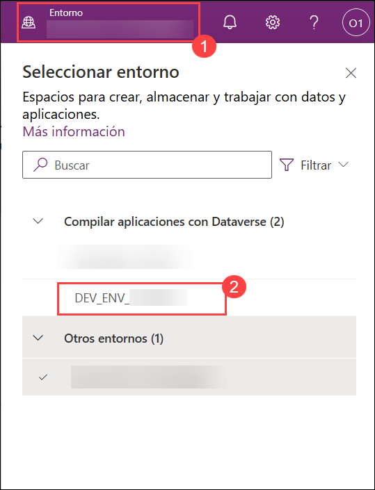
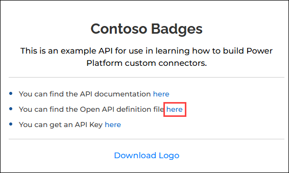
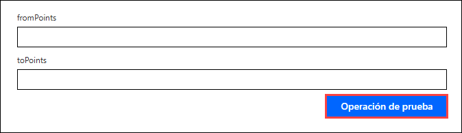
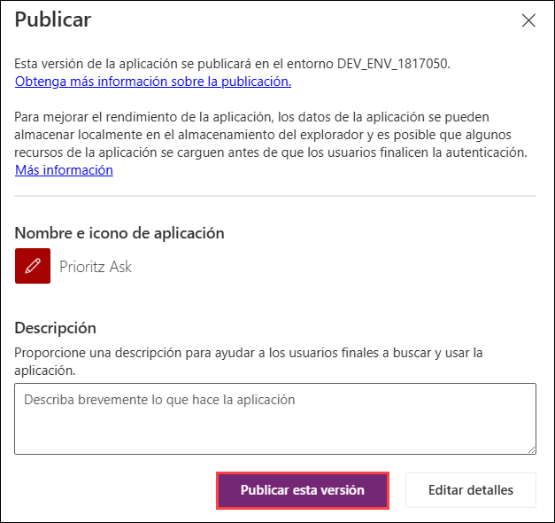
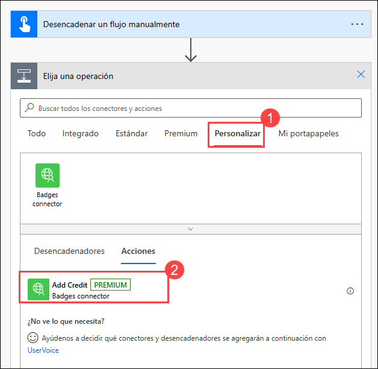

# Laboratorio 03 - Conector personalizado para API existente

## Duración Estimada: 110 minutos

Como parte del equipo de fusión de PrioritZ, configurará un conector personalizado para una API existente. El equipo desea agregar una insignia a la aplicación PrioritZ para dar crédito a los usuarios cuando hayan terminado de clasificar un elemento. El equipo identificó una API existente, pero no tiene un conector de Power Platform.

## Objetivos del Laboratorio

- Ejercicio 1: Crear Base de Datos en el Entorno Predeterminado 
- Ejercicio 2: Crear Solución 
- Ejercicio 3: Crear Conector Personalizado 
- Ejercicio 4: Añadir Código Personalizado 
- Ejercicio 5: Probar Conector Personalizado 

## Ejercicio 1: Crear Base de Datos en el Entorno Predeterminado

En este ejercicio, creará una base de datos de Dataverse en el entorno de prueba, que se utilizará para importar la solución en los próximos ejercicios.

Cuando revise la API, verá que tiene cuatro operaciones y utiliza autenticación mediante una clave de API.


 

### Tarea 1: Crear Base de Datos

1. Navegue al portal de creadores de Power Apps.

         https://make.powerapps.com

1. Haga clic en **Environment (1)** y seleccione el entorno de desarrollo creado previamente llamado **Azure HOL - xxxxxx (default) (2)**.

     

1. Seleccione **Soluciones (1)** en el menú del lado izquierdo de Power Apps. Haga clic en **Creae una base de datos (2)** para crear una base de datos de Dataverse.
 
    

1. Seleccione **Moneda -> TND** y haga clic en **Creae una base de datos (2)**.
   
    
    
    >**Nota:** Puede dejar abierta esta pestaña del navegador y continuar con el próximo ejercicio, ya que la creación de la base de datos de Dataverse tomará algún tiempo.

## Ejercicio 2: Crear Solución

En este ejercicio, creará una solución para el conector personalizado Contoso Badges. Actualmente, los conectores personalizados deben estar en una solución separada de las aplicaciones y los flujos que los usan.

### Tarea 1: Crear una solución

1. Abra una nueva pestaña del navegador y navegue hasta el portal de creación de Power Apps y seleccione **Entornos (1)**, asegúrese de estar en su entorno de desarrollo llamado **DEV_ENV_<inject key="Deployment ID" enableCopy="false" /> (2)**.

         https://make.powerapps.com 

    

1. Seleccione **Soluciones (1)** y haga clic en **+ Nueva solución (2)**.

    

1. Escriba **Contoso Badges connector (1)** como Nombre para mostrar, seleccione **Contoso Coffee (2)** como Editor y haga clic en **Crear (3)**.
   
   

> **Felicidades** por completar la tarea! Ahora, es el momento de validarlo. Estos son los pasos:
> - Presione el botón Validar para la tarea correspondiente. Si recibe un mensaje de éxito, puede continuar con la siguiente tarea. 
> - Si no es así, lea atentamente el mensaje de error y vuelva a intentar el paso, siguiendo las instrucciones de la guía de laboratorio.
> - Si necesita ayuda, póngase en contacto con nosotros en cloudlabs-support@spektrasystems.com. Estamos disponibles las 24 horas del día, los 7 días de la semana para ayudar.

<validation step="2be455a2-0037-48b9-83b9-d3efb66743e9" />

## Ejercicio 3: Crear Conector Personalizado

En este ejercicio, creará un conector personalizado a partir de una API existente.

### Tarea 1: Descargar la definición de API abierta y cree un conector

1. Navegue a la siguiente URL para abrir la API Contoso Coffee Badges.

   ```
   https://contosobadgestest.azurewebsites.net/
   ```
1. Haga clic en el enlace **Open API definition file**.
   
    

1. Haga una revisión rápida de la definición de Open API.

1. Haga clic derecho en la página y seleccione **Guardar como** o use **Ctrl + C** y nombre el archivo como **swagger.json** en su equipo. Ahora, cierre la pestaña del navegador haciendo clic en **X**.

     

     >**Nota:** Si tiene problemas para guardar el archivo, copie el código y péguelo en el Bloc de notas, luego guarde el archivo como **swagger.json**.

1. Navegue hasta el portal de creación de Power Apps y asegúrese de estar en su entorno de desarrollo llamado **DEV_ENV_<inject key="Deployment ID" enableCopy="false" />**.

         https://make.powerapps.com

1. Seleccione **Soluciones (1)** y abra la solución **Contoso Badges connector (2)** que creó.

     

1. Haga clic en **+ Nuevo (1) | Automatización (2)** y seleccione **Conector personalizado (3)**.
     
     


1. Ingrese la siguiente información en la hoja **Crear conector**.

     - Nombre del conector: **Badges connector (1)** 
     - Descripción: **Connector for contosobadgestest (2)**
     - Host: **contosobadgestest.azurewebsites.net (3)** 
     - Haga clic en **Crear conector (4)**.
    
        

        >**Nota**: Si se le solicita que inicie sesión, use las credenciales de ODL que se encuentran en la pestaña de ambiente ubicada a la derecha de la guía de laboratorio.

1. Seleccione **Conectores personalizados (1)** en el mapa del sitio. Haga clic en el botón **... Más acciones (2)** del conector personalizado que creó y seleccione **Actualizar desde archivo Open API (3)**

      

1. Haga clic en **Importar** para seleccionar el archivo API.

      

1. Seleccione el archivo **swagger.json** que guardó en su máquina y haga clic en **Abrir**.
    
1. Haga clic en **Continuar** en la ventana emergente **Importar un archivo OpenAPI**.
    
    

1. Ingrese **Connector for contosobadgestest (1)** para Descripción, **contosobadgestest.azurewebsites.net (2)** para Host, y avance a **Seguridad (3)**.
      
      

1. Revise la **configuración de seguridad (1)** y avance a **Definición (2)**.

      

1. No salga de esta página.

### Tarea 2: Modificar la definición

1. Seleccione la acción **AddCredit (1)** y luego **important (2)** para Visibility.
    
     

1. Desplácese hacia abajo hasta la sección **Solicitud (Request)**, haga clic en el botón **body** y seleccione **Editar**.

     

1. Desplácese hacia abajo y haga clic en el botón **points** y seleccione **Editar**.
    
    

1. Seleccione **Sí (1)** para Is required? y haga clic en el botón **Atrás (2)**.
     
     

1. Haga clic en el botón **recipientid** y seleccione **Editar**.

     

1. Seleccione **Sí** para Is required? y haga clic en el botón **Atrás**.

     

1. Haga clic en el botón **name** y seleccione **Editar**.

     

1. Seleccione **Sí** para Is required? y haga clic en el botón **Atrás**.

     

1. Verifique que los 3 elementos del payload muestran `*` en ellos y Haga clic en el botón **Atrás** nuevamente.

      

1. Avance a **Código**
 
1. Revise el código y avance a **Probar**.

      

1. Haga clic en **Actualizar conector** y espere a que se actualice el conector

     

1. No salga de esta página.

### Tarea 3: Probar el conector

1. Abra una nueva pestaña o ventana del navegador y navegue hasta la siguiente URL para abrir la API Contoso Coffee Badges. 
    ```
    https://contosobadgestest.azurewebsites.net/
    ```

1. Haga clic en el enlace para obtener la **API Key**
    
   

1. Copie el valor de la **API Key** y guárdelo en el Bloc de notas, ya que utilizará este valor en los próximos pasos. Ahora, cierre la pestaña del navegador haciendo clic en **X**.

1. Vuelva a la página de prueba del conector y haga clic en **+ Nueva conexión**.
    
     

1. Pegue la **API Key (1)** que copió en el **paso 3** de esta tarea y haga clic en **Crear conexión (2)**.
   
    

1. Haga clic en el botón **Actualizar** conexiones.
   
    

1. La conexión que creó debe estar seleccionada.

1. Vaya a la operación **AddCredit (1)**. Ingrese los siguientes detalles:

     - **recipientId:** **<inject key="AzureAdUserEmail"></inject> (2)**
     - **name:** **odl_user (3)**
     - **points:** **1 (4)**
     - Luego haga clic en **Operación de preueba (5)**

    

1. La prueba debería ser exitosa y la respuesta debe verse como la imagen a continuación.
     
     

1. Seleccione la operación **GetRecipient (1)**. Proporcione su dirección de correo electrónico como ID y haga clic en **Operación de prueba (3)**.

     - **id:** **<inject key="AzureAdUserEmail"></inject>** **(2)** 

     

1. La prueba debería tener éxito y debería obtener la respuesta esperada.

1. Continúe y pruebe las operaciones ListBadges y ListRecipients. Deje las opciones en blanco y haga clic en **Probar operación**.

     

1. Todas las pruebas deberían tener éxito.
  
     

> **Felicidades** por completar la tarea! Ahora, es el momento de validarlo. Estos son los pasos:
> - Presione el botón Validar para la tarea correspondiente. Si recibe un mensaje de éxito, puede continuar con la siguiente tarea. 
> - Si no es así, lea atentamente el mensaje de error y vuelva a intentar el paso, siguiendo las instrucciones de la guía de laboratorio.
> - Si necesita ayuda, póngase en contacto con nosotros en cloudlabs-support@spektrasystems.com. Estamos disponibles las 24 horas del día, los 7 días de la semana para ayudar.

<validation step="e9892770-5284-40d8-a6a1-28f85d7e051f" />

## Ejercicio 4: Añadir Código Personalizado

En este ejercicio, agregará una nueva operación para devolver solo el nombre de la insignia actual y la URL de la imagen.
Para ello, utilizará la función de código personalizado para cambiar la forma de la respuesta de la API.

### Tarea 1: Agregar código desde la carpeta de recursos

1. Navegue hasta Power Automate utilizando la siguiente URL. Seleccione **Environments (1)**, asegúrese de estar en su entorno de desarrollo llamado **DEV_ENV_<inject key="Deployment ID" enableCopy="false" /> (2)**.
          
   ```
   https://make.powerautomate.com
   ```

1. Haga clic en **Más (1)** y seleccione **Descubrir Todo (2)**.

   

1. En **Datos (1)**, seleccione **Conectores personalizados (2)**.

   

1. Haga clic en el botón **Editar** del conector personalizado que creó.

    

1. Seleccione la pestaña **Definición** del menú desplegable y haga clic en **Nueva acción** en la pestaña de definición.
  
    

1. Ingrese la siguiente información para agregar la acción **Get current badge**.

     - Resumen: **Get current badge (1)**
     - Descripción: **Get current badge (2)** 
     - Id. de Operación: **getcurrentbadge (3)**<br/>

     

1. Desplácese hacia abajo hasta la sección **Solicitud (Request)** y haga clic en **+ Importar desde muestra**.
    
    

1. Seleccione **Get (1)** para Verbo, ingrese el valor a continuación para **URL (2)** y haga clic en **Importar (3)**.
   ```
   https://contosobadgestest.azurewebsites.net/getcurrentbadge?id={id} 
   ```

    

1. Haga clic en **Actualizar conector** y espere a que se actualice el conector.

     

1. Seleccione la pestaña **Código**

     

1. Habilite **Código (1)** y haga clic en **Cargar (2)**.
    
     

1. Seleccione el archivo **CustomConnectorCode.csx** ubicado en esta ruta `C:\LabFiles\Developer-in-a-day\Student\L03 - Custom connector for existing API\Resources` y haga clic en **Abrir**.

1. Seleccione la acción **getcurrentbadge** del menú desplegable.
     
     

1. Revise el código que acaba de agregar.

1. Haga clic en **Actualizar conector** y espere a que se actualice el conector.

     

1. Avance a **Probar** seleccionándolo en el menú desplegable.

1. Seleccione la acción **getcurrentbadge**.

1. Proporcione su dirección de correo electrónico como ID y haga clic en **Operación de prueba**.
     
     - **id:** **<inject key="AzureAdUserEmail"></inject>**

     

1. La prueba debería ser exitosa y debería obtener una insignia actual para el usuario que creó.
    
    

     > **Nota**: Si la operación de prueba falla, intente actualizar el conector y luego vuelva a probarlo realizando los pasos 15 a 18.

1. Copie el JSON del **Cuerpo de respuesta**.

    

1. Seleccione la pestaña Definición en el menú desplegable.

    

1. Seleccione la acción **getcurrentbadge**.
     
     

1. Desplácese hacia abajo hasta la sección **Respuesta** y haga clic en **+ Agregar respuesta predeterminada.**
 
     

1. Pegue el JSON que copió en el **Cuerpo (1)** y haga clic en **Importar (2)**.
     
     

1. Haga clic en **Actualizar conector** y espere a que se actualice el conector.

     

1. **No** abandone esta página.

### Tarea 2: Probar código personalizado

En esta tarea, probará su código personalizado.

1. Seleccione la pestaña **Probar**.

     

1. Seleccione la conexión que creó anteriormente.

1. Vaya a la sección **Operaciones** y seleccione la operación **getcurrentbadge (1)**. Proporcione su correo electrónico como **id** y haga clic en **Operación de prueba(3)**.

     - **id:** **<inject key="AzureAdUserEmail"></inject>** **(2)**

     

1. La operación debería tener éxito y el **Cuerpo** de la respuesta debería verse como la imagen a continuación.
    
    

## Ejercicio 5: Probar Conector Personalizado

En este ejercicio, probará el conector personalizado que creó utilizando un flujo y una aplicación de canvas.

### Tarea 1: Probar conector desde la aplicación de canvas

En esta tarea, utilizará el conector personalizado que creó para mostrar la insignia actual del usuario en la aplicación de canvas PrioritZ Ask.

1. Navegue hasta el portal de creación de **Power Apps** utilizando la siguiente URL si aún no está abierto y asegúrese de estar en su entorno de desarrollo.
   ```
   https://make.powerapps.com
   ```
   
1. Expanda **Soluciones** y abra la solución **PrioritZ**.

     

1. Seleccione **Aplicaciones (1)**, seleccione la aplicación **PrioritZ Ask (2)** y haga clic en **Editar (3)**.
 
     

   >**Nota**: Haga click en **Abrir app** si se le indica.

1. Seleccione **Datos (1)** desde la izquierda y haga clic en **+ Agregar datos (2)**
     
     

1. Expanda **Conectores** y seleccione el elemento **Badges connector** que creó.
    
    


1. Haga clic en **+ Agregar una conexión**.

    

1. Abra una nueva pestaña o ventana del navegador y navegue hasta la siguiente URL para abrir la API Contoso Coffee Badge.
    
    ```
    https://contosobadgestest.azurewebsites.net/
 
    ```
    
1. Haga clic en el enlace para abrir la **API Key**
     
    

1. Copie el valor **API Key** y péguelo en el Bloc de notas, ya que utilizará este valor en los próximos pasos. Ahora, cierre la pestaña del navegador haciendo clic en **X**.

1. Regrese al diseñador de aplicaciones, pegue la **API Key (1)** que copió en el paso anterior y haga clic en **Conectar (2)**. Haga clic en **Entendido** si aparece alguna ventana emergente con el título Premium.
     
     

     >**Nota**: Si no se le solicita que ingrese la clave API, ignórelo.

1. Seleccione la **vista de árbol**.

1. Seleccione la pestaña **Pantallas (1)**, vaya a la pestaña **Insertar (2)**, haga clic en **Multimedia (3)** y, a continuación, seleccione **Imagen (4)**.
     
     

1. Haga doble clic en la imagen recién agregada y cambie su nombre a **User badge**.
    
     

1. Establezca el valor **Image** de User badge con la fórmula que se muestra a continuación.

    ```
    ContosoBadges.getcurrentbadge({id:User().Email}).image
    ```
    

1. Establezca el valor Tooltip de User badge con la fórmula que se muestra a continuación.

    ```
    ContosoBadges.getcurrentbadge({id:User().Email}).name
    ```
    

1. Achique la imagen y muévala a la esquina superior derecha de la pantalla.

1. El elemento User badge ahora debería verse como la imagen que se muestra a continuación. Haga clic en el botón **Iniciar**.
      
     

1. Pase el cursor sobre la insignia para ver el nombre de la insignia.

      

1. Cierre la vista previa.

1. Seleccione **Publicar**.

     

1. Seleccione **Publicar esta versión**.

     

1. Vuelva a la solución haciendo clic en el botón **Atrás**.
     
      

1. No salga de esta página.

### Tarea 2: Probar el conector desde el flujo

1. Asegúrese de que todavía se encuentra en la solución **PrioritZ**.

     

1. Haga clic en **+ Nuevo (1)** y seleccione **Automatización (2) | Flujo de nube (3) | Instantáneo (4)**.

    

1. Ingrese **Test add credit (1)** como nombre del flujo, seleccione **Activar manualmente un flujo (2)** y haga clic en **Crear (3)**.
     
    

     >**Nota**: Si no puede ver el botón **Crear**, haga clic en el botón de **puntos suspensivos** ubicado en la esquina superior derecha de la página web y ajuste el zoom al **90%**.

1. Haga clic en **+ Nuevo paso**.

    

1. Seleccione la pestaña **Personalizado (1)** y luego seleccione la acción **Add credit (2)**.
   
    
    
1. Ingrese **Test connection (1)**, pegue la **API Key (2)** que copió anteriormente en el **paso 9** de la tarea 1 de este ejercicio y haga clic en **Crear (3)**.
  
    

1. Haga clic en el campo **recipientId (1)**. En Activar manualmente un panel de flujo, seleccione **User email (2)**.
    
     

1. Haga clic en el campo **name**. En Activar manualmente un panel de flujo, y seleccione **User name**.

1. Ingrese **1** para points y haga clic en **Guardar**. Espere a que se guarde el flujo.
   
     

1. Haga clic en **Probar**.

     

1. Seleccione **Manualmente (1)** y haga clic en **Probar (2)** nuevamente.

     

1. Haga clic en **Continuar**.

1. Haga clic en **Ejecutar flujo**.

1. Haga clic en **Listo**.

1. La ejecución del flujo debería ser exitosa. Una vez que se haya realizado correctamente, haga clic en el botón **Atrás**.
    
     

1. Seleccione **Flujos en la nube** y abra el flujo que creó.
     
     

1. Abra una nueva ventana del navegador y navegue hasta el portal de creación de Power Apps usando la siguiente URL. Asegúrese de que está en el entorno correcto.

     ```
     https://make.powerapps.com
     ```

1. Seleccion **Aplicaciones** e inicie la aplicación **PrioritZ Ask**.

1. La aplicación debería mostrar ahora **First Badge**.
  
     

1. Vuelve al flujo y ejecútelo dos veces más.

     

1. Vuelva a la aplicación **PrioritZ Ask** y actualice la página.

1. Ahora debería ver la insignia **Team Player**.
  
     

1. Vaya al flujo y ejecútelo dos veces más.

1. Vuelva a la aplicación **PrioritZ Ask** y actualice la página.

1. Ahora debería ver la insignia **Champ**
   
     

## Resumen

En este laboratorio, aprendió a crear y modificar un conector personalizado utilizando una definición de Open API, probar su funcionalidad e integrarlo con aplicaciones de canvas y flujos dentro de Power Platform.

## Has completado este laboratorio con éxito. Haz clic en el botón **Siguiente >>** para continuar con el próximo laboratorio.


