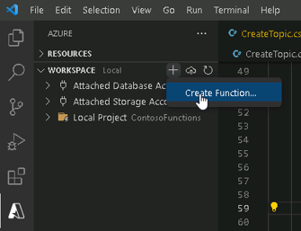
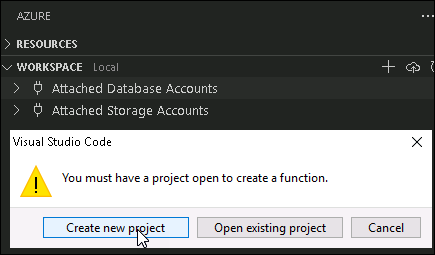
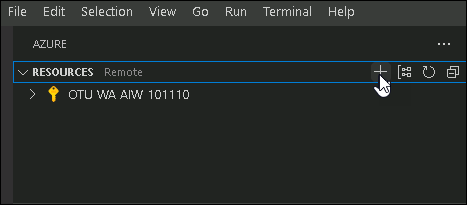
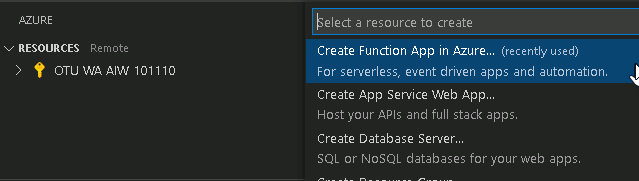
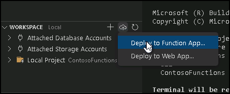
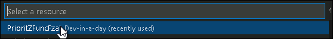

# Lab 04 - Azure Function

## Table of Contents


Lab Scenario 

1. Exercise 1 – Create Azure Function 

   - Task 1: Install Azure tools extension 

   - Task 2: Create function 

2. Exercise 2 - Function implementation 

   - Task 1: Implement function 

3. Exercise 3 – Publish to Azure 

   - Task 1: Publish 

   - Task 2: Register Connector Client app 

4. Exercise 4 – Create Connector 

   - Task 1: Create connector 

   - Task 2: Test connector 

5. Exercise 5 – Use Function from Canvas App 

   - Task 1: Use function 

   - Task 2: Test application 


### Lab Scenario

Working as part of the PrioritZ fusion team you will be configuring a custom connector for a new API you
build using Azure Functions. The team has decided to move the logic when a user creates a new “ask” to
the Azure Function API. This will keep the Power App formula simple and allow more complex logic to be
added in the future. In this lab you will create the function, use the Dataverse API, secure the API with
Azure AD, configure a custom connector to use the API, and change the Power App to use the
connector.

Note: This lab requires an Azure subscription (or trial) in the same tenant as your Dataverse
environment.

## Exercise 1 – Create Azure Function

In this exercise, you install Azure tools extension for Visual Studio Code and create the function

### Task 1: Install Azure tools extension

1. Start **Visual Studio Code**.
2. Select the **Extensions** tab.
3. Search for Azure and click **Install Azure Tools**.
  
    .png)


4. Wait for the installation to complete.
5. You should now see the new Azure Tools extension you added.
    
    .png)

6. Click **Terminal** and select **New Terminal**.
 
    .png)

7. Go to the terminal and run the command below to create new folder.
   ```
   md ContosoFunctions
   ```
     .png)


### Task 2: Create function

1. Select **Azure Tool** , go to the **workspace** section click **+** , click Create Function, and click **Create New Project**.
  
    
  
    

2. Select the **ContosoFunctions** folder you created and click **Select**.
3. Select **C#** for language.
4. Select **.NET 6** for .NET runtime.
 
    .png)

5. Select **HTTP trigger with OpenAPI** for template.
6. Enter **CreateTopic** for function name and **[ENTER].**
    
    .png)

7. Enter **Contoso.PrioritZ** for namespace and [ENTER]
8. Select **Anonymous** for AccessRights. Later we will protect the function using Azure AD.


9. Select **Open in current window.**
  
    .png)

10. Your function should open in **Visual Studio Code** .
11. Click **Terminal** and select **Run Build Task**.
  
   .png)

12. The build should succeed.
13. Go to Terminal and **press any key close it** .

## Exercise 2 - Function implementation

In this exercise, you will implement the function.

### Task 1: Implement function

1. Click **New file**.
    
    .png)

2. Name the new file **Model.cs**
  
    .png)

3. Open the new **Model.cs** file and paste the code below. This will define the data that will be sent
    from the Power App.
      ```
      using System;
      using Microsoft.Azure.WebJobs.Extensions.OpenApi.Core.Attributes;
      using Microsoft.OpenApi.Models;
      namespace Contoso.PrioritZ
      {
      public class TopicItemModel
      {
      public string Choice { get; set; }
      public string Photo { get; set; }
      }
      public class TopicModel
      {
      [OpenApiProperty(Nullable = false, Description = "This is a topic")]
      public string Topic { get; set; }
      public string Details { get; set; }
      public DateTime RespondBy { get; set; }
      public string MyNotes { get; set; }
      public string Photo { get; set; }
      public TopicItemModel[] Choices {get;set;}
      }
      }
      ```
4. Open the **CreateTopic** file.
5. Locate the Run method attributes and replace them with the attributes below. This provides
    user friendly names when we create a connector to use the API.
    
    .png)
       
      ```
      [FunctionName("CreateTopic")]
      [OpenApiOperation(operationId: "CreateTopic", tags: new[] { "name" }, Summary = "Create Topic", Description = "Create Topic", Visibility =  OpenApiVisibilityType.Important)]
      [OpenApiSecurity("function_key", SecuritySchemeType.ApiKey, Name = "code", In = OpenApiSecurityLocationType.Query)]
      [OpenApiResponseWithBody(statusCode: HttpStatusCode.OK, contentType: "application/json", bodyType: typeof(Guid), Description = "The Guid response")]
      [OpenApiRequestBody(contentType: "application/json", bodyType: typeof(TopicModel))]
      ```


6. Remove **get** from the Run method. You should only have post.
  
    .png)


7. Go to the **Terminal** and add **Power Platform Dataverse Client** package.

   .png)

      ```
      dotnet add package Microsoft.PowerPlatform.Dataverse.Client
      ```


8. Wait for the package to be added.
9. Add **Azure Identity** package.

```
dotnet add package Azure.Identity
```
10. Wait for the package to be added.
11. Open the **CreateTopic** file and add the using statements below.

      ```
      using System;
      using Microsoft.Identity.Client;
      using Azure.Core;
      using Azure.Identity;
      using Microsoft.PowerPlatform.Dataverse.Client;
      using Microsoft.Azure.WebJobs.Extensions.OpenApi.Core.Enums;
      using Microsoft.Xrm.Sdk;
      ```
12. Add the below method after the Run method. This method will use the token passed from the
    calling app to get a new token that will allow the function to use the Dataverse API on behalf of
    the calling user.
    
      ```
      public static async Task<string> GetAccessTokenAsync(HttpRequest req,string resourceUri)
      {
      //Get the calling user token from the request to use as
      UserAssertion
      var headers = req.Headers;
      var token = string.Empty;
      if (headers.TryGetValue("Authorization", out var authHeader))
      {
      if (authHeader[0].StartsWith("Bearer "))
      {
      token = authHeader[0].Substring(7, authHeader[0].Length -
      7);
      }
      }
      string[] scopes = new[] {$"{resourceUri}/.default" };
      string clientSecret = Environment.GetEnvironmentVariable("ClientSecret");
      string clientId = Environment.GetEnvironmentVariable("ClientID");
      string tenantId = Environment.GetEnvironmentVariable("TenantID");
      var app = ConfidentialClientApplicationBuilder.Create(clientId)
      .WithClientSecret(clientSecret)
      .WithAuthority($"https://login.microsoftonline.com/{tenantId}")
      .Build();
      //Get On Behalf Of Token for calling user
      UserAssertion userAssertion = new UserAssertion(token);
      var result = await app.AcquireTokenOnBehalfOf(scopes,
      userAssertion).ExecuteAsync();

      return result.AccessToken;
      }

     ```

13. Replace the code inside the **Run** method with code below. This will get an instance of the
    Dataverse API and use the GetAccessToken function we just defined.
    
      ```    
      _logger.LogInformation("Starting Create Topic");
      var serviceClient = new ServiceClient(
      instanceUrl: new Uri(Environment.GetEnvironmentVariable("DataverseUrl")),
      tokenProviderFunction: async uri => { return await
      GetAccessTokenAsync(req, Environment.GetEnvironmentVariable("DataverseUrl"));
      },
      useUniqueInstance: true,
      logger: _logger);
      if (!serviceClient.IsReady)
      {
      throw new Exception("Authentication Failed!");
      }
      ```

14. Add the following code after the if statement of the **Run** method to reserialize the request. This
    will get us the data passed from the caller.
    
      ```
      string requestBody = await new StreamReader(req.Body).ReadToEndAsync();
      var data = JsonConvert.DeserializeObject<TopicModel>(requestBody);

      ```

15. Add the code below that will create the row to the **Run** method. This code creates the rows in
    Dataverse and is where we might add more logic in the future.
    
       ```
      var ask = new Entity("contoso_prioritztopic");
      ask["contoso_topic"] = data.Topic;
      ask["contoso_details"] = data.Details;
      ask["contoso_mynotes"] = data.MyNotes;
      ask["contoso_respondby"] = data.RespondBy.Date;
      if (data.Photo != null)
       {
      // Remove unnecessary double quotes,
      // Remove everything before the first comma (embedded stuff)
       ask["contoso_photo"] = Convert.FromBase64String(data.Photo.Trim('\"').Split(',')[1]);
       }
      var topicId = await serviceClient.CreateAsync(ask);
      foreach (var choice in data.Choices)
      {
       var item = new Entity("contoso_prioritztopicitem");
       item["contoso_choice"] = choice.Choice;
       item["contoso_prioritztopic"] = new
      EntityReference("contoso_prioritztopic", topicId);
      if (choice.Photo != null)
       {
       item["contoso_photo"] =
      Convert.FromBase64String(choice.Photo.Trim('\"').Split(',')[1]);
       }
       var choiceId = await serviceClient.CreateAsync(item);
      }

      ```

16. Return the topic id as JSON (required by Power Apps). Add the code below to the **Run** method.

      ```
      return new OkObjectResult(topicId);
      ```

17. Click **Terminal** and select **Run Build Task**.
18. The run should succeed. Press any key to stop.


## Exercise 3 – Publish to Azure

In this exercise, you will deploy the function to Azure.

### Task 1: Publish

1. Select **Azure Tools**.
2. Click **Sign in to Azure**.
   
   .png)
    
3. It ask  **Sign in to Azure**  give account details.

4. Sign into an Azure account that has a subscription or create a trial.
5. Close the sign in browser window.
6. Select **+ Create new Function App**.
  
    
 
    

7. Enter **PrioritZFuncFL** for function app name an [ENTER]. Replace FL with your initials.
8. Select **.NET 6**.
9. Select your location.
10. Click Deploy Function App and choose Function just now you created .Wait for the function app to be deployed.
    
     
   
     

11. Navigate to https://portal.azure.com/
12. Select **All resources** , search for the function app you deployed and click to open it.
  
     .png)

13. Select **Authentication** and click **Add identity provider.**
  
     .png)

14. Select **Microsoft** for Identity provider,
15. Select **Current tenant - Single tenant** and click **Add**.
   
     .png)

16. Go to the **Portal menu** page of Azure portal.
17. Select **Azure Active Directory**.
    
     .png)

18. Select **App registrations**.
19. Click to open the **PrioritZFL**.
     
     .png)


20. Copy the **Application (client) ID** of the **PrioritZFL** application registration and keep it on a
    notepad as **PrioritZFL API application ID**. You will need this id in future steps. This ID will be
    used to configure protection of the API.
    
    .png)
    
    .png)

21. Copy the **Directory (tenant) ID** and keep it on a notepad as **Tenant ID**. You will need this id in
    future steps.
  
    .png)

22. Select **Certificates & secrets**.
23. Click **New + client secret**.
  
     .png)

24. Provide a description, select **3 months** , and click **Add**.
    
    .png)

25. Copy the **Value** and keep it in a notepad as **PrioritZFL API Secret**. You need this value in future
    steps.
    
     .png)

26. Select **API permissions**.
27. Click **+ Add a permission**.
  
     .png)

28. Select **Dynamics CRM**. Dynamics CRM is Dataverse, the Azure portal just hasn’t been updated as
    of the time of the writing of these steps.
     
     .png)

29. Check the **user_impersonation** checkbox and click **Add permission**.

    .png)

30. Go back to **Home** and open the **PrioritZFL** function app.
   
     .png)

31. Select **Configuration**.
  
     .png)

32. Click **+ New application setting.**
     
     .png)

33. Enter **ClientID** for Name.
34. Go to your notepad and copy the **PrioritZFL API application ID**.
35. Go back to the portal, paste the ID you copied in the **Value** field, and click **OK**.
   
     .png)


36. Click **+ New application setting** again.

37. Enter **ClientSecret** for Name.

38. Go to your notepad and copy the **PrioritZFL API Secret**.

39. Go back to the portal, paste the secret you copied in the **Value** field, and click **OK**.

40. Click **+ New application setting** again.

41. Enter **TenantID** for Name.

42. Go to your notepad and copy the **Tenant ID**.

43. Go back to the portal, paste the Tenant ID you copied in the **Value** field, and click **OK**.

44. Click **+ New application setting** one more time.
45. Enter **DataverseURL** for Name.
46. Start a new browser window or tab and navigate to Power Platform admin center and select
    **Environments**.
47. Click to open the Dev environment you are using for this lab.
48. Copy the **Environment URL**.

     .png)

49. Go back to the portal, paste the URL you copied in the **Value** field, and click **OK**.

50. You should see the four application settings you added. Click **Save**.
  
     .png)

51. Click **Continue**.

52. Navigate to https://login.microsoftonline.com/{tenant id}/adminconsent?client_id={api app id}
    Replace {tenant id} and {api app id} with tenant id and PrioritZFL API application ID from your
    notepad. If you are not a tenant administrator, you will need to work with your
    trainer/administrator to consent.

53. Click **Accept**.

### Task 2: Register Connector Client app

1. Click on the **Portal menu** and select **Azure Active Directory**.
2. Select **App registrations** and click **+ New registration**. This application registration will be used
    for the connector to access the protected API.
3. Enter **PrioritZConnector<Initials>** for Name, select **Accounts in this organizational directory**
    **only** , select **Web** for Redirect URI, enter https://global.consent.azure-apim.net/redirect and
    click **Register**.

     .png)
    
4. Copy the **Application (client) ID** and keep it in a notepad as **PrioritZFL Connector application ID**.
     
     .png)
    
5. Select **Certificates & secrets** and click **+ New client secret**.
6. Provide a description, select **3 months** , and click **Add**.
7. Copy the secret **Value** and keep it on a notepad as **PrioritZFL Connector Secret**.
8. Select **API permissions** and click **+ Add a permission**.
      
     .png)

9. Select the **My APIs** tab and select **PrioritZFL**.
    
     .png)
    
 10. Check the **user_impersonation** checkbox and click **Add permission**.

## Exercise 4 – Create Connector

In this exercise, you will create a new custom connector.

### Task 1: Create connector

1. Navigate to https://portal.azure.com/
2. Select **All resources** , search for the function app you deployed and click to open it.
     
     .png)
    
3. Copy the **URL**.
   
     .png)

4. Open a new browser tab or window and paste the URL you copied.
5. Add **/api/swagger.json** to the end of the URL and [ENTER]
     
     .png)
    
6. Click **Accept** if prompted for permissions.
7. Right click on the swagger and select **Save as**.
    
     .png)
    
8. Save the file on your local machine.
9. Navigate to Power Apps maker portal and make sure you have the correct Dev environment
    selected.
10. Expand **Data** and select **Custom Connectors**.
     
     .png)

11. Click on the chevron button next to the New custom connector and select **Import an OpenAPI**
    **file**.
     
     .png)
    
12. Enter **PrioritZ Connector** for name and click **Import**.
    
     .png)
    
13. Select the swagger file you saved and click **Open**.
14. Click **Continue**.
15. Provide Description and advance to **Security**.
    
     .png)

16. Select **OAuth 2.0** for Authentication type.
17. Select **Azure Active Directory** Identity provider.
18. Copy the **PrioritZFL Connector application ID** from your notepad and paste it in the **Client id**
    field.
19. Copy the **PrioritZFL Connector Secret** your notepad and paste it in the **Client secret** field.
20. Copy the **Tenat ID** from your notepad and replace common with it in the **Tenant ID** field.
21. Copy the **PrioritZ API application ID** from your notepad and paste it in the **Resource URL** field.
22. Enter **true** for Enable on-behalf-of login.
23. Click **Create connector**.
    
     .png)

### Task 2: Test connector

1. Select the **Test** tab.
2. Click **+ New connection**.
     
   .png)
    
3. Click **Create**.
4. Provide your credentials.
5. Click **Accept**.
6. Select **Custom connectors** and click **Edit** on the **PrioritZ connector**.
     
   .png)
    
7. Select the **Test** tab.
8. Make sure the connection you created is selected.
9. Turn on **Raw Body.**
10. Provide the JSON below and click **Test operation**.
   
     .png)
   
      ```
          {
          "topic": "Test Topic",
          "details": "From Azure Function",
          "respondBy": "2022-11-01",
          "myNotes": "It worked",
          "choices": [
          {
          "choice": "Choice 1"
          }
          ]
          }
      ```
     


    
 11. The operation test should succeed, and the response should look like the image below.

     .png)

### Exercise 5 – Use Function from Canvas App

In this exercise, you will use then Azure function you created via the custom connector from the PrioritZ
Admin canvas application.

### Task 1: Use function

1. Navigate to Power Apps maker portal a nd make sure you are in correct environment.
2. Select Apps, select the **PrioritZ Admin** application and click **Edit**.
     
   .png)

3. Select **Data** , click **+ Add data** , search for prioritz connector, and select the **PrioritZ Connector**
    you created.
     
    .png)
    
    
4. Add the connector by clicking again.
5. Click on the **... More actions** button of the connector you just added and select **Rename**.
    
   .png)
    
6. Rename the connector **PrioritZFunction**.
     
     .png)

7. Select the **Tree view** and expand the **Add Topic Screen**.
8. Select the **Add choice icon**.
 
    .png)
    
    
9. Replace the **OnSelect** formula of the **Add choice icon** with the formula below. This adjusts the
    column names to match the API and encodes the photos.
   
    .png)
   
      ```    
      Collect(
      colAddChoices,
      {
      choice: 'Choice name textbox'.Text,
      photoRaw: UploadedImage1.Image,
      photo: JSON(
      UploadedImage1.Image,
      JSONFormat.IncludeBinaryData
      )
      }
      );
      Reset('Choice name textbox');
      Reset(AddMediaButton2)
      ```


10. Select **Save topic icon**.
11. Replace the **OnSelect** formula of the **Save topic icon** with the formula below. This changes to
    have the API create the “ask”.
   
     .png)
   
      ```    
      Set(returnGuid, PrioritZFunction.CreateTopic({
      topic: 'Topic name textbox'.Text,
      details: 'Topic details textbox'.Text,
      respondBy: 'respond by date picker'.SelectedDate,
      myNotes: 'Notes textbox'.Text,
      photo: JSON(AddTopicImage.Image, JSONFormat.IncludeBinaryData),
      choices: ShowColumns(colAddChoices, "choice", "photo")
      }));
      Notify("Topic created! " & returnGuid, NotificationType.Success, 5000);
      Back();
      ```
    
12. Click **File** and select **Save**.
   
    
13. Click on the  back button.
14. Do not navigate away from this page.

### Task 2: Test application

1. Select the **Home Screen** and click **Preview the app**.
   
    .png)

2. Click on the **+** add button.
3. Enter **Function Test** for Topic, **Testing the function** for Details. **Note for testing the function** for
  Note, select a date for Response by, and click **add a picture**.

    .png)
    
4. Select any small image from your local machine.
5. Enter **Test choice one** for Choice and click **add a picture**.
6. Select any small image from your machine and click **+**.

     .png) 
    
7. Enter **Test choice two** for Choice and click **add a picture**.

8. Select any image from your machine and click **+**.

9. Click **Save**.
  
     .png)

10. The new topic should be saved, and you should be navigated back to the main screen.
11. Locate the new topic you created and open it.
    
     .png)
    
12. You should see the two choices you added to topic.

    .png)
