# Lab 04 - Azure Function

## Table of Contents


Lab Scenario 

1. Exercise 1 – Create Azure Function 

   - Task 1: Install Azure tools extension 

   - Task 2: Create function 

2. Exercise 2 - Function implementation 

   - Task 1: Implement function 

3. Exercise 3 – Publish to Azure 

   - Task 1: Publish 

   - Task 2: Register Connector Client app 

4. Exercise 4 – Create Connector 

   - Task 1: Create connector 

   - Task 2: Test connector 

5. Exercise 5 – Use Function from Canvas App 

   - Task 1: Use function 

   - Task 2: Test application 


### Lab Scenario

Working as part of the PrioritZ fusion team you will be configuring a custom connector for a new API you
build using Azure Functions. The team has decided to move the logic when a user creates a new “ask” to
the Azure Function API. This will keep the Power App formula simple and allow more complex logic to be
added in the future. In this lab you will create the function, use the Dataverse API, secure the API with
Azure AD, configure a custom connector to use the API, and change the Power App to use the
connector.

Note: This lab requires an Azure subscription (or trial) in the same tenant as your Dataverse
environment.

## Exercise 1 – Create Azure Function

In this exercise, you install Azure tools extension for Visual Studio Code and create the function

### Task 1: Install Azure tools extension

1. Start **Visual Studio Code** using the shortcut available on the desktop.

   
    
2. Select the **Extensions** tab.

   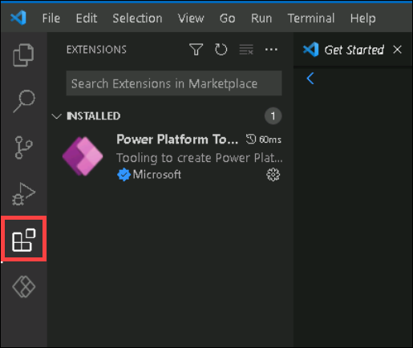

3. Search for **Azure tools (1)** and click on **Install (2)** to install the  Azure Tools extension.
  
    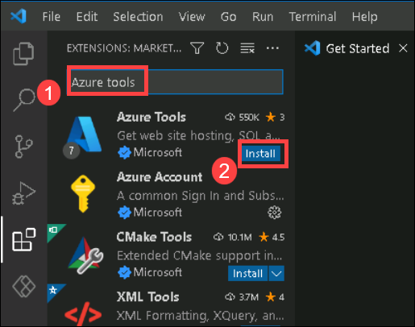

4. Wait for the installation to complete.

5. You should now see the new Azure Tools extension you added.
    
    .png)

6. Click on **Terminal** from the top menu and select **New Terminal**.
 
    .png)

7. Run the below command in the terminal to create new folder.
   ```
   md ContosoFunctions
   ```
     .png)


### Task 2: Create function

1. Select **Azure Tools** from the left navigtion menu and navigate to the **Workspace** section.

    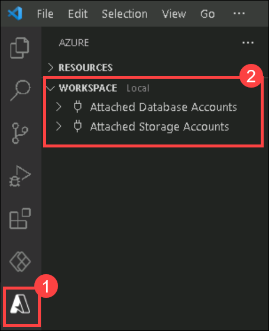

1. Click on **+** under **Workspace** section, click Create Function, and click **Create New Project**.

    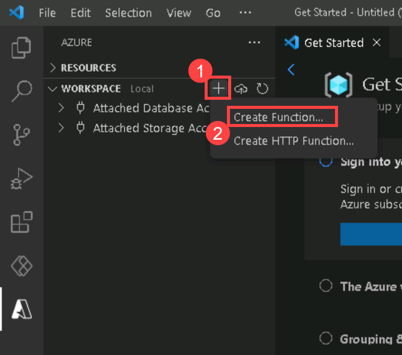

1. Now, you will be presented with the below pop-up, click on **Yes** to create a new project.

    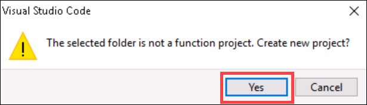

1. Select **C#** for language.

    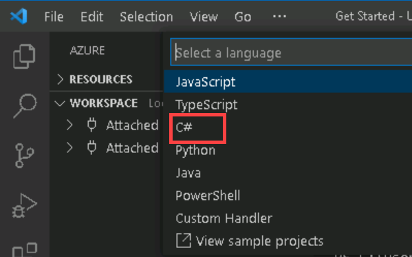

1. Select **.NET 6.0 LTS** for .NET runtime.
 
    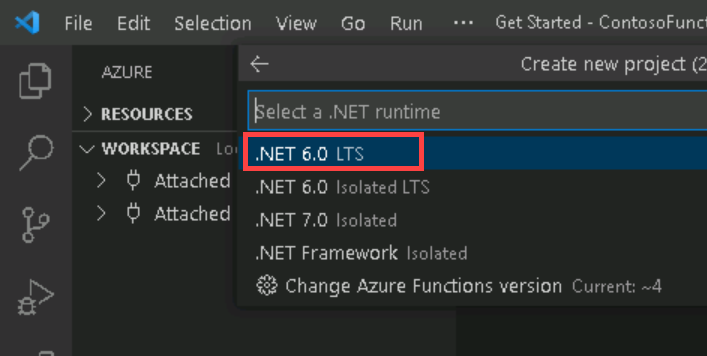

1. Select **HTTP trigger with OpenAPI** for template.

    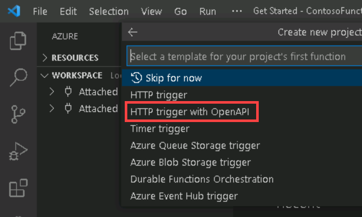

1. Enter **CreateTopic** for function name and **[ENTER].**
    
    .png)

1. Enter **Contoso.PrioritZ** for namespace and **[ENTER]**.

    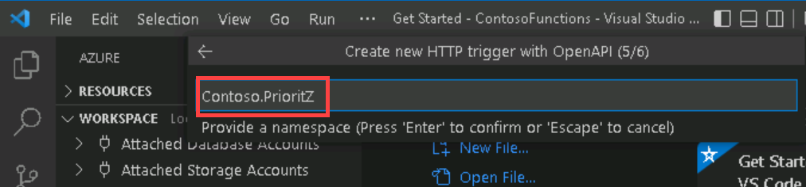

1. Select **Anonymous** for AccessRights. Later we will protect the function using Azure AD.

    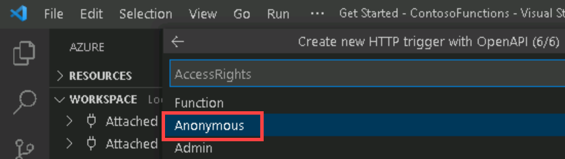

9. If you are presented with below window, select **Open in current window.**
  
    .png)

1. Your function should open in **Visual Studio Code** .

1. Click on **Terminal** from the top menu and select **Run Build Task**.
  
   .png)

1. Once the build is succeeded, **press any key to close the terminal**.

    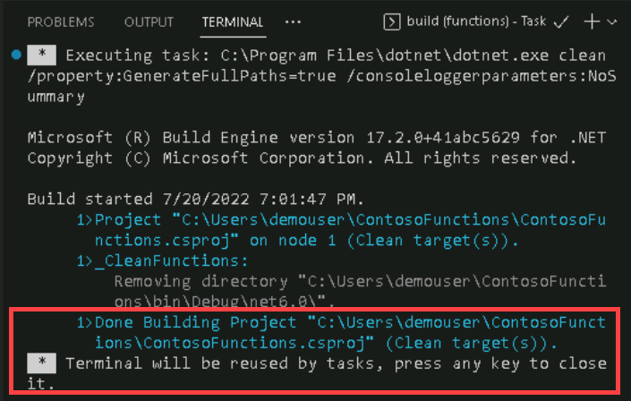


## Exercise 2 - Function implementation

In this exercise, you will implement the function.

### Task 1: Implement function

1. Click **New file** that is next to **ContosoFunctions** to add a new file.
    
    .png)

1. Name the new file **Model.cs**
  
    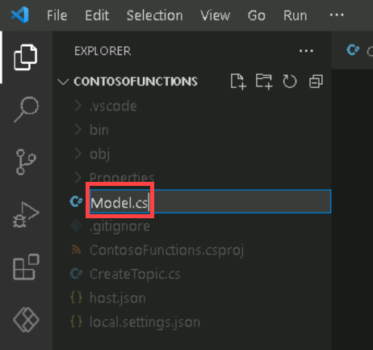


1. Open the new **Model.cs** file and paste the code below. This will define the data that will be sent
    from the Power App.
      ```
      using System;
      using Microsoft.Azure.WebJobs.Extensions.OpenApi.Core.Attributes;
      using Microsoft.OpenApi.Models;
      namespace Contoso.PrioritZ
      {
      public class TopicItemModel
      {
      public string Choice { get; set; }
      public string Photo { get; set; }
      }
      public class TopicModel
      {
      [OpenApiProperty(Nullable = false, Description = "This is a topic")]
      public string Topic { get; set; }
      public string Details { get; set; }
      public DateTime RespondBy { get; set; }
      public string MyNotes { get; set; }
      public string Photo { get; set; }
      public TopicItemModel[] Choices {get;set;}
      }
      }
      ```
      
   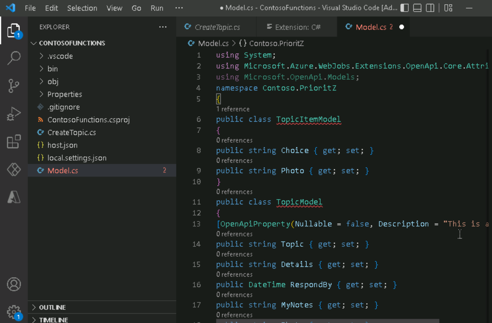
   
1. Open the **CreateTopic** file.
1. Locate the Run method attributes that are present above the **Run method** and replace them with the attributes below. This provides user friendly names when we create a connector to use the API.
    
    .png)
       
      ```
      [FunctionName("CreateTopic")]
      [OpenApiOperation(operationId: "CreateTopic", tags: new[] { "name" }, Summary = "Create Topic", Description = "Create Topic", Visibility = OpenApiVisibilityType.Important)]
      [OpenApiSecurity("function_key", SecuritySchemeType.ApiKey, Name = "code", In = OpenApiSecurityLocationType.Query)]
      [OpenApiResponseWithBody(statusCode: HttpStatusCode.OK, contentType: "application/json", bodyType: typeof(Guid), Description = "The Guid response")]
      [OpenApiRequestBody(contentType: "application/json", bodyType: typeof(TopicModel))]
      ```

1. Remove **get** from the Run method as you should only have **post**.
  
    .png)


1. Click on **Terminal** from the top menu and select the **New Terminal**.

1. Run the below command in the terminal to add the **Power Platform Dataverse Client** package.

      ```
      dotnet add package Microsoft.PowerPlatform.Dataverse.Client
      ```
    .png)

1. Wait for the package to be added then run the below command to add **Azure Identity** package.

    ```
    dotnet add package Azure.Identity
    ```

10. Wait for the **Azure Identity** package to be added.
11. Open the **CreateTopic** file and add the using statements below.

      ```
      using System;
      using Microsoft.Identity.Client;
      using Azure.Core;
      using Azure.Identity;
      using Microsoft.PowerPlatform.Dataverse.Client;
      using Microsoft.Azure.WebJobs.Extensions.OpenApi.Core.Enums;
      using Microsoft.Xrm.Sdk;
      ```
      
     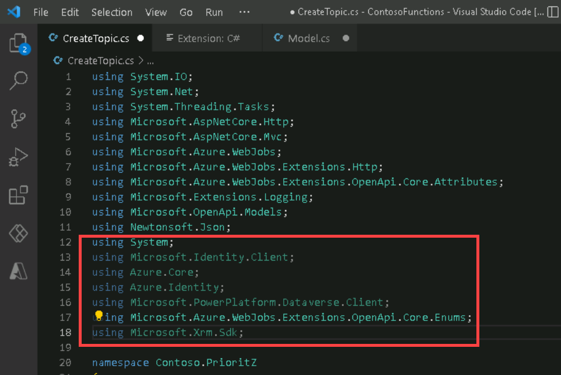
  
12. Add the below method after the **Run** method. This method will use the token passed from the
    calling app to get a new token that will allow the function to use the Dataverse API on behalf of
    the calling user.
    
      ```
      public static async Task<string> GetAccessTokenAsync(HttpRequest req,string resourceUri)
      {
      //Get the calling user token from the request to use as UserAssertion
      var headers = req.Headers;
      var token = string.Empty;
      if (headers.TryGetValue("Authorization", out var authHeader))
      {
      if (authHeader[0].StartsWith("Bearer "))
      {
      token = authHeader[0].Substring(7, authHeader[0].Length -
      7);
      }
      }
      string[] scopes = new[] {$"{resourceUri}/.default" };
      string clientSecret = Environment.GetEnvironmentVariable("ClientSecret");
      string clientId = Environment.GetEnvironmentVariable("ClientID");
      string tenantId = Environment.GetEnvironmentVariable("TenantID");
      var app = ConfidentialClientApplicationBuilder.Create(clientId)
      .WithClientSecret(clientSecret)
      .WithAuthority($"https://login.microsoftonline.com/{tenantId}")
      .Build();
      //Get On Behalf Of Token for calling user
      UserAssertion userAssertion = new UserAssertion(token);
      var result = await app.AcquireTokenOnBehalfOf(scopes,
      userAssertion).ExecuteAsync();

      return result.AccessToken;
      }

     ```

    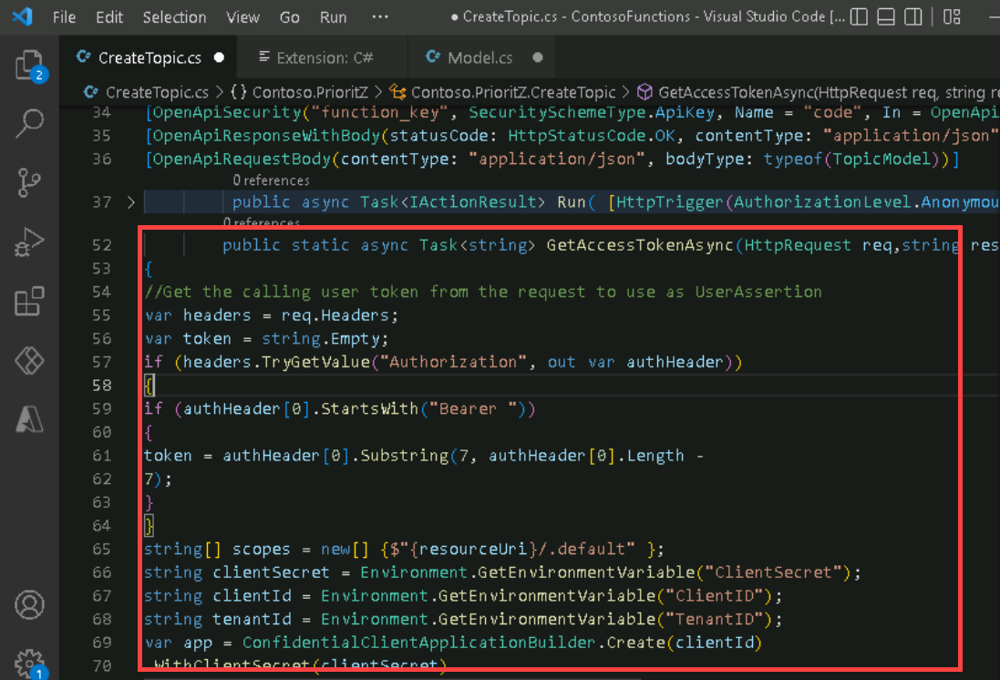

13. Replace the code inside the **Run** method with code below. This will get an instance of the
    Dataverse API and use the GetAccessToken function we just defined.
    
      ```    
      _logger.LogInformation("Starting Create Topic");
      var serviceClient = new ServiceClient(
      instanceUrl: new Uri(Environment.GetEnvironmentVariable("DataverseUrl")),
      tokenProviderFunction: async uri => { return await
      GetAccessTokenAsync(req, Environment.GetEnvironmentVariable("DataverseUrl"));
      },
      useUniqueInstance: true,
      logger: _logger);
      if (!serviceClient.IsReady)
      {
      throw new Exception("Authentication Failed!");
      }
      ```

    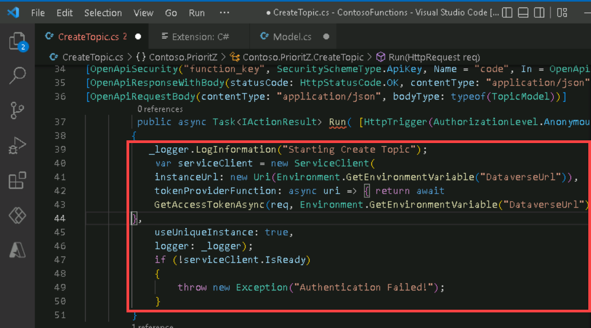

14. Add the following code after the if statement of the **Run** method to reserialize the request. This
    will get us the data passed from the caller.
    
      ```
      string requestBody = await new StreamReader(req.Body).ReadToEndAsync();
      var data = JsonConvert.DeserializeObject<TopicModel>(requestBody);

      ```
    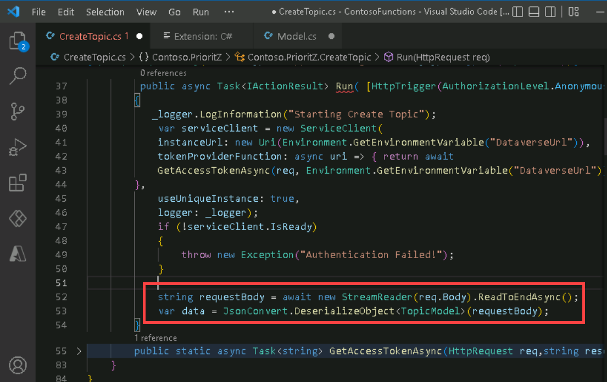

15. Add the below code that creates the row to the **Run** method after the code you added in previous step to **reserialize the request**. This code creates the rows in
    Dataverse and is where we might add more logic in the future.
    
       ```
      var ask = new Entity("contoso_prioritztopic");
      ask["contoso_topic"] = data.Topic;
      ask["contoso_details"] = data.Details;
      ask["contoso_mynotes"] = data.MyNotes;
      ask["contoso_respondby"] = data.RespondBy.Date;
      if (data.Photo != null)
       {
      // Remove unnecessary double quotes,
      // Remove everything before the first comma (embedded stuff)
       ask["contoso_photo"] = Convert.FromBase64String(data.Photo.Trim('\"').Split(',')[1]);
       }
      var topicId = await serviceClient.CreateAsync(ask);
      foreach (var choice in data.Choices)
      {
       var item = new Entity("contoso_prioritztopicitem");
       item["contoso_choice"] = choice.Choice;
       item["contoso_prioritztopic"] = new
      EntityReference("contoso_prioritztopic", topicId);
      if (choice.Photo != null)
       {
       item["contoso_photo"] =
      Convert.FromBase64String(choice.Photo.Trim('\"').Split(',')[1]);
       }
       var choiceId = await serviceClient.CreateAsync(item);
      }

      ```

    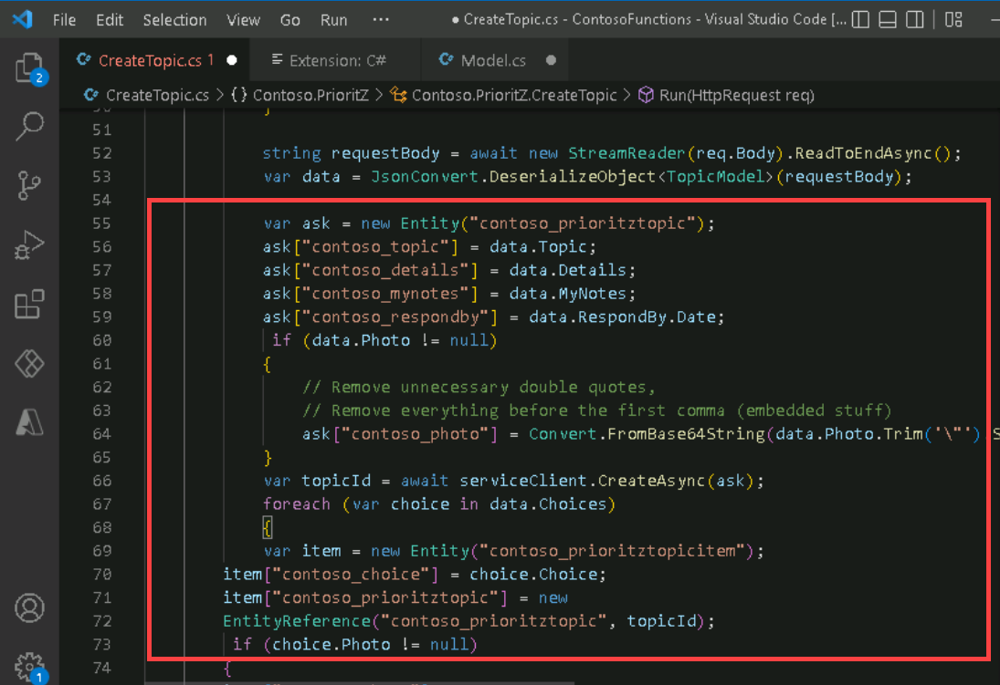

16. Add the code below to the **Run** method to return the topic id as JSON (required by Power Apps) after the code you added in previous step to create the row to the **Run** method.

      ```
      return new OkObjectResult(topicId);
      ```
   
    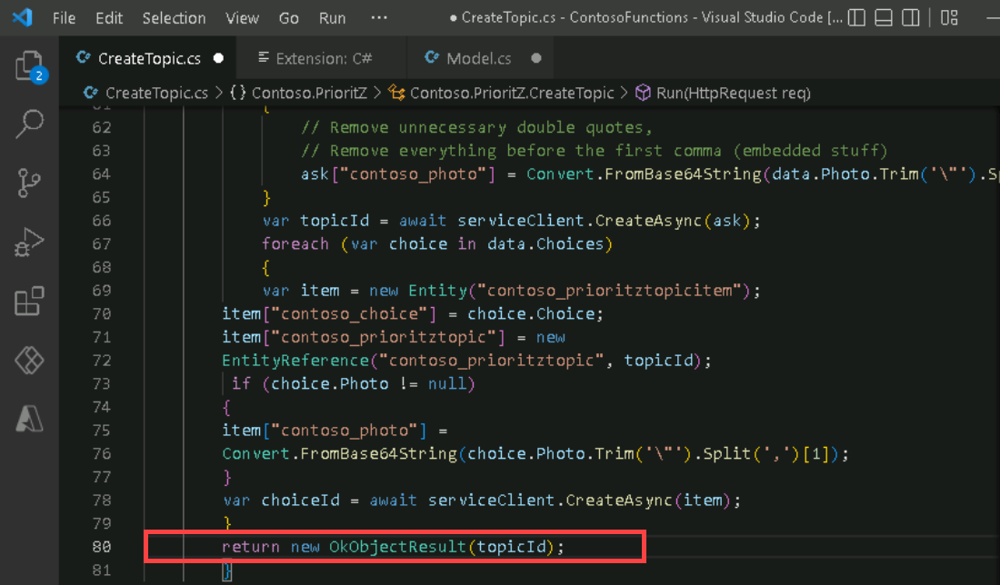

17. Click **Terminal** and select **Run Build Task**.

    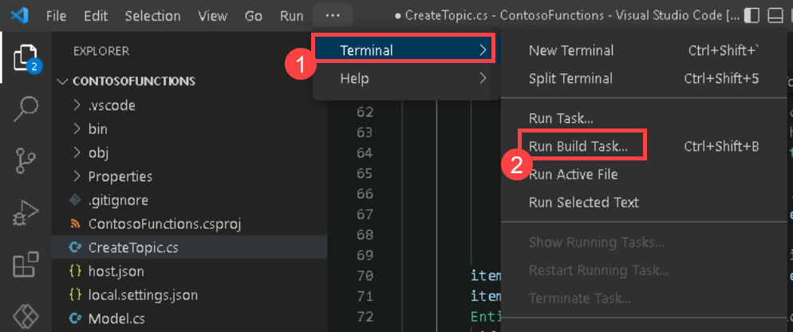

19. The run should succeed. Press any key to stop.

## Exercise 3 – Publish to Azure

In this exercise, you will deploy the function to Azure.

### Task 1: Publish

1. Select **Azure Tools** from the left hand side menu.

    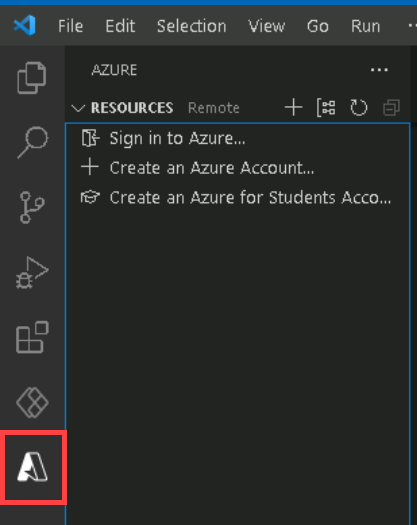

1. Click **Sign in to Azure** under **Resources** section.
   
   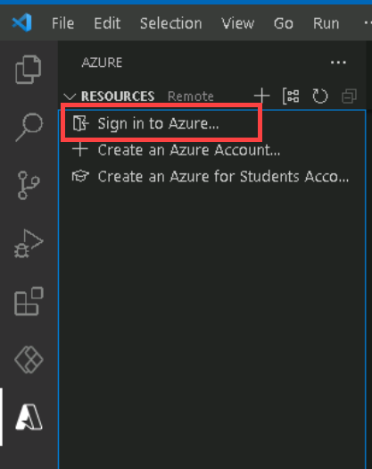
    
1. Complete the **Sign-in** process using the below credentials.

   * Email/Username: <inject key="AzureAdUserEmail"></inject>
   * Password: <inject key="AzureAdUserPassword"></inject>

1. Close the sign in browser window once the sign in is process is completed.
1. Navigat back to Viual Studio Code and click on **+** that is next to your subscription to create new Function App.
  
    
 
1. Now, search for and select **Create Function App in Azure**.

    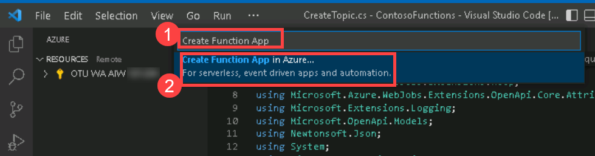

1. Enter **PrioritZFunc<inject key="Deployment ID" enableCopy="false" />** for function app name and hit [ENTER].

    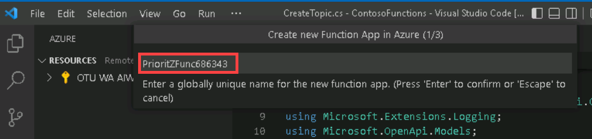

1. Select **.NET 6**.

    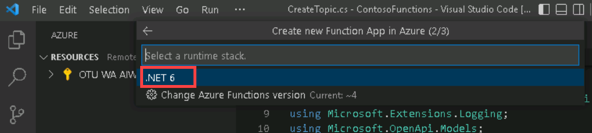
10. Select any location form the list and wait for the Function App to be deployed.

    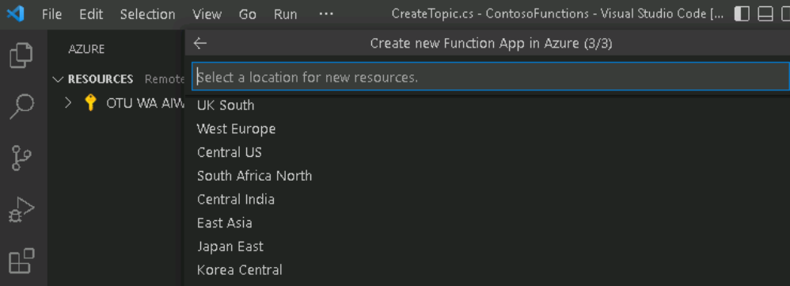
    
11. Once Function App is deployed, Click **Deploy Function App** under **Worskpaces** section and choose the Function App just now you created. 
    
     
   
     

11. Wait for the function app to be deployed then navigate to Azure Portal using the below URL.

    ```
    https://portal.azure.com/
    ```
    
12. Select **All resources** , search for the function app **PrioritZFunc<inject key="Deployment ID" enableCopy="false" />** that you have deployed earlier and click to open it.
  
     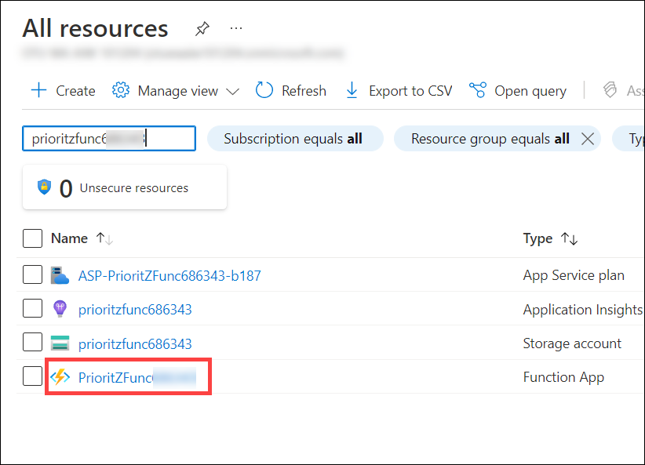

13. Select **Authentication** from the left hand side menu and click on **Add identity provider**.
  
     .png)

1. Select **Microsoft** for Identity provider and **Current tenant - Single tenant** for **Supported Account types** then click on **Add**.
   
     .png)

16. Open the **Portal menu** by clicking on the Portal menu icon.

    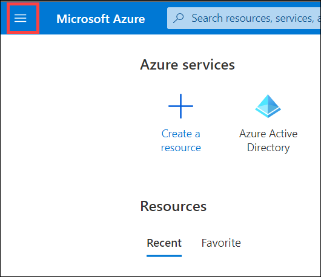

17. Select **Azure Active Directory** from the list of resources.
    
    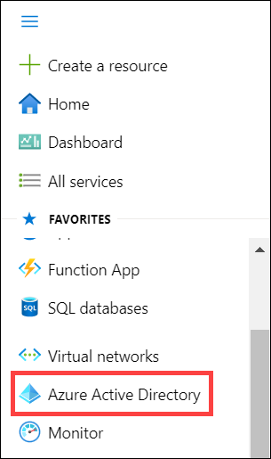

18. Select **App registrations** under **Manage**  from the left hand side menu.

    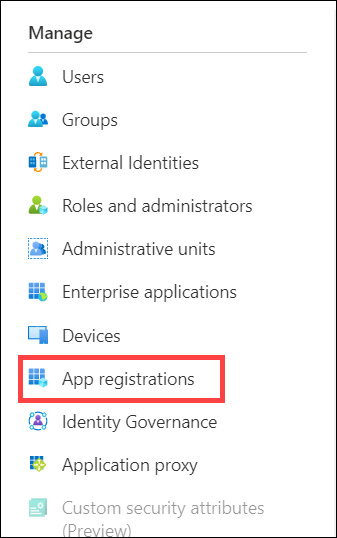
    
19. Click to open the **PrioritZFunc<inject key="Deployment ID" enableCopy="false" />** to open the app.
     
     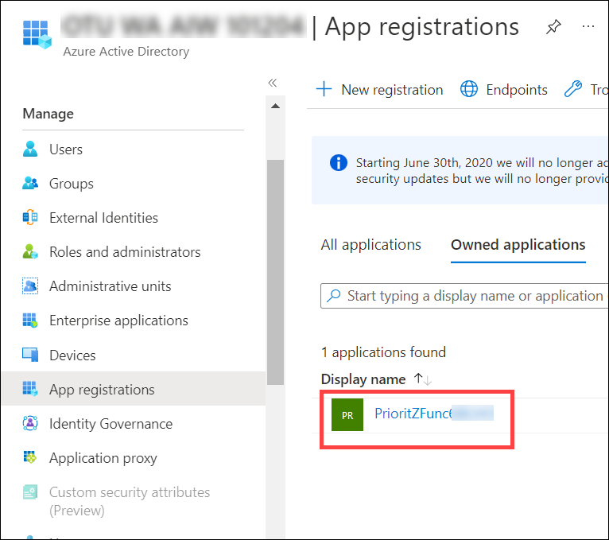

20. Copy the **Application (client) ID** of the **PrioritZFunc<inject key="Deployment ID" enableCopy="false" />** application registration and keep it on a
    notepad as **PrioritZFL API application ID**. You will need this id in future steps. This ID will be
    used to configure protection of the API.
    
    .png)
    
    .png)

21. Copy the **Directory (tenant) ID** and keep it on a notepad as **Tenant ID**. You will need this id in
    future steps.
  
    .png)

22. Select **Certificates & secrets** under **Manage** from the left hand side menu.

    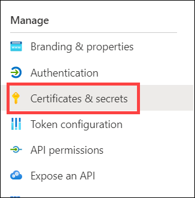

23. Click **+ New client secret**.
  
     .png)

24. Provide a description, select **3 months** , and click **Add**.
    
    .png)

25. Copy the **Value** and keep it in a notepad as **PrioritZFL API Secret**. You need this value in future
    steps.
    
     .png)

26. Select **API permissions** under **Manage** from the left hand side menu.

    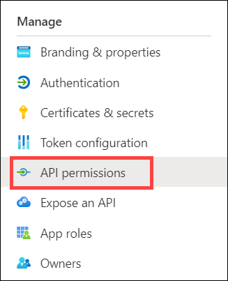
    
27. Click **+ Add a permission**.
  
     .png)

28. Select **Dynamics CRM** from the list of API permissions. Dynamics CRM is Dataverse, the Azure portal just hasn’t been updated as of the time of the writing of these steps.
     
     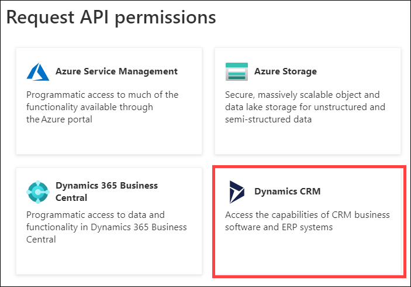

29. Check the **user_impersonation** checkbox and click **Add permission**.

    .png)

30. Go back to **Home** and open the **PrioritZFunc<inject key="Deployment ID" enableCopy="false" />** function app.
   
     

31. Select **Configuration** under **Settings** from the left hand side menu..
  
     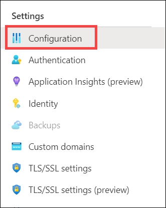

32. Click **+ New application setting.**
     
     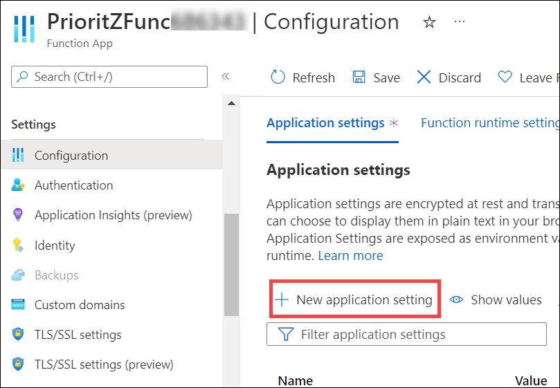

33. Enter the following details on the **Add/Edit application setting** blade and click **OK**.
      
      - **Name**: **ClientID**
      - **Value**: Paste the **PrioritZFL API application ID** that you have noted earlier in the notepad.

     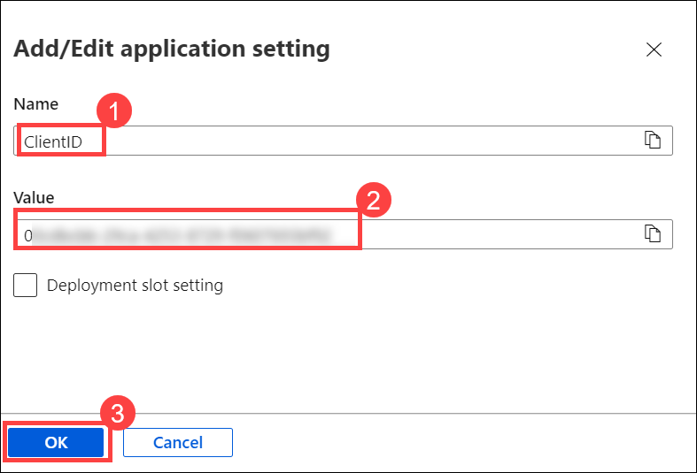

1. Click **+ New application setting** again.

37. Enter the following details on the **Add/Edit application setting** blade and click **OK**.
      
      - **Name**: **ClientSecret**
      - **Value**: Paste the **PrioritZFL API Secret** that you have noted earlier in the notepad.

     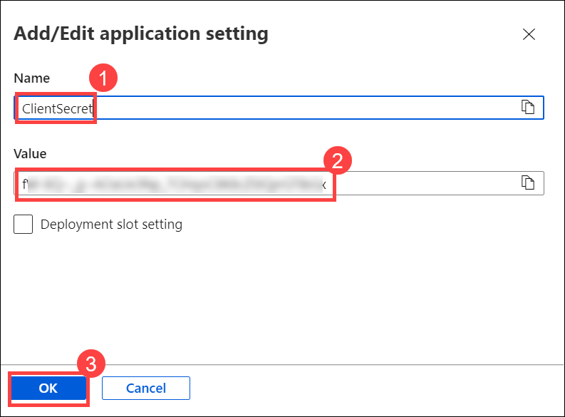
     
40. Click **+ New application setting** again.

1. Enter the following details on the **Add/Edit application setting** blade and click **OK**.
      
      - **Name**: **TenantID**
      - **Value**: Paste the **TenantID** that you have noted earlier in the notepad.

     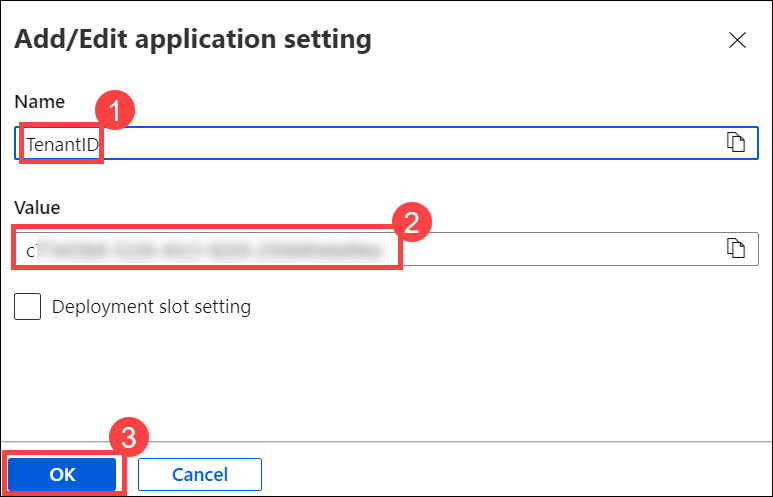
     
46. Start a new browser window or tab and navigate to Power Platform admin center and select
    **Environments**.
47. Click to open the Dev environment you are using for this lab.
48. Copy the **Environment URL** and paste it in the notepad.

     .png)

44. Click **+ New application setting** one more time.

45. Enter the following details on the **Add/Edit application setting** blade and click **OK**.
      
      - **Name**: **DataverseURL**
      - **Value**: Paste the **Environment URL** that you have noted earlier in the notepad.
      
    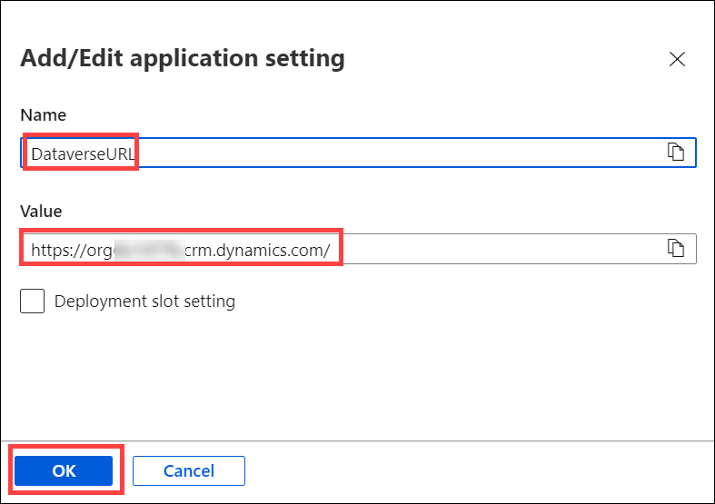
50. You should see the four application settings you added. Click **Save**.
  
     .png)

51. Click **Continue**.

52. Paste the below URL in notepad and replace `{tenant id}` and `{api app id}` with **tenant id** and **PrioritZFL API application ID** values from your
    notepad. 

    ```
     https://login.microsoftonline.com/{tenant-id}/adminconsent?client_id={api app id}
     ```
 
 1. After updating the values, navigate to the URL in a browser tab and sign in with below creadentails.
   
   * Email/Username: <inject key="AzureAdUserEmail"></inject>
   * Password: <inject key="AzureAdUserPassword"></inject>
   
53. Click **Accept**.

### Task 2: Register Connector Client app

1. Navigate to the Azure portal, then search for **Azure Active Directory** ***(1)*** in the search bar and select **Azure Active Directory** ***(2)*** from the suggestions.

   

1. Select **App registrations** ***(1)*** from the side blade and click on **+ New registration** ***(1)***. This application registration will be used for the connector to access the protected API.

   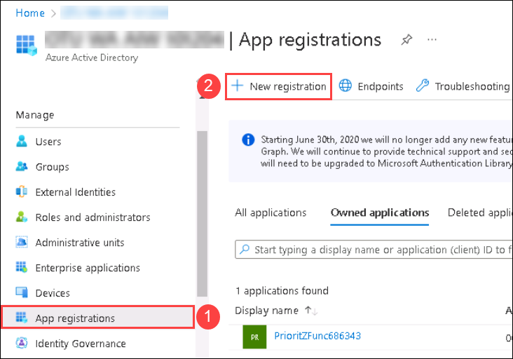

1. Please provide the following details and click on **Register** ***(5)***.
   
   - Name: **PrioritZConnector<inject key="DeploymentID" enableCopy="false" />** ***(1)***
   - Supported account types: **Accounts in this organizational directory only (OTU WA AIW [SUFFIX] only - Single tenant)** ***(2)***
   - Redirect URL: Select **Web** ***(3)*** and provide `https://global.consent.azure-apim.net/redirect` ***(4)*** as the URL.

   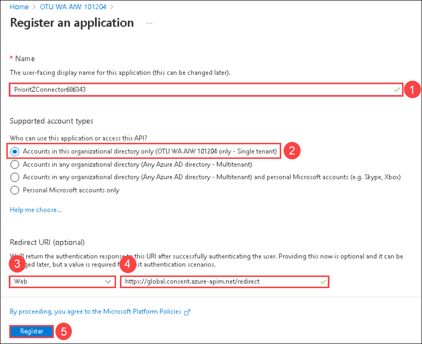
    
1. Copy the **Application (client) ID** and save it in a notepad as you need it for later use.
     
   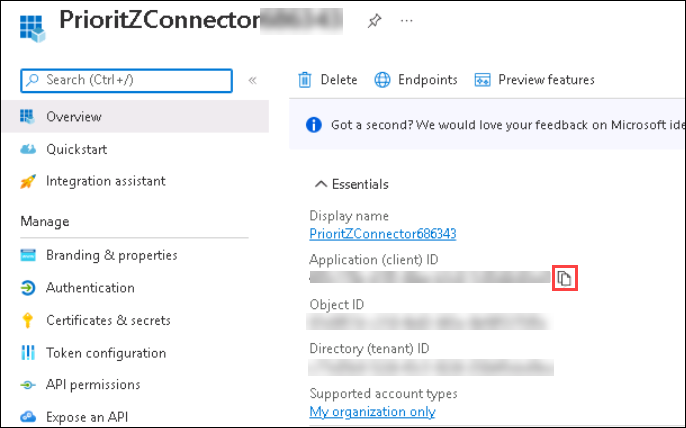
    
1. Select **Certificates & secrets** from the side blade and click on **+ New client secret**.
   
   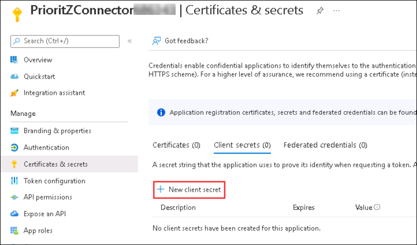
    
1. Provide **PrioritZsecret** ***(1)*** as description, set expiry to **3 months** ***(2)***, and click on **Add** ***(3)***.

   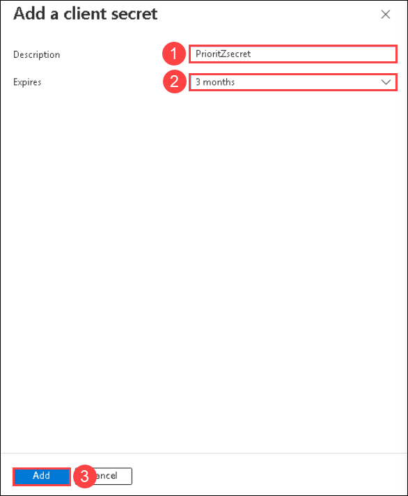

1. Copy the **Secret ID** and save it in a notepad as you need it for later use.

   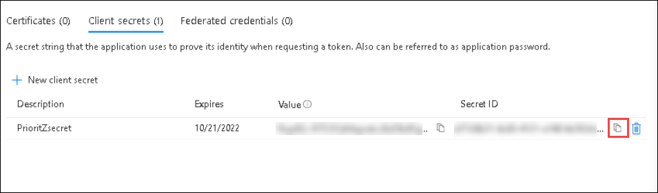

1. Select **API permissions** ***(1)*** from the side blade and click on **+ Add a permission** ***(2)***.
      
   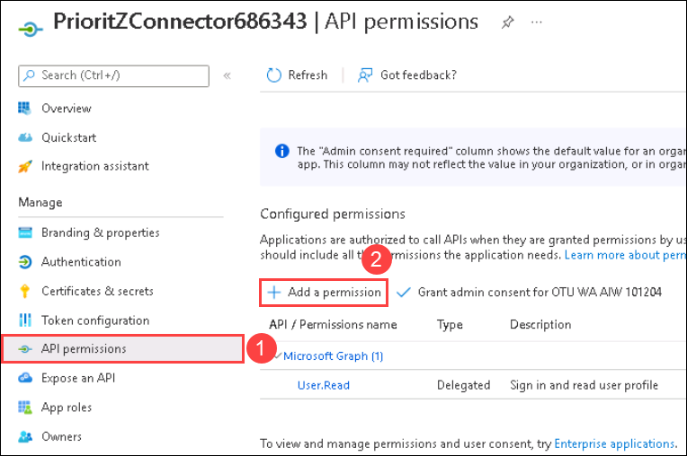

1. In the Request API Permissions tab, select the **My APIs** ***(1)*** tab and select **PrioritZFunc<inject key="DeploymentID" enableCopy="false" />** ***(2)***.
    
   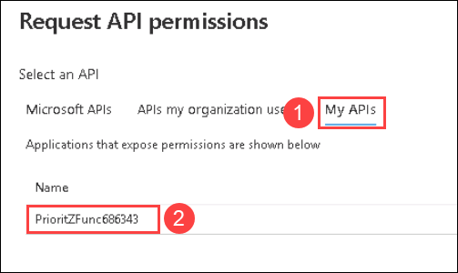
    
1. Toggle the **user_impersonation** ***(1)*** checkbox and click **Add permission** ***(2)***.

   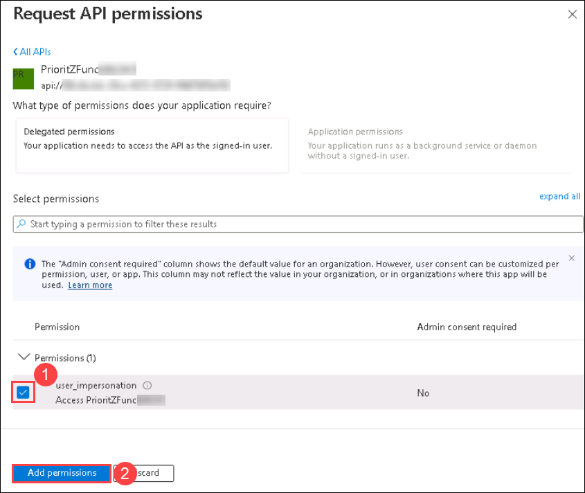
   
## Exercise 4 – Create Connector

In this exercise, you will create a new custom connector.

### Task 1: Create connector

1. Navigate to Azure Portal using the below URL.

   ```
   https://portal.azure.com/
   ```

1. Now in the Azure portal, click on **Resource Groups** present under Navigate.

   
 
1. Select the  **prioritzfunc<inject key="DeploymentID" enableCopy="false" />** resource Group from the list.

   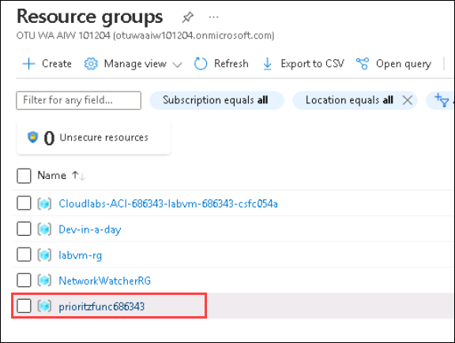

1. Select **PrioritZFunc<inject key="DeploymentID" enableCopy="false" />** function resource from the list.
     
   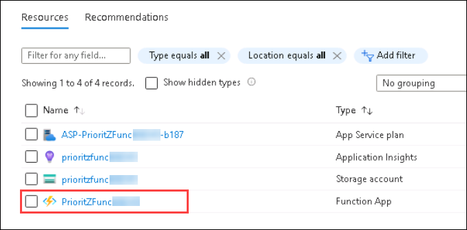
    
1. From the overview page, Copy the **URL** of the function. 
   
   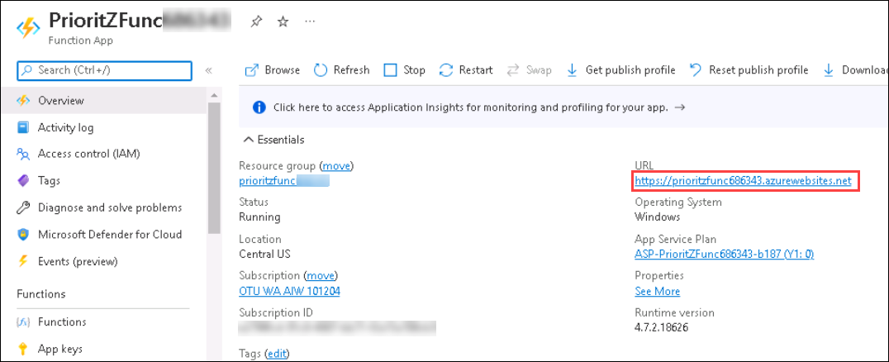 

1. Add **/api/swagger.json** to the end of the URL and access it using the browser.
     
   .png)
    
   >**Note**: If permissions prompt pops up, Click on **Accept** and continue.
   
1. Right click on the swagger and select **Save as** and Save the file in your local machine.
    
   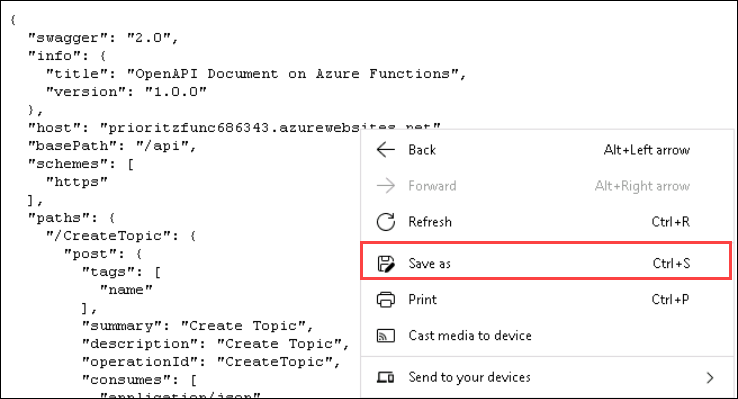 
   
1. Navigate to Power Apps maker portal by using below URL. Make sure the development environment is selected.
   ```
       https://make.powerapps.com
   ```
   
   
   
1. Expand **Dataverse** ***(1)*** and select **Custom Connectors** ***(1)***.
     
   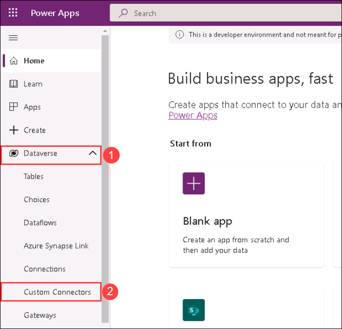 

1. Click on the chevron button next to the New custom connector and select **Import an OpenAPI file**.
     
   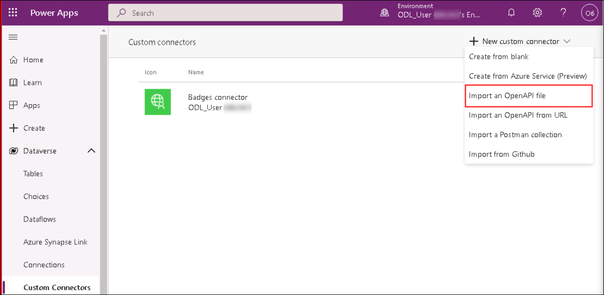 
    
1. Enter **PrioritZ Connector** ***(1)*** for name and click **Import** ***(2)***.
    
   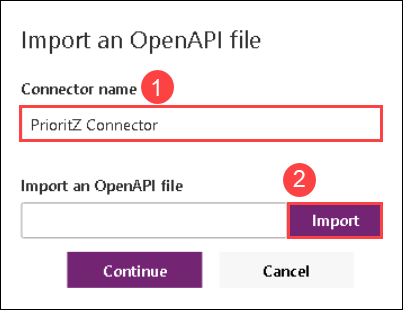 
    
1. Select the swagger file which you saved in step 7 of this task and Click **Continue**.

   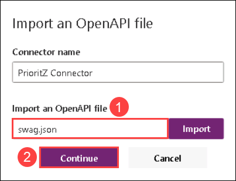 
 
1. Provide **PrioritZ<inject key="DeploymentID" enableCopy="false" /> Connector** ***(1)*** as description as and advance to **Security** ***(2)***.
    
   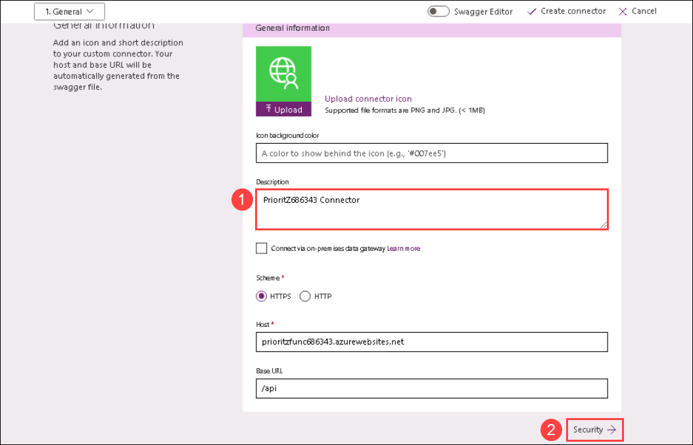 

16. Select **OAuth 2.0** ***(1)*** for Authentication type. Provide the following details and Click on **Create connector** ***(8)***.

    - Identity Provider: **Azure Active Directory** ***(2)***
    - Client id: Paste **PrioritZFL Connector application ID** ***(3)*** which you copied earlier
    - Client secret: Paste **PrioritZFL Connector Secret** ***(4)*** which you copied earlier
    - Tenant ID: Paste the **Tenant ID** ***(5)*** which you copied earlier
    - Resource URL: Paste **PrioritZ API application ID** ***(6)*** which you copied earlier
    - Enable on-behalf-of login: **true** ***(7)***

   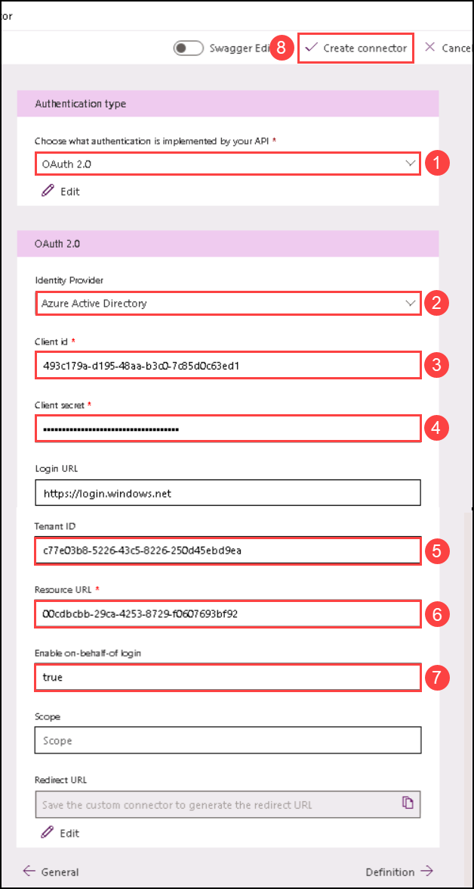 
   
### Task 2: Test connector

1. Select the **Test** ***(1)*** tab and click **+ New connection** ***(2)***.
     
   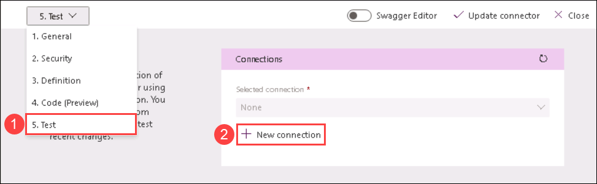 
    
1. Click on **Create**.

   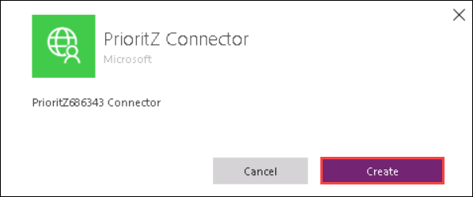 
   
1. If login prompt pops up enter the below credentials and click on **Accept** to accept the terms.

   * Email/Username: <inject key="AzureAdUserEmail"></inject>
   * Password: <inject key="AzureAdUserPassword"></inject>
   
7. Select **Custom connectors** and click **Edit** on the **PrioritZ connector**.
     
   .png)
    
7. Select the **Test** tab.
8. Make sure the connection you created is selected.
9. Turn on **Raw Body** and provide the JSON below and click **Test operation**.
    
    ```
          {
          "topic": "Test Topic",
          "details": "From Azure Function",
          "respondBy": "2022-11-01",
          "myNotes": "It worked",
          "choices": [
          {
          "choice": "Choice 1"
          }
          ]
          }
      ```
     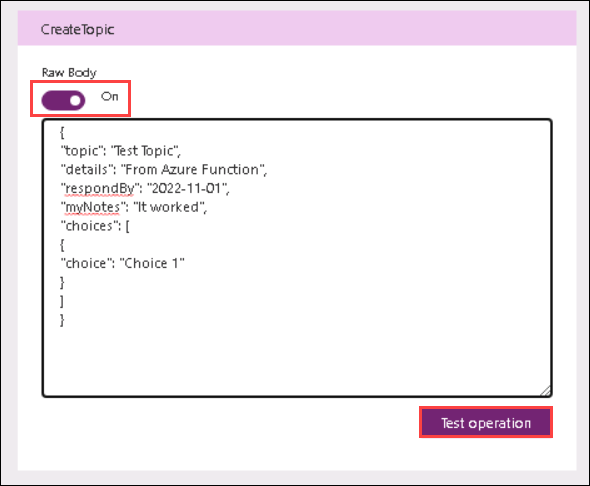 
        
 11. The operation test should succeed, and the response should look like the image below.

     .png)

### Exercise 5 – Use Function from Canvas App

In this exercise, you will use then Azure function you created via the custom connector from the PrioritZ
Admin canvas application.

### Task 1: Use function

1. Navigate to Power Apps maker portal a nd make sure you are in correct environment.
2. Select Apps, select the **PrioritZ Admin** application and click **Edit**.
     
   .png)

3. Select **Data** , click **+ Add data** , search for prioritz connector, and select the **PrioritZ Connector**
    you created.
     
    .png)
    
    
4. Add the connector by clicking again.
5. Click on the **... More actions** button of the connector you just added and select **Rename**.
    
   .png)
    
6. Rename the connector **PrioritZFunction**.
     
     .png)

7. Select the **Tree view** and expand the **Add Topic Screen**.
8. Select the **Add choice icon**.
 
    .png)
    
    
9. Replace the **OnSelect** formula of the **Add choice icon** with the formula below. This adjusts the
    column names to match the API and encodes the photos.
   
    .png)
   
      ```    
      Collect(
      colAddChoices,
      {
      choice: 'Choice name textbox'.Text,
      photoRaw: UploadedImage1.Image,
      photo: JSON(
      UploadedImage1.Image,
      JSONFormat.IncludeBinaryData
      )
      }
      );
      Reset('Choice name textbox');
      Reset(AddMediaButton2)
      ```


10. Select **Save topic icon**.
11. Replace the **OnSelect** formula of the **Save topic icon** with the formula below. This changes to
    have the API create the “ask”.
   
     .png)
   
      ```    
      Set(returnGuid, PrioritZFunction.CreateTopic({
      topic: 'Topic name textbox'.Text,
      details: 'Topic details textbox'.Text,
      respondBy: 'respond by date picker'.SelectedDate,
      myNotes: 'Notes textbox'.Text,
      photo: JSON(AddTopicImage.Image, JSONFormat.IncludeBinaryData),
      choices: ShowColumns(colAddChoices, "choice", "photo")
      }));
      Notify("Topic created! " & returnGuid, NotificationType.Success, 5000);
      Back();
      ```
    
12. Click **File** and select **Save**.
   
    
13. Click on the  back button.
14. Do not navigate away from this page.

### Task 2: Test application

1. Select the **Home Screen** and click **Preview the app**.
   
    .png)

2. Click on the **+** add button.
3. Enter **Function Test** for Topic, **Testing the function** for Details. **Note for testing the function** for
  Note, select a date for Response by, and click **add a picture**.

    .png)
    
4. Select any small image from your local machine.
5. Enter **Test choice one** for Choice and click **add a picture**.
6. Select any small image from your machine and click **+**.

     .png) 
    
7. Enter **Test choice two** for Choice and click **add a picture**.

8. Select any image from your machine and click **+**.

9. Click **Save**.
  
     .png)

10. The new topic should be saved, and you should be navigated back to the main screen.
11. Locate the new topic you created and open it.
    
     .png)
    
12. You should see the two choices you added to topic.

    .png)
