# Laboratorio 04: Función Azure

## Duración estimada: 110 minutos

Trabajando como parte del equipo de fusión de PrioritZ, configurará un conector personalizado para una nueva API que
compilar utilizando Azure Functions. El equipo ha decidido cambiar la lógica cuando un usuario crea una nueva "pregunta" a
la API de funciones de Azure. Esto mantendrá la fórmula de Power App simple y permitirá implementar una lógica más compleja.
agregado en el futuro. En esta práctica de laboratorio, creará la función, utilizará la API de Dataverse y protegerá la API con
Microsoft Entra ID configura un conector personalizado para usar la API y cambia la aplicación Power para usar la
conector.

Nota: Esta práctica de laboratorio requiere una suscripción (o prueba) de Azure en el mismo inquilino que su Dataverse.
ambiente.

## Objetivo de laboratorio

- Ejercicio 1: crear una función de Azure 
- Ejercicio 2: Implementación de funciones 
- Ejercicio 3: Publicar en Azure 
- Ejercicio 4: Crear conector 
- Ejercicio 5: Usar la función de la aplicación Canvas

## Ejercicio 1: creación de una función de Azure

En este ejercicio, instalará la extensión de herramientas de Azure para Visual Studio Code y creará la función

### Tarea 1: Instalar la extensión de herramientas de Azure

1. Inicie **Visual Studio Code** usando el acceso directo disponible en el escritorio.

   
    
1. Seleccione la pestaña **Extensiones**.

   

1. Busque **Azure tools (1)** y haga clic en **Instalar (2)** para instalar la extensión de Azure Tools.
  
    

1. Espere a que se complete la instalación.

1. Ahora debería ver la nueva extensión de Azure Tools que agregó.
    
    .png)

1. Haga clic en **Terminal** en el menú superior y seleccione **Nueva Terminal**.

1. Ejecute el siguiente comando en la terminal para crear una nueva carpeta.
   
   ```
   md ContosoFunctions
   ```
     .png)

### Tarea 2: crear una función

1. Seleccione **Herramientas de Azure (1)** en el menú de navegación de la izquierda y navegue hasta la sección **Espacio de trabajo (2)**.

    

1. Haga clic en el **símbolo(1)** que se muestra en la imagen, en la sección **Espacio de trabajo**, haga clic en **Crear función (2)** y haga clic en **Crear nuevo proyecto**.
   
    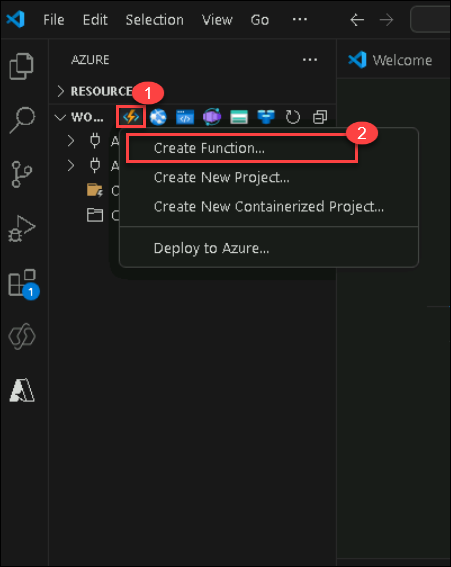

   >**Nota**: Si el símbolo **+** no está visible, seleccione la configuración y vea si se requieren actualizaciones para vscode y actualice la aplicación. Cierre el vscode actual, ábralo nuevamente y realice el paso anterior.

1. Seleccione la carpeta **ContosoFunctions (1)** que creó y haga clic en **seleccionar carpeta (2)**.

    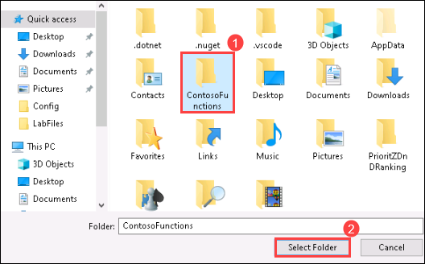

1. Ahora, se le presentará la siguiente ventana emergente, haga clic en **Sí** para crear un nuevo proyecto.

    

1. Seleccione **C#** para el idioma.

    

1. Seleccione **.NET 6.0 LTS** para el tiempo de ejecución de .NET.
 
    

1. Seleccione **Disparador HTTP con OpenAPI** como plantilla.

    

1. Ingrese **CreateTopic** como nombre de la función y presione **[ENTER].**
    
    .png)

1. Ingrese **Contoso.PrioritZ** para el espacio de nombres y presione **[ENTER]**.

    

1. Seleccione **Anónimo** para Derechos de acceso. Posteriormente protegeremos la función usando Microsoft Entra ID.
   
    

1. Si se le presenta la siguiente ventana, seleccione **Abrir en la ventana actual.**
  
    .png)

1. Su función debería abrirse en **Visual Studio Code**.

1. Si aparece una ventana emergente **¿Confías en los autores de los archivos de esta carpeta**? Haz clic en **Sí, confío en el autor**.

1. Haga clic en **Terminal** en el menú superior y seleccione **Ejecutar tarea de compilación**.
  
   .png)

1. Una vez que la compilación se haya realizado correctamente, **presione cualquier tecla para cerrar la terminal**.

    

## Ejercicio 2: implementación de funciones

En este ejercicio, implementará la función.

### Tarea 1: implementar la función

1. Haga clic en **Nuevo archivo** que está al lado de **ContosoFunctions** para agregar un archivo nuevo.
    
   .png)

1. Nombra el nuevo archivo **Model.cs**
  
   

1. Abra el nuevo archivo **Model.cs** y pegue el código siguiente. Esto definirá los datos que se enviarán.
    desde la aplicación Power.
   
      ```
      using System;
      using Microsoft.Azure.WebJobs.Extensions.OpenApi.Core.Attributes;
      using Microsoft.OpenApi.Models;
      namespace Contoso.PrioritZ
      {
      public class TopicItemModel
      {
      public string Choice { get; set; }
      public string Photo { get; set; }
      }
      public class TopicModel
      {
      [OpenApiProperty(Nullable = false, Description = "This is a topic")]
      public string Topic { get; set; }
      public string Details { get; set; }
      public DateTime RespondBy { get; set; }
      public string MyNotes { get; set; }
      public string Photo { get; set; }
      public TopicItemModel[] Choices {get;set;}
      }
      }
      ```
   Después de agregar el código, tu **Model.cs** se verá como la siguiente captura de pantalla:
   
   
   
1. Abra el archivo **CreateTopic.cs**.

1. Localice los atributos del método Ejecutar (números de línea 24 a 27) que están presentes encima del **método Ejecutar** y reemplácelos con los atributos siguientes. Esto proporciona nombres fáciles de usar cuando creamos un conector para usar la API.
    
       
      ```
      [FunctionName("CreateTopic")]
      [OpenApiOperation(operationId: "CreateTopic", tags: new[] { "name" }, Summary = "Create Topic", Description = "Create Topic", Visibility = OpenApiVisibilityType.Important)]
      [OpenApiSecurity("function_key", SecuritySchemeType.ApiKey, Name = "code", In = OpenApiSecurityLocationType.Query)]
      [OpenApiResponseWithBody(statusCode: HttpStatusCode.OK, contentType: "application/json", bodyType: typeof(Guid), Description = "The Guid response")]
      [OpenApiRequestBody(contentType: "application/json", bodyType: typeof(TopicModel))]
      ```
      
      Después de agregar los atributos, su **método de ejecución** debería verse como la siguiente captura de pantalla:
      
      .png)

1. Elimine **get** del método Ejecutar, ya que solo debería tener **post**.
  
    .png)

1. Haga clic en **Terminal** en el menú superior y seleccione **Nueva Terminal**.

1. Ejecute el siguiente comando en la terminal para agregar el paquete **Power Platform Dataverse Client**.

      ```
      dotnet add package Microsoft.PowerPlatform.Dataverse.Client
      ```
    .png)

1. Espere a que se agregue el paquete y luego ejecute el siguiente comando para agregar el paquete **Azure Identity**.
    
    ```
    dotnet add package Azure.Identity
    ```
1. Espere a que se agregue el paquete **Azure Identity**.

1. Abra el archivo **CreateTopic** y agregue las siguientes declaraciones después de la línea número 11.

      ```
      using System;
      using Microsoft.Identity.Client;
      using Azure.Core;
      using Azure.Identity;
      using Microsoft.PowerPlatform.Dataverse.Client;
      using Microsoft.Azure.WebJobs.Extensions.OpenApi.Core.Enums;
      using Microsoft.Xrm.Sdk;
      ```
      
     
  
1. Agregue el siguiente método después del método **Ejecutar**. Este método utilizará el token pasado desde el
    llamar a la aplicación para obtener un nuevo token que permitirá que la función use la API de Dataverse en nombre de
    el usuario que llama.
    
      ```
      public static async Task<string> GetAccessTokenAsync(HttpRequest req,string resourceUri)
      {
      //Get the calling user token from the request to use as UserAssertion
      var headers = req.Headers;
      var token = string.Empty;
      if (headers.TryGetValue("Authorization", out var authHeader))
      {
      if (authHeader[0].StartsWith("Bearer "))
      {
      token = authHeader[0].Substring(7, authHeader[0].Length -
      7);
      }
      }
      string[] scopes = new[] {$"{resourceUri}/.default" };
      string clientSecret = Environment.GetEnvironmentVariable("ClientSecret");
      string clientId = Environment.GetEnvironmentVariable("ClientID");
      string tenantId = Environment.GetEnvironmentVariable("TenantID");
      var app = ConfidentialClientApplicationBuilder.Create(clientId)
      .WithClientSecret(clientSecret)
      .WithAuthority($"https://login.microsoftonline.com/{tenantId}")
      .Build();
      //Get On Behalf Of Token for calling user
      UserAssertion userAssertion = new UserAssertion(token);
      var result = await app.AcquireTokenOnBehalfOf(scopes,
      userAssertion).ExecuteAsync();

      return result.AccessToken;
      }

     ```

    

1. Reemplace el código dentro del método **Ejecutar** con el código siguiente. Esto proporcionará una instancia de la
    API de Dataverse y utilice la función GetAccessToken que acabamos de definir.
    
      ```    
      _logger.LogInformation("Starting Create Topic");
      var serviceClient = new ServiceClient(
      instanceUrl: new Uri(Environment.GetEnvironmentVariable("DataverseUrl")),
      tokenProviderFunction: async uri => { return await
      GetAccessTokenAsync(req, Environment.GetEnvironmentVariable("DataverseUrl"));
      },
      useUniqueInstance: true,
      logger: _logger);
      if (!serviceClient.IsReady)
      {
      throw new Exception("Authentication Failed!");
      }
      ```

    

1. Agregue el siguiente código después de la declaración if del método **Ejecutar** para volver a serializar la solicitud. Este
    nos proporcionará los datos pasados ​​por la persona que llama.
    
      ```
      string requestBody = await new StreamReader(req.Body).ReadToEndAsync();
      var data = JsonConvert.DeserializeObject<TopicModel>(requestBody);

      ```
    

1. Agregue el siguiente código que crea la fila al método **Ejecutar** después del código que agregó en el paso anterior para **volver a serializar la solicitud**. Este código crea las filas en
    Dataverse es donde podríamos agregar más lógica en el futuro.
    
       ```
      var ask = new Entity("contoso_prioritztopic");
      ask["contoso_topic"] = data.Topic;
      ask["contoso_details"] = data.Details;
      ask["contoso_mynotes"] = data.MyNotes;
      ask["contoso_respondby"] = data.RespondBy.Date;
      if (data.Photo != null)
       {
      // Remove unnecessary double quotes,
      // Remove everything before the first comma (embedded stuff)
       ask["contoso_photo"] = Convert.FromBase64String(data.Photo.Trim('\"').Split(',')[1]);
       }
      var topicId = await serviceClient.CreateAsync(ask);
      foreach (var choice in data.Choices)
      {
       var item = new Entity("contoso_prioritztopicitem");
       item["contoso_choice"] = choice.Choice;
       item["contoso_prioritztopic"] = new
      EntityReference("contoso_prioritztopic", topicId);
      if (choice.Photo != null)
       {
       item["contoso_photo"] =
      Convert.FromBase64String(choice.Photo.Trim('\"').Split(',')[1]);
       }
       var choiceId = await serviceClient.CreateAsync(item);
      }

      ```

    

1. Agregue el siguiente código al método **Ejecutar** para devolver el ID del tema como JSON (requerido por Power Apps) después del código que agregó en el paso anterior para crear la fila para el método **Ejecutar**.

      ```
      return new OkObjectResult(topicId);
      ```
   
    

1. Haga clic en **Terminal (1)** y seleccione **Ejecutar tarea de compilación (2)**.

    

1. La carrera debería tener éxito. Presione cualquier tecla para detener.
    
     > **Nota** :

      1. Si la operación de la tarea de compilación falla con los errores, asegúrese de haber seguido las instrucciones anteriores y agregado el código correctamente en los archivos **CreateTopic.cs y Model.cs.**
      2. Además, puede encontrar los archivos **CreateTopic.cs y Model.cs** en la ubicación **C:\LabFiles**, puede comparar su código con estos archivos y solucionar los problemas, si los hay, y luego intentar hacerlo. realice **el paso 17 nuevamente**.

## Ejercicio 3: Publicar en Azure

En este ejercicio, implementará la función en Azure.

### Tarea 1: Publicar

1. Seleccione **Herramientas de Azure** en el menú del lado izquierdo.

    

1. Haga clic en **Iniciar sesión en Azure** en la sección **Recursos**.
   
   
    
1. Complete el proceso de **Iniciar sesión** utilizando las siguientes credenciales.

   * Correo electrónico/nombre de usuario: <inject key="AzureAdUserEmail"></inject>
   * Contraseña: <inject key="AzureAdUserPassword"></inject>

1. Cierre la ventana del navegador de inicio de sesión una vez que se complete el proceso de inicio de sesión.

1. Vuelva a Visual Studio Code y haga clic en **+** que está al lado de la **pestaña Recursos** para crear una nueva aplicación de funciones.
  
    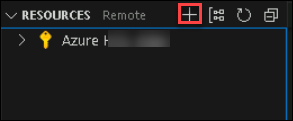
 
1. Ahora, busque y seleccione **Crear aplicación de funciones en Azure**.

    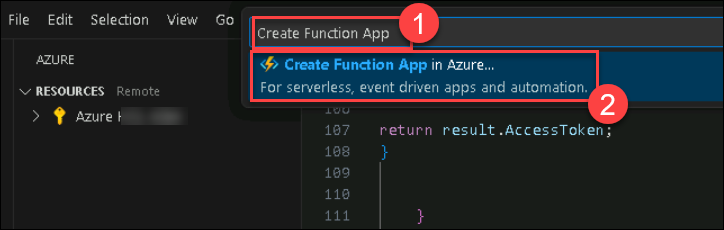

1. Ingrese **PrioritZFunc<inject key="Deployment ID" enableCopy="false" />** para el nombre de la aplicación de función y presione [ENTER].

    

1. Seleccione **.NET 6(LTS) en proceso**.

    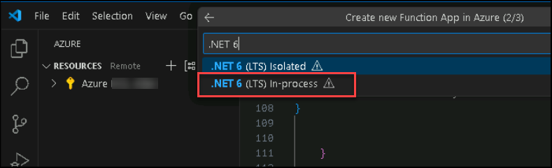

1. Seleccione la ubicación: **<inject key="Region" enableCopy="false" />** de la lista y espere a que se implemente la aplicación de función.

    
    
1. Una vez implementada la aplicación de funciones, haga clic en **Implementar en Azure** en la sección **Espacios de trabajo** y elija la aplicación de funciones que creó.
    
     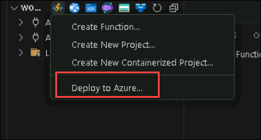
   
     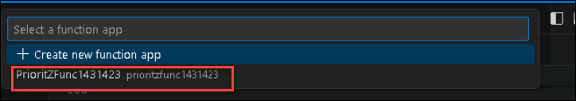

1. Espere a que se implemente la aplicación de funciones y luego navegue hasta Azure Portal utilizando la siguiente URL.

    ```
    https://portal.azure.com/
    ```
    
1. Seleccione **Todos los recursos**, busque la aplicación de funciones **PrioritZFunc<inject key="Deployment ID" enableCopy="false" />** que implementó anteriormente y haga clic para abrirla.
  
     

1. Seleccione **Autenticación (1)** en el menú del lado izquierdo y haga clic en **Agregar proveedor de identidad (2)**.
  
     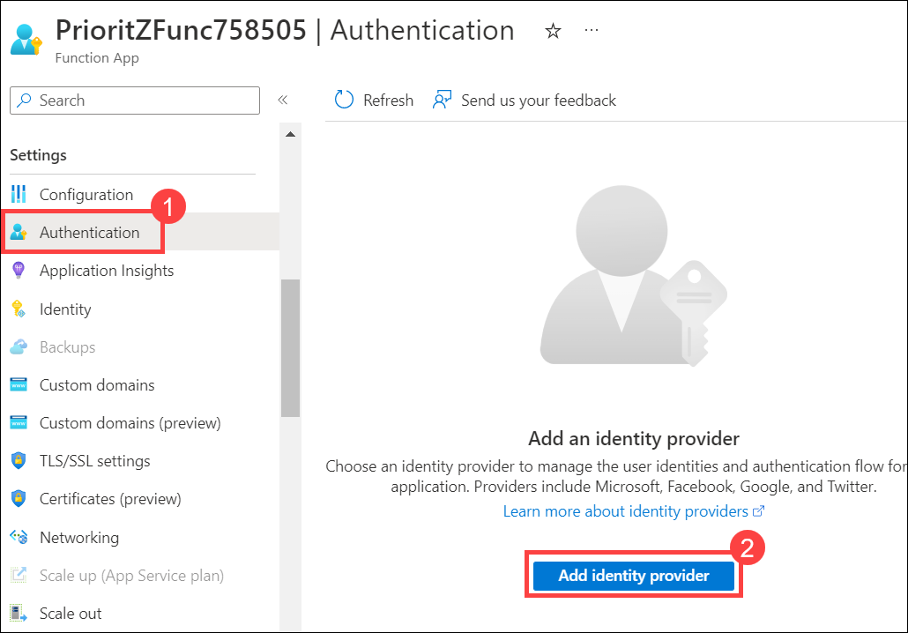

1. Seleccione **Microsoft** para Proveedor de identidad e **Inquilino actual - Inquilino único** para **Tipos de cuenta admitidos** y luego haga clic en **Agregar**.
   
     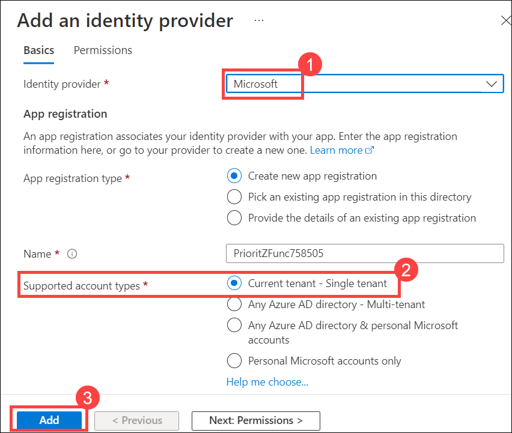

1. Abra el **menú Portal** haciendo clic en el icono del menú Portal.

     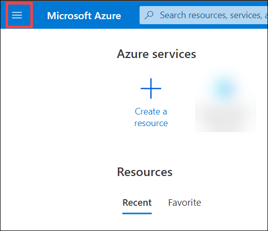

1. Seleccione **Microsoft Entra ID** de la lista de recursos.
    
     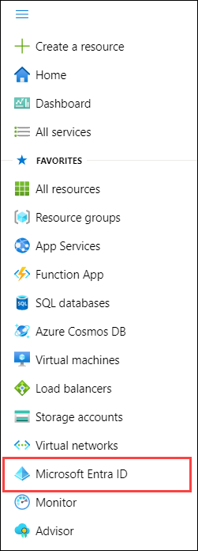

1. Seleccione **Registros de aplicaciones** en **Administrar** en el menú del lado izquierdo.

    
    
1. Haga clic para abrir **PrioritZFunc<inject key="Deployment ID" enableCopy="false" />** para abrir la aplicación.
     
     

1. Copie el **ID de aplicación (cliente)** del registro de la aplicación **PrioritZFunc<inject key="Deployment ID" enableCopy="false" />** y guárdelo en un
    bloc de notas como **ID de aplicación API PrioritZFL**. Necesitará esta identificación en pasos futuros. Este ID se utilizará para configurar la protección de la API.
    
    .png)
    
    .png)
    
    >**Nota**: Asegúrese de copiar y pegar el valor correcto de **ID de aplicación (cliente)**. Copiar el valor incorrecto provocará problemas en los siguientes pasos/tareas.

1. Copie el **ID del directorio (inquilino)** y guárdelo en un bloc de notas como **ID del inquilino**. Necesitará esta identificación en pasos futuros.
  
    .png)
    
    >**Nota**: Asegúrese de copiar y pegar el valor correcto de **ID de directorio (inquilino)**. Copiar el valor incorrecto provocará problemas en los siguientes pasos/tareas.

1. Seleccione **Certificados y secretos** en **Administrar** en el menú del lado izquierdo.

    

1. Haga clic en **+ Nuevo secreto de cliente**.
  
     .png)

1. Proporcione una descripción como **PrioritZ API secret(1)**, seleccione **3 meses(2)** y haga clic en **Agregar(3)**.
    
    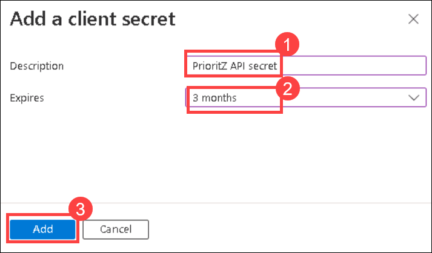

1. Copie el **Valor** y guárdelo en un bloc de notas como **PrioritZFL API Secret**. Necesita este valor en pasos futuros.
    
    >**Nota**: Asegúrese de copiar y pegar el valor **Secreto** correcto. Copiar el valor incorrecto provocará problemas en los siguientes pasos/tareas.

1. Seleccione **Permisos de API** en **Administrar** en el menú del lado izquierdo.

    
    
1. Haga clic en **+ Agregar un permiso**.
  
     .png)

1. Seleccione **Dynamics CRM** de la lista de permisos de API. Dynamics CRM es Dataverse, el portal de Azure simplemente no se ha actualizado al momento de escribir estos pasos.
     
     

1. Marque la casilla de verificación **user_impersonation** y haga clic en **Agregar permiso**.

    u.png)

1. Vuelva a **Inicio** y abra la aplicación de función **PrioritZFunc<inject key="Deployment ID" enableCopy="false" />**.
   
     

1. Seleccione **Variables de entorno (1)** en **Configuración** en el menú del lado izquierdo.
  
1. lamer **+ Agregar (2)**.
     
     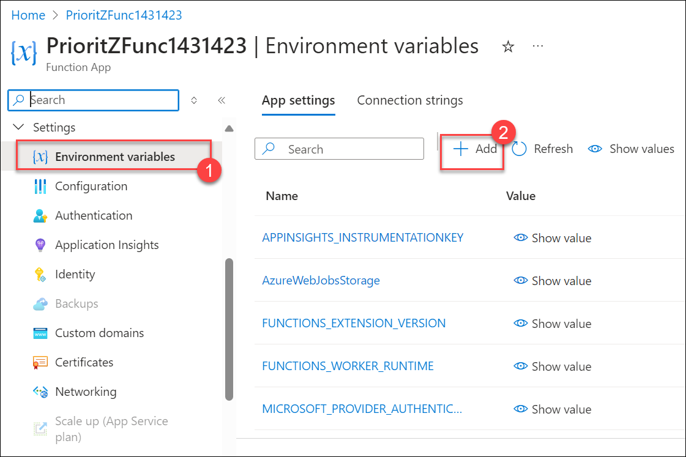

1. Ingrese los siguientes detalles en la hoja **Agregar/Editar configuración de la aplicación** y haga clic en **Aplicar (3)**.
      
      - **Nombre**: **ID de cliente (1)**
      - **Valor**: Pegue el **ID de aplicación API PrioritZFL (2)** que anotó anteriormente en el bloc de notas.

     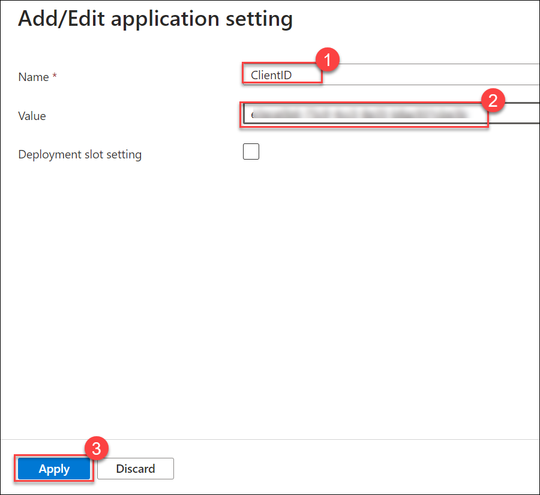

1. Haga clic en **+ Agregar** nuevamente.

1. Ingrese los siguientes detalles en la hoja **Agregar/Editar configuración de la aplicación** y haga clic en **Aplicar (3)**.
      
      - **Nombre**: **ClienteSecreto (1)**
      - **Valor**: Pegue el **PrioritZFL API Secret (2)** que anotó anteriormente en el bloc de notas.

     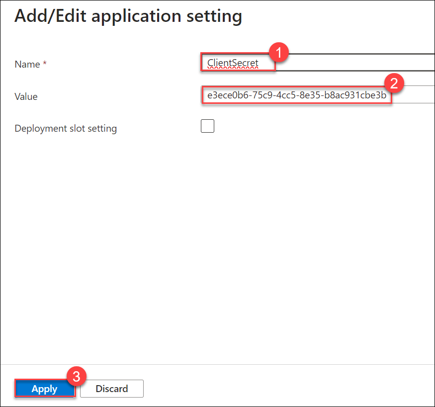
     
1. Haga clic en **+ Agregar** nuevamente.

1. Ingrese los siguientes detalles en la hoja **Agregar/Editar configuración de la aplicación** y haga clic en **Aplicar (3)**.
      
      - **Nombre**: **ID de inquilino (1)**
      - **Valor**: pegue el **TenantID (2)** que anotó anteriormente en el bloc de notas.

     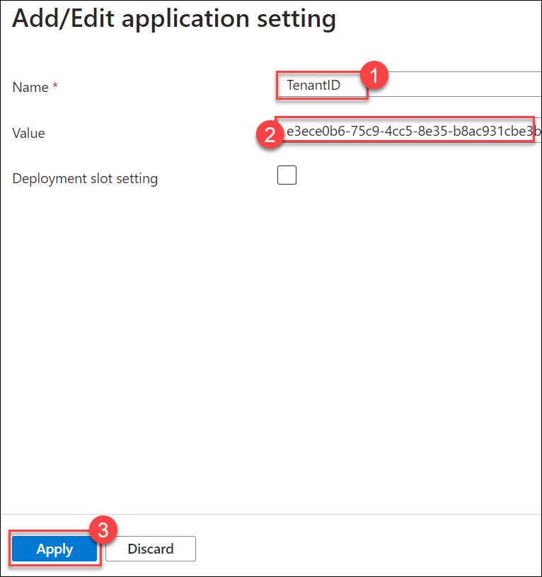
     
1. Inicie una nueva ventana o pestaña del navegador, navegue hasta el centro de administración de Power Platform y seleccione **Entornos**.

      ```
        https://admin.powerplatform.microsoft.com/environments
      ```

1. Haga clic para abrir el entorno de desarrollo denominado **DEV_ENV_<inject key="Deployment ID" enableCopy="false" />** que está utilizando para esta práctica de laboratorio.

1. Copie la **URL del entorno** y péguela en el bloc de notas.

     .png)

1. Haga clic en **+ Agregar** una vez más.

1. Ingrese los siguientes detalles en la hoja **Agregar/Editar configuración de la aplicación** y haga clic en **Aplicar**.
      
      - **Nombre**: **DataverseURL**
      - **Valor**: pegue la **URL del entorno** que anotó anteriormente en el bloc de notas.
      
    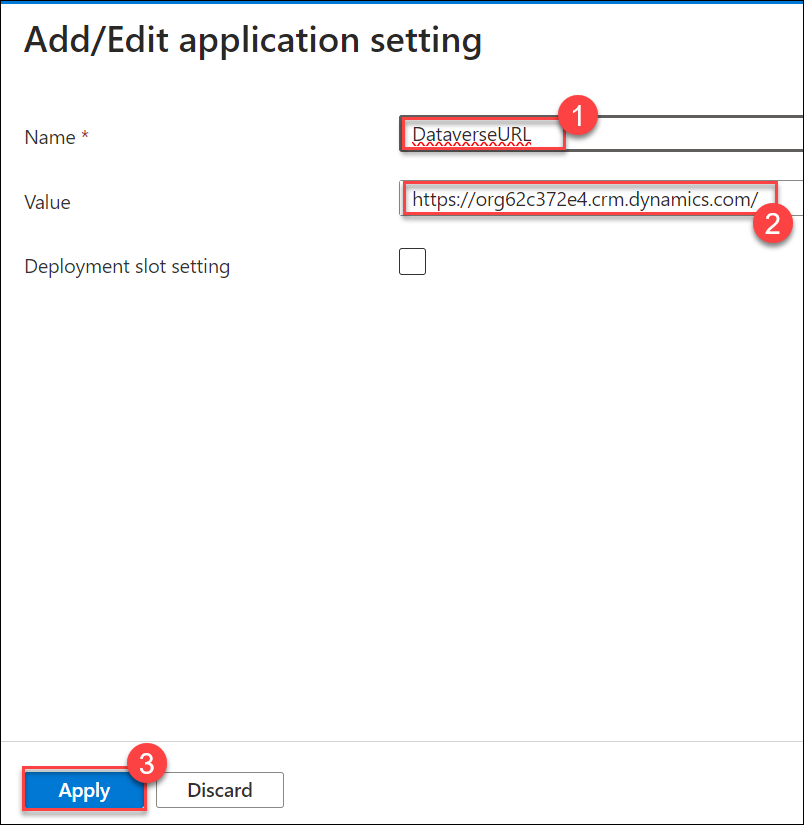

    >**Nota**: asegúrese de pegar la **URL del entorno** correcta que anotó anteriormente en esta tarea. Copiar el valor incorrecto provocará problemas en los siguientes pasos/tareas.

1. Debería ver las cuatro configuraciones de la aplicación que agregó.
  
     .png)

1. Haga clic en **Aplicar** y en la ventana emergente **Guardar cambios**, haga clic en **Confirmar**.

1. Pegue la siguiente URL en el Bloc de notas y reemplace `{tenant id}` y `{api app id}` con los valores **tenant id** y **PrioritZFL API application ID** de su
    bloc.

    ```
     https://login.microsoftonline.com/{tenant-id}/adminconsent?client_id={api app id}
     ```
     
     Después de actualizar los valores, su URL debería verse así: `https://login.microsoftonline.com/2140cxxxxxxx/adminconsent?client_id=195b2axxxxxxx`
 
1. Después de actualizar los valores, navegue hasta la URL en una pestaña del navegador e inicie sesión con las siguientes credenciales.
   
   * Correo electrónico/nombre de usuario: <inject key="AzureAdUserEmail"></inject>
   * Contraseña: <inject key="AzureAdUserPassword"></inject>
   
1. Haga clic en **Aceptar**.

### Tarea 2: Registrar la aplicación Connector Client

1. Navegue hasta Azure Portal, luego busque **Microsoft Entra ID** ***(1)*** en la barra de búsqueda y seleccione **Microsoft Entra ID** ***(2)*** en las sugerencias.

   

1. Seleccione **Registros de aplicaciones** ***(1)*** en la hoja lateral y haga clic en **+ Nuevo registro** ***(2)***. Este registro de aplicación se utilizará para que el conector acceda a la API protegida.
   
   

1. Proporcione los siguientes detalles y haga clic en **Registrarse** ***(5)***.
   
   - Nombre: **PrioritZConnector<inject key="DeploymentID" enableCopy="false" />** ***(1)***
   - Tipos de cuenta admitidos: **Cuentas en este directorio organizacional únicamente (solo Nombre de inquilino - Inquilino único)** ***(2)***
   - URL de redireccionamiento: seleccione **Web** ***(3)*** y proporcione `https://global.consent.azure-apim.net/redirect` ***(4)*** como la URL.

   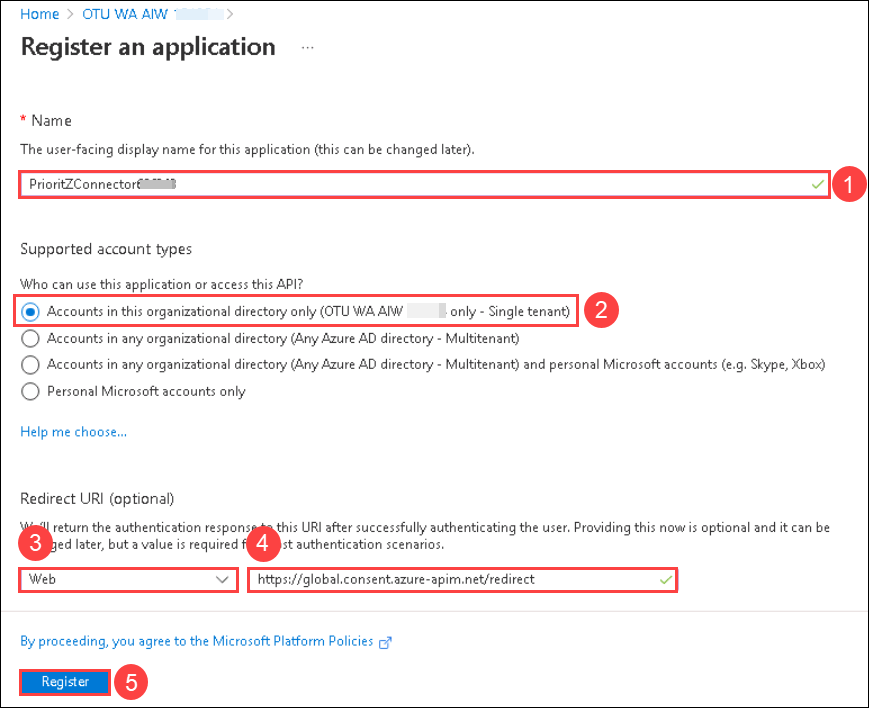
    
1. Copie el **ID de la aplicación (cliente)** y guárdelo en un bloc de notas como **ID de la aplicación PrioritZ Connector**.
     
   
    
1. Seleccione **Certificados y secretos** en la hoja lateral y haga clic en **+ Nuevo secreto de cliente**.
   
   
    
1. Proporcione **PrioritZsecret** ***(1)*** como descripción, establezca el vencimiento en **3 meses** ***(2)*** y haga clic en **Agregar** ***(3). )***.

   

1. Copie el **Valor secreto** y guárdelo en un bloc de notas como **Secreto de PrioritZ Connector**.

   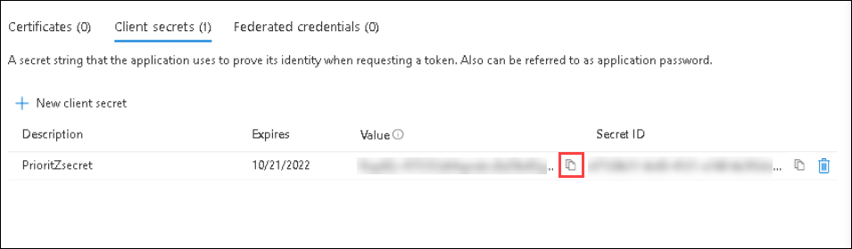

1. Seleccione **Permisos de API** ***(1)*** en la hoja lateral y haga clic en **+ Agregar un permiso** ***(2)***.
      
   

1. En la pestaña Solicitar permisos de API, seleccione la pestaña **Mis API** ***(1)*** y seleccione **PrioritZFunc<inject key="DeploymentID" enableCopy="false" />** ***( 2)***.
    
   
    
1. Active la casilla de verificación **user_impersonation** ***(1)*** y haga clic en **Agregar permiso** ***(2)***.
   
   
   
## Ejercicio 4: crear conector

En este ejercicio, creará un nuevo conector personalizado.

### Tarea 1: crear un conector

1. Navegue hasta Azure Portal usando la siguiente URL.

   ```
   https://portal.azure.com/
   ```

1. Ahora, en Azure Portal, haga clic en **Grupos de recursos** presente en Navegar.

   
 
1. Seleccione el grupo de recursos **prioritzfunc<inject key="DeploymentID" enableCopy="false" />** de la lista.
   
   

1. Seleccione el recurso de función **PrioritZFunc<inject key="DeploymentID" enableCopy="false" />** de la lista.
     
   
    
1. Desde la página de descripción general, copie la **URL** de la función.
   
    

1. Agregue **/api/swagger.json** al final de la URL y acceda a ella mediante el navegador.
     
   .png)
    
   >**Nota**: Si aparece el mensaje de permisos, haga clic en **Aceptar** y continúe.
   
1. Haga clic derecho en swagger, seleccione **Guardar como** y guarde el archivo en su máquina local. Proporcione un nombre para el archivo como swag.json.
    
    
   
1. Navegue hasta el portal del creador de Power Apps utilizando la siguiente URL. Asegúrese de que el entorno de desarrollo esté seleccionado.
   
   ```
   https://make.powerapps.com
   ```
1. Expanda **Dataverse** ***(1)*** y seleccione **Conectores personalizados** ***(1)***.
     
    

1. Haga clic en el botón de Chevron al lado del Nuevo conector personalizado y seleccione **Importar un archivo OpenAPI**.
     
    
    
1. Ingrese **PrioritZ Connector** ***(1)*** como nombre y haga clic en **Importar** ***(2)***.
    
    
    
1. Seleccione el **archivo swagger (1)** que guardó en el paso 7 de esta tarea y haga clic en **Continuar (2)**.

    
 
1. Proporcione **PrioritZ<inject key="DeploymentID" enableCopy="false" /> Conector** ***(1)*** como descripción y haga clic en **Seguridad** ***(2)*** .
    
    

1. Seleccione **OAuth 2.0** ***(1)*** para Tipo de autenticación. Proporcione los siguientes detalles y haga clic en **Crear conector** ***(8)***.

    - Proveedor de identidad: **Azure Active Directory** ***(2)***
    - ID de cliente: Pegue **ID de aplicación de PrioritZ Connector** ***(3)*** que copió anteriormente
    - Secreto del cliente: Pegue **PrioritZ Connector Secret** ***(4)*** que copió anteriormente
    - ID de inquilino: pegue el **ID de inquilino** ***(5)*** que copió anteriormente.
    - URL del recurso: Pegue **ID de aplicación API PrioritZ** ***(6)*** que copió anteriormente
    - Habilitar en nombre de inicio de sesión: **verdadera** ***(7)***

    
   
### Tarea 2: conector de prueba

1. Ahora navegue hasta el conector que acaba de crear y haga clic en el botón **editar**. Seleccione la pestaña **Prueba** ***(1)*** del menú desplegable y haga clic en **+ Nueva conexión** ***(2)***.
     
    
    
1. Haga clic en **Crear**.

    
   
1. Si aparece el mensaje de inicio de sesión, ingrese las siguientes credenciales y haga clic en **Aceptar** para aceptar los términos.

   * Correo electrónico/nombre de usuario: <inject key="AzureAdUserEmail"></inject>
   * Contraseña: <inject key="AzureAdUserPassword"></inject>
   
1. Una vez creado el conector, seleccione **Conectores personalizados (1)** en el menú del lado izquierdo y haga clic en **Editar (2)** en el **conector PrioritZ**.
     
   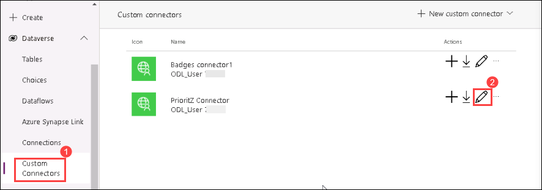
    
1. Seleccione **Prueba** en la pestaña del menú desplegable.

    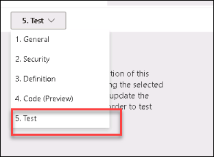
    
1. Asegúrese de que la conexión que creó esté seleccionada.

    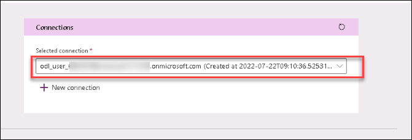
    
1. Active **Raw Body**, proporcione el JSON a continuación y haga clic en **Probar operación**.
    
    ```
          {
          "topic": "Test Topic",
          "details": "From Azure Function",
          "respondBy": "2022-11-01",
          "myNotes": "It worked",
          "choices": [
          {
          "choice": "Choice 1"
          }
          ]
          }
      ```
      
        
 1. La prueba de funcionamiento debería tener éxito y la respuesta debería verse como la imagen a continuación.

     .png)

### Ejercicio 5: utilizar la función de la aplicación Canvas

En este ejercicio, utilizará la función de Azure que creó a través del conector personalizado de PrioritZ.
Aplicación de lienzo de administración.

### Tarea 1: usar la función

1. Navegue hasta el portal del creador de Power Apps y asegúrese de estar en el entorno correcto.

1. Seleccione Aplicaciones, seleccione la aplicación **PrioritZ Admin** y haga clic en **Editar**.
     
   .png)

1. Seleccione **Datos**, haga clic en **+ Agregar datos**, busque el conector Prioritz y seleccione el **Conector PrioritZ** que creó.
     
    .png)
       
1. Agregue el conector haciendo clic en él nuevamente.

1. Haga clic en el botón **... Más acciones** del conector que acaba de agregar y seleccione **Cambiar nombre**.
    
   .png)
    
1. Cambie el nombre del conector **PrioritZFunction**.
     
     .png)

1. Seleccione la **Vista de árbol** y expanda la **Pantalla Agregar tema**.
    
    

1. Seleccione el icono **Agregar opción**.
 
    .png)
        
1. Reemplace la fórmula **OnSelect** del **Ícono Agregar opción** con la siguiente fórmula. Esto ajusta los nombres de las columnas para que coincidan con la API y codifica las fotos.
   
    .png)
   
      ```    
      Collect(
      colAddChoices,
      {
      choice: 'Choice name textbox'.Text,
      photoRaw: UploadedImage1.Image,
      photo: JSON(
      UploadedImage1.Image,
      JSONFormat.IncludeBinaryData
      )
      }
      );
      Reset('Choice name textbox');
      Reset(AddMediaButton2)
      ```

1. Seleccione **Icono para guardar tema**.

1. Reemplace la fórmula **OnSelect** del **icono Guardar tema** con la siguiente fórmula. Esto cambia para que la API cree la "pregunta".
   
     
     .png)
   
      ```    
      Set(returnGuid, PrioritZFunction.CreateTopic({
      topic: 'Topic name textbox'.Text,
      details: 'Topic details textbox'.Text,
      respondBy: 'respond by date picker'.SelectedDate,
      myNotes: 'Notes textbox'.Text,
      photo: JSON(AddTopicImage.Image, JSONFormat.IncludeBinaryData),
      choices: ShowColumns(colAddChoices, "choice", "photo")
      }));
      Notify("Topic created! " & returnGuid, NotificationType.Success, 5000);
      Back();
      ```
    
1. Haga clic en **Guardar**.

1. Haga clic en **Publicar**.

1. Seleccione **Publicar esta versión** y espere a que se complete la publicación.

1. No salgas de esta página.

### Tarea 2: Aplicación de prueba

1. Seleccione la **Pantalla de inicio** y haga clic en **Vista previa de la aplicación**.
   
    .png)

1. Haga clic en el botón **+** agregar.

1. Ingrese **Prueba de función** para Tema, **Probando la función** para Detalles. **Nota para probar la función** para Nota, seleccione una fecha para Responder antes y haga clic en **agregar una imagen**.

    .png)
    
1. Navegue hasta esta ruta **C:\LabFiles** en el explorador de archivos, seleccione **image.png** y haga clic en abrir.

1. Ingrese **Pruebe la opción uno** para Elección y haga clic en **agregar una imagen**.

1. Navegue hasta esta ruta **C:\LabFiles** en el explorador de archivos, seleccione **image.png** y haga clic en **+**.

     .png) 
    
1. Ingrese **Opción de prueba dos** para Elección y haga clic en **agregar una imagen**.

1. Navegue hasta esta ruta **C:\LabFiles** en el explorador de archivos, seleccione **image.png** y haga clic en **+**.

1. Haga clic en **Guardar**.
  
     .png)

1. El nuevo tema debería guardarse y volver a la pantalla principal.

1. Localiza el nuevo tema que creaste y ábrelo.
    
     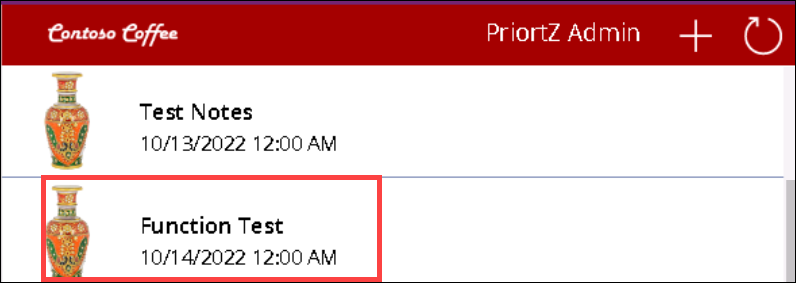
    
1. Deberías ver las dos opciones que agregaste al tema.

    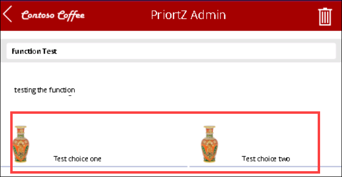

## Resumen

En esta práctica de laboratorio, aprendió a crear, implementar y publicar una función de Azure, crear un conector para ella y probar su integración dentro de las aplicaciones de Power Platform.

## Has completado este laboratorio con éxito. Haz clic en el botón **Siguiente >>** para continuar con el próximo laboratorio.


