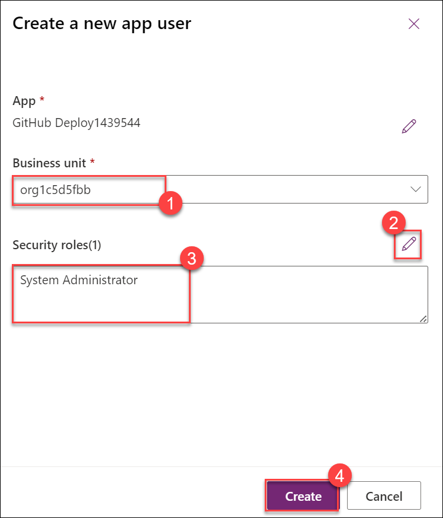
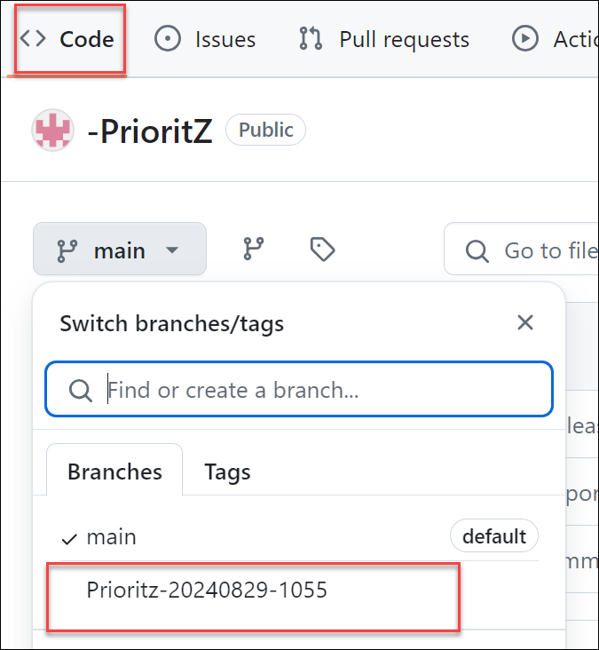
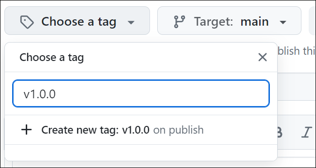
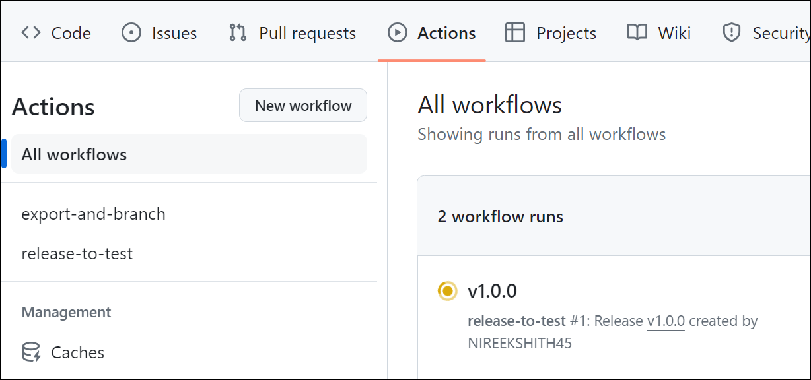

# Laboratório 04 - Gestão do ciclo de vida da aplicação

## Duração estimada: 90 minutos

Trabalhando como parte da equipa de PrioritZ fusion, estará a configurar GitHub Actions com as ferramentas de Power Platform para automatizar e agilizar as implementações da equipa. Isto envolve a configuração da integração contínua e dos pipelines de implementação contínua (CI/CD) para garantir a entrega perfeita e eficiente de atualizações nas aplicações Power Platform, ao mesmo tempo que gere os processos de controlo, teste e implementação de versão para melhorar a colaboração e manter padrões de alta qualidade em todo o projetos da equipa.

Objectivos de laboratório

- Exercício 1: Configure um Service Principal
- Exercício 2: Criar o GitHub Repo
- Exercício 3: Exportação e Branching
- Exercício 4: Lançar para Testes

## Exercício 1 – Configure um Service Principal

Neste exercício, criará um service Principal. O service Principal será utilizado pelo GitHub Actions, para que não sejam executadas sob a sua identidade individual do utilizador.

### Tarefa 1: Criar registo de aplicações

1. Navegue de volta ao separador do navegador em que o Portal do Azure está aberto. Se ainda não estiver aberto, navegue até ao Portal Azure utilizando o URL abaixo.

    ```
    https://portal.azure.com/
    ```

1. Na página inicial do Portal do Azure, pesquise por **Microsoft Entra ID** ***(1)*** na barra de pesquisa e seleccione **Microsoft Entra ID** ***(2)***.

    

1. Selecione **App registrations** ***(1)*** da lâmina lateral e clique em **+ New registration** ***(2)***. Este registo de aplicação será utilizado para o conector para aceder à API protegida.

    

1. Forneça os seguintes detalhes e clique em **Register** ***(3)***.

    - Nome: **GitHub Deploy<inject key="DeploymentID" enableCopy="false" />** ***(1)***
    - Tipos de conta suportados: **Accounts in this organizational directory only (OTU WA AIW [SUFFIX] only - Single tenant)** ***(2)***

        

1. Copie o **Application (client) ID**, **Directory(Tenant) ID** e guarde-o num bloco de notas, pois precisa deles para utilização posterior.

    

1. Selecione **Certificates & secrets** na lâmina lateral e clique em **+ New client secret**.

    

1. Introduza **GitHub client secret<inject key="DeploymentID" enableCopy="false" />** ***(1)*** como descrição, define expiro para **3 months** ***(2 )*** e clique em **Add** ***(3)***.

    

1. Copie o **valor** e guarde-o num bloco de notas conforme necessário para utilização posterior.

    

    >**Nota**: Certifique-se de que copia os valores corretos de **Application (client) ID**, **Directory(Tenant) ID** and **Secret**. Copiar o valor incorreto resultará em problemas nos próximos passos/tarefas.

### Tarefa 2: Crie um novo Dataverse

Nesta tarefa, irá um novo teste de ambientes Dataverse.

1. Abra uma nova janela ou aba do browser e navegue até ao Power Platform Admin Center utilizando o URL abaixo.

    ```
    https://admin.powerplatform.microsoft.com/environments
    ```

1. Clique em **+New** para criar um novo Dataverse.

    

1. No separador **New environment**.

    - Name:**DEV_ENV_TEST(1)**.

    - Make this a Managed Environment:**Ativar Sim(2)**.

    - Group:**None(3)**. e desça.

    - Type :**Developer(4)** e clique em **Next(5)**.

    - Deploy sample apps and data? :**Ativar Sim(6)** e clique em **Save(7)**.

        

        

        

1. Agora pode ver o novo Dataverse, **DEV_ENV_TEST**, que criou.

    

### Tarefa 3: Crie um utilizador de aplicação no Dataverse

Nesta tarefa, irá registar a aplicação que criou no Microsoft Entra ID nos ambientes de dev e test de Dataverse. Será também atribuídas permissões ao service principle para implementar soluções


1. Abra uma nova janela ou aba do browser e navegue até ao Power Platform Admin Center utilizando o URL abaixo.

    ```
    https://admin.powerplatform.microsoft.com/environments
    ```

1. Clique em **Environments** ***(1)*** da lâmina lateral e seleccione o seu **DEV_ENV_<inject key="DeploymentID" enableCopy="false" />'s environment** ***(2)***.

    

1. Na página do seu ambiente, clique em **Settings**.

    

1. Expandir **Users + permissions** **(1)** e seleccione **Application users** **(2)**.

    

1. Na página utilizadores da aplicação, clique em **+ New app user**.

    

1. Na guia do utilizador da aplicação, clique em **+ Add an app**.

    

1. Selecione o **GitHub Deploy<inject key="DeploymentID" activityCopy="false" />** ***(1)*** registo de aplicação que criou anteriormente e clique em **Add** **( 2)**.

    

1. Digite **org** e selecione sua **unidade de negócios** **(1)** e em **Funções de segurança** clique em **editar símbolo (2)** e selecione 
   **Administrador do sistema(3)** e clique em **Criar (4)**.

    

1. Volte a recuar para **Environments** ***(1)*** na lâmina lateral e seleccione o seu **test environment** ***(2)***.

    

1. Na página de ambiente de teste, clique em **Settings**.

    

1. Expandir **Users + permissions** ***(1)*** e seleccione **Application users** ***(2)***.

    

1. Na página utilizadores da aplicação, clique em **+ New app user**.

    

1. No separador **Create a new app user**, clique em **+ Add an app**.

    

1. Selecione o **GitHub Deploy<inject key="DeploymentID" activityCopy="false" />** ***(1)*** registo de aplicação que criou anteriormente e clique em **Add** ***(2)***.

    

1. Digite **org** e selecione sua **unidade de negócios** **(1)** e em **Funções de segurança** clique em **editar símbolo (2)** e selecione 
   **Administrador do sistema(3)** e clique em **Criar (4)**.

    

1. Clique em **Environments** ***(1)*** e seleccione o seu **DEV_ENV_<inject key="DeploymentID" enableCopy="false" />'s environment** ***(2)***.

    

1. Copie o **Environment URL** e guarde-o num bloco de notas, estará a utilizar este URL em passos futuros.

    

1. Volte para **Environments** ***(1)*** e seleccione **test environment(2)**.

    

1. Copie o **Environment URL** e guarde-o num bloco de notas, estará a utilizar este URL em passos futuros.

    

## Exercício 2 – Crie o GitHub Repo

Neste exercício, criará um repositório do GitHub e adicionar segredos do repositório.

### Tarefa 1: Crie um repositório

1. Navegue até ao URL abaixo e inscreva-se utilizando as suas credenciais do GitHub.

    ```
    https://github.com/
    ```

1. Clique no ícone do seu perfil e selecione **Your repositories**.

    

3. Clique em **New repository** para criar um repositório.

    

4. Introduza **PrioritZ (1)** para o nome do repositório, seleccione **Public (2)** , verifique o **Add a README file (3)**.

    

1. Clique em **Create repository** para o criar.

    

5. Clique em **Settings** para abrir o separador de definições.

    

6. Aceda à secção **Security**, expanda **Secrets and variables (1)** e seleccione **Actions (2)**.

    > **Nota:** Os valores que fornece não serão visíveis depois de criar o item, por isso tenha pressa para acertar os valores.

    

7. Clique em **New repository secret** para adicionar um segredo.

    

8. Introduza **PowerPlatformAppID (1)** para Nome e cole o **Application (client) ID (2)** de **GitHub Deploy<inject key="DeploymentID" activityCopy="false" />** que observou anteriormente no **`Exercício 1 -> Tarefa 1 -> Passo 5`** do seu bloco de notas no campo **Value** e clique em **Add secret (3)**.

    

9. Clique em **New repository secret** novamente.

10. Introduza **PowerPlatformClientSecret (1)** para Nome e cole o **secret Value (2)** do seu bloco de nota que observou anteriormente em **`Exercício 1 -> Tarefa 1 -> Passo 8`** em o campo **Value** e clique em **Add secret (3)**.

    

11. Clique em **New repository secret** novamente.

12. Introduza **PowerPlatformTenantID (1)** para Nome e colar o secreto **Tenant ID (2)** do seu bloco de notas que observou anteriormente em **`Exercício 1 -> Tarefa 1 -> Passo 5`** no campo **Value** e clique em **Add secret (3)**.

    

13. Clique novamente em **New repository secret**.

14. Introduza **PowerPlatformDevUrl (1)** para o nome e cole o **Dev environment URL (2)** do seu bloco de nota que copiou no **`Exercício 1 -> Tarefa 3 -> Passo 21`** no campo **Valor** e clique em **Add secret (3)**.

    >**Nota**: Certifique-se de que está a colar o URL do ambiente de desenvolvimento denominado **DEV_ENV_<inject key="DeploymentID" enableCopy="false" />** que copiou no **`Exercício 1 -> Tarefa 3 -> Passo 17`**

    

15. Clique em **New repository secret** mais uma vez.

16. Introduza **PowerPlatformTestUrl (1)** para o nome e cole o **Test Environment URL (2)** do seu bloco de nota que copiou no **`Exercício 1 -> Tarefa 3 -> Passo 18`** no campo **Value** e clique em **Add secret (3)**.

    >**Nota**: Certifique-se de que está a colar o URL do ambiente de teste denominado **DEV_ENV_TEST** que copiou no **`Exercício 1 -> Tarefa 3 -> Passo 23`**

    

17. Agora deve ter **5** segredos do repositório.

    

18. Fique nesta página.

### Exercício 3 – Exportação e Branching

Neste exercício, irá definir um workflow the GitHub Actions e adicionar passos para exportar a solução do ambiente dev e criar um novo branch.

### Tarefa 1: Exportação e Branching

Nesta tarefa, criará um workflow the GitHub Actions utilizando o YAML fornecido. YAML utiliza a indentação de dois espaços, por isso siga isso com cuidado à medida que constrói a definição do workflow. Em caso de dúvida, reveja a indentação mostrada nas imagens.

1. Selecione o separador **Actions** e clique em **Set up a workflow yourself** para criar um novo fluxo de trabalho.

    

1. Altere o nome do ficheiro **export-and-branch.yml**

1. Retire tudo a partir do ficheiro de workflow.

    

1. Navegue até ao URL `https://raw.githubusercontent.com/CloudLabsAI-Azure/PowerApps-Dev-in-a-Day/main/export-and-branch.yml`, copie o conteúdo total do ficheiro e cole no workflow **export-and-branch.yml**.

    

1. Clique em **Commit changes** e clique em ***Commit changes**.

    

    

1. Aceda ao separador **Actions(1)** no lado esquerdo e selecione **General(2)**.

    

1. Na secção **Workflow Permission**, certifique-se de que **read and write permission** é seleccionado e clique em **save**.

    

1. Selecione o separador **Actions** **(1)** e selecione o **workflow** ***(2)*** que criou.

    

1. Clique em **Run workflow.**

    

1. Clique em **Run workflow** novamente e aguarde que o workflow seja executado para ser concluído.

    

1. Selecione o separador **Code** ***(1)*** e clique em **Branches** ***(2)***. Deverá ver dois branches

    

1. Clique para abrir a branch que foi criada pela ação de workflow denominada Prioritz-XXXXXXXX.

    

1. No branch **Prioritz-XXXXXXX.**, poderá ver a pasta de solução.

    

1. Clique no botão **Contribute** ***(1)*** e seleccione **Open pull request** ***(2)***.

    

23. Adicione uma descrição se quiser e clique em **Create pull request**.

    

24. Agora deve ver o resumo do pedido de pull. Confirme que o ramo não tem conflitos com o
 ramo principal e que as alterações podem ser fundidas automaticamente no ramo principal.

25. Clique no botão chevron ao lado do botão **Merge pull request** e selecione **Squash and merge**.

    

26. Clique em **Squash and merge**.

27. Clique em **Confirm squash and merge**.

28. O pedido de pull deve ser efetuado com sucesso.

    


### Exercício 4 – Lançamento para teste

Neste exercício, criará uma ação de workflow e adicionará passos que libertarão a solução que exportou para o ambiente de teste.

### Tarefa 1: Criar fluxo de trabalho

1. Agora navegue até ao separador **Actions (1)**.

1. Clique em **New workflow (2)**.

    

1. Agora, na página de trabalho **Choose a workflow**, clique em **set up a workflow yourself**.

    

1. Altere o nome do ficheiro para **release-to-test.yml**

    

1. Retire tudo a partir do ficheiro de workflow.

1. Navegue até ao URL `https://raw.githubusercontent.com/CloudLabsAI-Azure/PowerApps-Dev-in-a-Day/main/release-to-test.yml` e copie o conteúdo total do ficheiro e cole-o no ficheiro de trabalho **release-to-test.yml**.

    

16. Clique em **Commit changes** e clique em **Commit changes**.

    

18. Selecione o separador **Code** e certifique-se de que selecciona Prioritz-XXXXXXX.

    

19. Aceda à secção **Releases** e clique em **Create new release**.

    

20. Clique no botão **Choose a tag**, introduzir **v1.0.0** e seleccione **+ Create new tag on publish**.

    

21. Clique em **Publish release**.

22. Selecione o separador **Actions** e monitorize o fluxo de trabalho.

    

23. O lançamento deve ser concluído com sucesso.

    

24. Navegue de volta ao portal PowerApps e Certifique-se de que está no ambiente de teste PowerApps.

    

25. Selecione o separador **solutions (1)** do lado esquerdo e clique em **Managed (2)**, deve ver a solução implementada com o
 nome de **Prioritz (3)**.

    

## Resumo
Neste laboratório, aprendeu a promover uma solução para um ambiente de teste, a configurar um service principal e a gerir a sua solução utilizando o GitHub para controlo de versões e automação do workflow.

## Concluiu o laboratório com sucesso
