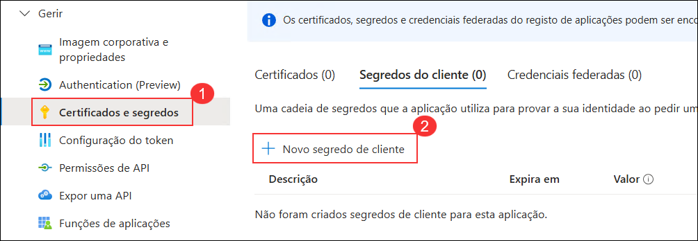
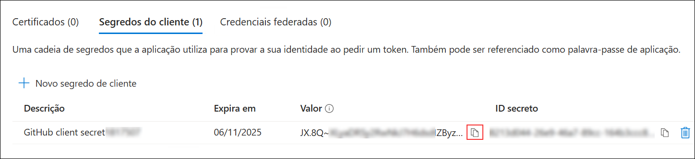
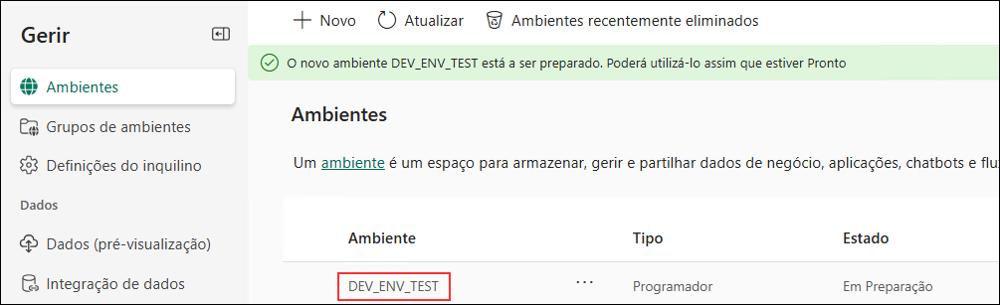
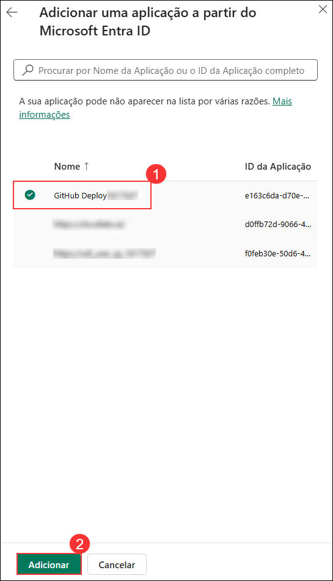
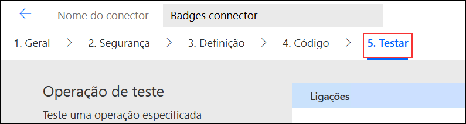

# Laboratório 04 - Gestão do ciclo de vida da aplicação

## Duração estimada: 90 minutos

Trabalhando como parte da equipa de PrioritZ fusion, estará a configurar GitHub Actions com as ferramentas de Power Platform para automatizar e agilizar as implementações da equipa. Isto envolve a configuração da integração contínua e dos pipelines de implementação contínua (CI/CD) para garantir a entrega perfeita e eficiente de atualizações nas aplicações Power Platform, ao mesmo tempo que gere os processos de controlo, teste e implementação de versão para melhorar a colaboração e manter padrões de alta qualidade em todos os projetos da equipa.

Objectivos de laboratório

- Exercício 1: Configure um service principal
- Exercício 2: Promover Solução para Teste Ambiente
- Exercício 3: Criar o GitHub Repo
- Exercício 4: Exportação e Branching
- Exercício 5: Lançar para Testes

## Exercício 1 – Configure um Service Principal

Neste exercício, criará um service principal. O service principal será utilizado pelo GitHub Actions, para que não sejam executadas sob a sua identidade individual do utilizador.

### Tarefa 1: Criar registo de aplicações

1. Navegue de volta ao separador do navegador em que o Portal do Azure está aberto. Se ainda não estiver aberto, navegue até ao Portal do Azure utilizando o URL abaixo.

    ```
    https://portal.azure.com/
    ```

1. Na página inicial do Portal do Azure, pesquise por **Microsoft Entra ID** ***(1)*** na barra de pesquisa e seleccione **Microsoft Entra ID** ***(2)***.

    

1. No menu lateral, selecione **Registos de aplicações (1)** e clique em **+ Novo registo (2)** para criar o registo de aplicação que será utilizado pelo conector para aceder à API protegida.

    

1. Forneça o nome **GitHub Deploy<inject key="DeploymentID" enableCopy="false" />** (1)**, selecione **Contas apenas neste diretório organizacional (Azure HOL — Inquilino único) (2)** e clique em **Registar (3)**.

    

1. Copie o **ID de aplicação (cliente)** e o **ID do diretório (inquilino)** e guarde-os num bloco de notas para utilização posterior.

    

1. Na lâmina lateral, selecione **Certificados e segredos (1)** e clique em **+ Novo segredo do cliente (2)**.

    

1. Introduza **GitHub client secret<inject key="DeploymentID" enableCopy="false" /> (1)** como descrição, defina o prazo de expiração para **90 dias (3 meses) (2)** e clique em **Adicionar (3)**.

    

1. Copie o **Valor** do segredo do cliente e guarde-o num bloco de notas para utilização posterior.

    

    >**Nota**: Certifique-se de copiar os valores corretos de **Application (client) ID**, **Directory (tenant) ID** e **Secret**. Copiar valores incorretos resultará em problemas nos passos ou tarefas seguintes.

### Tarefa 2: Crie um novo Dataverse

Nesta tarefa, irá criar um novo ambiente de teste do Dataverse.

1. Abra uma nova janela ou aba do browser e navegue até ao Power Platform Admin Center utilizando o URL abaixo.

    ```
    https://admin.powerplatform.microsoft.com/environments
    ```

1. Clique em **+Novo** para criar um novo Dataverse.

    

1. No separador **Novo ambiente**:  

    - Nome: **DEV_ENV_TEST(1)**.  

    - Tornar este um Ambiente Gerido: **Ativar Sim(2)**.  

    - Grupo: **Nenhum(3)** e desça. 

    - Tipo: **Programador(4)** e clique em **Seguinte(5)**.  

    - Implementar aplicações e dados de exemplo?: **Ativar Sim(6)** e clique em **Guardar(7)**.

        

        

1. Agora pode ver o novo Dataverse, **DEV_ENV_TEST**, que criou.

    

### Tarefa 3: Crie um utilizador de aplicação no Dataverse

Nesta tarefa, irá registar a aplicação que criou no Microsoft Entra ID nos ambientes de dev e test de Dataverse. Serão também atribuídas permissões ao service principle para implementar soluções


1. Abra uma nova janela ou aba do browser e navegue até ao Power Platform Admin Center utilizando o URL abaixo.

    ```
    https://admin.powerplatform.microsoft.com/environments
    ```

1. Clique em **Ambientes** **(1)** da lâmina lateral e seleccione o seu **DEV_ENV_<inject key="DeploymentID" enableCopy="false" />'s environment** **(2)**.

    

1. Na página do seu ambiente, clique em **Definições**. 

    

1. Expanda **Utilizadores + permissões** **(1)** e selecione **Utilizadores da aplicação** **(2)**. 

    

1. Na página **Utilizadores da aplicação**, clique em **+ Novo utilizador da aplicação**.  

    

1. Na guia **Criar um novo utilizador da aplicação**, clique em **+ Adicionar uma aplicação**.  

    

1. Selecione o **GitHub Deploy<inject key="DeploymentID" activityCopy="false" />** **(1)** que criou anteriormente e clique em **Adicionar** **(2)**.  

    

1. Digite **org** e selecione a sua **unidade de negócio** **(1)**, em **Direitos de acesso** clique no **ícone de edição** **(3)**, selecione **System Administrator** **(2)** e clique em **Criar** **(4)**. 

    

    **Observação:** se o símbolo **#** ainda estiver visível antes do GitHub Deploy<inject key="DeploymentID" enableCopy="false" />, clique nele e atualize o painel para removê-lo.

1. Volte para **Ambientes** **(1)** no painel lateral e selecione o seu ambiente **DEV_ENV_TEST** **(2)**. 

    

1. Na página de ambiente de teste, clique em **Definições**. 

    

1. Expanda **Utilizadores + permissões** **(1)** e selecione **Utilizadores da aplicação** **(2)**.

    

1. Na página **Utilizadores da aplicação**, clique em **+ Novo utilizador da aplicação**.  

    

1. No separador **Criar um novo utilizador da aplicação**, clique em **+ Adicionar uma aplicação**. 

    

1. Selecione o registo de aplicação **GitHub Deploy <inject key="DeploymentID" activityCopy="false" />** **(1)** que criou anteriormente e clique em **Adicionar** **(2)**.  

    

1. Digite **org** e selecione a sua **unidade de negócio** **(1)**, em **Direitos de acesso** clique no **ícone de edição (3)**, selecione **System Administrator (2)** e clique em **Criar (4)**.

    

    **Observação:** se o símbolo **#** ainda estiver visível antes do GitHub Deploy<inject key="DeploymentID" enableCopy="false" />, clique nele e atualize o painel para removê-lo.

1. Clique em **Ambientes** **(1)** da lâmina lateral e seleccione o seu **DEV_ENV_<inject key="DeploymentID" enableCopy="false" />'s environment** **(2)**.

    

1. Copie o **Environment URL** e guarde-o num bloco de notas para utilizá-lo em passos futuros.

    

1. No menu à esquerda, clique em **Ambientes** **(1)** e, na lista apresentada, selecione o ambiente **DEV_ENV_TEST** **(2)**.  

    

1. Copie o **Environment URL** e guarde-o num bloco de notas, estará a utilizar este URL em passos futuros.

    

## Exercício 2 – Promover Solução para Teste Ambiente

Neste exercício, irá exportar a solução de conector Contoso Badges do Dev
ambiente e importá-lo para o ambiente de teste.

### Tarefa 1: Solução de exportação.

1. Navegue até ao portal do fabricante do Power Apps e certifique-se de que está no seu ambiente de desenvolvimento.

    ```
    https://make.powerapps.com
    ```

1. Vá para **Soluções (1)**, selecione **Contoso Badges conector (2)** e clique em **Exportar solução (3)**.

    

1. Na página **Antes de exportar**, clique em **Publicar** para publicar todas as alterações realizadas. 

    

1. Na página **Antes de exportar**, clique em **Seguinte** para continuar após a publicação das alterações.  

    

1. Na página **Exportar esta solução**, selecione a opção **Gerido (recomendado)** **(1)** e clique em **Exportar** **(2)**. 

    

1. Aguarde que a solução seja exportada.

1. Quando a exportação for concluída, clique em **Transferir** para baixar o ficheiro da solução exportada. 

    

### Tarefa 2: Solução de importação

1. No portal do criador do Power Apps, clique em **Ambientes (1)** e selecione o ambiente de teste pré-criado chamado **DEV_ENV_TEST (2)**.

    ```
    https://make.powerapps.com
    ```

    

1. Clique em **Importar solução**. 

    

    >**Nota:** Experimente atualizar o navegador se as soluções não forem abertas.

1. Clique em **Procurar**. 

    

1. Na janela **Abrir**, selecione o ficheiro **ContosoBadgesconnector_1_0_0_1_managed.zip (1)** e clique em **Abrir (2)**.

    

1. Clique em **Seguinte** para continuar com a importação da solução. 

    

1. A solução deve ser importada com sucesso. **Não** navegue por esta página.

### Tarefa 3: Conector de teste

1. No menu esquerdo, clique em **Soluções (1)**. Na parte superior, selecione **Tudo (2)** e, na lista exibida, clique na solução **Contoso Badges (3)** para abri-la.

    

1. Na lista de itens da solução, clique em **Badges connector** para abrir o conector.  

    

    >**Nota**: Se receber a mensagem de erro **could not retrieve the connector data**, aguarde de 5 a 10 minutos e atualize os dados do conector. Caso o problema persista, elimine o conector importado e repita os **passos 5 a 10** da **Tarefa 2: Importar a solução**, depois tente abrir o conector novamente.

1. Clique em **Editar**.

    

1. Selecione o separador **Testar** do menu superior.

    

1. Clique em **+ Nova ligação**. Será aberto um novo separador do browser para criar uma ligação.

    

1. Inicie uma nova janela ou aba do browser e navegue até ao URL abaixo para abrir a API Contoso Coffee Badges.

    ```
    https://contosobadgestest.azurewebsites.net/
    ```

1. Clique no link **Get an API Key**.

    

1. Copie o valor **API Key**.

1. Volte ao editor do conector, cole a chave da API que copiou no passo anterior desta tarefa e clique em **Create connection**. Agora, feche o separador do browser clicando em **X**.

    

1. Clique em **Refresh Connections**.

    

1. Vá para a seção **Operações (1)** e selecione a operação **AddCredit (2)**. Forneça o seu e-mail em **recipientId (3)**, insira um **name (4)**, introduza **1** em **points** e clique em **Operação de teste (5)**.

    

1. O teste deve ter sucesso e a resposta deve parecer a imagem abaixo.

    


## Exercício 3 – Crie o GitHub Repo

Neste exercício, criará um repositório do GitHub e adicionar segredos do repositório.

### Tarefa 1: Crie um repositório

1. Navegue até ao URL abaixo e inscreva-se utilizando as suas credenciais do GitHub.

    ```
    https://github.com/
    ```

1. Clique no ícone do seu perfil e selecione **Seus repositórios**.

    

1. Clique em **Novo** para criar um repositório.

    

1. Introduza **PrioritZ (1)** para o nome do repositório, selecione **Público (2)** e ative a opção **Adicionar README (3)**. Em seguida, clique em **Criar repositório (4)**.

    

1. Clique em **Configurações** para abrir o separador de definições.

    

1. Aceda à secção **Configurações (1)**, expanda **Segredos e variáveis (2)** e selecione **Ações (3)**.

    

    > **Nota:** Os valores fornecidos não ficarão visíveis depois de criar o item, por isso, dedique algum tempo para obter os valores corretos.

1. Clique em **Novo segredo do repositório** para adicionar um segredo.

    

1. Insira **PowerPlatformAppID (1)** para Nome e cole o nome de usuário odl: **<inject key="AzureAdUserEmail"></inject> (2)** e clique em **Segredo (3)**

    

1. Clique em **Novo segredo do repositório** novamente.

    

1. Insira **PowerPlatformClientSecret (1)** para Nome e cole a senha: **<inject key="AzureAdUserPassword"></inject> (2)** e clique em **Adicionar Segredo (3)**

    

1. Clique em **Novo segredo do repositório** novamente.

1. Introduza **PowerPlatformTenantID (1)** para Nome e colar o secreto **Tenant ID (2)** do seu bloco de notas que observou anteriormente em **`Exercício 1 -> Tarefa 1 -> Passo 5`** no campo **Value** e clique em **Segredo (3)**.

    

1. Clique novamente em **Novo segredo do repositório**.

1. Introduza **PowerPlatformDevUrl (1)** para o nome e cole o **Dev environment URL (2)** do seu bloco de nota que copiou no **`Exercício 1 -> Tarefa 3 -> Passo 17`** no campo **Valor** e clique em **Segredo (3)**.

    >**Nota**: Certifique-se de que está a colar o URL do ambiente de desenvolvimento denominado **DEV_ENV_<inject key="DeploymentID" enableCopy="false" />** que copiou no **`Exercício 1 -> Tarefa 3 -> Passo 17`**

    

1. Clique em **New repository secret** mais uma vez.

1. Introduza **PowerPlatformTestUrl (1)** para o nome e cole o **Test Environment URL (2)** do seu bloco de nota que copiou no **`Exercício 1 -> Tarefa 3 -> Passo 19`** no campo **Value** e clique em **Segredo (3)**.

    >**Nota**: Certifique-se de que está a colar o URL do ambiente de teste denominado **DEV_ENV_TEST** que copiou no **`Exercício 1 -> Tarefa 3 -> Passo 19`**

    

1. Agora deve ter **5** segredos do repositório.

    

1. Permaneça nesta página.

### Exercício 4 – Exportação e Branching

Neste exercício, irá definir um workflow the GitHub Actions e adicionar passos para exportar a solução do ambiente dev e criar um novo branch.

### Tarefa 1: Exportação e Branching

Nesta tarefa, criará um workflow the GitHub Actions utilizando o YAML fornecido. YAML utiliza a indentação de dois espaços, por isso siga isso com cuidado à medida que constrói a definição do workflow. Em caso de dúvida, reveja a indentação mostrada nas imagens.

1. Selecione o separador **Ações (1)** e clique em **Configure um fluxo de trabalho por conta própria (2)** para criar um novo fluxo de trabalho.

    

1. Altere o nome do ficheiro para **export-and-branch.yml (1)** e remova todo o conteúdo do ficheiro de workflow.

    

1. Navegue até ao URL `https://raw.githubusercontent.com/CloudLabsAI-Azure/PowerApps-Dev-in-a-Day/main/export-and-branch.yml`, copie o conteúdo total do ficheiro e cole no workflow **export-and-branch.yml**.

    

1. Na janela **Confirmar alterações**, clique em **Confirmar alterações** para finalizar o commit.

    

    

1. No separador **Configurações (1)**, selecione **Ações (2)** e clique em **Geral (3)**.

    

1. Na secção **Permissões de fluxo de trabalho**, selecione **Permissões de leitura e gravação (1)** e clique em **Salvar (2)**.

    

1. No separador **Ações** **(1)**, selecione **Todos os fluxos de trabalho** **(2)**.

    

1. No painel lateral, selecione o workflow **exportação e filial**.  

    

1. Clique no botão **Executar fluxo de trabalho**  para iniciar o workflow.

    

1. No separador **Código** **(1)**, clique no menu de seleção de ramos **(2)** e selecione o ramo **Prioridade-XXXX-0642** **(3)**

    

1. No branch **Prioritz-XXXXXXX.**, poderá ver a pasta de solução.

    

1. Clique no botão **Contribute** **(1)** e seleccione **Open pull request** **(2)**.

    

1. Adicione uma descrição se desejar e clique em **Criar pedido pull**.

    

1. Agora deve ver o resumo do pedido de pull. Confirme que o ramo não tem conflitos com o ramo principal e que as alterações podem ser fundidas automaticamente no ramo principal.

1. Clique no ícone de seta ao lado do botão **Solicitação de pull de mesclagem** **(1)** e selecione **Esmagar e mesclar** **(2)**.

    

1. Clique em **Confirmar squash e mesclar**.

    

1. O pedido de pull deve ser efetuado com sucesso.

    


### Exercício 5 – Lançamento para teste

Neste exercício, criará uma ação de workflow e adicionará passos que libertarão a solução que exportou para o ambiente de teste.

### Tarefa 1: Criar fluxo de trabalho

1. Navegue até ao separador **Ações** **(1)** e clique em **Novo fluxo de trabalho** **(2)**.

    

1. Clique em **Configure um fluxo de trabalho por conta própria**.

    

1. Altere o nome do ficheiro para **release-to-test.yml**

    

1. Remova todo o conteúdo do ficheiro de workflow.

1. Navegue até ao URL `https://raw.githubusercontent.com/CloudLabsAI-Azure/PowerApps-Dev-in-a-Day/main/release-to-test.yml` e copie o conteúdo total do ficheiro e cole-o no ficheiro de trabalho **release-to-test.yml**.

    

1. Clique em **Confirmar alterações** e, em seguida, clique novamente em **Confirmar alterações** para confirmar.

    

    

1. No campo de nome do ficheiro, insira **release-to-test.yml**.

    

1. Navegue de volta ao portal PowerApps e Certifique-se de que está no ambiente de teste no Power Apps.

    

1. Selecione o separador **Soluções (1)** no lado esquerdo e clique em **Gerida (2)**. Deve ver a solução implementada com o nome **Prioritz (3)**.

    

## Resumo
Neste laboratório, aprendeu a promover uma solução para um ambiente de teste, a configurar um service principal e a gerir a sua solução utilizando o GitHub para controlo de versões e automação do workflow.

## Concluiu o laboratório com sucesso