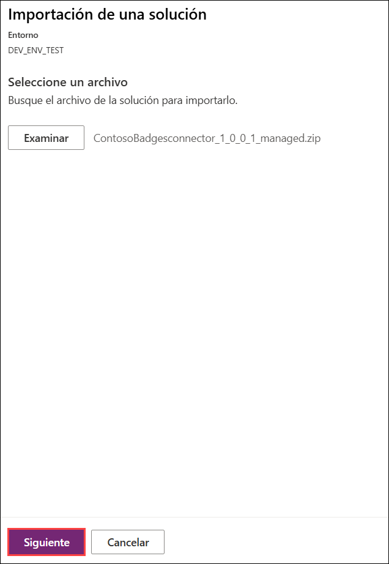
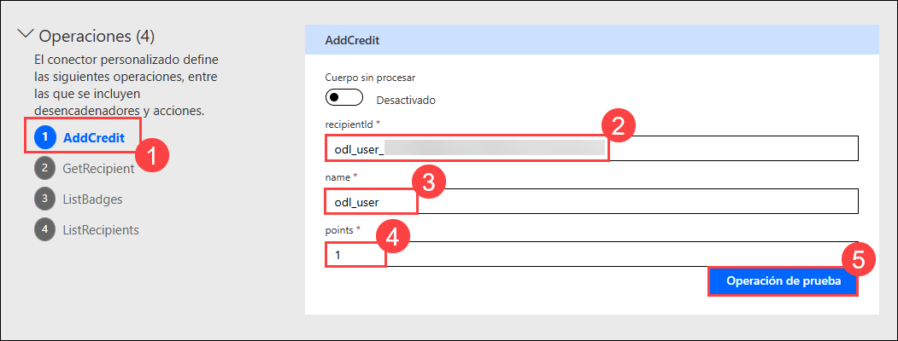
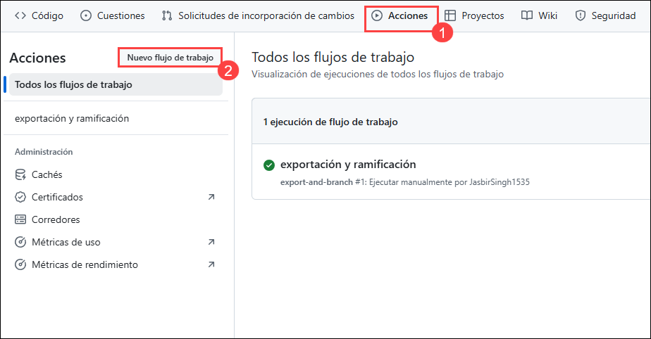

# Laboratorio 04 - Gestión del ciclo de vida de las aplicaciones

## Duración Estimada: 90 mins

Al trabajar como parte del equipo de fusión de PrioritZ, configurará GitHub Actions con Power Platform Build Tools para automatizar y optimizar las implementaciones del equipo. Esto implica configurar canalizaciones de integración continua e implementación continua (CI/CD) para garantizar la entrega fluida y eficiente de actualizaciones a las aplicaciones de Power Platform, al mismo tiempo que administra los procesos de control de versiones, pruebas e implementación para mejorar la colaboración y mantener estándares de alta calidad en todos los proyectos del equipo.

## Objetivos del Laboratorio 

- Ejercicio 1: Configuración de una entidad de servicio
- Ejercicio 2: Promover la Solución al Entorno de Pruebas
- Ejercicio 3: Crear repositorio de GitHub 
- Ejercicio 4: Exportación y Ramas 
- Ejercicio 5: Lanzamiento para probar 

## Ejercicio 1: Configurar una entidad de servicio

En este ejercicio, creará una entidad de servicio. El flujo de trabajo usará la entidad de servicio
acciones, por lo que no se ejecutan bajo su identidad de usuario individual.

### Tarea 1: Crear el registro de la aplicación

1. Vuelva a la pestaña del explorador en la que está abierto el Portal de Azure. Si aún no está abierto, vaya a Azure Portal mediante la siguiente dirección URL.

   ```
   https://portal.azure.com/
   ```

1. En la página principal del Portal Azure, busque **Microsoft Entra ID** ***(1)*** en la barra de búsqueda y seleccione **Microsoft Entra ID** ***(2)*** en las sugerencias.

   
   
1. Seleccione **Registros de aplicaciones** ***(1)*** en la hoja lateral y haga clic en **+ Nuevo registro** ***(2)***. Este registro de aplicación se utilizará para que el conector acceda a la API protegida.

   

1. Proporcione los siguientes datos y haga clic en **Registrarse** ***(3)***.
   
   - Nombre: **GitHub Deploy<inject key="DeploymentID" enableCopy="false" />** ***(1)***
   - Tipos de cuenta admitidos: **Cuentas solo en este directorio organizacional (Azure HOL - xxxxxx only - Single tenant)** ***(2)***.

     
   
1. Copie el **ID de la aplicación (cliente)**, el **ID del directorio (inquilino)** y guárdelo en un bloc de notas cuando lo necesite para su uso posterior.
     
   

1. Seleccione **Certificados y secretos (1)** en la hoja lateral y haga clic en **+ Nuevo secreto de cliente (2)**.

   

1. Ingrese **GitHub client secret<inject key="DeploymentID" enableCopy="false" />** ***(1)*** como descripción, establezca el vencimiento en **3 meses** ***(2)* ** y haga clic en **Agregar** ***(3)***.
   
   
   
1. Copie el **valor** y guárdelo en un bloc de notas, ya que lo necesitará para usarlo más adelante.

   

    >**Nota**: Asegúrese de copiar y pegar el **ID de aplicación (cliente)**, el **ID de directorio (inquilino)** y el valor **Secreto** correctos. Copiar el valor incorrecto provocará problemas en los siguientes pasos/tareas.
    
### Tarea 2: crear un nuevo Dataverse

En esta tarea, probará nuevos entornos de Dataverse.

1. Abra una nueva ventana o pestaña del navegador y navegue hasta el Centro de administración de Power Platform utilizando la siguiente URL.

     ```
     https://admin.powerplatform.microsoft.com/environments
     ```
1. Haga clic en **+Nuevo** para crear un nuevo Dataverse.       

   

1. En la pestaña **Nuevo entorno**.
   
   - Nombre:**DEV_ENV_TEST(1)**.
   
   - Haga de este un entorno gestionado :**Habilitar Sí(2)**.
   
   - Grupo :**Ninguno(3)**. y desplácese hacia abajo.
   
   - Escriba :**Developer(4)** y haga clic en **Siguiente (5)**.
   
   - ¿Desea implementar aplicaciones y datos de ejemplo? :**Habilite Sí(6)** y haga clic en **Guardar(7)**.
   
     

     

     

1. Ahora puede ver el nuevo Dataverse, **DEV_ENV_TEST**, que creó.

   

### Tarea 3: Crear una usuaria de aplicación en Dataverse

En esta tarea, registrará la aplicación que creó en Microsoft Entra ID en el programa de desarrollo y prueba.
Entornos de Dataverse. También se le asignará un rol de seguridad que permitirá a la entidad de servicio
implementar soluciones.

1. Abra una nueva ventana o pestaña del navegador y navegue hasta el Centro de administración de Power Platform utilizando la siguiente URL.

     ```
     https://admin.powerplatform.microsoft.com/environments
     ```

1. Haga clic en **Entornos** ***(1)*** en la hoja lateral y seleccione su entorno **DEV_ENV_<inject key="DeploymentID" enableCopy="false" />** ***(2 )***.

   
   
1. Desde la página de su entorno, haga clic en **Configuración**.

   
   
1. Expanda **Usuarios + permisos** **(1)** y seleccione **Usuarios de la aplicación** **(2)**.
    
   

1. En la página de usuarios de la aplicación, haga clic en **+ Nuevo usuario de la aplicación**.

   
   
1. En la pestaña Crear un nuevo usuario de aplicación, haga clic en **+ Agregar una aplicación**.
      
   
   
1. Seleccione el registro de la aplicación **GitHub Deploy<inject key="DeploymentID" enableCopy="false" />** ***(1)*** que creó anteriormente y haga clic en **Agregar** **(2)**.

   

1. Escriba **org** y seleccione su **unidad de negocio** **(1)** y en **Roles de seguridad** haga clic en **editar símbolo (2)** y seleccione 
   **Administrador del sistema(3)** y luego haga clic en **Crear (4)**.

   

   **Nota:** Si el símbolo **#** aún está visible antes de GitHub Deploy<inject key="DeploymentID" enableCopy="false" />, haga clic en él y actualice el panel para eliminarlo.
   
1. Vuelva nuevamente a **Entornos** ***(1)*** en la hoja lateral y seleccione su **entorno de prueba** ***(2)***.

   
   
1. Desde la página de su entorno de prueba, haga clic en **Configuración**.

   

1. Expanda **Usuarios + permisos** ***(1)*** y seleccione **Usuarios de la aplicación** ***(2)***.
    
   
   
1. En la página de usuarios de la aplicación, haga clic en **+ Nuevo usuario de la aplicación**.

   
   
1. En la pestaña **Crear un nuevo usuario de aplicación**, haga clic en **+ Agregar una aplicación**.
      
   
   
1. Seleccione el registro de la aplicación **GitHub Deploy<inject key="DeploymentID" enableCopy="false" />** ***(1)*** que creó anteriormente y haga clic en **Agregar** ***(2 )***.

   

1. Escriba **org** y seleccione su **unidad de negocio** **(1)** y en **Roles de seguridad** haga clic en **editar símbolo (2)** y seleccione 
   **Administrador del sistema(3)** y luego haga clic en **Crear (4)**.

   

   **Nota:** Si el símbolo **#** aún está visible antes de GitHub Deploy<inject key="DeploymentID" enableCopy="false" />, haga clic en él y actualice el panel para eliminarlo.
   
1. Haga clic en **Entornos** ***(1)*** en la hoja lateral y seleccione su entorno **DEV_ENV_<inject key="DeploymentID" enableCopy="false" />** ***(2 )***.

   
   
1. Copie la **URL del entorno** y guárdela en un bloc de notas; utilizará esta URL en pasos futuros.
    
   
   
1. Vuelva nuevamente a **Entornos** ***(1)*** en la hoja lateral y seleccione su entorno **de prueba(2)**.

   
   
1. Copie la **URL del entorno** y guárdela en un bloc de notas; utilizará esta URL en pasos futuros.
    
   

## Ejercicio 2: Promover la Solución al Entorno de Pruebas

En este ejercicio, exportará la solución del conector Contoso Badges desde el entorno de desarrollo y la importará al entorno de prueba.

### Tarea 1: Exportar la solución.

1. Navegue hasta el portal de creación de Power Apps y asegúrese de estar en su entorno de desarrollo.

     ```
     https://make.powerapps.com
     ```

1. Seleccione **Soluciones (1)**. Seleccione la solución del conector **Contoso Badges (2)** y haga clic en **Exportar solución (3)**.
   
     

1. En la hoja **Antes de exportar**, haga clic en **Publicar** y espere a que se complete la publicación.

   

1. Una vez publicada, haga clic en **Siguiente**.

   

1. Seleccione **Administrada (1)** y haga clic en **Exportar (2)**.

   

1. Espere a que se exporte la solución.

1. Haga clic en el botón Descargar en la parte superior derecha de la pantalla. Haga clic en Descargar Solución.
 
    

### Tarea 2: Importar la solución

1. Navegue al portal de creadores de Power Apps si aún no está abierto y seleccione su entorno de prueba, haga clic en **Entorno (1)** y seleccione el entorno de desarrollo creado previamente llamado **DEV_ENV_TEST (2)**.

     ```
     https://make.powerapps.com
     ```
     

1. Haga clic en **Importar Solución**.
    
     
     
     >**Nota:** Intente actualizar el navegador si las soluciones no están abiertas.

1. Haga clic en **Examinar**.

     

1. Seleccione la solución que exportó desde el entorno de desarrollo y haga clic en **Abrir**.

1. Haga clic en **Siguiente**.

     

1. Haga clic en **Importar** y espere a que se complete la importación.

     

1. La solución debería importarse correctamente. **No** salga de esta página.

### Tarea 3: Probar el conector

1. Haga clic en **Soluciónes (1)**, luego en **Todos (2)** y luego seleccione **Contoso Badge Connector (3)** para abrir la solución que acaba de importar.

     

1. Haga clic para abrir **Badges connector**.
  
    

    >**Nota**: Si recibe el mensaje de error **could not retrieve the connector data**, espere unos minutos (5 a 10 minutos) para que se actualicen los datos del conector. Si eso no funciona, puede eliminar el conector importado y realizar los **pasos 5 a 10** de la tarea **Tarea 2: Importar solución** nuevamente y luego intente abrir el conector.

1. Haga clic en **Editar**.

     

1. Seleccione la pestaña **Probar** en el menú desplegable.

        

1. Haga clic en **+ Nueva conexión**. Se abrirá una nueva pestaña del navegador para crear una conexión.

        

1. Abra una nueva ventana o pestaña del navegador y navegue hasta la siguiente URL para abrir la API Contoso Coffee Badges.

   ```
   https://contosobadgestest.azurewebsites.net/
   ```

1. Haga clic en el enlace **Get an API Key**.
  
     

1. Copie el valor de la **API Key**.

1. Vuelva al editor de conectores, pegue la API Key que copió en el paso anterior y haga clic en **Crear conexión**. Ahora, cierre la pestaña del navegador haciendo clic en **X**.
   
     

1. Haga clic en **Actualizar** conexiones.
     
      

1. Vaya a la sección **Operaciones** y seleccione la operación **addcredit**.

      

1. Vaya a la operación **AddCredit (1)**. Ingrese los siguientes detalles:

     - **recipientId:** **<inject key="AzureAdUserEmail"></inject> (2)**
     - **name:** **odl_user (3)**
     - **points:** **1 (4)**
     - Luego haga clic en **Operación de preueba (5)**

    

1. La prueba debería tener éxito y la respuesta debería verse como la imagen a continuación.
      
      

## Ejercicio 3: crear un repositorio de GitHub

En este ejercicio, creará un repositorio de GitHub y agregará secretos de repositorio.

### Tarea 1: crear un repositorio

1. Navegue a la siguiente URL e inicie sesión con sus credenciales de GitHub.

   ```
   https://github.com/
   ```
1. Haz clic en el icono de tu perfil y selecciona **Tus repositorios**.

   

1. Haga clic en **Nuevo** repositorio para crear un repositorio.

   

1. Ingrese **PrioritZ (1)** para el nombre del repositorio, seleccione **Público (2)** y marque **Agregar un archivo README (3)**.

   

1. Haga clic en **Crear repositorio** para crearlo.

   

1. Haga clic en **Configuración** para abrir la pestaña de configuración.
    
     

1. Vaya a la sección **Configuración (1)**, expanda **Secretos y variables (2)** y seleccione **Acciónes (3)**.
   
    > **Nota:** Los valores que proporcione no serán visibles después de crear el elemento, así que tómese su tiempo para obtener los valores correctos.
      
     
   
1. Haga clic en **Nuevo secreto de repositorio** para agregar un secreto.

     

1. Ingrese **PowerPlatformAppID (1)** como Nombre y pegue el ID odl: **<inject key="AzureAdUserEmail"></inject> (2)** y **haga clic en Agregar secreto (3)**
    
     

1. Haga clic en **Nuevo secreto del repositorio** nuevamente.

1. Ingrese **PowerPlatformClientSecret (1)** como Nombre y pegue la contraseña: **<inject key="AzureAdUserPassword"></inject> (2)** y **haga clic en Agregar secreto (3)**

     

1. Haga clic en **Nuevo secreto del repositorio** nuevamente.

1. Ingrese **PowerPlatformTenantID (1)** para Nombre y pegue el secreto **Tenant ID (2)** de su bloc de notas que anotó anteriormente en **`Ejercicio 1 -> Tarea 1 -> Paso 5`** en el **Valor** y haga clic en **Agregar secreto (3)**.
    
     

1. Haga clic en **Nuevo secreto del repositorio** nuevamente.

1. Ingrese **PowerPlatformDevUrl (1)** como Nombre y pegue la URL secreta del entorno de desarrollo (2)** de su bloc de notas que copió en **`Ejercicio 1 -> Tarea 3 -> Paso 17`** en el campo **Valor** y haga clic en **Agregar secreto (3)**.

    >**Nota**: Asegúrate de pegar la URL del entorno de desarrollo denominada **DEV_ENV_<inject key="DeploymentID" enableCopy="false" />** que copiaste en el **`Ejercicio 1 -> Tarea 3 -> Paso 17`**
   
      
  
1. Haga clic en **Nuevo secreto del repositorio** una vez más.

1. Ingrese **PowerPlatformTestUrl (1)** para Nombre y pegue la **URL del entorno de prueba (2)** de su bloc de notas que copió en el **`Ejercicio 1 -> Tarea 3 -> Paso 19`** en el **Valor** y haga clic en **Agregar secreto (3)**.

     >**Nota**: Asegúrese de pegar la URL del entorno de prueba denominada **DEV_ENV_TEST** que copió en el **`Ejercicio 1 -> Tarea 3 -> Paso 19`**.
 
     
   
1. Ahora deberías tener **5** secretos del repositorio.
     
    

1. No salgas de esta página.

## Ejercicio 4: Exportación y ramas

En este ejercicio, establecerá una acción de flujo de trabajo y agregará pasos que exportarán la solución desde el entorno de desarrollo y crearán una nueva rama.

### Tarea 1: Exportar y ramificar

En esta tarea, creará la definición del flujo de trabajo utilizando el YAML proporcionado. La acción YAML utiliza sangría de dos espacios, así que sígala cuidadosamente mientras crea la definición del flujo de trabajo. En caso de duda, revise la sangría que se muestra en las imágenes.

1. Seleccione la pestaña **Acciones** y haga clic en **Configurar un flujo de trabajo usted mismo** para crear un nuevo flujo de trabajo.
 
   
   
   
1. Cambie el nombre del archivo **export-and-branch.yml**
       
1. Elimine todo del archivo de flujo de trabajo.
  
   

1. Navegue a la URL `https://raw.githubusercontent.com/CloudLabsAI-Azure/PowerApps-Dev-in-a-Day/main/export-and-branch.yml`, copie el contenido completo del archivo y péguelo en el flujo de trabajo **export-and-branch.yml**.

   

1. Haga clic en **Confirmar cambios** y luego haga clic en **Confirmar cambios**.
    
   

   

1. Haga clic en **Configuración (1)**, vaya a la pestaña **Acciónes (2)** en el lado izquierdo, luego seleccione **General (3)**.

   

1. En la sección **Permiso de flujo de trabajo**, asegúrese de que esté seleccionado **permiso de lectura y escritura (1)** y luego haga clic en **Salvar (2)**.

   

1. Seleccione la pestaña **Acciones** **(1)** y seleccione el **flujo de trabajo** ***(2)*** que creó.

   
   
1. Haga clic en **Ejecutar flujo de trabajo.**
      
   
   
1. Haga clic en **Ejecutar flujo de trabajo** nuevamente y espere a que se complete la ejecución del flujo de trabajo.
      
   
   
1. Seleccione la pestaña **Código (1)*** y haga clic en **Sucursales (2)**. Debería ver dos ramas.
   
   
   
1. Haga clic para abrir la rama que se creó mediante la acción de flujo de trabajo denominada Prioritz-XXXXXXXX-XXXX.
   
   

1. En la carretera Prioritz-XXXXXXX. rama, debería poder ver la carpeta de la solución.
      
   
   
1. Haga clic en el botón **Contribuir** ***(1)*** y seleccione **Abrir solicitud de incorporación de cambios (pull request)** ***(2)***.
        
   
   
1. Agregue una descripción si lo desea y luego haga clic en **Crear solicitud de incorporación de cambios (pull request)**.

     
   
1. Ahora debería ver el resumen de la solicitud de incorporación de cambios. Confirme que la rama no tenga conflictos con la rama principal y que los cambios se puedan fusionar en la rama principal automáticamente.
   
1. Haga clic en el botón de chevrón al lado del botón **Solicitud de incorporación de cambios de fusión (merge pull request)** y seleccione **Aplastar y fusionar (Squash and merge)**.
      
    

1. Haga clic en **Aplastar y fusionar (Squash and merge)**.
   
1. Haga clic en **Confirmar aplastamiento y fusión (squash and merge)**.
   
1. La solicitud de incorporación de cambios debería fusionarse correctamente.
   
     

## Ejercicio 5: Lanzamiento para prueba

En este ejercicio, creará una acción de flujo de trabajo y agregará pasos que lanzarán la solución que
exportado al entorno de prueba.

### Tarea 1: crear un flujo de trabajo

1. Ahora navegue hasta la pestaña **Acciones (1)**, haga clic en **Nuevo flujo de trabajo (2)**.

    
   
1. Ahora, en la página **Elija un flujo de trabajo**, haga clic en **configurar un flujo de trabajo usted mismo**.
     
    
   
1. Cambie el nombre del archivo a **release-to-test.yml**
   
    
     
1. Eliminar todo del archivo de flujo de trabajo.

1. Navegue a la URL `https://raw.githubusercontent.com/CloudLabsAI-Azure/PowerApps-Dev-in-a-Day/main/release-to-test.yml` en el navegador y copie el contenido completo del archivo y péguelo en el archivo de flujo de trabajo **release-to-test.yml**.
 
   
      
1. Haga clic en **Confirmar cambios** y luego haga clic en **Confirmar cambios**.

    
    
1. Seleccione la pestaña **Acciones (1)**, haga clic en **Todos los flujos de trabajo (2)** y supervise el flujo de trabajo.

     

1. La versión de release debería completarse exitosamente.
     
1. Vuelva al portal de PowerApps y asegúrese de estar en el entorno de prueba de PowerApps.

      

1. seleccione la pestaña **soluciones (1)** en el lado izquierdo y haga clic en **Administrado (2)**. Debería ver la solución implementada con el nombre de **Prioritz (3)**.

    
    
## Resumen
En esta práctica de laboratorio, aprendió a promover una solución en un entorno de prueba, configurar una entidad de servicio y administrar su solución usando GitHub para el control de versiones y la automatización del flujo de trabajo.

## Has completado con éxito el laboratorio.
