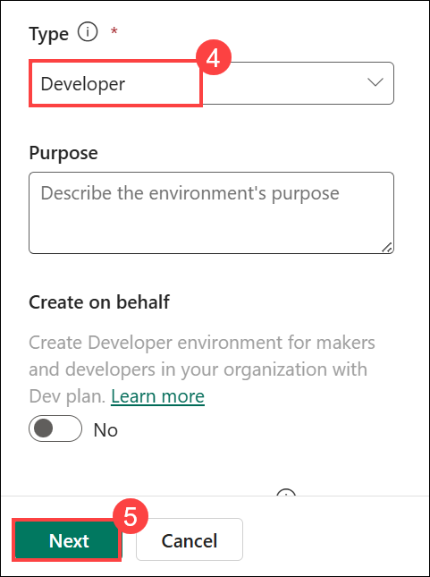
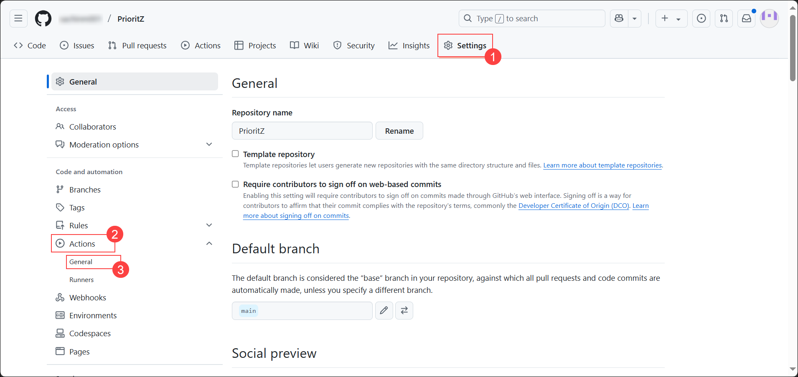
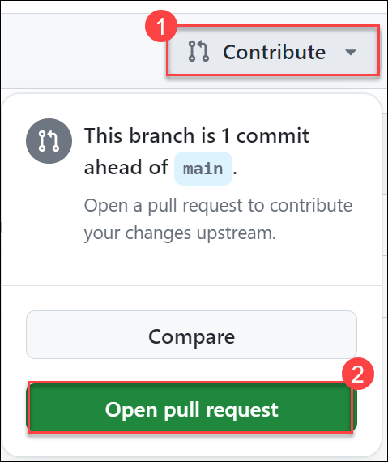

# Lab 04 - Application lifecycle management

## Estimated Duration: 130 Minutes

Working as part of the PrioritZ fusion team, you will be configuring GitHub Actions with the Power Platform Build Tools to automate and streamline the team’s deployments. This involves setting up continuous integration and continuous deployment (CI/CD) pipelines to ensure seamless and efficient delivery of updates to Power Platform applications, while also managing version control, testing, and deployment processes to enhance collaboration and maintain high-quality standards across the team’s projects.

Lab Objectives 

- Exercise 1: Configure a Service Principal
- Exercise 2: Promote Solution to Test Environment 
- Exercise 3: Create GitHub Repo 
- Exercise 4: Export and Branch 
- Exercise 5: Release to Test 

## Exercise 1 – Configure a Service Principal

In this exercise, you will create a service principal. The service principal will be used by the workflow actions, so they do not execute under your individual user identity.

### Task 1: Create app registration

1. Navigate back to the browser tab in which the Azure Portal is open. If not already open, navigate to the Azure Portal using the URL below.

   ```
   https://portal.azure.com/
   ```

1. From Azure Portal home page, search for **Microsoft Entra ID** **(1)** in the search bar and select **Microsoft Entra ID** **(2)** from the suggestions.

   
   
1. Select **App registrations** **(1)** from the side blade under Manage and click on **+ New registration** **(2)**. This application registration will be used for the connector to access the protected API.

   

1. Please provide the following details and click on **Register** **(3)**.
   
   - Name: **GitHub Deploy<inject key="DeploymentID" enableCopy="false" />** **(1)**

   - Supported account types: **Accounts in this organizational directory only (Azure HOL - xxxxxx only - Single tenant)** **(2)**

     
   
1. Copy the **Application (client) ID (1)**, **Directory (Tenant) ID (2)**, and save it in a notepad as you need it for later use.
     
   

1. Select **Certificates & secrets (1)** from the side blade and click on **+ New client secret (2)**.

   

1. Enter **GitHub client secret<inject key="DeploymentID" enableCopy="false" />** **(1)** as description, set expiry to **90 days (3 months)** **(2)**, and click on **Add** **(3)**.
   
   
   
1. Copy the **value** and save it in a notepad as you need it for later use.

   

   >**Note:** Make sure to copy and paste the correct **Application (client) ID**, **Directory (Tenant) ID** and **Secret** value. Copying the incorrect value will result in issues in the next steps/tasks.

### Task 2: Create a new Dataverse

In this task, you will create a new test Dataverse environment.

1. Open a new browser window or tab and navigate to the Power Platform Admin Center using the URL below.

     ```
     https://admin.powerplatform.microsoft.com/environments
     ```

1. Click on **+ New** to create a new Dataverse.         

   

1. In the **New environment** tab.
   
   - Name: **DEV_ENV_TEST (1)**.
   
   - Make this a Managed Environment: **Enable Yes (2)**.
   
   - Group: **None (3)**. and scroll down.
   
   - Type: **Developer (4)** and click on **Next (5)**.
   
   - Deploy sample apps and data?: **Enable Yes (6)** and click on **Save (7)**.
   
      
   
      
   
      

1. You can now see the new Dataverse, **DEV_ENV_TEST**, that you created.

   

### Task 3: Create an app user in Dataverse

In this task, you will be registering the app you created in Microsoft Entra ID into the dev and test
Dataverse environments. You will also be assigned a security role that will allow the service principal to
deploy solutions.

1. Open a new browser window or tab and navigate to the Power Platform Admin Center using the URL below.

     ```
     https://admin.powerplatform.microsoft.com/environments
     ```

1. Click on **Environments** **(1)** from the side blade and select your **DEV_ENV_<inject key="DeploymentID" enableCopy="false" />'s environment** **(2)**.

   
   
1. From your environment page, click on **Settings**.

   
   
1. Expand **Users + permissions** **(1)** and select **Application users** **(2)**.
    
   

1. In the Application users page, click on **+ New app user**.

   
   
1. In Create a new app user tab, click on **+ Add an app**.
      
   
   
1. Select the **GitHub Deploy<inject key="DeploymentID" enableCopy="false" />** **(1)** application registration which you created earlier and click on **Add** **(2)**.

   

1. Type **org** and select your **Business unit** **(1)** and in **Security roles** click on **edit symbol (2)** and select **System administrator (3)** then click on **Create (4)**.

   

    > **Note:** If the **#** symbol is still visible before GitHub Deploy<inject key="DeploymentID" enableCopy="false" />, click on it and refresh the pane to remove it.
   
1. Again go back to **Environments** **(1)** in the side blade and select your **DEV_ENV_TEST** **(2)**.

   
   
1. From your test environment page, click on **Settings**.

   

1. Expand **Users + permissions** **(1)** and select **Application users** **(2)**.
    
   
   
1. In the Application users page, click on **+ New app user**.

   
   
1. On the **Create a new app user** tab, click on **+ Add an app**.
      
   
   
1. Select the **GitHub Deploy<inject key="DeploymentID" enableCopy="false" />** **(1)** application registration which you created earlier and click on **Add** **(2)**.

   

1. Type **org** and select your **Business unit** **(1)** and In **Security roles** click on **edit symbol (2)** and select **System administrator (3)** then click on **Create (4)**.

   

    > **Note:** If the **#** symbol is still visible before GitHub Deploy<inject key="DeploymentID" enableCopy="false" />, click on it and refresh the pane to remove it.
   
1. Click on **Environments** **(1)** from the side blade and select your **DEV_ENV_<inject key="DeploymentID" enableCopy="false" />'s environment** **(2)**.

   
   
1. Copy the **Environment URL** and save it in a notepad, you will be using this URL in future steps.
    
   
   
1. Again go back to **Environments** **(1)** in the side blade and select  **DEV_ENV_TEST (2)** environment.

   
   
1. Copy the **Environment URL** and save it in a notepad, you will be using this URL in future steps.
    
   

## Exercise 2 – Promote Solution to Test Environment

In this exercise, you will export the Contoso Badges connector solution from the Dev environment and import it to the Test environment.

### Task 1: Export solution

1. Navigate to the Power Apps  maker portal and make sure you are in your dev environment **DEV_ENV_<inject key="Deployment ID" enableCopy="false" />**

   ```
   https://make.powerapps.com
   ```

2. Go to **Solutions (1)**, select **Contoso Badges connector (2)**, and click **Export Solution (3)**.
   
     

3. On the **Before you export** blade, click **Publish** and wait for the publishing to complete.

    

4. Once published, click on **Next**.

5. Select **Managed** and click **Export**.

6. Wait for the solution to be exported.

7. Click the **Download** button at the top-right corner of the screen, then select **Download Solution**
 
    

### Task 2: Import solution

1. Navigate to the Power Apps maker portal if not already open and select your **Test** environment, click on **Environment (1)** and select the pre-created dev environment named **DEV_ENV_TEST (2)**. 

    ```
    https://make.powerapps.com
    ```

    

2. Click **Import Solution**.
    
     
     
     >**Note:** Try refreshing the browser if solutions are not opened.

3. Click **Browse**.

4. Select the solution you exported from the Dev environment and click **Open**.

5. Click **Next**.

6. Click **Import** and wait for the import to complete.

7. The solution should be imported successfully. **Do not** navigate away from this page.

### Task 3: Test connector

1. Click on **Solution (1)** then **All (2)** and then select **Contoso Badge Connector (3)** to open the solution you just imported.

      

2. Click to open the **Badges connector**.
  
    

    >**Note:** If you receive the error message as **could not retrieve the connector data**, wait for a few mins (5-10 mins) to get the connector data updated. If that doesn't work, you can delete the imported connector and perform the **steps 1-7** in the **Task 2: Import solution** task again, then try to open the connector.

3. Click **Edit**.

4. Select the **Test** tab from the dropdown.
   
     

5. Click **+ New connection**. A new browser tab will be opened to create a connection.

      

6. Start a new browser window or tab and navigate to the URL below to open the Contoso Coffee Badges API.

   ```
   https://contosobadgestest.azurewebsites.net/
   ```

7. Click on the **Get an API Key** link.
  
     

8. Copy the **API Key** value.

9. Go back to the connector editor, paste the API Key you copied in the previous step and click **Create connection**. Now, close the browser tab by clicking on **X**.
   
     

10. Click **Refresh** connections.
     
      

11. Go to the **Operations (1)** section and select the **AddCredit (2)** operation.

      

12. Provide your email for **recipientid (1)** , provide a **name (2)** , enter **1** for **points (3)** , and click **Test operation (4)**.
     
     

13. The test should succeed, and the response should look like the image below.
      
      

## Exercise 3 – Create GitHub Repo

In this exercise, you will create a GitHub repository and add repository secrets.

### Task 1: Create a repository

1. Navigate to the URL below and sign in using your GitHub credentials.

   ```
   https://github.com/
   ```

2. Click on your profile icon and select **Your repositories**.

   

3. Click **New repository** to create a repository.

   

4. Enter **PrioritZ (1)** for Repository name, select **Public (2)** , check the **Add a README file (3)**.

   

5. Click **Create repository** to create it.

   

6. Click **Settings (1)** to open the settings tab.

7. Go to the **Security** section, expand **Secrets and variables(2)** and select **Actions (3)**.

    > **Note:** The values you provide will not be visible after you create the item, so take your time to get the values correct. 
      
     
   
8. Click **New repository secret** to add a secret.

     

9. Enter **PowerPlatformAppID (1)** for Name and paste the odl username: **<inject key="AzureAdUserEmail"></inject> (2)** and **click Add Secret (3)** 

     

10. Click **New repository secret** again.

11. Enter **PowerPlatformClientSecret (1)** for Name and paste the password: **<inject key="AzureAdUserPassword"></inject> (2)** and click **Add Secret (3)** 

     

12. Click **New repository secret** again.

13. Enter **PowerPlatformTenantID (1)** for Name and paste the secret **Tenant ID (2)** from your notepad that you noted earlier in **`Exercise 1 -> Task 1 -> Step 5`** in the **Value** field and click **Add secret (3)**.

     

14. Click **New repository secret** again.

15. Enter **PowerPlatformDevUrl (1)** for Name and paste the secret **Dev environment URL (2)** from your notepad that you copied in the **`Exercise 1 -> Task 3 -> Step 17`** in the **Value** field and click **Add secret (3)**.

    >**Note:** Make sure you are pasting the dev environment URL named **DEV_ENV_<inject key="DeploymentID" enableCopy="false" />** that you copied in the **`Exercise 1 -> Task 3 -> Step 17`**
   
      
  
16. Click **New repository secret** one more time.

17. Enter **PowerPlatformTestUrl (1)** for Name and paste the **Test Environment URL (2)** from your notepad that you copied in the **`Exercise 1 -> Task 3 -> Step 19`** in the **Value** field and click **Add secret (3)**.

    >**Note:** Make sure you are pasting the test environment URL named **DEV_ENV_TEST** that you copied in the **`Exercise 1 -> Task 3 -> Step 19`**
 
    
 
18. You should now have **5** repository secrets.
     
    

19. Do not navigate away from this page.

## Exercise 4 – Export and Branch

In this exercise, you will set a workflow action and add steps that will export the solution from the dev environment and create a new branch.

### Task 1: Export and branch

In this task, you will create the workflow definition using the YAML provided. The action YAML uses two-space indentation, so follow that carefully as you build the workflow definition. If in doubt, review the
indentation shown in the images.

1. Select the **Actions** tab and click on **Set up a workflow yourself** to create a new workflow.
 
   
   
1. Change the file name to it **export-and-branch.yml**
       
1. Remove everything from the workflow file.
  
   

1. Navigate to `https://raw.githubusercontent.com/CloudLabsAI-Azure/PowerApps-Dev-in-a-Day/main/export-and-branch.yml` URL, copy the full content of the file and paste it into the **export-and-branch.yml** workflow.

   

1. Click **Commit changes**.
    
   

1. Then click **Commit changes**.

   

1. Click On **Settings (1)**, Go to the **Actions (2)** tab on the left side, then select **General (3)**.

   

1. In the **Workflow Permission** section, make sure **Read and write permission (1)** is selected, then click **Save (2)**.  

   

1. Select the **Actions** **(1)** tab and select the **workflow** **(2)** you created.

   
   
1. Click on **Run workflow**.
      
   
   
1. Click **Run workflow** again and wait for the workflow run to complete.
      
   
   
1. Select the **Code** **(1)** tab and click on **Branches** **(2)**. You should see two branches.
   
   
   
1. Click to open the branch that was created by the workflow action named Prioritz-XXXXXXXX-XXXX.
   
   

1. On the Prioritz-XXXXXXXX-XXXX branch, you should be able to see the solution folder.
      
   
   
1. Click on **Contribute** **(1)** button and select **Open pull request** **(2)**.
        
   
   
1. Add a description if you like, and then click **Create pull request**.

     
   
1. You should now see the pull request summary. Confirm that the branch has no conflicts with the main branch and that the changes can be merged into the main branch automatically.
   
1. Click on the chevron button next to the **Merge pull request (1)** button and select **Squash and** **merge (2)**.
      
    

1. Click **Squash and merge**.
   
1. Click **Confirm squash and merge**.
   
1. The pull request should get merged successfully.
   
     

## Exercise 5 – Release to Test

In this exercise, you will create a workflow action and add steps that will release the solution you exported to the test environment.

### Task 1: Create workflow

1. Now navigate to the **Actions (1)** tab.
   
1. Click **New workflow (2)**.

    
   
1. Now on **Choose a workflow** page, click **set up a workflow yourself**.
     
    
   
1. Change the file name to **release-to-test.yml**
   
    
     
1. Remove everything from the workflow file.

1. Navigate to `https://raw.githubusercontent.com/CloudLabsAI-Azure/PowerApps-Dev-in-a-Day/main/release-to-test.yml` URL in the browser and copy the full content of the file and paste it into the **release-to-test.yml** workflow file.
 
   
      
1. Click **Commit changes** and then click **Commit changes**.

    
   
1. Select the **Actions** tab and monitor the workflow.

1. The release should be completed successfully.
    
     
     
1. Navigate back to the PowerApps portal and ensure you are in the **DEV_ENV_TEST** environment.

      

1. Select the **solutions (1)** tab from the left side and click on **Managed (2)**. You should see the solution deployed with the name of **Prioritz (3)**.

    
    
## Summary
In this lab, you learned to promote a solution to a test environment, configure a service principal, and manage your solution using GitHub for version control and workflow automation.

## You have successfully completed the Hands-on lab!
