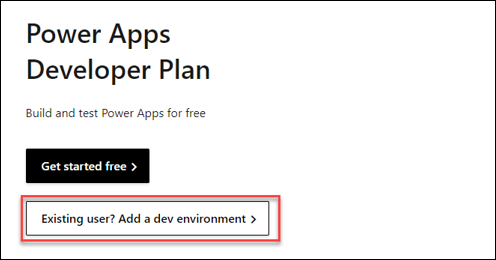

# Lab 00 - Setup Environment

Duration: 45 mins

## Table of Contents

**Lab Scenario** 

1. Exercise 1 - Create Dev environment

   - Task 1: Create dev environment 

2. Exercise 2 – Install Visual Studio Code and Power Platform CLI Extension 

   - Task 1: Install Node Package Manager

   - Task 2: Install Visual Studio Code 

### Lab Scenario

Working as part of the PrioritZ fusion team you will be setting up your Power Platform development environment. You will also install Visual Studio Code, and the Power Platform CLI.

## Exercise 1 - Create dev environment

In this exercise, you will create a Power Platform developer environment. You will do all the development work for this course in this environment.

>**Note**: Do not use an existing environment.

### Task 1: Create dev environment

1.	Navigate to [Power Apps Developer Plan](https://powerapps.microsoft.com/developerplan/)

1.	Select Add a dev environment.

    
    
1.	Sign in if prompted.
1.	Select your country and click Accept.
1.	You should be navigated back to the maker portal.
1.	Click Settings and select Admin center.

    
    
1.	Wait for the dev environment to be created.

    
    
1.	Refresh until the status changes to Ready.

    
    
1.	Go back to the maker portal https://make.powerapps.com/ refresh the page if you already have it open.

1.	Click on the environment name and select the dev environment you created.

    
    
1.	Expand Dataverse and select Tables.

1.	You should see several Dataverse tables that are created with every environment.

    
      
## Exercise 2 – Install Visual Studio Code and Power Platform CLI Extension

In this exercise, you will install Visual Studio Code, Power Platform Tools, Azure tools. These tools are used in the labs for this course.

### Task 1: Install Node Package Manager

1.	Navigate to [Npm and Node.js](https://nodejs.org/en/) 

1.	Select the recommended version. We recommend that you use LTS (Long-Term Support) version 18.12.1 or higher. 

    
    
1.	Double click on the downloaded installation file.

1.	Flow the installation wizard to install node package manager.
    
### Task 2: Install Visual Studio Code

1.	Navigate to [Visual Studio Code](https://code.visualstudio.com/) 

1.	Download Visual Studio Code and install it if you don’t already have it installed.

1.	Start Visual Studio Code.

1.	Select the Extensions tab.

1.	Search for Azure and click Install Azure Tools.

    
    
1.	Wait for the installation to complete.

1.	You should now see the new Azure Tools extension you added.

    
    
1.	Select the Extensions tab.

1.	Search for power platform and click Power Platform Tools.

    
    
1.	You should now see the Power Platform Tools tab.

    

