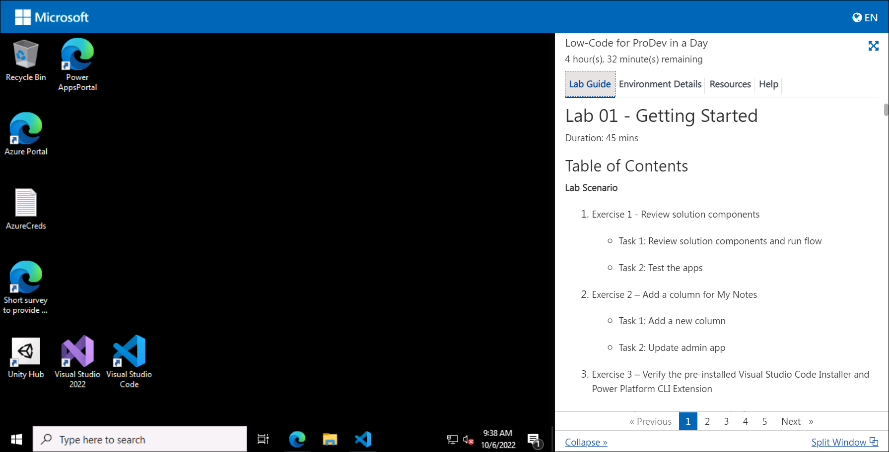
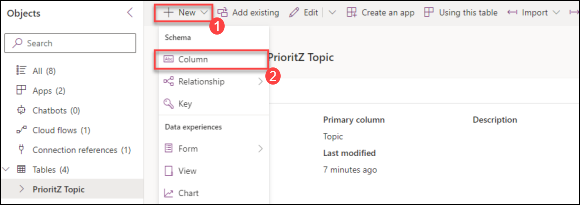
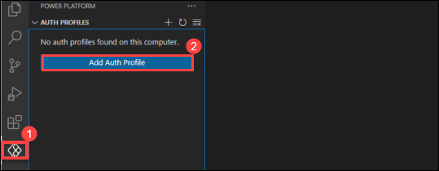
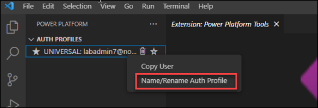
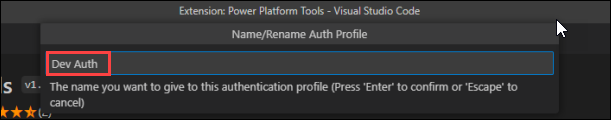
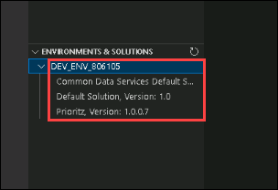
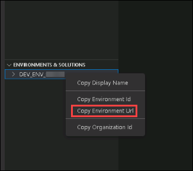

# Lab 01 - Getting Started

Duration: 30 mins

## Table of Contents

**Lab Scenario** 

1. Exercise 1 - Import starting solution 

   - Task 1: Import solution 

2. Exercise 2 - Run flow 

   - Task 1: Run flow

3. Exercise 3 – Add a column for My Notes 

   - Task 1: Add a new column 

   - Task 2: Update admin app 

3. Exercise 4 – Test Power Platform CLI

   - Task 1: Test the Power Platform CLI 


### Lab Scenario


You will import the current solution and use this to start your work. You will also add a column to a table and modifying the app to use it. You will also configure and test the Power Platform CLI.

# Getting Started with Lab

1. Once the environment is provisioned, a virtual machine (JumpVM) and lab guide will get loaded in your browser. Use this virtual machine throughout the workshop to perform the the lab.

   
   
2. To get the lab environment details, you can select **Environment Details** tab. Additionally, the credentials will also be sent to your email address provided during registration. 

   
   
## Exercise 1 - Import starting solution

In this exercise, you will import a solution into your pre-created dev environment. This solution contains the current version of the PrioritZ apps, flows and Dataverse tables.

>**Note**: The Dev environment is already pre-created as a part of the prerequisites.

### Task 1: Import solution

1. In the JumpVM, click on **Power Apps** portal shortcut of Microsoft Edge browser that is available on desktop.

   
   
2. When you click on Power Apps portal, the edge browser welcome screen will come up, select **Start without your data**.

   

3. On the **We can help you import your browsing data from Google** window, click on **Continue without this data**.
   
   
   
4. On the next window, click on **Confirm and start browsing**.

   

5. Now, you will see two tabs in the edge browser, close the first tab named with **Microsoft Edge**.

6. On the **Sign in** window, you will see the login screen, enter the following username **(1)** and click on **Next** **(2)**.

   * Email/Username: <inject key="AzureAdUserEmail"></inject>

   

7. Now enter the following password **(1)** and click on **Sign in** **(2)**. 

   * Password: <inject key="AzureAdUserPassword"></inject>
   
   

8. If you are presented with **Help us protect your account**, click on **Skip for now**.

   

9. If you see the pop-up **Stay Signed in?**, click **No**.

10.  Once logged in, click on **Environment (1)** and select the pre-created dev environment named **DEV_ENV_<inject key="Deployment ID" enableCopy="false" /> (2)**.   

     

11. Now, click on **Solutions(1)** from the left hand side menu and click **Import solution(2)**.

      

12.  Click **Browse**.
    
     
     
13. Navigate to this path `C:\LabFiles\Developer-in-a-day\Student\L01 - Getting started\Resources` in file explorer , select the **Prioritz_1_0_0_7.zip** file, and        click **Open**.

14. Make sure the **Prioritz(1)** file is selected and Click **Next(2)**.
    
     
     
15. Click **Next** again on the import solution blade.

16. Click on the **select a connection** dropdown and then select **+ New connection**.

      
      
17. Click **Create**, in a newly opened browser window and **Sign In** if prompted.

      
     
18. Close the connection browser window or tab.

19. Click **Refresh**.

      
     
20. Check the connection and click **Import** button to import the solution.

     
     
21. Wait until the solution import to complete.

     
     
22. You should now see the solution you imported in the list of solutions.

23.	Do not navigate away from this page.

## Exercise 2 – Run flow

In this exercise, you will run a flow that will add sample data to your environment.

### Task 1 - Run Flow

1.	Open the **PrioritZ** solution you imported.

     

2. Select **Cloud flow (1)** and open the **Import sample data – Topics (2)** flow.
 
     

3. Click on **Run** to run the flow.
   
     

4. Click the **Run flow** button on the Run flow blade.

     

     > **Note** : If you receive this error `Error from token exchange: Permission denied due to missing connection` while running the flow, this is because the **Dataverse connection** not being added correctly. Delete the imported solution and try to re-import the solution by performing the **Steps 11-21** of task1 again, then try to trigger the flow again.

5. Click **Done** and wait for the flow run to complete.

     

6. The flow should run successfully. If you want, you can click on the run row and it will show you
   the details of what the flow did.
   
      
      
7.	Click on the browser back button.

8.	You should be back on the solution you imported.

## Exercise 3 – Add a column for My Notes

In this exercise, you will add a new column **My Notes** to the topic table and update the PriortZ Admin
application.

### Task 1: Add a new column

1. Navigate to Power Apps maker portal by using below URL if not already open. Make sure the development environment is selected.
    ```
    https://make.powerapps.com
   ```
2. Select **Solutions (1)** from the left-hand side menu of Power Apps and open the **PrioritZ (2)** solution.

   

3. Expand **Tables** and select the **PrioritZ Topic** table.

4. Click **+ New(1)** and select **Column(2)**.

    

5. Enter the below value in the Display name field.

   ```
   My Notes
   ```
6. Now, search for **Plain text (1)** under Data type then select the one that comes under **Multiline Text (2)** , and click **Save (3)**.

    
   
   > **Note** : Do not navigate away from this page.

### Task 2: Update admin app

1. Make sure you are still in the **PrioritZ** solution. Select **Apps (1)** under **Objects** and select the **PrioritZ Admin (2)** application and click on **Edit (3)**.
    
    

2. Select the **Add Topic Screen**.

    

3. Click **+ Insert(1)** and select **Text input(2)**.
   
     

4. Double click on the newly added **Text input** and enter the below value to rename the text input.

    ```
    Notes textbox
    ```
    
     

5. Make the add picture control smaller if needed, and move the **Respond By and label textbox** down and place the **Notes textbox** between the Details control and the Respond by label.
   
    

6. Select **Notes textbox** and then **HintText** from the properties dropdown.

    

7. Change the **HintText** value of the Notes textbox to the below value. 

    ```
    My notes
    ```
   
    

8. Remove the Default text.

9. Select the **Mode** from the properties dropdown and change it's value by entering the below text.

    ```
    TextMode.MultiLine
    ```

    

10. Select **Save topic icon** under **Add Topics Screen** section.
     
     

11. Replace the **OnSelect** formula of the **Save topic icon** with the formula below. The Patch creates
   the new row in the Dataverse table.
     
     

    ```
    Set(newTopic,Patch('Prioritz Topics',Defaults('Prioritz Topics'),{'My Notes': 'Notes textbox'.Text,Topic:'Topic name textbox'.Text,Details:'Topic details textbox'.Text,'Respond By':'respond by date picker'.SelectedDate,Photo:AddTopicImage.Image}));ForAll(colAddChoices,Patch('Prioritz Topic Items',Defaults('Prioritz Topic Items'),{Choice:ThisRecord.choice,'PrioritZ Topic':newTopic,Photo:ThisRecord.photo}));Back()
    ```
12. Select the **View Topic Screen (1)** from the **Screens** tab.

13.  Click **+ Insert(1)** tab and select **Text label(2)**.

     

14. Double click on the newly added label and enter the below value to rename the label you just added.

     ```
     Notes label
     ```
     
    

15. Change the **Text** value of the Notes label with the below text.

     ```
     'Topics gallery'.Selected.'My Notes'
     ```
  
      

16. Rearrange the controls and move the **Notes label** between the details label and Topic items
    gallery.
   
      


17. Select the **Home Screen** and click **Preview the app**.
      
      

18. Click on the **+** button to add a new topic.

      

19. Fill out the form by providing below information and click **add a picture** that is present below **Respond By** field.

       1. Topic: `Test Notes` (1)
       
       2. Details: `Testing the notes` (2)
       
       3. Text input: `Prioritz Admin topic` (3)
       
       4. Respond By: **Today's date** (4)
      
      
20. Navigate to this path C:\LabFiles in file explorer, select **image.png** and click open.

21. Type **Test One** on the Choice field and click **add a picture** that is present below Choice field.
     
      

22. Navigate to this path `C:\LabFiles` in file explorer, select **image.png** and click open.

23. Click **+** to add the choice.
     
      

24. Add one more choices by repeating **steps 20-22** of this task.
       
       1. **Choice 1** : Enter `Test Two`

25. After adding all the Choices an topic dteails, your screen should look like beow screenshot.

    
      
26. Now, click on **Save** button.The new topic should be **saved**.

27. Click to open the **Test Notes** topic that you just created.

28. The notes **Prioritz Admin topic** that you have added earlier should now be visible now.
 
     

29. Close the app **preview**.

30. Click **Publish**.

     

31. Select Publish this version and wait for the publishing to complete.

     

32. You may close the **app designer**.

## Exercise 4 – Test the Power Platform CLI

In this exercise, you will test the **Power Platform CLI extension** in Visual Studio Code.

>**Note** : Visual studio code and Power platform CLI installation is already done as a part of the prerequisites.

### Task 1 - Test Power Platform CLI

1. In the JumpVM, start **Visual Studio Code** using the shortcut available on the desktop.

   
   
2. Select the **Power Platform tab(1)** and click **Add Auth Profile(2)**.

    

3. The sign in popup should appear.

4. Provide your credentials and sign in.

5. Right click on the auth profile you created and select **Name/Rename Auth profile**.

   

6. Type **Dev Auth** and hit **[ENTER]**.

   

7. You should now have at least one auth profile. If you have more than profile, make sure the 
   profile you created is selected.
 
   

8. Go to the Environments & Solutions pane and expand the environment you are using for this 
   lab.

9. You should see all the solutions in the environment.

    

10. Right click on the dev environment you created and select **copy Environment Url** and paste it in notepad for the next step.

    

11. Click **Terminal** and select **New Terminal**.

    
       
12. Run the command below to select the dev environment. Replace `<your environment URL>` in the below command with the value of environment URL that you copied          earlier, then run the command. 
      ```
      pac org select --environment <your environment URL>
      ```

      > **Info:** After adding the environment URL, the command will look like this: `pac org select --environment https://org32172839283.crm.dynamics.com/`
  
      

13. Run the command below to see list of solutions.

      ```
      pac solution list
      ```
14. You should see list of solutions installed on your environment.
    
    
