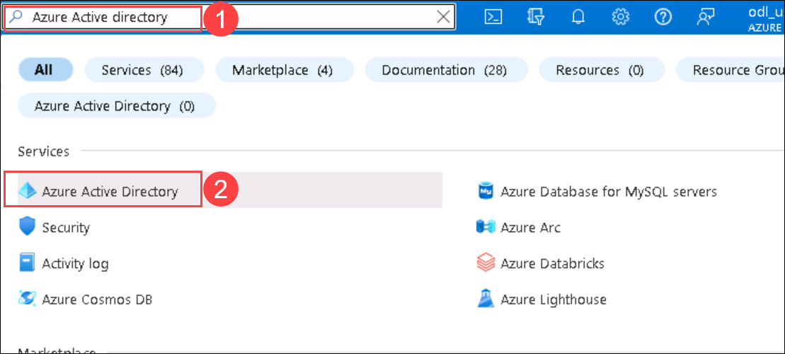

# Lab 05 - Application lifecycle management

Duration: 95 mins

## Table of Contents


Lab Scenario 

1. Exercise 1 – Promote Solution to Test Environment 

   - Task 1: Export Solution 

   - Task 2: Import Solution 

2. Exercise 2 – Configure a Service Principal 

   - Task 1: Create app registration 

   - Task 2: Create app user in Dataverse 

3. Exercise 3 – Create GitHub Repo 

   - Task 1: Create repository 

4. Exercise 4 – Export and Branch 

   - Task 1: Export and branch 

5. Exercise 5 – Release to Test 

   - Task 1: Create workflow

### Lab Scenario

Working as part of the PrioritZ fusion team you will be configuring GitHub Actions using the Power
Platform Build Tools to automate the team’s deployments.

## Exercise 1 – Promote Solution to Test Environment

In this exercise, you will export the export the Contoso Badges connector solution from the Dev
environment and import it to Test environment.You will be doing this promotion manually for this 
solution so you see how it can be done. However, in a real project it could all be automated using the 
build tasks you will use in the remaining parts of this lab.

###  Task 1: Export solution.

1. Navigate to Power Apps  maker portal and make sure you are in your dev environment.

         https://make.powerapps.com

2. Select **Solutions**.

3. Select the **Contoso Badges connector** solution and click **Export Solution**.
   
     

4. On the **Before you export** blade, click **Publish** and wait for the publishing to complete.

5. Once published, click on **Next**.

6. Select **Managed** and click **Export**.

7. Wait for the solution to be exported.

8. Click Download button Right side top of the screen ,Click Download Solution.
 
    


###  Task 2: Import solution

1. Navigate to Power Apps maker portal if not already open and select your **Test** environment named OTU XXXXXX (default).

         https://make.powerapps.com

2. Select **Solutions** from the left-hand side menu of Power Apps.

3. Click on **Create database** to create a Dataverse database.
 
    

4. Leave the **Currency** and **Lanaguage** field to default and click on **Create database**.
    

5. Wait for sometime (5-7 mins) until the solutions are loaded.

   > **Note**: If solutions are not loading and you are **Try again** error this is because Power Apps takes sometime to create the Database and load the daa. You can follow the below steps to fix the issue:

      1. Try refreshing the browser few times.
      2. If refresh doesn't work, try logging in to the Power Apps maker portal from private window and check solutions info.

6. Click **Import Solution**.
    
     

7. Click **Browse**.

8. Select the solution you exported from the Dev environment and click **Open**.

9. Click **Next**.

10. Click **Import** and wait for the import to complete.

11. The solution should import successfully.

## Exercise 2 – Configure a Service Principal

In this exercise, you will create service principal. The service principal will be used by the workflow
actions, so they do not execute under your individual user identity.

### Task 1: Create app registration

1. Navigate back to the browser tab in which Azure Portal is open. If not already open, navigate to Azure Portal using the below URL.

   ```
   https://portal.azure.com/
   ```

2. From Azure Portal home page, search for **Azure Active Directory** ***(1)*** in the search bar and select **Azure Active Directory** ***(2)*** from the suggestions.

   
   
3. Select **App registrations** ***(1)*** from the side blade and click on **+ New registration** ***(2)***. This application registration will be used for the connector to access the protected API.

   

4. Please provide the following details and click on **Register** ***(3)***.
   
   - Name: **GitHub Deploy<inject key="DeploymentID" enableCopy="false" />** ***(1)***
   - Supported account types: **Accounts in this organizational directory only (OTU WA AIW [SUFFIX] only - Single tenant)** ***(2)***

   .
   
5. Copy the **Application (client) ID**, **Directory(Tenant) ID**, and save it in a notepad as you need it for later use.
     
   

6. Select **Certificates & secrets** from the side blade and click on **+ New client secret**.

   

7. Enter **GitHub client secret<inject key="DeploymentID" enableCopy="false" />** ***(1)*** as description, set expiry to **3 months** ***(2)***, and click on **Add** ***(3)***.
   
   
   
8. Copy the **value** and save it in a notepad as you need it for later use.

   

    >**Note**: Make sure to copy and paste the correct **Application (client) ID**, **Directory(Tenant) ID** and **Secret** value. Copying the incorrect value will result in issues in the next steps/tasks.

 
### Task 2: Create app user in Dataverse

In this task, you will be registering the app you created in Azure Active Directory into the dev and test
Dataverse environments. You will also be assigning a security role that will allow the service principal to
deploy solutions.


1. Open a new browser window or tab and navigate to Power Platform Admin Center using the below URL.

     ```
     https://admin.powerplatform.microsoft.com/environments
     ```

2. Click on **Environments** ***(1)*** from the side blade and select your **DEV_ENV_<inject key="DeploymentID" enableCopy="false" />'s environment** ***(2)***.

   
   
3. From your environment page, click on **Settings**.

   
   
4. Expand **Users + permissions** ***(1)*** and select **Application users** ***(2)***.
    
   

5. In the Application users page, click on **+ New app user**.

   
   
6. In Create a new app user tab, click on **+ Add an app**.
      
   
   
7. Select the **GitHub Deploy<inject key="DeploymentID" enableCopy="false" />** ***(1)*** application registration which you created earlier and click on **Add** **(2)**.

   

8. Select your **Business unit** ***(1)*** from the drop down and click on **Create** ***(2)***. There should only be one Business unit unless you created more.

   

9. Select the **GitHub Deploy<inject key="DeploymentID" enableCopy="false" />** ***(1)*** application user you just created and click on **Edit security roles** ***(2)***.
    
   

10. On the **Edit security roles** blade, scroll down and select **System administrator** ***(1)*** and click on **Save** ***(2)***.

    
   
11. Again go back to **Environments** ***(1)*** in the side blade and select your **test environment** ***(2)***.

    
   
12. From your test environment page, click on **Settings**.

    

13. Expand **Users + permissions** ***(1)*** and select **Application users** ***(2)***.
    
    
   
14. In the Application users page, click on **+ New app user**.

    
   
15. On the **Create a new app user** tab, click on **+ Add an app**.
      
    
   
16. Select the **GitHub Deploy<inject key="DeploymentID" enableCopy="false" />** ***(1)*** application registration which you created earlier and click on **Add** ***(2)***.

    

17. Select your **Business unit** ***(1)*** from the drop down and click on **Create** ***(2)***. There should only be one Business unit unless you created more.

    

18. Select the **GitHub Deploy<inject key="DeploymentID" enableCopy="false" />** ***(1)*** application user you just created and click on **Edit security roles** ***(2)***.
    
    
   
19. Select **System administrator** ***(1)*** and click on **Save** ***(2)***.

    
   
20. Click on **Environments** ***(1)*** from the side blade and select your **DEV_ENV_<inject key="DeploymentID" enableCopy="false" />'s environment** ***(2)***.

    
   
21. Copy the **Environment URL** and save it in a notepad, you will be using this URL in future steps.
    
    
   
22. Again go back to **Environments** ***(1)*** in the side blade and select your **OTU XXXXXX (default) (2)** environment.

    
   
23. Copy the **Environment URL** and save it in a notepad, you will be using this URL in future steps.
    
    
   
## Exercise 3 – Create GitHub Repo

In this exercise, you will create a GitHub repository and add repository secrets.

### Task 1: Create repository

1. Navigate to the below URL and sign-in using your GitHub credentials.

   ```
   https://github.com/
   ```
2. Click on your **profile icon(1)** and select **Your repositories(2)**.

   

3. Click **New repository** to create a repository.

   

4. Enter **PrioritZ (1)** for Repository name, select **Public (2)** , check the **Add a README file (3)**.

   

5. Click **Create repository** to create it.

   

6. Click **Settings** to open the settings tab.
    
     .png)

7. Go to the **Security** section, expand **Secrets (1)** and select **Actions (2)**.

    > **Note**: The values you provide will not be visible after you create the item so take your time to get the values correct. 
      
     
   
8. Click **New repository secret** to add a secret.

     

9. Enter **PowerPlatformAppID (1)** for Name and paste the **Application (client) ID (2)** of **GitHub Deploy<inject key="DeploymentID" enableCopy="false" />** that you noted earlier in **`Exercise 2 -> Task 1 -> Step 5`** from your notepad in the **Value** field and click **Add secret (3)**.

     

10. Click **New repository secret** again.

11. Enter **PowerPlatformClientSecret (1)** for Name and paste the **secret Value (2)** from your notepad that you noted earlier in **`Exercise 2 -> Task 1 -> Step 8`** in the **Value** field and click **Add secret (3)**.

     

12. Click **New repository secret** again.

13. Enter **PowerPlatformTenantID (1)** for Name and paste the secret **Tenant ID (2)** from your notepad that you noted earlier in **`Exercise 2 -> Task 1 -> Step 5`** in the **Value** field and click **Add secret (3)**.

     

14. Click **New repository secret** again.

15. Enter **PowerPlatformDevUrl (1)** for Name and paste the secret **Dev environment URL (2)** from your notepad that you copied in the **`Exercise 2 -> Task 2 -> Step 21`** in the **Value** field and click **Add secret (3)**.

    >**Note**: Make sure you are pasting the dev environment URL named **Testodl_user_<inject key="DeploymentID" enableCopy="false" />** that you copied in the **`Exercise 2 -> Task 2 -> Step 21`**
   
      
  
16. Click **New repository secret** one more time.

17. Enter **PowerPlatformTestUrl (1)** for Name and paste the **Test Environment URL (2)** from your notepad that you copied in the **`Exercise 2 -> Task 2 -> Step 23`** in the **Value** field and click **Add secret (3)**.

     >**Note**: Make sure you are pasting the test environment URL named **OTU XXXXXX (default)** that you copied in the **`Exercise 2 -> Task 2 -> Step 23`**
 
     
   
18. You should now have **5** repository secrets.
     
       .png)

19. Do not navigate away from this page.

### Exercise 4 – Export and Branch

In this exercise, you will setup a workflow action, and add steps that will export the solution from dev
environment and create a new branch.

### Task 1: Export and branch

In this task you will create the workflow definition using the YAML provided. The action YAML uses two
space indentation so follow that carefully as you build the workflow definition. If in doubt, review the
indentation shown in the images.

1. Select the **Actions** tab and click on **set up a workflow yourself** to create a new workflow.
 
   .png)
   
2. Change the file name to it **export-and-branch.yml**
       
3. Remove everything from the workflow file.
  
   

4. Navigate to `https://raw.githubusercontent.com/CloudLabsAI-Azure/PowerApps-Dev-in-a-Day/main/export-and-branch.yml` URL, Copy the full content of the file and paste it in the **export-and-branch.yml** workflow.

   

5. Click **Start commit** and then click **Commit new file**.
    
   .png)

6. Select the **Actions** **(1)** tab and select the **workflow** ***(2)*** you created.

   
   
7. Click on **Run workflow.**
      
   .png)
   
8. Click **Run workflow** again and wait for the workflow run to complete.
      
   .png)
   
9. Select the **Code** ***(1)*** tab and click on **Branches** ***(2)***. You should see two branches
   
   
   
10. Click to open the branch that was created by the workflow action named as Prioritz-XXXXXXX.
   
    

11. On the Prioritz-XXXXXXX. branch, you should be able to see the solution folder.
      
    
   
12. Click on **Contribute** ***(1)*** button and select **Open pull request** ***(2)***.
        
    
   
13. Add description if you like and then click **Create pull request**.

     
   
14. You should now see the pull request summary. Confirm that the branch has no conflicts with the
    main branch and that the changes can be merged into the main branch automatically.
   
15. Click on the chevron button next to the **Merge pull request** button and select **Squash and**
    **merge**.
      
    .png)

16. Click **Squash and merge**.
   
17. Click **Confirm squash and merge**.
   
18. The pull request should get merged successfully.
   
     


### Exercise 5 – Release to Test

In this exercise, you will create a workflow action and add steps that will release the solution you
exported to the test environment.

### Task 1: Create workflow

1. Now navigate to the **Actions** tab.

    
   
2. Click **New workflow**.

    
   
3. Now on **Choose a workflow** page, click **set up a workflow yourself**.
     
    .png)
   
4. Change the file name to **release-to-test.yml**
   
    
     
5. Remove everything from the workflow file.
  
   

6. Navigate to `https://raw.githubusercontent.com/CloudLabsAI-Azure/PowerApps-Dev-in-a-Day/main/release-to-test.yml` URL in the browser and copy the full content of the file and paste it in the **release-to-test.yml** workflow file.
 
   
      
7. Click **Start commit** and then click **Commit new file**.
     
     .png)

8. Select the **Code** tab.
   
9. Go to the **Releases** section and click **Create new release**.
     
     .png)    
   
10. Click on the **Choose a tag** button, enter **v1.0.0** , and select **+ Create new tag on publish**.
      
     .png)  

11. Click **Publish release**.
   
12. Select the **Actions** tab and monitor the workflow.
      
     .png)

13. The release should complete successfully.
    
     
     
14. Navigate back to powerapps portal and select the solutions tab from the left side and you should see the solution deployed with the name of Prioritz. Make sure that you are in test powerapps environment.

      


