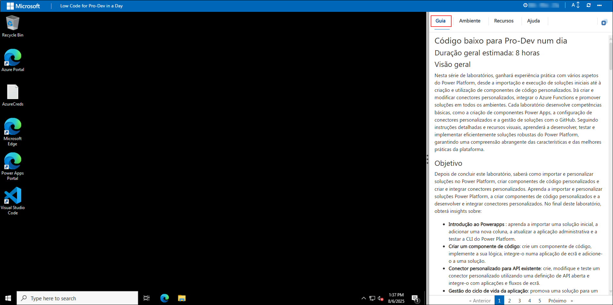
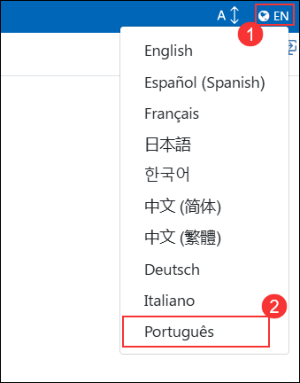
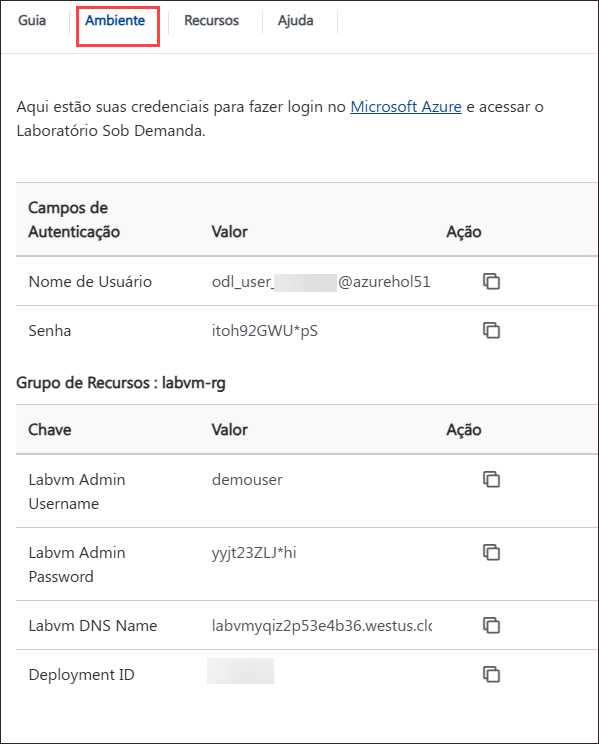
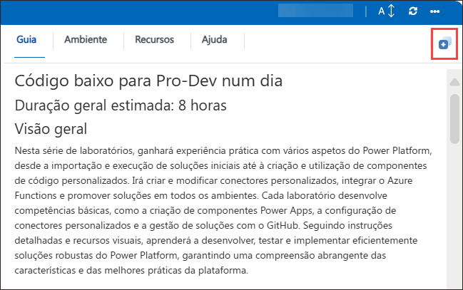
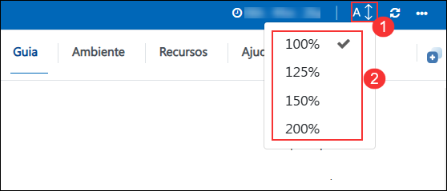
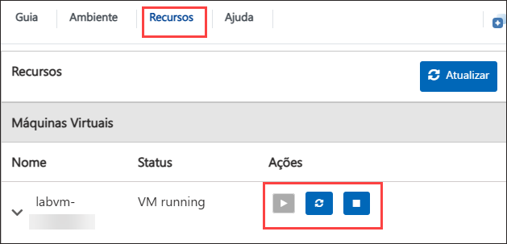
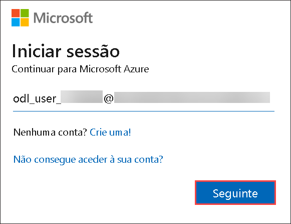
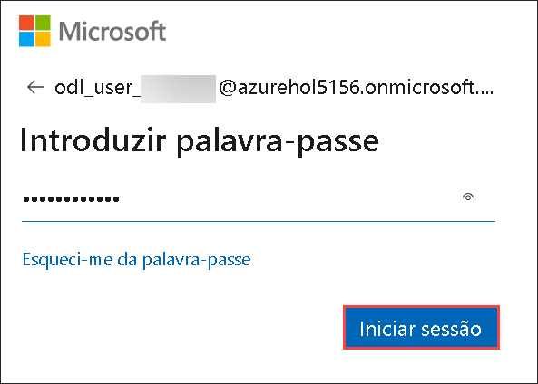
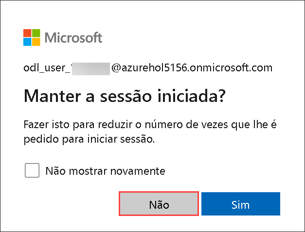

# Código baixo para Pro-Dev num dia

## Duração geral estimada: 8 horas

## Visão geral

Nesta série de laboratórios, ganhará experiência prática com vários aspetos do Power Platform, desde a importação e execução de soluções iniciais até à criação e utilização de componentes de código personalizados. Irá criar e modificar conectores personalizados, integrar o Azure Functions e promover soluções em todos os ambientes. Cada laboratório desenvolve competências básicas, como a criação de componentes Power Apps, a configuração de conectores personalizados e a gestão de soluções com o GitHub. Seguindo instruções detalhadas e recursos visuais, aprenderá a desenvolver, testar e implementar eficientemente soluções robustas do Power Platform, garantindo uma compreensão abrangente das funcionalidades e melhores práticas da plataforma.

## Objetivo

Depois de concluir este laboratório, saberá como importar e personalizar soluções no Power Platform, criar componentes de código personalizados e criar e integrar conectores personalizados.
Aprenda a importar e personalizar soluções Power Platform, a criar componentes de código personalizados e a desenvolver e integrar conectores personalizados. No final deste laboratório, obterá insights sobre:

 - **Introdução ao Power Apps** : aprenda a importar uma solução inicial, a adicionar uma nova coluna, a atualizar a aplicação administrativa e a testar a CLI do Power Platform.
 - **Criar um componente de código**: crie um componente de código, implemente a sua lógica, integre-o numa aplicação de ecrã e adicione-o a uma solução.
 - **Conector personalizado para API existente**: crie, modifique e teste um conector personalizado utilizando uma definição de API aberta e integre-o com aplicações e fluxos de ecrã.
 - **Gerir o ciclo de vida da aplicação**: promova uma solução para um ambiente de teste, configure uma entidade de serviço, faça a gestão com o GitHub e configure um workflow para lançamento.

## Pré-requisitos

- Conhecimentos básicos de Power Platform e Power Apps.
- Acesso ao ambiente Power Platform e conta Azure.
- Compreensão de APIs e desenvolvimento de componentes personalizados
- Familiaridade com as operações GitHub e Git.
- Preparação com ficheiros necessários, definições de API e ferramentas de desenvolvimento.

## Diagrama de Arquitetura

Nestes laboratórios, seguirá um processo estruturado para dominar os principais aspetos do desenvolvimento e gestão do Power Platform. Começará por importar uma solução pré-criada, executar um fluxo para adicionar dados de exemplo, personalizá-lo adicionando uma nova coluna e testar a CLI do Power Platform utilizando o VS Code. Em seguida, irá criar um componente de código com o VS Code, integrá-lo numa aplicação de ecrã e adicioná-lo a uma solução. Em seguida, irá criar um conector personalizado utilizando uma definição de API aberta, melhorá-lo com código personalizado e testá-lo em fluxos e aplicações de ecrã. Depois disso, irá criar, implementar e publicar uma Função Azure, criar um conector para a mesma e, opcionalmente, integrá-la numa aplicação de ecrã. Por fim, irá promover uma solução para um ambiente de teste, configurar uma entidade de serviço, gerir a solução utilizando um repositório GitHub e libertá-la para teste. Cada passo é detalhado com instruções e recursos visuais para garantir que obtém experiência prática com as funcionalidades do Power Platform.

 

## Explicação dos Componentes

- **Ambiente Power Platform**: o espaço de trabalho central onde importa, gere e personaliza soluções no Power Platform. Fornece as ferramentas e interface necessárias para o desenvolvimento e teste
 diversas aplicações e componentes.
- **Visual Studio Code**: um editor de código versátil utilizado para desenvolver componentes de código personalizados e Azure Functions. Oferece extensões e integrações poderosas para agilizar a codificação e a depuração dentro do ecossistema da Power Platform.
- **Componente de código**: elementos criados para estender a funcionalidade do Power Apps. Estes componentes envolvem a escrita e integração de lógica personalizada, o que melhora os recursos e a flexibilidade das aplicações de ecrã.
- **Conector personalizado**: ferramentas que permitem que as aplicações do Power Platform se liguem a fontes de dados externas através de APIs. Estes conectores permitem a integração perfeita de dados e serviços externos no Power Platform aplicações.
- **Azure Function**: serviços de computação sem servidor que executam código on-demand para realizar diversas tarefas. O Azure Functions está integrado com as aplicações do Power Platform para adicionar recursos avançados e escaláveis ​​e executar operações específicas.
- **GitHub**: um sistema de controlo de versões para gerir e acompanhar alterações em soluções e códigos.

## Começando

Bem-vindo ao seu programador num dia! Preparámos um ambiente perfeito para que possa explorar e aprender sobre os serviços Azure. Vamos começar por tirar o máximo partido desta experiência:

## Aceder ao seu ambiente de laboratório

Quando estiver pronto para começar, a sua máquina virtual e o **Guia de laboratório** estarão ao seu alcance no navegador Web.

### Máquina Virtual e Guia de Laboratório

No ambiente integrado, a máquina virtual serve como o espaço de trabalho designado, enquanto o guia do laboratório fica acessível no lado direito da tela.

**Nota**: certifique-se de seguir as instruções cuidadosamente para garantir que o laboratório funcione sem problemas e forneça uma experiência de usuário ideal.

## Alterar o idioma do guia do laboratório

Para alterar o idioma do guia do laboratório, clique no **ícone(1)** de idioma localizado no canto superior direito e selecione **Português (2)** na lista suspensa. 

## Explorar os recursos do seu laboratório

Para melhor compreender os seus recursos e credenciais de laboratório, navegue até ao separador **Detalhes do ambiente**.

## Utilizando o recurso de janela dividida

Por conveniência, pode abrir o guia de laboratório numa janela separada, selecionando o botão **Dividir janela** no canto superior direito.

## Guia de laboratório Ampliar/Reduzir

Para ajustar o nível de zoom da página do ambiente, clique no ícone **A↕** localizado ao lado do cronômetro no ambiente do laboratório.

 

## Gerir a sua máquina virtual

Sinta-se à vontade para iniciar, parar ou reiniciar a sua máquina virtual conforme necessário no separador **Recursos**. A sua experiência está nas suas mãos!

## Vamos começar pelo Portal do Azure

1. Na sua máquina virtual, clique no ícone do Portal do Azure, como se mostra abaixo:

   

2. Verá o separador **Entrar no Microsoft Azure**. Aqui, insira as suas credenciais:

    - **E-mail/Nome de utilizador:** <inject key="AzureAdUserEmail"></inject>

      

3. De seguida, introduza a sua palavra-passe:

    - **Password:** <inject key="AzureAdUserPassword"></inject>

      

4. Se vir o pop-up **Permanecer ligado?**, clique em **Não**.

   

5. Se vir o pop-up **Tem recomendações gratuitas do Azure Advisor!**, feche a janela para continuar o laboratório.

6. Se for apresentada uma janela pop-up **Bem-vindo ao Microsoft Azure**, clique em **Talvez mais tarde** para ignorar o tour.

Ao completar estes exercícios, irá importar e personalizar soluções do Power Platform, criar e implementar componentes de código personalizados com o Visual Studio Code, desenvolver e integrar conectores personalizados, criar e implementar o Azure Functions e gerir soluções utilizando o GitHub para o código-fonte.

## Contacto de suporte

A equipa de suporte da CloudLabs está disponível 24 horas por dia, 7 dias por semana, 365 dias por ano, via e-mail e chat ao vivo para garantir a assistência contínua a qualquer momento. Oferecemos canais de apoio dedicados e adaptados especificamente para alunos e instrutores, garantindo que todas as suas necessidades são satisfeitas de forma rápida e eficiente.

Contactos de apoio ao aluno:

- Suporte por e-mail: cloudlabs-support@spektrasystems.com

- Suporte por chat ao vivo: https://cloudlabs.ai/labs-support

Agora, clique em **Seguinte** no canto inferior direito para passar para a página seguinte.

## Boa aprendizagem!!
