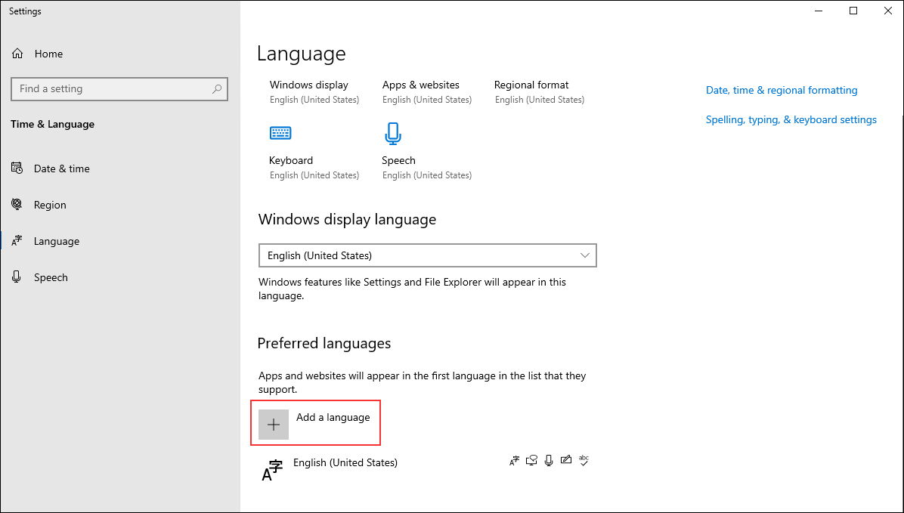
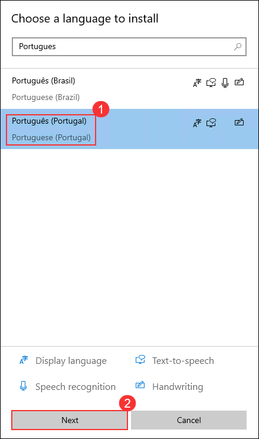
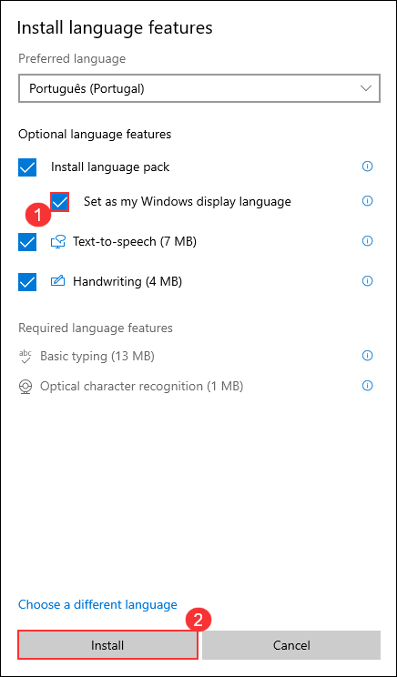

# Low-Code para Desenvolvedores Profissionais em um Dia

## Duração geral estimada: 8 horas

## Visão geral

Neste laboratório, você obterá experiência prática com vários aspectos da Power Platform, desde a importação e execução de soluções iniciais até a construção e o uso de componentes de código personalizados. Você criará e modificará conectores personalizados, integrará Azure Functions e promoverá soluções entre ambientes. Cada laboratório desenvolve habilidades fundamentais, como a criação de componentes do Power Apps, a configuração de conectores personalizados e o gerenciamento de soluções com o GitHub. Seguindo instruções detalhadas e auxílios visuais, você aprenderá a desenvolver, testar e implantar soluções robustas da Power Platform de forma eficaz, garantindo uma compreensão abrangente das capacidades e melhores práticas da plataforma.

## Objetivo

Após concluir estes laboratórios, você saberá como importar e personalizar soluções na Power Platform, construir componentes de código personalizados e criar e integrar conectores personalizados. Ao final deste laboratório, você terá obtido conhecimento sobre:

 - **Introdução ao Power Apps** : Aprender a importar uma solução inicial, adicionar uma nova coluna, atualizar o aplicativo de administração e testar a CLI da Power Platform.
 - **Criar um componente de código**: Criar um componente de código, implementar sua lógica, integrá-lo a um aplicativo de tela e adicioná-lo a uma solução.
 - **Conector personalizado para API existente**: Criar, modificar e testar um conector personalizado usando uma definição Open API, e integrá-lo com aplicativos de tela e fluxos.
 - **Gerenciamento do ciclo de vida de aplicativos (ALM)**: Promover uma solução para um ambiente de teste, configurar uma entidade de serviço (service principal), gerenciar com o GitHub e configurar um fluxo de trabalho (workflow) para o lançamento.

## Pré-requisitos

Os participantes devem ter:

- Conhecimentos básicos de Power Platform e Power Apps.
- Compreensão de APIs e desenvolvimento de componentes personalizados
- Familiaridade com as operações GitHub e Git.
- Estar preparado com os arquivos, definições de API e ferramentas de desenvolvimento necessárias.

## Diagrama de Arquitetura

Neste laboratório, você seguirá um processo estruturado para dominar aspectos-chave do desenvolvimento e gerenciamento da Power Platform. Você começará importando uma solução pré-construída, executando um fluxo para adicionar dados de exemplo, personalizando-a com uma nova coluna e testando a CLI da Power Platform com o VS Code. Em seguida, você construirá um componente de código com o VS Code, o integrará a um aplicativo de tela e o adicionará a uma solução. Depois, você criará um conector personalizado usando uma definição Open API, o aprimorará com código personalizado e o testará tanto em fluxos quanto em aplicativos de tela. Após isso, você criará, implementará e publicará uma Azure Function, criará um conector para ela e, opcionalmente, a integrará a um aplicativo de tela. Finalmente, você promoverá uma solução para um ambiente de teste, configurará uma entidade de serviço, gerenciará a solução usando um repositório GitHub e a liberará para testes. Cada passo é detalhado com instruções e auxílios visuais para garantir que você ganhe experiência prática com os recursos da Power Platform.

## Diagrama da Arquitetura

 

## Explicação dos Componentes

A arquitetura para este laboratório envolve os seguintes componentes principais:

- **Ambiente Power Platform**: O espaço de trabalho central onde você importa, gerencia e personaliza soluções dentro da Power Platform. Ele fornece as ferramentas e a interface necessárias para desenvolver e testar vários aplicativos e componentes.
- **Visual Studio Code**: Um editor de código versátil usado para desenvolver componentes de código personalizados e Azure Functions. Ele oferece extensões e integrações poderosas para otimizar a codificação e a depuração no ecossistema da Power Platform.
- **Componente de Código**: Elementos criados para estender a funcionalidade dos Power Apps. Esses componentes envolvem a escrita e integração de lógica personalizada, o que aprimora as capacidades e a flexibilidade dos aplicativos de tela.
- **Conector Personalizado**: Ferramentas que permitem que os aplicativos da Power Platform se conectem a fontes de dados externas via APIs. Esses conectores possibilitam a integração perfeita de dados e serviços externos nas aplicações da Power Platform.
- **Azure Function**: Serviços de computação sem servidor (serverless) que executam código sob demanda para realizar várias tarefas. As Azure Functions são integradas aos aplicativos da Power Platform para adicionar capacidades avançadas e escaláveis e para lidar com operações específicas.
- **GitHub**: Um sistema de controle de versão para gerenciar e rastrear alterações em soluções e código.

## Começando

Bem-vindo ao seu workshop "Low-Code para Desenvolvedores Profissionais em um Dia"! Preparamos um ambiente integrado para você explorar e aprender sobre os serviços do Azure. Vamos começar aproveitando ao máximo esta experiência:

### Acessando seu Ambiente de Laboratório

Quando estiver pronto para começar, sua máquina virtual e o **Guia de laboratório** estarão ao seu alcance dentro do seu navegador.

### Máquina Virtual e Guia de Laboratório

No ambiente integrado, a VM do laboratório serve como o espaço de trabalho designado, enquanto o guia do laboratório fica acessível no lado direito da tela.

**Observação**: Certifique-se de seguir as instruções cuidadosamente para garantir que o laboratório funcione sem problemas e forneça uma experiência de usuário ideal.

## Alterar o Idioma do Guia do Laboratório

Para alterar o idioma do guia do laboratório, clique no **ícone(1)** de idioma localizado no canto superior direito e selecione **Português (2)** na lista suspensa. 

## Explorando Seus Recursos de Laboratório

Para entender melhor seus recursos de laboratório e credenciais, navegue até a aba **Detalhes do ambiente**.

## Utilizando o Recurso de Dividir Janela

Para sua conveniência, você pode abrir o guia do laboratório em uma janela separada selecionando o botão **Dividir janela** no canto superior direito.

## Zoom no Guia do Laboratório

Para ajustar o nível de zoom da página do ambiente, clique no ícone **A↕** localizado ao lado do cronômetro no ambiente do laboratório.

 

## Gerenciando sua Máquina Virtual

Sinta-se à vontade para **iniciar, parar ou reiniciar&& a sua máquina virtual conforme necessário a partir da aba **Recursos**. A sua experiência está nas suas mãos!

## Vamos começar com o Portal do Azure

1. Na sua máquina virtual, clique no ícone do **Portal do Azure**, como mostrado abaixo:

   

2. Você verá a aba **Entrar no Microsoft Azure**. Aqui, insira as suas credenciais:

    - **E-mail/Nome de usuário:** <inject key="AzureAdUserEmail"></inject>

      

3. Em seguida, insira sua senha:

    - **Senha:** <inject key="AzureAdUserPassword"></inject>

      

4. Se você vir o pop-up **Ação Necessária**, clique em **Perguntar Depois**.

>**Observação**: Por favor, não habilite o MFA (Autenticação Multifator); selecione imediatamente **Perguntar Depois**, se disponível. Se a opção **Perguntar Depois** não for exibida, prossiga com a habilitação do MFA seguindo os passos destacados em **Passos para Prosseguir com a Configuração do MFA se a Opção "Perguntar Depois" Não Estiver Visível**.

5. Se você vir o pop-up **Permanecer Conectado?**, clique em **Não**.

   

6. Se for apresentada uma janela pop-up **Bem-vindo ao Microsoft Azure**, clique em **Cancelar** para ignorar o tour.

Ao concluir estes exercícios, você importará e personalizará soluções da Power Platform, criará e implementará componentes de código personalizados com o Visual Studio Code, desenvolverá e integrará conectores personalizados, criará e implantará Azure Functions e gerenciará soluções usando o GitHub para controle de versão.

>**Observação:** Por favor, certifique-se de seguir as instruções cuidadosamente para garantir que o laboratório funcione sem problemas e proporcione uma experiência de usuário otimizada.

## Alterar o idioma da Máquina Virtual

Se precisar alterar o idioma da Máquina Virtual para Português, siga os passos abaixo antes de iniciar o laboratório.

1. Na barra de pesquisa do Windows, digite **Language settings (1)** e selecione **Language settings (2)** nos resultados.

   

1. Na página **Language**, clique em **Add a language**.

   

1. Na janela **Choose a language to install**, pesquise por *Português*, selecione **Português (Portugal) (1)** e clique em **Next (2)**.

   

1. Na janela **Install language features**, marque a opção **Set as my Windows display language (1)** e clique em **Install (2)**.

   

1. Agora aguarde o Windows baixar e instalar os componentes de idioma. Isso pode levar alguns minutinhos (~5–10 min), dependendo da internet e da VM.

1. Quando o Windows perguntar para você sair ou reiniciar a sessão — geralmente aparece um pop-up tipo **“Sign out now?”** — clique **Sim, sair agora** para aplicar o novo idioma.

1. A VM vai fechar sua sessão e, na próxima tela de login, o sistema já vai estar todo no idioma português. Curte que tá tudo pronto pra continuar o laboratório!

## Contacto de suporte

A equipe de suporte do CloudLabs está disponível 24 horas por dia, 7 dias por semana, 365 dias por ano, via e-mail e chat ao vivo para garantir assistência contínua a qualquer momento. Oferecemos canais de suporte dedicados e personalizados tanto para alunos quanto para instrutores, garantindo que todas as suas necessidades sejam atendidas de forma rápida e eficiente.

Contactos de apoio ao aluno:

- Suporte por e-mail: cloudlabs-support@spektrasystems.com
- Suporte por chat ao vivo: https://cloudlabs.ai/labs-support

Agora, clique em **Avançar** no canto inferior direito para ir para a próxima página.

## Bons estudos!!
