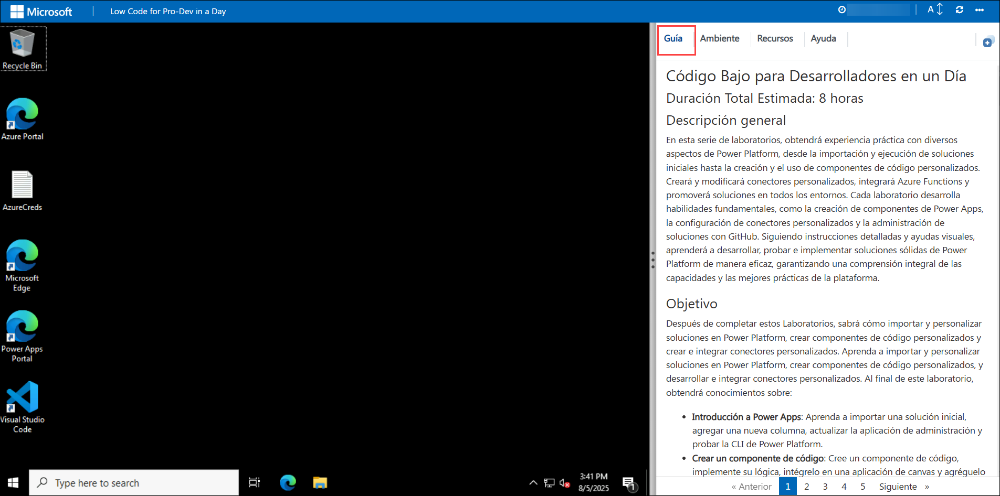
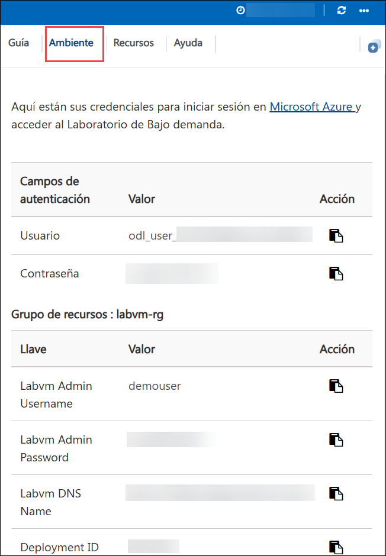
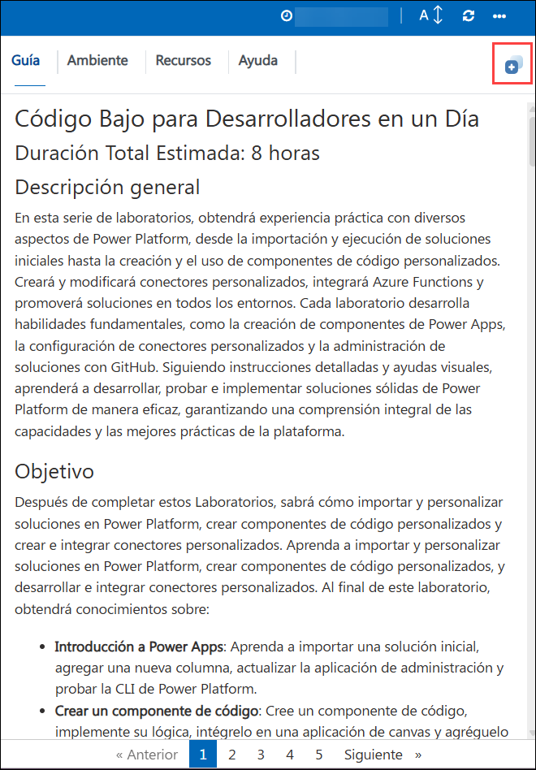

# Código Bajo para Desarrolladores en un Día

## Duración Total Estimada: 8 horas

## Descripción general

En esta serie de laboratorios, obtendrá experiencia práctica con diversos aspectos de Power Platform, desde la importación y ejecución de soluciones iniciales hasta la creación y el uso de componentes de código personalizados. Creará y modificará conectores personalizados, integrará Azure Functions y promoverá soluciones en todos los entornos. Cada laboratorio desarrolla habilidades fundamentales, como la creación de componentes de Power Apps, la configuración de conectores personalizados y la administración de soluciones con GitHub. Siguiendo instrucciones detalladas y ayudas visuales, aprenderá a desarrollar, probar e implementar soluciones sólidas de Power Platform de manera eficaz, garantizando una comprensión integral de las capacidades y las mejores prácticas de la plataforma.

## Objetivo

Después de completar estos Laboratorios, sabrá cómo importar y personalizar soluciones en Power Platform, crear componentes de código personalizados y crear e integrar conectores personalizados.
Aprenda a importar y personalizar soluciones en Power Platform, crear componentes de código personalizados, y desarrollar e integrar conectores personalizados. Al final de este laboratorio, obtendrá conocimientos sobre:

 - **Introducción a Power Apps**: Aprenda a importar una solución inicial, agregar una nueva columna, actualizar la aplicación de administración y probar la CLI de Power Platform.
 - **Crear un componente de código**: Cree un componente de código, implemente su lógica, intégrelo en una aplicación de canvas y agréguelo a una solución.
 - **Conector personalizado para API existente**: Cree, modifique y pruebe un conector personalizado mediante una definición de Open API e intégrelo con aplicaciones y flujos de canvas.
 - **Administración del ciclo de vida de la aplicación**: Promueva una solución a un entorno de prueba, configure una entidad de servicio, administre con GitHub y configure un flujo de trabajo para el lanzamiento.

## Requisitos previos

- Conocimientos básicos de Power Platform y Power Apps.
- Acceso al entorno Power Platform y a la cuenta de Azure.
- Conocimiento de APIs y desarrollo de componentes personalizados.
- Familiaridad con GitHub y las operaciones de Git.
- Preparación con los archivos necesarios, las definiciones de API y las herramientas de desarrollo.

## Arquitectura

En estos laboratorios, seguirá un proceso estructurado para dominar los aspectos clave del desarrollo y la administración de Power Platform. Comenzará por importar una solución preconstruida, ejecutando un flujo para agregar datos de muestra, personalizándola agregando una nueva columna y probando la CLI de Power Platform con VS Code. A continuación, creará un componente de código con VS Code, lo integrará en una aplicación de canvas y lo agregará a una solución. Luego, creará un conector personalizado con una definición de Open API, lo mejorará con código personalizado y lo probará tanto en flujos como en aplicaciones de canvas. A continuación, creará, implementará y publicará una Azure Function, creará un conector para ella y, opcionalmente, la integrará en una aplicación de canvas. Por último, promoverá una solución a un entorno de prueba, configurará una entidad de servicio, administrará la solución con un repositorio de GitHub y la publicará para pruebas. Cada paso se detalla con instrucciones y ayudas visuales para garantizar que obtenga experiencia práctica con las características de Power Platform.

## Diagrama de Arquitectura

   

## Explicación de los Componentes

- **Entorno de Power Platform**: El espacio de trabajo central donde se importan, administran y personalizan soluciones dentro de Power Platform. Proporciona las herramientas y la interfaz necesarias para desarrollar y probar diversas aplicaciones y componentes.
- **Visual Studio Code**: Un editor de código versátil que se utiliza para desarrollar componentes de código personalizados y Azure Functions. Ofrece extensiones e integraciones potentes para agilizar la codificación y la depuración dentro del ecosistema de Power Platform.
- **Componente de Código**: Elementos creados para ampliar la funcionalidad de Power Apps. Estos componentes implican la escritura e integración de lógica personalizada, lo que mejora las capacidades y la flexibilidad de las aplicaciones de canvas.
- **Conector Personalizado**: Herramientas que permiten que las aplicaciones de Power Platform se conecten con fuentes de datos externas a través de APIs. Estos conectores permiten una integración perfecta de datos y servicios externos en las aplicaciones de Power Platform.
- **Azure Functions**: Servicios de computación sin servidor que ejecutan código bajo demanda para realizar diversas tareas. Azure Functions se integran en las aplicaciones de Power Platform para agregar capacidades avanzadas y escalables y manejar operaciones específicas.
- **GitHub**: Un sistema de control de versiones para administrar y realizar un seguimiento de los cambios en las soluciones y el código.

## Primeros pasos
 
¡Bienvenido a su Taller de Código Bajo para Desarrolladores en un Día! Hemos preparado un ambiente perfecto para que explore y aprenda sobre los servicios de Azure. Comencemos por aprovechar al máximo esta experiencia:
 
## Acceso a su Ambiente de Laboratorio
 
Una vez que esté listo para comenzar, su máquina virtual y la **Guía de laboratorio** estarán a su alcance en su navegador web.

### Máquina Virtual y Guía de Laboratorio
 
En el entorno integrado, la máquina virtual del laboratorio funciona como el espacio de trabajo designado, mientras que la guía del laboratorio está accesible en el lado derecho de la pantalla.

**Nota**: Asegúrese de seguir las instrucciones cuidadosamente para garantizar que el laboratorio funcione sin problemas y brinde una experiencia de usuario óptima.
 
## Exploración de los Recursos de su Laboratorio

Para comprender mejor los recursos y credenciales de su laboratorio, navegue hasta la pestaña **Detalles del Ambiente**.

## Guía de laboratorio Acercar/Alejar

Para ajustar el nivel de zoom de la página del entorno, haga clic en el ícono **A↕ : 100%** ubicado junto al temporizador en el entorno del laboratorio.

 
 
## Uso de la Función de Ventana Dividida

Para mayor comodidad, puede abrir la guía de laboratorio en una ventana separada seleccionando el botón **Ventana Dividida** en la esquina superior derecha.
 

 
## Administración de su Máquina Virtual

Siéntase libre de **iniciar**, **detener** o **reiniciar** su máquina virtual según sea necesario desde la pestaña **Recursos**. ¡Su experiencia está en sus manos!
 

 
## Comencemos con el Portal de Azure

1. En su máquina virtual, haga clic en el ícono del Portal de Azure como se muestra a continuación:
 
   
 
2. Verá la pestaña **Iniciar sesión en Microsoft Azure**. Aquí, ingrese sus credenciales:
 
   - **Correo Electrónico/Nombre de Usuario:** <inject key="AzureAdUserEmail"></inject>
 
     
 
3. A continuación, proporcione su contraseña:
 
   - **Contraseña:** <inject key="AzureAdUserPassword"></inject>
 
     
 
4. Si ve la ventana emergente Acción Requerida, haga clic en Preguntar después.

   

   > **NOTA:** No active MFA, seleccione **Preguntar después**.

5. Si ve la ventana emergente **¿Desea permanecer conectado?**, haga clic en **No**.

   

6. Si ve la ventana emergente **¡Tiene recomendaciones gratuitas de Azure Advisor!**, cierre la ventana para continuar con el laboratorio.

7. Si aparece una ventana emergente **Bienvenido a Microsoft Azure**, haga clic en **Cancelar** para omitir la visita guiada.

Al completar estos ejercicios, importará y personalizará soluciones de Power Platform, creará e implementará componentes de código personalizados con Visual Studio Code, desarrollará e integrará conectores personalizados, creará e implementará Azure Functions y administrará soluciones con GitHub para el control de código fuente.
   
## Contacto de Soporte

El equipo de soporte de CloudLabs está disponible las 24 horas del día, los 7 días de la semana, los 365 días del año, por correo electrónico y chat en vivo para garantizar una asistencia perfecta en cualquier momento. Ofrecemos canales de soporte dedicados y diseñados específicamente para estudiantes e instructores, garantizando que todas sus necesidades se aborden de manera rápida y eficiente.

Contactos de Soporte para Estudiantes:

- Soporte por Correo Electrónico: cloudlabs-support@spektrasystems.com

- Soporte por Chat en Vivo: https://cloudlabs.ai/labs-support

Ahora, haga clic en **Siguiente >>** en la esquina inferior derecha para pasar a la página siguiente.

## ¡¡Feliz aprendizaje!!

 
