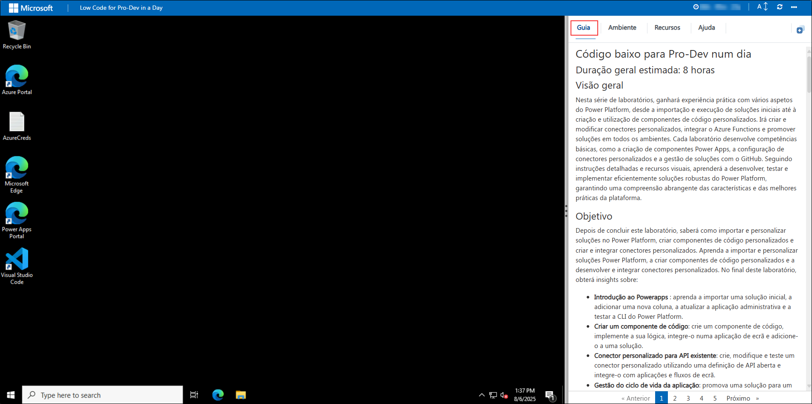
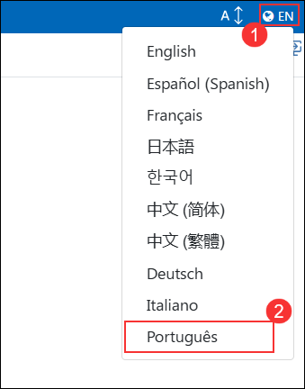
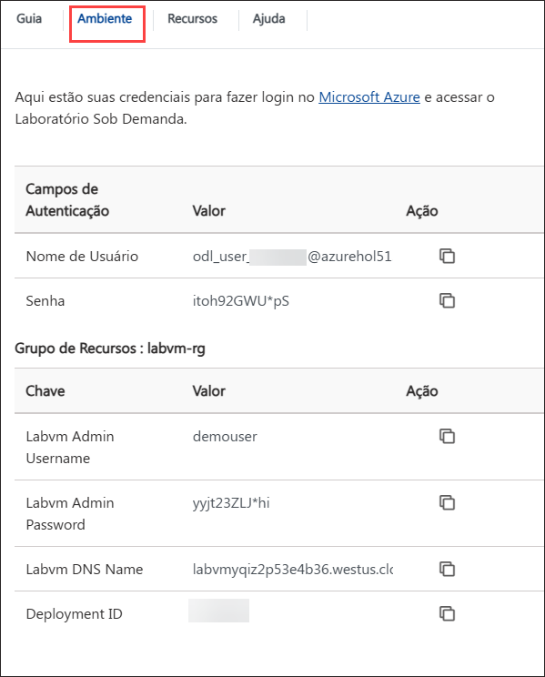
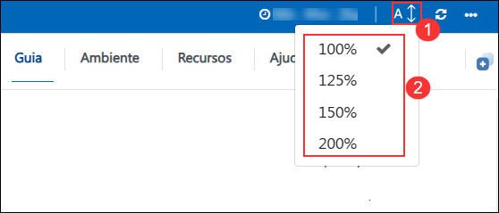
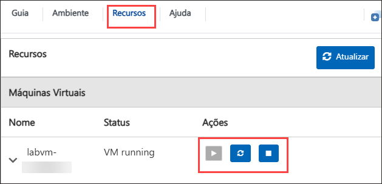

# Desenvolvimento de baixo código com Powerapps e Power Automate

## Duração geral estimada: 4 horas

## Visão geral

Nesta série de laboratórios, irá adquirir experiência prática com vários aspetos do Power Platform, desde a importação e execução de soluções iniciais até à criação e utilização de componentes de código personalizados. Irá criar e modificar conectores personalizados e promover soluções em todos os ambientes. Cada laboratório desenvolve competências fundamentais, como a criação de componentes Power Apps e a configuração de conectores personalizados. Seguindo instruções detalhadas e recursos visuais, aprenderá a desenvolver, testar e implementar soluções robustas do Power Platform de forma eficaz, garantindo uma compreensão abrangente das características e melhores práticas da plataforma.

## Objetivo

Após concluir este laboratório, saberá como importar e personalizar soluções no Power Platform, criar componentes de código personalizados e criar e integrar conectores personalizados.
Aprenda a importar e personalizar soluções Power Platform, a criar componentes de código personalizados e a desenvolver e integrar conectores personalizados. No final deste laboratório, obterá insights sobre:

- **Introdução ao PowerApps**: Aprenda a importar uma solução inicial, adicionar uma nova coluna, atualizar a aplicação de administração e testar a CLI do Power Platform.
- **Criar um componente de código**: Crie um componente de código, implemente a sua lógica, integre-o numa aplicação Canvas e adicione-o a uma solução.
- **Conector personalizado para API existente**: Crie, modifique e teste um conector personalizado utilizando uma definição de API aberta e integre-o com aplicações Canvas e streams.

## Pré-requisitos

Os participantes devem ter:

- Conhecimentos básicos do Power Platform e Power Apps.
- Acesso ao ambiente Power Platform e à conta Azure.
- Compreensão de APIs e desenvolvimento de componentes personalizados.
- Familiaridade com o GitHub e as suas operações.
- Preparação com os ficheiros necessários, definições de API e ferramentas de desenvolvimento.

## Arquitetura

Nestes laboratórios, seguirá um processo estruturado para dominar os principais aspetos do desenvolvimento e gestão do Power Platform. Começará por importar uma solução pré-criada, executando um fluxo para adicionar dados de exemplo, personalizando-a adicionando uma nova coluna e testando a CLI do Power Platform utilizando o VS Code. Em seguida, irá criar um componente de código com o VS Code, integrá-lo numa aplicação Canvas e adicioná-lo a uma solução. Em seguida, irá criar um conector personalizado utilizando uma definição de Open API, melhorá-lo com código personalizado e testá-lo em fluxos e aplicações Canvas. Cada passo é detalhado com instruções e recursos visuais para garantir que adquire experiência prática com as funcionalidades do Power Platform.

## Diagrama de Arquitetura

 

## Explicação dos Componentes

- **Ambiente do Power Platform**: O espaço de trabalho central onde importa, gere e personaliza soluções dentro do Power Platform. Fornece as ferramentas e a interface necessárias para desenvolver e testar
diversas aplicações e componentes.
- **Visual Studio Code**: Um editor de código versátil utilizado para desenvolver componentes de código personalizados e Azure Functions. Oferece extensões e integrações poderosas para otimizar a codificação e a depuração dentro do
ecossistema Power Platform.
- **Componente de Código**: Elementos criados para estender a funcionalidade das Power Apps. Estes componentes envolvem a escrita e a integração de lógica personalizada, o que melhora as capacidades e a flexibilidade das aplicações Canvas.
- **Conector Personalizado**: Ferramentas que permitem que as aplicações Power Platform se liguem a fontes de dados externas através de APIs. Estes conectores permitem a integração perfeita de dados e serviços externos nas aplicações Power Platform.

## Começando

Bem-vindo ao workshop de Desenvolvimento Low Code com Power Apps e Power Automate! Preparámos um ambiente perfeito para que possa explorar e aprender sobre os serviços Azure. Vamos começar por tirar o máximo partido desta experiência:

## Aceder ao seu ambiente de laboratório

Quando estiver pronto para começar, a sua máquina virtual e o **Guia de laboratório** estarão ao seu alcance no navegador Web.

### Máquina Virtual e Guia de Laboratório

No ambiente integrado, a máquina virtual serve como o espaço de trabalho designado, enquanto o guia do laboratório fica acessível no lado direito da tela.

**Nota**: certifique-se de seguir as instruções cuidadosamente para garantir que o laboratório funcione sem problemas e forneça uma experiência de usuário ideal.

## Alterar o idioma do guia do laboratório

Para alterar o idioma do guia do laboratório, clique no **ícone(1)** de idioma localizado no canto superior direito e selecione **Português (2)** na lista suspensa. 

## Explorar os recursos do seu laboratório

Para melhor compreender os seus recursos e credenciais de laboratório, navegue até ao separador **Detalhes do ambiente**.

## Guia de laboratório Ampliar/Reduzir

Para ajustar o nível de zoom da página do ambiente, clique no ícone **A↕** localizado ao lado do cronômetro no ambiente do laboratório.

## Utilizando o recurso de janela dividida

Por conveniência, pode abrir o guia de laboratório numa janela separada, selecionando o botão **Dividir janela** no canto superior direito.

## Gerir a sua máquina virtual

Sinta-se à vontade para iniciar, parar ou reiniciar a sua máquina virtual conforme necessário no separador **Recursos**. A sua experiência está nas suas mãos!

## Vamos começar pelo Portal do Azure

1. Na sua máquina virtual, clique no ícone do Portal do Azure, como se mostra abaixo:

   

2. Verá o separador **Entrar no Microsoft Azure**. Aqui, insira as suas credenciais:

    - **E-mail/Nome de utilizador:** <inject key="AzureAdUserEmail"></inject>

      

3. De seguida, introduza a sua palavra-passe:

    - **Password:** <inject key="AzureAdUserPassword"></inject>

      

4. Se vir o pop-up **Permanecer ligado?**, clique em **Não**.

   

5. Se vir o pop-up **Tem recomendações gratuitas do Azure Advisor!**, feche a janela para continuar o laboratório.

6. Se for apresentada uma janela pop-up **Bem-vindo ao Microsoft Azure**, clique em **Talvez mais tarde** para ignorar o tour.

Ao completar estes exercícios, irá importar e personalizar soluções do Power Platform, criar e implementar componentes de código personalizados com o Visual Studio Code, desenvolver e integrar conectores personalizados, criar e implementar o Azure Functions e gerir soluções utilizando o GitHub para o código-fonte.

## Alterar o idioma da Máquina Virtual

Se precisar alterar o idioma da Máquina Virtual para Português, siga os passos abaixo antes de iniciar o laboratório.

1. Na barra de pesquisa do Windows, digite **Language settings (1)** e selecione **Language settings (2)** nos resultados.

   

1. Na página **Language**, clique em **Add a language**.

   

1. Na janela **Choose a language to install**, pesquise por *Português*, selecione **Português (Portugal) (1)** e clique em **Next (2)**.

   

1. Na janela **Install language features**, marque a opção **Set as my Windows display language (1)** e clique em **Install (2)**.

   

1. Agora aguarde o Windows baixar e instalar os componentes de idioma. Isso pode levar alguns minutinhos (~5–10 min), dependendo da internet e da VM.

1. Quando o Windows perguntar para você sair ou reiniciar a sessão — geralmente aparece um pop-up tipo **“Sign out now?”** — clique **Sim, sair agora** para aplicar o novo idioma.

1. A VM vai fechar sua sessão e, na próxima tela de login, o sistema já vai estar todo no idioma português. Curte que tá tudo pronto pra continuar o laboratório!

## Contacto de suporte

A equipa de suporte da CloudLabs está disponível 24 horas por dia, 7 dias por semana, 365 dias por ano, via e-mail e chat ao vivo para garantir a assistência contínua a qualquer momento. Oferecemos canais de apoio dedicados e adaptados especificamente para alunos e instrutores, garantindo que todas as suas necessidades são satisfeitas de forma rápida e eficiente.

Contactos de apoio ao aluno:

- Suporte por e-mail: cloudlabs-support@spektrasystems.com

- Suporte por chat ao vivo: https://cloudlabs.ai/labs-support

Agora, clique em **Seguinte** no canto inferior direito para passar para a página seguinte.

## Boa aprendizagem!!