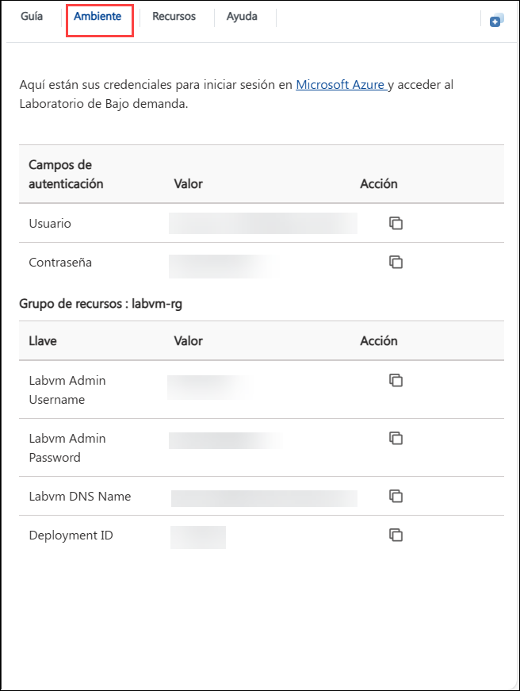
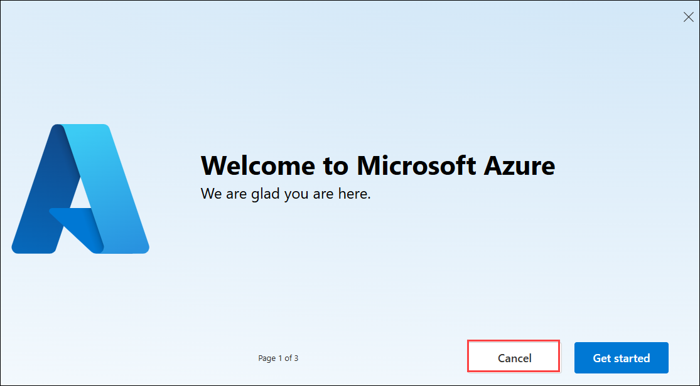
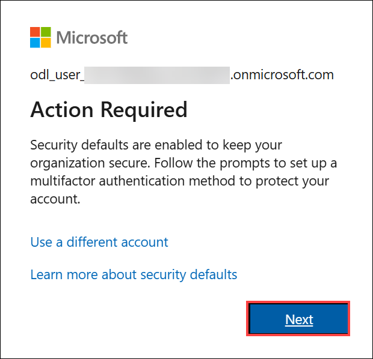
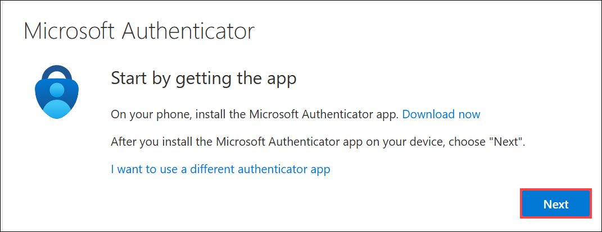
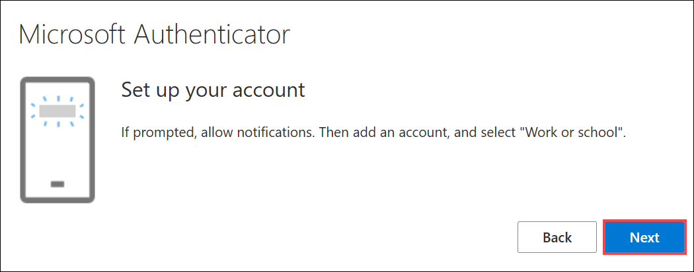
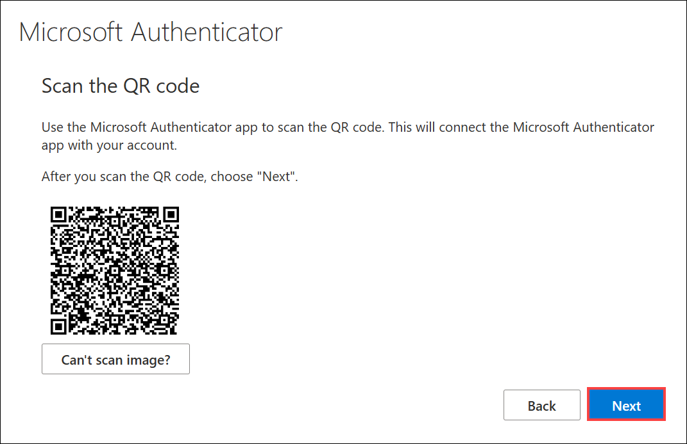
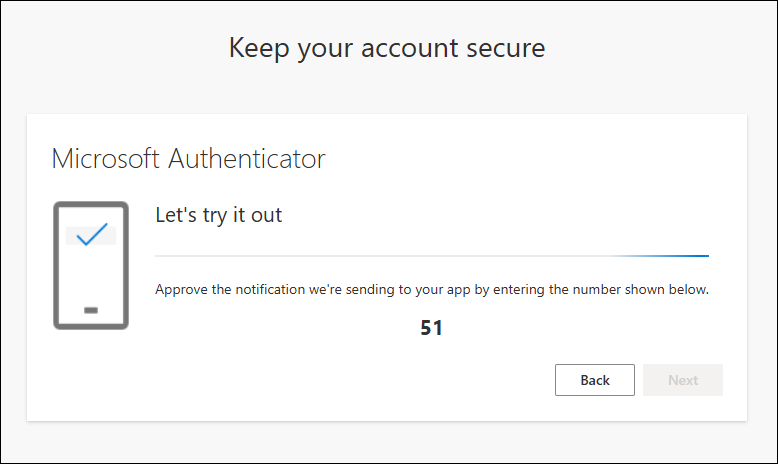
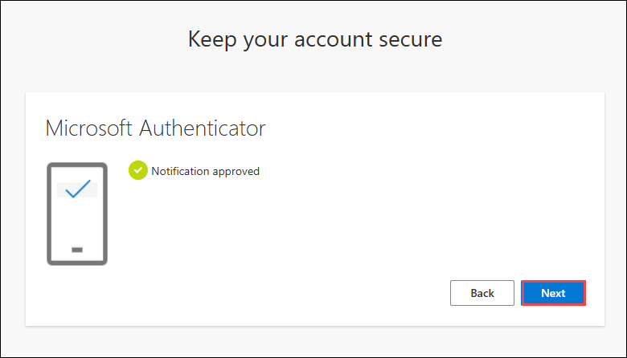
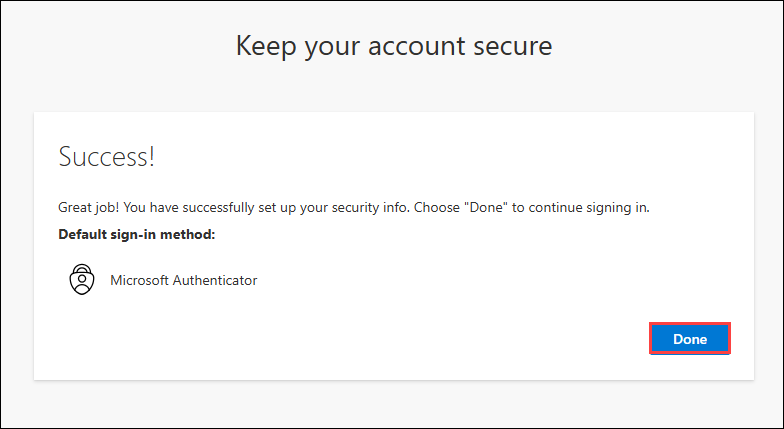

# Low Code Development with Power Apps & Power Automate

## Overall Estimated Duration: 4 Hours

## Overview

In this series of labs, you will gain hands-on experience with various aspects of the Power Platform, from importing and running starting solutions to building and using custom code components. You will create and modify custom connectors, and promote solutions across environments. Each lab builds foundational skills, such as creating Power Apps components and setting up custom connectors. By following detailed instructions and visual aids, you will learn to effectively develop, test, and deploy robust Power Platform solutions, ensuring a comprehensive understanding of the platform's capabilities and best practices.

## Objective

After completing these Lab, you'll know how to import and customize solutions in Power Platform, build custom code components, and  create and integrate custom connectors.
Learn to import and customize Power Platform solutions, create custom code components, and develop and integrate custom connectors. By the end of this lab, you will gain insights on:

 - **Getting started with Powerapps:** Learn to import a starting solution, add a new column, update the admin app, and test the Power Platform CLI.
 - **Build a code component:** Create a code component, implement its logic, integrate it into a canvas app, and add it to a solution.
 - **Custom connector for existing API:** Create, modify, and test a custom connector using an Open API definition, and integrate it with canvas apps and flows.

## Prerequisites

Participants should have:

- Basic knowledge of Power Platform and Power Apps.
- Access to Power Platform environment and Azure account.
- Understanding of APIs and custom component development
- Familiarity with GitHub and Git operations.
- Preparedness with necessary files, API definitions, and development tools.

## Architecture

In these labs, you'll follow a structured process to master key aspects of Power Platform development and management. You'll start by importing a pre-built solution, running a flow to add sample data, customizing it by adding a new column, and testing the Power Platform CLI using VS Code. Next, you'll build a code component with VS Code, integrate it into a canvas app, and add it to a solution. Then, you'll create a custom connector using an Open API definition, enhance it with custom code, and test it in both flows and canvas apps. Each step is detailed with instructions and visual aids to ensure you gain practical experience with Power Platform's features.

## Architecture Diagram

 

## Explanation of Components

- **Power Platform Environment:** The central workspace where you import, manage, and customize solutions within the Power Platform. It provides the necessary tools and interface for developing and testing 
 various applications and components.
- **Visual Studio Code:** A versatile code editor used for developing custom code components and Azure Functions. It offers powerful extensions and integrations to streamline coding and debugging within the 
 Power Platform ecosystem.
- **Code Component:** Elements created to extend the functionality of Power Apps. These components involve writing and integrating custom logic, which enhances the capabilities and flexibility of canvas apps.
- **Custom Connector:** Tools that allow Power Platform apps to connect with external data sources via APIs. These connectors enable seamless integration of external data and services into Power Platform applications.

##  Getting Started with the Lab
 
Welcome to your Low Code Development with Power Apps & Power Automate workshop! We've prepared a seamless environment for you to explore and learn about Azure services. Let's begin by making the most of this experience:
 
## Accessing Your Lab Environment
 
Once you're ready to dive in, your virtual machine and **Guide** will be right at your fingertips within your web browser.

### Virtual Machine & Lab Guide
 
Your virtual machine is your workhorse throughout the workshop. The lab guide is your roadmap to success.
 
## Exploring Your Lab Resources
 
To get a better understanding of your lab resources and credentials, navigate to the **Environment Details** tab.

 
## Utilizing the Split Window Feature
 
For convenience, you can open the lab guide in a separate window by selecting the **Split Window** button from the Top right corner.
 

 
## Managing Your Virtual Machine
 
Feel free to **Start, Stop**, or **Restart** your virtual machine as needed from the **Resources** tab. Your experience is in your hands!
 

## Lab Guide Zoom In/Zoom Out

To adjust the zoom level for the environment page, click the A↕ : 100% icon located next to the timer in the lab environment.

## Let's Get Started with Azure Portal
 
1. On your virtual machine, click on the Azure Portal icon as shown below:
 
   
 
1. You'll see the **Sign into Microsoft Azure** tab. Here, enter your credentials:
 
   - **Email/Username:** <inject key="AzureAdUserEmail"></inject>
 
     
 
1. Next, provide your password:
 
   - **Password:** <inject key="AzureAdUserPassword"></inject>
 
     

1. If you see the pop-up Action Required, click **Ask Later**.

   

   > **NOTE:** Please do not enable MFA; immediately select "Ask Later" if available. If the "Ask Later" option is not shown, then proceed to enable MFA by following the steps highlighted under **Steps to Proceed with MFA Setup if Ask Later Option is Not Visible**

1. If you see the pop-up **Stay Signed in?**, click **No**.

   

1. If a **Welcome to Microsoft Azure** popup window appears, click **Cancel** to skip the tour.

    

## Steps to Proceed with MFA Setup if Ask Later Option is Not Visible

> **Note:** Continue with the exercises if MFA is already enabled or the option is unavailable.

1. On the **Action Required** pop-up, click on **Next**.

   

2. In the Keep your account secure window, the window that appears and the steps that follow are for the Microsoft Authenticator app method. Select **Next**.

    

3. On the Set up your account page, select **Next**.

   

4. **Note:** If you don’t have the Microsoft Authenticator app installed on your mobile device:

   - Open **Google Play Store** (Android) or **App Store** (iOS).
   - Search for **Microsoft Authenticator** and tap **Install**.
   - Open the **Microsoft Authenticator app**, select **Add account**, then choose **Work or school account**.

5. Scan the QR code with your phone. On the phone, inside the Authenticator app, select Work or school account, and scan the QR code. Select **Next**.

   

6. On the Keep your account secure page. Enter the code, which is shown on the Authenticator app.

   

7. Once the code is entered. click **Next**

   

8. Select Done on the Success! page.

   
   
By completing these exercises, you will import and customize Power Platform solutions, create and implement custom code components with Visual Studio Code, develop and integrate custom connectors, create and deploy Azure Functions, and manage solutions using GitHub for source control.

## Support Contact

The CloudLabs support team is available 24/7, 365 days a year, via email and live chat to ensure seamless assistance at any time. We offer dedicated support channels tailored specifically for both learners and instructors, ensuring that all your needs are promptly and efficiently addressed.

Learner Support Contacts:

- Email Support: cloudlabs-support@spektrasystems.com

- Live Chat Support: https://cloudlabs.ai/labs-support

Now, click on the **Next** from the lower right corner to move to the next page.

## Happy Learning!!

