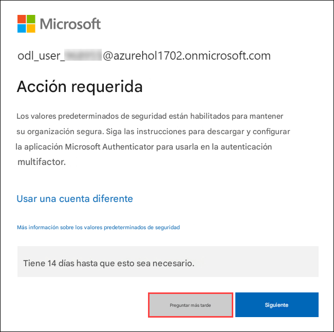
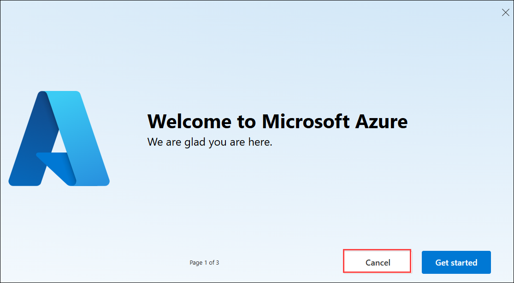

# Desarrollo de código bajo con Powerapps y Power Automate

## Duración Total Estimada: 4 horas

## Descripción general

En esta serie de laboratorios, adquirirá experiencia práctica con diversos aspectos de Power Platform, desde la importación y ejecución de soluciones iniciales hasta la creación y el uso de componentes de código personalizados. Creará y modificará conectores personalizados y promoverá soluciones en diferentes entornos. Cada laboratorio desarrolla habilidades fundamentales, como la creación de componentes de Power Apps y la configuración de conectores personalizados. Siguiendo instrucciones detalladas y ayudas visuales, aprenderá a desarrollar, probar e implementar eficazmente soluciones robustas de Power Platform, lo que le permitirá comprender a fondo las capacidades y las prácticas recomendadas de la plataforma.

## Objetivo

Tras completar este laboratorio, sabrá cómo importar y personalizar soluciones en Power Platform, crear componentes de código personalizados y crear e integrar conectores personalizados.
Aprenda a importar y personalizar soluciones en Power Platform, crear componentes de código personalizados y desarrollar e integrar conectores personalizados. Al finalizar este laboratorio, adquirirá conocimientos sobre:

- **Introducción a PowerApps**: Aprenda a importar una solución inicial, añadir una nueva columna, actualizar la aplicación de administración y probar la CLI de Power Platform.
- **Crear un componente de código**: Cree un componente de código, implemente su lógica, intégrelo en una aplicación de lienzo y añádalo a una solución.
- **Conector personalizado para API existente**: Cree, modifique y pruebe un conector personalizado utilizando una definición de API abierta e intégrelo con aplicaciones de lienzo y flujos.

## Requisitos previos

Los participantes deben tener:

- Conocimientos básicos de Power Platform y Power Apps.
- Acceso al entorno de Power Platform y a una cuenta de Azure.
- Conocimiento de las API y desarrollo de componentes personalizados.
- Familiaridad con GitHub y las operaciones de Git.
- Conocimiento de los archivos necesarios, las definiciones de API y las herramientas de desarrollo.

## Arquitectura

En estos laboratorios, seguirás un proceso estructurado para dominar los aspectos clave del desarrollo y la gestión de Power Platform. Comenzarás importando una solución prediseñada, ejecutando un flujo para añadir datos de muestra, personalizándola añadiendo una nueva columna y probando la CLI de Power Platform con VS Code. A continuación, crearás un componente de código con VS Code, lo integrarás en una aplicación de lienzo y lo añadirás a una solución. Después, crearás un conector personalizado con una definición de API abierta, lo mejorarás con código personalizado y lo probarás tanto en flujos como en aplicaciones de lienzo. Cada paso se detalla con instrucciones y ayudas visuales para que adquieras experiencia práctica con las funciones de Power Platform.

## Diagrama de Arquitectura

   

## Explicación de los Componentes

- **Entorno de Power Platform**: El espacio de trabajo central donde se importan, administran y personalizan soluciones dentro de Power Platform. Proporciona las herramientas y la interfaz necesarias para desarrollar y probar diversas aplicaciones y componentes.
- **Visual Studio Code**: Un editor de código versátil para desarrollar componentes de código personalizados y Azure Functions. Ofrece potentes extensiones e integraciones para optimizar la codificación y la depuración dentro del ecosistema de Power Platform.
- **Componente de código**: Elementos creados para ampliar la funcionalidad de Power Apps. Estos componentes implican la escritura e integración de lógica personalizada, lo que mejora las capacidades y la flexibilidad de las aplicaciones de lienzo.
- **Conector personalizado**: Herramientas que permiten que las aplicaciones de Power Platform se conecten con fuentes de datos externas mediante API. Estos conectores permiten una integración fluida de datos y servicios externos en las aplicaciones de Power Platform.

## Primeros pasos
 
¡Bienvenido a tu taller de Desarrollo Low Code con Power Apps y Power Automate! Hemos preparado un entorno perfecto para que explores y aprendas sobre los servicios de Azure. Empecemos por aprovechar al máximo esta experiencia:
 
## Acceso a su Ambiente de Laboratorio
 
Una vez que esté listo para comenzar, su máquina virtual y la **Guía** de laboratorio estarán a su alcance en su navegador web.

### Máquina Virtual y Guía de Laboratorio
 
En el entorno integrado, la máquina virtual del laboratorio funciona como el espacio de trabajo designado, mientras que la guía del laboratorio está accesible en el lado derecho de la pantalla.

## Exploración de los Recursos de su Laboratorio

Para comprender mejor los recursos y credenciales de su laboratorio, navegue hasta la pestaña **Ambiente**.

## Uso de la Función de Ventana Dividida

Para mayor comodidad, puede abrir la guía de laboratorio en una ventana separada seleccionando el botón **Ventana Dividida** en la esquina superior derecha.
 

## Administración de su Máquina Virtual

Siéntase libre de **iniciar**, **detener** o **reiniciar** su máquina virtual según sea necesario desde la pestaña **Recursos**. ¡Su experiencia está en sus manos!
 

 
## Guía de laboratorio Acercar/Alejar

Para ajustar el nivel de zoom de la página del entorno, haga clic en el ícono **A↕ : 100%** ubicado junto al temporizador en el entorno del laboratorio.

 
  
## Comencemos con el Portal de Azure

1. En su máquina virtual, haga clic en el ícono del **Portal de Azure** como se muestra a continuación:
 
   
 
2. Verá la pestaña **Iniciar sesión en Microsoft Azure**. Aquí, ingrese sus credenciales:
 
   - **Correo Electrónico/Nombre de Usuario:** <inject key="AzureAdUserEmail"></inject>
 
     
 
3. A continuación, proporcione su contraseña:
 
   - **Contraseña:** <inject key="AzureAdUserPassword"></inject>
 
     
 
4. Si ve la ventana emergente Acción Requerida, haga clic en Preguntar después.

   

5. Si ve la ventana emergente **¿Desea permanecer conectado?**, haga clic en **No**.

   

7. Si aparece una ventana emergente **Bienvenido a Microsoft Azure**, haga clic en **Cancelar** para omitir la visita guiada.

   

Al completar estos ejercicios, importará y personalizará soluciones de Power Platform, creará e implementará componentes de código personalizados con Visual Studio Code, desarrollará e integrará conectores personalizados, creará e implementará Azure Functions y administrará soluciones con GitHub para el control de código fuente.

   > **Nota:** Asegúrese de seguir las instruciones cuidadosamente para garantizar que el laboratorio se desarrolle sin problemas sy brinde una experiencia de usuario óptima.
   
## Contacto de Soporte

El equipo de soporte de CloudLabs está disponible las 24 horas del día, los 7 días de la semana, los 365 días del año, por correo electrónico y chat en vivo para garantizar una asistencia perfecta en cualquier momento. Ofrecemos canales de soporte dedicados y diseñados específicamente para estudiantes e instructores, garantizando que todas sus necesidades se aborden de manera rápida y eficiente.

Contactos de Soporte para Estudiantes:

- Soporte por Correo Electrónico: cloudlabs-support@spektrasystems.com

- Soporte por Chat en Vivo: https://cloudlabs.ai/labs-support

Ahora, haga clic en **Siguiente >>** en la esquina inferior derecha para pasar a la página siguiente.

## ¡¡Feliz aprendizaje!!
